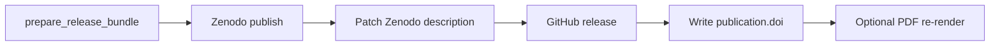

# Publishing Research

> **From manuscript to DOI: citations, Zenodo, arXiv, and GitHub Releases**

**Skill Level**: 11-12
**Quick Reference:** [Publication runbook](publication-runbook.md) | [Modules Guide](../modules/modules-guide.md) | [Publishing Module](../modules/guides/publishing-module.md) | [Zenodo DOI strategy](zenodo-doi-strategy.md)

Start with the [Publication runbook](publication-runbook.md) when you need an
end-to-end path from rendered project to standalone public GitHub repository,
real Zenodo DOI, optional mirrors, and archival handoff. This guide is the
detailed reference behind that runbook.

---

## Setting Up Publication Metadata

Configure your project's `manuscript/config.yaml`. For the split **concept vs version DOI** layout (recommended for all releases after the first deposit), see [Zenodo DOI strategy](zenodo-doi-strategy.md).

```yaml
paper:
  title: "Your Research Title"
  version: "1.0"
  date: "2026-01-15"

authors:
  - name: "Author Name"
    orcid: "0000-0001-6232-9096"
    email: "author@example.com"
    affiliation: "Institution Name"
    corresponding: true
  - name: "Co-Author"
    orcid: "0000-0002-1234-5678"
    affiliation: "Other Institution"

publication:
  doi: "10.5281/zenodo.12345678"          # concept DOI — PDF cover and CITATION.cff
  version_doi: "10.5281/zenodo.87654321" # latest deposit (updated by publish_project_release.py)
  version_record: "https://zenodo.org/records/87654321"
  github_repository: "owner/repo"
  journal: "Zenodo"
  volume: "1"
  year: "2026"

keywords:
  - "reproducible research"
  - "your-topic"
```

---

## Generating Citations

The Python API exposes BibTeX, APA, and MLA helpers. The
`infrastructure.publishing.cli generate-citation` command currently exposes
BibTeX only.

```python
from infrastructure.publishing import (
    generate_citation_bibtex,
    generate_citation_apa,
    generate_citation_mla,
    PublicationMetadata,
)

# Extract metadata from config.yaml
from infrastructure.publishing.metadata_from_config import publication_metadata_from_config
from pathlib import Path

metadata = publication_metadata_from_config(Path("projects/templates/template_code_project/manuscript/config.yaml"))

# Generate citations in multiple formats
bibtex = generate_citation_bibtex(metadata)
apa = generate_citation_apa(metadata)
mla = generate_citation_mla(metadata)

print(bibtex)
# generate_citation_bibtex always emits an @software entry; the citation key is
# the lowercased, space-stripped first author followed by the year.
# @software{danielarifriedman2026,
#   title={A template approach to Reproducible Research},
#   author={Friedman, Daniel Ari},
#   year={2026},
#   doi={10.5281/zenodo.12345678}
# }
```

### Generate All Formats at Once

```python
from infrastructure.publishing import generate_citations_markdown

# Creates a markdown block with BibTeX, APA, and MLA through the Python API
citations_md = generate_citations_markdown(metadata)
```

---

## Verify credentials first

Before any real deposit, confirm your tokens actually authenticate.
`credential_check` sends a single **read-only** GET per platform (an
identity/verify endpoint) and reports whether the credential is live. It never
writes, uploads, or mutates anything, and token values are never printed — only
the HTTP status and a public identity field (login, account name).

```bash
# Probe every platform whose token is present (uses os.environ, plus an optional .env)
uv run python -m infrastructure.publishing.credential_check --env-file .env

# Restrict to specific platforms
uv run python -m infrastructure.publishing.credential_check --only github zenodo
```

The probe catalogue (`PROBES`) covers `github`, `huggingface_hub`, `osf`,
`ipfs_pinata`, `zenodo`, `netlify`, `cloudflare_pages`, and the
monetization-adjacent platforms `gumroad`, `leanpub`, and `stripe`. `pypi`
reports `no-endpoint` — it has no read-only identity endpoint, so its token is
only validated at upload time. Each result is `pass`, `fail`, `skipped` (no
credential set), or `no-endpoint`. The CLI **exits non-zero if any present
credential fails**, so it works as a pre-release gate.

Credential presence is machine-specific and volatile, so it deliberately lives
in this opt-in operational check — never in a committed README. The durable,
version-controlled record of *what has been published* is the separate
[publishing-status block](#compile-the-readme-publishing-status-block).

---

## Publishing to Zenodo

### Prerequisites

1. Create a [Zenodo account](https://zenodo.org)
2. Generate an API token: Settings → Applications → Personal access tokens
3. Set the token: `export ZENODO_TOKEN=your_token_here`

### Upload

```python
from pathlib import Path

from infrastructure.publishing import PublicationMetadata, publish_to_zenodo
from infrastructure.publishing.zenodo import ZenodoClient, ZenodoConfig

# Configure client (use sandbox first)
config = ZenodoConfig(access_token="your_token", sandbox=True)
client = ZenodoClient(config)

metadata = PublicationMetadata(
    title="My Research",
    authors=["Author Name"],
    abstract="Abstract text.",
    keywords=["research"],
    license="CC-BY-4.0",
)

# High-level publish
result = publish_to_zenodo(
    metadata,
    [Path("output/templates/template_code_project/pdf/template_code_project_combined.pdf")],
    access_token="your_token",
    sandbox=True,
    # base_url=...  # optional; used by tests against pytest-httpserver
)
print(f"DOI: {result.doi}")

# Or step-by-step with the client
dep = client.create_deposition({"title": metadata.title, "upload_type": "publication"})
client.upload_file(dep.bucket_url, Path("paper.pdf"))
doi = client.publish(dep.deposition_id)
```

### DOI Badge

```python
from infrastructure.publishing import generate_doi_badge

badge_md = generate_doi_badge("10.5281/zenodo.12345678")
# [](...)
```

---

## arXiv Submission

```python
from pathlib import Path

from infrastructure.publishing import PublicationMetadata, prepare_arxiv_submission

metadata = PublicationMetadata(
    title="My Paper",
    authors=["Author"],
    abstract="Abstract.",
    keywords=["research"],
)

output_dir = Path("projects/templates/template_code_project/output")
tarball = prepare_arxiv_submission(output_dir, metadata)
print(f"Submission package: {tarball}")
```

---

## GitHub Releases

```python
from pathlib import Path

from infrastructure.publishing.github import create_github_release

url = create_github_release(
    tag_name="v1.0.0",
    release_name="Initial Release",
    description="First public release.",
    assets=[Path("output/templates/template_code_project/pdf/template_code_project_combined.pdf")],
    token="ghp_...",
    repo="owner/repo",
)
print(url)
```

CLI wrapper (expects `output/pdf/*.pdf` in the current working directory):

```bash
uv run python -m infrastructure.publishing.publish_cli \
  --token $GITHUB_TOKEN --repo owner/repo --tag v1.0.0 --name "Release 1.0.0"
```

---

## Unified release (GitHub + Zenodo + DOI → render)

Opt-in orchestrator (not in the default pipeline DAG). Requires a rendered combined PDF and credentials.

**Credentials from `.env` (automatic).** `publish_project_release.py` calls
`ensure_dotenv_loaded()` on startup, so a token kept only in the repo-root
`.env` is picked up without a manual `export`. Put the tokens there once:

```dotenv
# .env (never commit — already gitignored)
ZENODO_PROD_TOKEN=...      # production Zenodo (used with --production)
ZENODO_SANDBOX_TOKEN=...   # sandbox Zenodo (default)
GITHUB_TOKEN=...           # or rely on `gh auth token` below
GITHUB_REPO=owner/repo     # optional default for --repo
```

An explicit `export` or a `--zenodo-token` / `--github-token` flag always wins
over the `.env` value. GitHub tokens are commonly supplied live instead:
`export GITHUB_TOKEN="$(gh auth token)"`.

```bash
# Dry-run: bundle + receipt only
uv run python scripts/publish/publish_project_release.py \
  --project templates/template_code_project \
  --tag v2.0.0 \
  --repo owner/template \
  --dry-run

# Sandbox release (default)
export GITHUB_TOKEN=...
export GITHUB_REPO=owner/template
export ZENODO_SANDBOX_TOKEN=...
uv run python scripts/publish/publish_project_release.py \
  --project templates/template_code_project \
  --tag v2.0.0 \
  --repo owner/template

# New Zenodo version when publication.doi is already set
uv run python scripts/publish/publish_project_release.py \
  --project templates/template_code_project \
  --tag v2.0.1 \
  --repo owner/template \
  --new-version

# Production first release with a DOI-bearing deposited PDF
export ZENODO_PROD_TOKEN=...
uv run python scripts/publish/publish_project_release.py \
  --project templates/template_code_project \
  --tag v2.0.0 \
  --repo owner/template \
  --production \
  --reserve-doi-first
```

`--reserve-doi-first` creates the Zenodo draft first, asks Zenodo to reserve a
version DOI, derives the concept DOI from the draft metadata, writes
`publication.doi` and `publication.version_doi`, re-renders the PDF, then
uploads that DOI-bearing PDF to the same draft before publishing. The older
one-pass flow still exists for already-published `--new-version` releases and
for cases where a pre-DOI deposited PDF is acceptable.

**Outputs:** `output/{project}/release_bundle/` (`Author_Year_Topic_hash8.pdf` by default — see [Deposit upload filename](#deposit-upload-filename); fallback `{project}_combined.pdf` when disabled), `publication_metadata.json`, `manifest.json`, `RELEASE_RECEIPT.json`.

Programmatic API: `infrastructure.publishing.release_workflow.run_release_workflow`.

## Updating Existing GitHub and Zenodo Publications

Use this checklist when the repository or a public exemplar has already been
published and you need to decide whether to publish a new version.

### Root `docxology/template` release

The root repository is the software publication for the framework itself. It
uses the Zenodo concept DOI `10.5281/zenodo.19139090`; each GitHub release
should produce or point at a Zenodo software version under that concept DOI.

1. Check what changed since the last release tag:

   ```bash
   git fetch --tags origin
   git describe --tags --always
   git log --oneline vX.Y.Z..HEAD
   ```

2. Publish a new root version when the accumulated changes alter public
   behavior, public template contracts, release metadata, generated public
   docs, or the paper/software claims. A small typo-only docs patch can usually
   wait for the next planned release.

3. Before tagging, align source metadata:

   ```bash
   rg -n "version =|version:" pyproject.toml CITATION.cff
   uv run python scripts/docgen/counts.py --check
   uv run python scripts/audit/check_tracked_projects.py
   uv run python scripts/audit/check_tracked_generated_artifacts.py
   ```

   `pyproject.toml` and root `CITATION.cff` should name the release version;
   `CITATION.cff` keeps the concept DOI, not a version DOI.

4. Create the GitHub release on the root repository and let the configured
   Zenodo-GitHub integration archive the release, or create a Zenodo "New
   version" manually from the latest root software record and upload the source
   archive for the same tag. The Zenodo record must include a related identifier
   for `https://github.com/docxology/template/tree/vX.Y.Z`.

5. Verify both public surfaces after publishing:

   ```bash
   gh-axi release view vX.Y.Z --repo docxology/template
   uv run python scripts/docgen/publication_records.py --refresh-external
   ```

   Also open `https://zenodo.org/records/19140303/latest`; it should redirect to
   the latest root software record. Do not hand-edit
   `docs/_generated/publication_records.md` or the generated block in
   `.github/README.md`.

### Public exemplar release

Standalone public exemplars use `publish_project_release.py`. Use the qualified
project name from `docs/_generated/publication_records.md`, not the short leaf
name.

```bash
uv run python scripts/runner/execute_pipeline.py --project templates/<name> --core-only
uv run python scripts/publish/publish_project_release.py \
  --project templates/<name> \
  --tag vX.Y.Z \
  --repo docxology/<name> \
  --production \
  --new-version
uv run python scripts/docgen/publication_records.py --refresh-external
```

For a first standalone exemplar release, use `--reserve-doi-first` instead of
`--new-version`. After the run, commit the updated
`manuscript/config.yaml`, `CITATION.cff`, `.zenodo.json`, generated publication
records, and any release-note docs.

Public exemplars also track their deterministic rendered evidence. In the root
monorepo, keep both `projects/templates/<name>/output/` and the copied
`output/templates/<name>/` tree in git when files stay below the 50 MB public
output ceiling. Retain final PDFs, figures, analysis data, hydrated
manuscripts, and stable release/validation registries; omit runtime state,
logs, telemetry, snapshots, and renderer intermediates. The generated-artifact
guard still blocks private project outputs and oversized public output files.
In the standalone
`docxology/template_*` repository, sync the same project-local `output/` tree
so the GitHub source mirror, GitHub release, and Zenodo record all point to the
same rendered state.

The render source of truth is still the public monorepo:

```bash
git clone https://github.com/docxology/template
cd template
uv sync
./run.sh --project templates/<name> --pipeline --core-only
uv run python scripts/pipeline/stage_04_validate.py --project templates/<name>
uv run python scripts/pipeline/stage_05_copy.py --project templates/<name>
```

The standalone repositories are publication mirrors for source, DOI metadata,
and tracked artifacts; use `docxology/template` for shared infrastructure,
pipeline stages, and cross-template validation.

`template_madlib` is now a standalone publication repository at
`docxology/template_madlib`, with concept DOI `10.5281/zenodo.20786638` and
version DOI `10.5281/zenodo.20932025`. Future first-release work for a new
canonical exemplar should follow the same pattern: mint the Zenodo record,
publish the dedicated GitHub repository and release, then regenerate the
publication matrix so the external checks report live GitHub and Zenodo status.

### Historical integration proof (2026-05-27)

End-to-end smoke test against **production** Zenodo and a disposable public GitHub repo, recorded on 2026-05-27. Exemplar `template_prose_project` was used; `publication.doi` was restored to empty after the run. Re-check the external URLs before citing this table as current live evidence.

**Path note:** the commands below use the bare slug `template_prose_project`,
which was correct the day this test ran. The very next day (2026-05-28) the
repo adopted the 5-folder project lifecycle and moved exemplars under
`projects/templates/`; `resolve_combined_pdf()` and the release workflow do
not auto-qualify a bare slug, so reproducing this today requires
`--project templates/template_prose_project`. Left verbatim below as the
historical record of what was actually run.

| Artifact | URL / ID |
| --- | --- |
| GitHub repo | https://github.com/docxology/template-release-smoke |
| Release v0.1.0 | https://github.com/docxology/template-release-smoke/releases/tag/v0.1.0-release-smoke |
| Release v0.2.0 | https://github.com/docxology/template-release-smoke/releases/tag/v0.2.0-release-smoke |
| Release v0.3.0 | https://github.com/docxology/template-release-smoke/releases/tag/v0.3.0-release-smoke |
| Zenodo concept DOI | https://doi.org/10.5281/zenodo.20415767 |
| Zenodo version DOI (v1) | https://doi.org/10.5281/zenodo.20415768 |
| Zenodo version DOI (v2) | https://doi.org/10.5281/zenodo.20415779 |
| Zenodo version DOI (v3) | https://doi.org/10.5281/zenodo.20415839 |

**Credentials:** Zenodo personal access token with `deposit:write`, `deposit:actions`, and `user:email` (OAuth app client credentials do not work for deposit API). GitHub via `gh auth token` as user `docxology`.

**Phase A — new deposition:**

```bash
export GITHUB_TOKEN="$(gh auth token)"
export GITHUB_REPO=docxology/template-release-smoke
export ZENODO_PROD_TOKEN=...   # from .env; never commit

uv run python scripts/publish/publish_project_release.py \
  --project template_prose_project \
  --tag v0.1.0-release-smoke \
  --repo docxology/template-release-smoke \
  --production \
  --release-name "Template release smoke v0.1.0 (integration test — do not cite)"
```

**Phase B — versioned release** (after `publication.doi` was set from Phase A):

```bash
uv run python scripts/publish/publish_project_release.py \
  --project template_prose_project \
  --tag v0.2.0-release-smoke \
  --repo docxology/template-release-smoke \
  --production \
  --release-name "Template release smoke v0.2.0 (integration test — do not cite)"
```

When GitHub was already published, `--skip-github` or `--skip-zenodo` can split phases. Receipt: `output/templates/template_prose_project/release_bundle/RELEASE_RECEIPT.json`.

**Phase C — v0.3.0 versioned release** (2026-05-27, new PAT + concept-DOI resolution fix):

```bash
uv run python scripts/publish/publish_project_release.py \
  --project template_prose_project \
  --tag v0.3.0-release-smoke \
  --repo docxology/template-release-smoke \
  --production \
  --skip-github \
  --release-name "Template release smoke v0.3.0 (integration test — do not cite)"
```

(GitHub release for v0.3.0 was created in an earlier partial run; Zenodo completed with `--skip-github`.)

**Fix validated during Phase B:** production Zenodo `GET /deposit/depositions?q=doi:...` returns a bare JSON list; `resolve_deposition_id_from_doi` in `infrastructure/publishing/zenodo/client.py` now accepts both list and Elasticsearch-style `hits` responses (see `tests/infra_tests/publishing/test_zenodo_client.py`).

**Fix validated during v0.3.0:** version DOIs (e.g. `10.5281/zenodo.20415768`) often miss deposit search; resolution falls back to `conceptdoi:` lookup after reading `conceptdoi` from `GET /records/{id}` (numeric suffix of the Zenodo DOI).

**v0.4.0 cross-link smoke (2026-05-27):** GitHub release [v0.4.0-release-smoke](https://github.com/docxology/template-release-smoke/releases/tag/v0.4.0-release-smoke) includes version, GitHub URL, DOI, Zenodo URL, PDF SHA-256, and plaintext abstract. Zenodo [10.5281/zenodo.20415971](https://doi.org/10.5281/zenodo.20415971) received the enriched deposit description at publish time. Post-publish description patch returns HTTP 404 on published records (deposit API is draft-only). Placeholder ORCIDs (`0000-0000-0000-*`) are omitted from Zenodo creator metadata.

### Plaintext deposit description and cross-linked releases (2026-05-27)

Zenodo and GitHub release metadata no longer reuse raw manuscript markdown. The release workflow builds a **deposit-safe plaintext abstract** via `infrastructure/publishing/abstract_plaintext.py`:

1. Prefer hydrated `projects/{name}/output/manuscript/00_abstract.md` when present (post variable injection).
2. Else read `manuscript/00_abstract.md` and substitute `{{TOKEN}}` values from `output/data/manuscript_variables.json`.
3. Normalize markdown noise: drop a redundant leading `# Abstract` heading (the platform already labels the field — otherwise the literal word "Abstract" leaks in as the first word of the description), strip Pandoc `{#id}` attributes, unwrap `` `inline code` ``, convert Markdown links into `label (url)`, remove `*emphasis*` and `[@citations]`.
4. Append a fixed **Associated artifacts** footer with GitHub release URL, DOI, Zenodo record URL, and PDF SHA-256.

> The leading-`# Abstract` strip is `infrastructure.prose.markdown.strip_leading_abstract_heading`, applied inside `normalise_for_deposit`. It only removes a standalone heading whose sole text is "Abstract" (any level, with or without a `{#id}` attribute); `# Abstract and Outlook` or prose that genuinely begins with the word are left untouched. Covered by `tests/infra_tests/prose/test_markdown_helpers.py::TestStripLeadingAbstractHeading` and the deposit-render assertions in `tests/infra_tests/publishing/test_abstract_plaintext.py`.

**Workflow order:** prepare bundle → **Zenodo publish** → enrich metadata with minted DOI → **patch live Zenodo description** (best-effort; deposit API accepts only draft depositions — published records return HTTP 404) → **GitHub release** (body includes fresh DOI) → write `publication.doi` → optional local re-render.



**Bidirectional cross-link contract** — each platform surfaces the other's identifiers:

| Field | Zenodo description footer | Zenodo API `related_identifiers` | GitHub release body |
| --- | --- | --- | --- |
| Plaintext abstract | Yes | — | Yes (`## Abstract`) |
| GitHub release URL | Yes | `isSupplementTo` | Yes |
| Zenodo DOI | At publish when pre-known; else on record page only | — (record IS the DOI) | Yes |
| Zenodo record URL | At publish when pre-known; else on record page only | — | Yes |
| PDF SHA-256 | Yes | — | Yes (backticks) |
| Version | Zenodo `version` API field | — | Yes (`paper.version` or tag) |

Abstract source is **`manuscript/00_abstract.md`** (not a config key). The workflow prefers the hydrated copy under `output/manuscript/00_abstract.md` when the analysis stage has run.

### Transmission bookends (optional)

When `publication.transmission_bookends.enabled: true`, the render pipeline writes two generated sections into `output/manuscript/`:

| File | Position | Content |
| --- | --- | --- |
| `00_00_transmission_begin.md` | **First PDF page** (page 1) | Compact metadata, pairing status, dual-row integrity QR strip (7 QRs + Code128), 3-line transmission manifest snippet, pairing diagram (`width=0.35`), one-line steganography summary |
| `99_zz_transmission_end.md` | **Last PDF page** | One-line current release, same integrity strip, prior releases table (capped at 3 rows for page fit; overflow note points to `publication_ledger.json`), one-line steganography summary — **no** duplicate full metadata or pairing checklist |

When bookends are enabled, the combined-PDF renderer skips the auto `\maketitle` block so transmission begin is page 1; the table of contents moves to page 2. Bibliography is injected **before** the end bookend so references render on the pages immediately preceding END OF TRANSMISSION. Bookend section titles use `\section*` so they do not appear in the TOC.

Each bookend uses a LaTeX single-page envelope (`samepage`, `\scriptsize`, zero paragraph/list spacing). Stage 04 runs `infrastructure.publishing.transmission_page_check` when bookends are enabled — BEGIN must appear only on page 1 and END only on the last page.

Structured manifest: `output/data/transmission_manifest.json` (`title`, `version`, `doi`, GitHub/Zenodo URLs, PDF SHA-256/512, `published`). The strip’s **Manifest** QR encodes compact JSON (≤100 chars).

Dual-row integrity strip (`output/figures/transmission_integrity_strip.png`): row 1 — Metadata, Citation, Contact, Integrity; row 2 — Zenodo URL, GitHub URL, Manifest JSON; Code128 raster from `python-barcode` encodes the steganography payload hash block.

**`template_code_project` production target:** `publication.github_repository: docxology/template_code_project` with bookends enabled in `projects/templates/template_code_project/manuscript/config.yaml`. Example production release (choose a tag from `paper.version`; keep `publication.doi` as the concept DOI and let the publish flow update `version_doi` / `version_record`):

```bash
uv run python scripts/runner/execute_pipeline.py --project templates/template_code_project --core-only
./secure_run.sh --steganography-only --project templates/template_code_project --deterministic
uv run python scripts/publish/publish_project_release.py \
  --project templates/template_code_project \
  --tag vX.Y.Z \
  --repo docxology/template_code_project \
  --release-name "Convergence Analysis of Gradient Descent Optimization (vX.Y.Z)" \
  --production \
  --new-version   # when publication.doi is already set from a prior mint
uv run python scripts/pipeline/stage_03_render.py --project templates/template_code_project
```

Current production records: see the generated live matrix in [`../_generated/publication_records.md`](../_generated/publication_records.md) and each exemplar's `manuscript/config.yaml` (`publication.doi` = concept DOI for citations and PDF cover; `publication.version_doi` = latest deposit).

**Superseded `template_code_project` version DOIs** (archival reference only — do not cite as current):

| Version | Version DOI | GitHub tag |
| --- | --- | --- |
| v2.0.0 | [10.5281/zenodo.20416203](https://doi.org/10.5281/zenodo.20416203) | [release](https://github.com/docxology/template_code_project/releases/tag/v2.0.0) |
| v2.1.0 | [10.5281/zenodo.20416267](https://doi.org/10.5281/zenodo.20416267) | [release](https://github.com/docxology/template_code_project/releases/tag/v2.1.0) |
| v2.2.0 | [10.5281/zenodo.20416565](https://doi.org/10.5281/zenodo.20416565) | [release](https://github.com/docxology/template_code_project/releases/tag/v2.2.0) |
| v2.3.0 | [10.5281/zenodo.20416936](https://doi.org/10.5281/zenodo.20416936) | [release](https://github.com/docxology/template_code_project/releases/tag/v2.3.0) |

Superseded concept DOI for the pre-split series: [10.5281/zenodo.20416202](https://doi.org/10.5281/zenodo.20416202). Current concept DOI: [10.5281/zenodo.20417136](https://doi.org/10.5281/zenodo.20417136).

### Deposit upload filename

Local pipeline output stays `{project}_combined.pdf`. `prepare_release_bundle` renames the copy uploaded to Zenodo and GitHub:

| Segment | Source | `template_code_project` example |
| --- | --- | --- |
| Author | Corresponding author surname (else first author) | `Author` |
| Year | `paper.date` or `publication.year` (via `publication_date`), else first `20xx` in release tag, else UTC current year | `2026` |
| Topic | First significant title word; optional `publication.deposit_filename.topic` | `Convergence` |
| Hash8 | First 8 hex chars of deposited PDF SHA-256 | `b591a0ce` |

**Example upload name:** `Author_2026_Convergence_b591a0ce.pdf`

Year precedence matches `year_segment()` in `infrastructure/publishing/deposit_filename.py`: config dates are merged as `paper.date` first, then `publication.year`. When neither is set, the release tag supplies the year (e.g. `v2.1.0` → `2026`). The UTC current-year fallback applies only when config and tag both lack a four-digit year — tags with a year keep filenames stable across calendar boundaries.

Set `publication.deposit_filename.enabled: false` to keep `{project}_combined.pdf` on platforms. `RELEASE_RECEIPT.json` records both `deposit_filename` and `source_pdf_name`.

**Zenodo new-version uploads:** `publish_new_version_to_zenodo()` clears inherited draft files before uploading the bundle PDF. New-version drafts copy prior files from the parent record; without cleanup, published records can list both fallback names (e.g. v2.1.0 listed `template_code_project_combined.pdf` and `Author_2026_Convergence_b591a0ce.pdf`). The next `--new-version` publish after this fix deposits only the current `deposit_filename`. Already-published Zenodo versions cannot be edited retroactively.

### Config file reference (`manuscript/config.yaml`)

| Key | Required | Used for |
| --- | --- | --- |
| `paper.title` | Yes | Zenodo title; GitHub release name default |
| `paper.subtitle` | No | PDF title page only |
| `paper.version` | No | Zenodo `version`; GitHub release body version line |
| `paper.date` | No | Zenodo `publication_date` (overrides `publication.year`) |
| `authors[].name` | Yes | Zenodo creators; citations |
| `authors[].orcid` | No | Zenodo creator ORCID |
| `authors[].affiliation` | No | Zenodo creator affiliation |
| `authors[].email` | No | Manuscript metadata (not sent to Zenodo API) |
| `publication.doi` | No | **Concept DOI** — stable citation; PDF cover, CITATION.cff; not overwritten on re-deposit when `version_doi` is set |
| `publication.version_doi` | No | Latest Zenodo **version** DOI; updated by `update_publication_after_zenodo_deposit()` |
| `publication.version_record` | No | Latest Zenodo record URL (`https://zenodo.org/records/{id}`) |
| `publication.published_artifacts` | No | Map of platform-name → durable URL; marks extra platforms published in the README status block (consumed by `status_report.py`) |
| `publication.year` | No | Zenodo `publication_date` when `paper.date` absent |
| `publication.repository_url` | No | Extra Zenodo `related_identifiers` (`references`) when distinct from GitHub release URL |
| `publication.zenodo_description` | No | Override abstract body for deposits (footer still appended) |
| `publication.github_repository` | No | Pre-release GitHub slug for transmission bookends (`owner/repo`) |
| `publication.transmission_bookends.enabled` | No | Inject begin/end transmission pages into combined PDF |
| `publication.transmission_bookends.max_prior_releases` | No | Ledger cap for prior-release rows; end bookend displays `min(max_prior_releases, 3)` for single-page fit |
| `publication.transmission_bookends.show_steganography` | No | Include steganography summary on bookends (default true) |
| `publication.deposit_filename.enabled` | No | Rename Zenodo/GitHub upload PDF (default true) |
| `publication.deposit_filename.topic` | No | Override topic segment in upload filename |
| `keywords` | No | Zenodo keywords |
| `metadata.license` | No | Zenodo license (default `CC-BY-4.0`) |

**CLI / environment overrides** (not in `config.yaml`):

| Input | Source | Used for |
| --- | --- | --- |
| Release tag | `--tag` | GitHub tag; Zenodo footer; fallback version |
| GitHub repository | `--repo` or `GITHUB_REPO` | GitHub release; Zenodo `related_identifiers` |
| Release title | `--release-name` | GitHub release name; Zenodo footer label |
| GitHub token | `--github-token` or `GITHUB_TOKEN` | GitHub API |
| Zenodo token | `--zenodo-token`, `ZENODO_PROD_TOKEN`, or `ZENODO_SANDBOX_TOKEN` | Zenodo deposit API |

Full mapping table, exemplar DOI matrix, and split-field workflow: [Zenodo DOI strategy](zenodo-doi-strategy.md) and [`projects/templates/template_prose_project/manuscript/config.yaml.example`](../../projects/templates/template_prose_project/manuscript/config.yaml.example).

**Zenodo web form → config/API mapping:**

| Zenodo form field | Source |
| --- | --- |
| Title | `paper.title` |
| Description | `build_deposit_description()` (plaintext abstract + footer) |
| Authors | `authors[]` with optional ORCID / affiliation |
| Publication date | `paper.date` or `publication.year` |
| Version | `paper.version` or release tag |
| Keywords | `keywords` |
| License | `metadata.license` |
| Related / alternate identifiers | GitHub release URL (`isSupplementTo`); optional `publication.repository_url` (`references`) |

**Receipt fields:** `RELEASE_RECEIPT.json` and `manifest.json` include `pdf_sha256` (SHA-256 of the deposited combined PDF).

Tests: `tests/infra_tests/publishing/test_abstract_plaintext.py`, `test_release_workflow.py`, `test_zenodo_client.py`, `test_transmission_bookends.py`, `test_transmission_page_check.py`, `test_publication_ledger.py`.

Manual page-span check after render:

```bash
uv run python -m infrastructure.publishing.transmission_page_check \
  projects/{name}/output/pdf/{name}_combined.pdf
```


## Executable bundle (Stage 12)

```bash
uv run python scripts/runner/bundle_executable.py --project templates/template_code_project
```

```python
from pathlib import Path

from infrastructure.publishing.executable_bundle import bundle_project

# bundle_project(repo_root, project_name, *, python_version="3.12") -> Path
# project_name is the discovery name (e.g. "templates/template_code_project");
# the bundle is written under output/<project>/executable_bundle/.
bundle_path = bundle_project(
    Path("."),
    "templates/template_code_project",
)
print(bundle_path)
```

---

## Multi-target archival (Stage 13)

Dry-run via pipeline stage (graceful skip if bundle missing):

```bash
uv run python scripts/runner/archive_publication.py --project templates/template_code_project
```

Direct CLI (dry-run by default):

```bash
uv run python -m infrastructure.publishing.archival_cli \
  --bundle output/templates/template_code_project/executable_bundle \
  --providers zenodo software_heritage ipfs_pinata ipfs_web3storage
```

Note: `08_executable_bundle.py` and `09_archive_publication.py` look up
`projects/<project>` and `output/<project>/...` directly (they do not
auto-qualify a bare exemplar name the way the `python -m
infrastructure.orchestration` CLI does) — pass the qualified slug
(`templates/<name>`, `working/<name>`, …) or the bare name resolves to a
missing path and the stage gracefully skips.

Add `--commit` to perform real deposits (requires credentials — see [`archival/README.md`](../../infrastructure/publishing/archival/README.md)).

---

## Publish to all platforms

`infrastructure.publishing.upload_runner` is the reusable multi-platform upload
dispatch — the per-platform helpers plus a batch orchestrator. Every uploader is
**dry-run by default**, returns a plain receipt dict, and a failure in one
platform is captured (never raised) so a batch always completes.

- Core uploaders (`CORE_UPLOADERS`, run by default): `pinata`, `huggingface`,
  `osf`, `testpypi`.
- Opt-in uploaders (`OPTIONAL_UPLOADERS`): `github`, `netlify`, `cloudflare`,
  `github_pages` — these create a real GitHub release/tag or need the
  `netlify`/`wrangler` CLIs, so `select_jobs(..., include_github=True,
  include_static=True)` must opt them in (`include_github` gates `github`;
  `include_static` gates `netlify`, `cloudflare`, and `github_pages` together).

The `template_gold_refinement` exemplar ships a thin CLI over this module at
`scripts/publish/upload_gold_refinement.py`:

```bash
# Always verify tokens first
uv run python -m infrastructure.publishing.credential_check --env-file .env

# Safe: dry-run every core platform (no writes)
uv run python scripts/publish/upload_gold_refinement.py

# REAL uploads to the core platforms (pinata, huggingface, osf, testpypi)
uv run python scripts/publish/upload_gold_refinement.py --commit

# Restrict to a subset
uv run python scripts/publish/upload_gold_refinement.py --commit \
  --only pinata huggingface osf testpypi

# Add the opt-in GitHub release and static-site deploys
uv run python scripts/publish/upload_gold_refinement.py --commit \
  --include-github --include-static
```

The script loads the repo-root `.env`, requires the rendered combined PDF
(`projects/templates/template_gold_refinement/output/pdf/template_gold_refinement_combined.pdf`
— build it with
`./run.sh --project templates/template_gold_refinement --pipeline --core-only`),
and writes a JSON receipt to
`output/templates/template_gold_refinement/upload_receipts.json`.

Programmatic API: build an `UploadTargets`, choose jobs with `select_jobs(...)`,
then `run_uploads(targets, jobs=..., commit=...)` returns an `UploadRun`
(`.results`, `.mode`, `.ok`). Full signatures are in the
[Publishing Module Reference](../modules/guides/publishing-module.md).

### Worked example — `template_gold_refinement` (2026-06-27)

The gold_refinement exemplar was published and fetch-back-confirmed across the
publishing surface on 2026-06-27 (README status block: "12 platforms, 7
published"):

| Platform | Durable identifier |
| --- | --- |
| Zenodo (concept DOI) | `10.5281/zenodo.20931955` |
| Zenodo (version DOI) | `10.5281/zenodo.20938523` |
| GitHub | release `v0.1.0` |
| IPFS (Pinata) | CID `QmQBXK5qoGv5NSWC8mzcx22AgkHeqBJL8z8HrCgEy7nzio` |
| Hugging Face | https://huggingface.co/datasets/ActiveInference/template_gold_refinement |
| OSF | https://osf.io/u485p/ |
| TestPyPI | `template-gold-refinement` 0.1.0 |
| Software Heritage | save-request 2375286 (task succeeded) |

See [Troubleshooting](#troubleshooting) for the Hugging Face Git-LFS, namespace,
TestPyPI, and Software Heritage gotchas hit during this run.

---

## Compile the README publishing-status block

After durable identifiers exist, record them once in `manuscript/config.yaml`
and regenerate a committed README "publishing status" block with
`infrastructure.publishing.status_report`. The block is delimited by stable
HTML-comment markers (`<!-- PUBLISHING-STATUS:START ... -->` and
`<!-- PUBLISHING-STATUS:END -->`) and is rebuilt deterministically without
disturbing the surrounding prose.

The block reports **durable publication state only** — DOIs, repository, and
release identifiers from `config.yaml`. It never encodes machine-specific
credential presence (that is the separate
[credential check](#verify-credentials-first)). Platform rows are generated from
the first-class rows in `registry.PLATFORM_REGISTRY`, so adding a platform to
the registry automatically surfaces it here when it has a status-report mapping.

```bash
# Preview the block (no write)
uv run python -m infrastructure.publishing.status_report \
  --project projects/templates/template_gold_refinement

# Write it into the README (first write needs a heading to insert after)
uv run python -m infrastructure.publishing.status_report \
  --project projects/templates/template_gold_refinement \
  --write --init-after "## Publication and rendering"

# CI gate: exit non-zero if the README block is missing or stale
uv run python -m infrastructure.publishing.status_report \
  --project projects/templates/template_gold_refinement --check
```

### Recording extra published platforms (`published_artifacts`)

Zenodo (from `publication.doi`) and GitHub (from
`publication.github_repository`) are detected automatically. For platforms whose
durable URL lives outside those fields — an IPFS CID, a Hugging Face dataset, an
OSF node — add them under a `publication.published_artifacts` map (platform name
→ durable URL); `status_report` consumes it to mark those rows published:

```yaml
publication:
  doi: "10.5281/zenodo.20931955"
  version_doi: "10.5281/zenodo.20938523"
  github_repository: "docxology/template_gold_refinement"
  published_artifacts:
    ipfs_pinata: "https://ipfs.io/ipfs/QmQBXK5qoGv5NSWC8mzcx22AgkHeqBJL8z8HrCgEy7nzio"
    huggingface_hub: "https://huggingface.co/datasets/ActiveInference/template_gold_refinement"
    osf: "https://osf.io/u485p/"
```

A `--published name=url` CLI flag overrides config for one-off runs (it only ever
upgrades a row to published — it never downgrades):

```bash
uv run python -m infrastructure.publishing.status_report \
  --project projects/templates/template_gold_refinement \
  --published osf=https://osf.io/u485p/ --write
```

> Never hand-edit the text between the `PUBLISHING-STATUS` markers — edit
> `config.yaml` (or pass `--published`) and regenerate.

---

## Publication Readiness

```python
from infrastructure.publishing import (
    validate_publication_readiness,
    create_submission_checklist,
    create_publication_package,
)

# Check if everything is ready. The function takes two list[Path] arguments
# (manuscript markdown + rendered PDFs) and returns a plain dict.
markdown_files = sorted(Path("projects/templates/template_code_project/manuscript").glob("*.md"))
pdf_files = sorted(Path("output/templates/template_code_project/pdf").glob("*.pdf"))
readiness = validate_publication_readiness(markdown_files, pdf_files)
print(f"Ready: {readiness['ready_for_publication']} (score {readiness['completeness_score']})")
for issue in readiness["missing_elements"]:
    print(f"  - {issue}")

# Generate a checklist
checklist = create_submission_checklist(metadata)

# Bundle metadata + files for submission: create_publication_package(output_dir, metadata)
package = create_publication_package(
    Path("output/templates/template_code_project/publication/"),
    metadata,
)
```

---

## DOI Validation

```python
from infrastructure.publishing import validate_doi

is_valid = validate_doi("10.5281/zenodo.12345678")
# True — valid DOI format
```

---

## Troubleshooting

**Missing ZENODO_TOKEN:**
- For `publish_project_release.py`: add `ZENODO_PROD_TOKEN` (or `ZENODO_SANDBOX_TOKEN`) to the repo-root `.env` — it is auto-loaded via `ensure_dotenv_loaded()`.
- Set via environment: `export ZENODO_TOKEN=your_token` (always overrides `.env`)
- Or pass directly: `ZenodoConfig(access_token="...")` / `--zenodo-token`

**Sandbox vs Production:**
- Always test with `sandbox=True` first
- Sandbox DOIs are not permanent

**Missing metadata fields:**
- Run `validate_publication_readiness()` to identify gaps
- Ensure `config.yaml` has all required fields (title, authors, DOI)

**Multi-platform upload gotchas** (seen during the `template_gold_refinement` run):
- **Hugging Face large PDFs:** the shipped `HuggingFaceHubAdapter` base64-inlines
  the blob and returns HTTP 400 on large binary PDFs (it needs Git-LFS). For real
  PDFs, upload via the official `huggingface_hub` `HfApi.upload_file`, which
  switches to LFS automatically.
- **Hugging Face namespace:** the repo namespace must match the token's account —
  a token without org access cannot create a repo under another namespace.
- **TestPyPI:** install `twine` in the venv first; version `0.1.0` is one-shot
  (re-uploading the same version fails). Confirm via the `/simple/` index, not the
  `/pypi/<name>/json` endpoint.
- **Software Heritage:** `deposit()` resolves the git origin from the directory's
  `origin` remote, or from a text file whose first line is the repository URL.

---

## Related Documentation

- **[Publishing Module Reference](../modules/guides/publishing-module.md)** — API details
- **[Secure Research Guide](secure-research-guide.md)** — PDF watermarking and provenance
- **[New Project Setup](new-project-setup.md)** — config.yaml template
- **[Infrastructure AGENTS.md](../../infrastructure/publishing/AGENTS.md)** — Machine-readable spec
