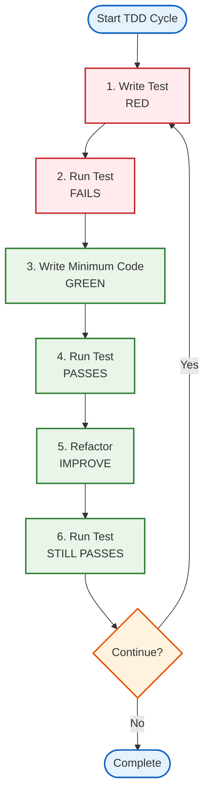

# 🧪 Testing and Reproducibility Guide

> **Master test-driven development** and complex workflows

**Previous**: [Figures and Analysis](../guides/figures-and-analysis.md) (Levels 4-6) | **Next**: [Extending and Automation](../guides/extending-and-automation.md) (Levels 10-12)

This guide covers **Levels 7-9** of the Research Project Template. for developers ready to embrace test-driven development, complex mathematical workflows, and reproducible research.

## 📚 What You'll Learn

By the end of this guide, you'll be able to:

- ✅ Practice test-driven development (TDD)
- ✅ Achieve and maintain test coverage
- ✅ Build complex mathematical workflows
- ✅ Implement testing strategies
- ✅ Ensure reproducible research results
- ✅ Manage data versioning and environment control

**Estimated Time:** 1-2 weeks

## 🎯 Prerequisites

- Completed [Figures and Analysis Guide](../guides/figures-and-analysis.md)
- Strong Python programming skills
- Understanding of software testing concepts
- Familiarity with pytest framework

**Development Standards:** See [Testing Standards](../rules/testing_standards.md) and [Type Hints Standards](../rules/type_hints_standards.md) for TDD and type safety guidelines.

## 📖 Table of Contents

- [Level 7: Test-Driven Development](#level-7-test-driven-development)
- [Level 8: Complex Mathematical Workflows](#level-8-complex-mathematical-workflows)
- [Level 9: Reproducible Research](#level-9-reproducible-research)
- [What to Read Next](#what-to-read-next)

---

## Level 7: Test-Driven Development

**Goal**: Master TDD methodology and maintain coverage

**Time**: 3-5 days

### The TDD Cycle



### Example TDD Workflow

**Scenario**: Add a momentum variant of the optimizer to the exemplar's core
package. The live optimizer lives in `src/template_code_project/core/optimizer.py`
and is tested by `tests/core/test_optimizer.py`; the cycle below develops a new
`gradient_descent_with_momentum` function next to it.

**Step 1: Write Test First** (RED)

```python
# projects/templates/template_code_project/tests/core/test_optimizer_momentum.py
import numpy as np
import pytest
from template_code_project.core.optimizer import (
    OptimizationResult,
    gradient_descent_with_momentum,
)

def test_gradient_descent_with_momentum_converges():
    """Momentum descent converges on a quadratic bowl."""
    result = gradient_descent_with_momentum(
        initial_point=np.array([1.0, 1.0]),
        objective_func=lambda x: float(np.sum(x**2)),
        gradient_func=lambda x: 2.0 * x,
        step_size=0.1,
    )
    assert isinstance(result, OptimizationResult)
    assert result.converged
    assert result.objective_value < 1e-10
```

**Step 2: Run Test** (FAILS)

```bash
uv run pytest projects/templates/template_code_project/tests/core/test_optimizer_momentum.py
# ImportError: cannot import name 'gradient_descent_with_momentum'
```

**Step 3: Write Minimum Code** (GREEN)

```python
# projects/templates/template_code_project/src/template_code_project/core/optimizer.py
# (new function added next to gradient_descent)
def gradient_descent_with_momentum(
    initial_point: np.ndarray,
    objective_func: Callable[[np.ndarray], float],
    gradient_func: Callable[[np.ndarray], np.ndarray],
    max_iterations: int = 1000,
    tolerance: float = 1e-6,
    step_size: float = 0.01,
    momentum: float = 0.9,
) -> OptimizationResult:
    """Run gradient descent with a velocity term."""
    x = np.asarray(initial_point, dtype=float)
    velocity = np.zeros_like(x)

    for iteration in range(1, max_iterations + 1):
        grad = gradient_func(x)
        grad_norm = float(np.linalg.norm(grad))

        if grad_norm < tolerance:
            return OptimizationResult(
                solution=x,
                objective_value=objective_func(x),
                iterations=iteration - 1,
                converged=True,
                gradient_norm=grad_norm,
                termination_reason="converged",
            )

        velocity = momentum * velocity - step_size * grad
        x = x + velocity

    return OptimizationResult(
        solution=x,
        objective_value=objective_func(x),
        iterations=max_iterations,
        converged=False,
        gradient_norm=float(np.linalg.norm(gradient_func(x))),
        termination_reason="max_iterations",
    )
```

**Step 4: Run Test** (PASSES)

```bash
uv run pytest projects/templates/template_code_project/tests/core/test_optimizer_momentum.py
# ✓ test_gradient_descent_with_momentum_converges PASSED
```

**Step 5: Add More Tests**

```python
@pytest.mark.parametrize("step_size", [0.001, 0.01, 0.1])
def test_momentum_step_sizes_converge(step_size):
    """Momentum descent converges across reasonable step sizes."""
    result = gradient_descent_with_momentum(
        initial_point=np.array([1.0, 1.0]),
        objective_func=lambda x: float(np.sum(x**2)),
        gradient_func=lambda x: 2.0 * x,
        step_size=step_size,
    )
    assert result.converged

def test_momentum_respects_iteration_cap():
    """The iteration cap terminates with a recorded reason."""
    result = gradient_descent_with_momentum(
        initial_point=np.array([5.0]),
        objective_func=lambda x: float(np.sum(x**2)),
        gradient_func=lambda x: 2.0 * x,
        step_size=0.001,
        max_iterations=3,
    )
    assert not result.converged
    assert result.iterations == 3
    assert result.termination_reason == "max_iterations"
```

**Step 6: Check Coverage**

```bash
uv run pytest projects/templates/template_code_project/tests/core/test_optimizer_momentum.py --cov=projects/templates/template_code_project/src --cov-report=term-missing
```

Expected: Coverage requirements met (90% project, 60% infra)

### Closing coverage gaps (toward the 90% gate)

**Check for missing lines**:

```bash
uv run pytest projects/templates/template_code_project/tests/ --cov=projects/templates/template_code_project/src --cov-report=term-missing

# Output shows:
# Name                                              Stmts   Miss  Cover   Missing
# ---------------------------------------------------------------------------------
# projects/templates/template_code_project/src/template_code_project/core/optimizer.py           25      2    92%   45-46
```

**Lines 45-46 are not covered** - add test:

```python
def test_edge_case_that_hits_lines_45_46():
    # Implement test that exercises those lines
    pass
```

**Generate HTML report** for visual inspection:

```bash
uv run pytest projects/templates/template_code_project/tests/ --cov=projects/templates/template_code_project/src --cov-report=html
open htmlcov/index.html
```

### Coverage Requirements

This template enforces:

- ✅ **Project code coverage**: ≥90% (enforced by CI)
- ✅ **Infrastructure coverage**: ≥60% (enforced by CI)
- ✅ **No mocks**: data only
- ✅ **Controlled randomness**: Explicit local RNG streams, recorded environment, and a tested comparison contract


---

## Level 8: Complex Mathematical Workflows

**Goal**: Build sophisticated analysis pipelines

**Time**: 1 week

### Advanced Source Modules

**Example (illustrative extension — not part of the shipped exemplar): adding
an Adam optimizer as a sibling module in the core package.** The live exemplar
keeps its numerical core in `src/template_code_project/core/optimizer.py`
(quadratic problems, gradient descent, trajectory history), with
sweep/invariant support in `core/invariants.py` and benchmark support in
`core/benchmark_support.py`; the sketch below shows how a new optimizer module
would reuse the shipped `OptimizationResult` dataclass:

```python
# projects/templates/template_code_project/src/template_code_project/core/advanced_optimizers.py  # illustrative
from dataclasses import dataclass
from typing import Callable

import numpy as np

from template_code_project.core.optimizer import OptimizationResult


@dataclass
class OptimizerConfig:
    """Configuration for optimization algorithms."""
    learning_rate: float = 0.01
    max_iterations: int = 1000
    tolerance: float = 1e-6
    momentum: float = 0.9  # For momentum-based methods


def adam_optimizer(
    objective_fn: Callable,
    gradient_fn: Callable,
    initial_x: list[float],
    config: OptimizerConfig,
    beta1: float = 0.9,
    beta2: float = 0.999,
    epsilon: float = 1e-8,
) -> OptimizationResult:
    """Adam optimization algorithm."""
    x = list(initial_x)
    m = [0.0] * len(x)  # First moment
    v = [0.0] * len(x)  # Second moment
    history = []

    for t in range(1, config.max_iterations + 1):
        grad = gradient_fn(x)
        f_x = objective_fn(x)
        history.append(f_x)

        # Update biased moments
        m = [beta1 * mi + (1 - beta1) * gi for mi, gi in zip(m, grad)]
        v = [beta2 * vi + (1 - beta2) * gi**2 for vi, gi in zip(v, grad)]

        # Bias correction
        m_hat = [mi / (1 - beta1**t) for mi in m]
        v_hat = [vi / (1 - beta2**t) for vi in v]

        # Update parameters
        x_new = [
            xi - config.learning_rate * mh / (vh**0.5 + epsilon)
            for xi, mh, vh in zip(x, m_hat, v_hat)
        ]

        # Check convergence
        if all(abs(x_new[i] - x[i]) < config.tolerance for i in range(len(x))):
            f_x_new = objective_fn(x_new)
            history.append(f_x_new)
            return OptimizationResult(
                solution=x_new,
                objective_value=f_x_new,
                iterations=t,
                converged=True,
                gradient_norm=float(np.linalg.norm(gradient_fn(x_new))),
                objective_history=history,
                termination_reason="converged",
            )

        x = x_new

    f_x = objective_fn(x)
    return OptimizationResult(
        solution=x,
        objective_value=f_x,
        iterations=config.max_iterations,
        converged=False,
        gradient_norm=float(np.linalg.norm(gradient_fn(x))),
        objective_history=history,
        termination_reason="max_iterations",
    )
```

### Testing

```python
# projects/templates/template_code_project/tests/core/test_advanced_optimizers.py  # illustrative
import numpy as np
from template_code_project.core.advanced_optimizers import OptimizerConfig, adam_optimizer

class TestObjectiveFunctions:
    """Test functions for optimization."""

    @staticmethod
    def quadratic(x):
        return sum(xi**2 for xi in x)

    @staticmethod
    def quadratic_gradient(x):
        return [2*xi for xi in x]

    @staticmethod
    def rosenbrock(x):
        return sum(100*(x[i+1] - x[i]**2)**2 + (1 - x[i])**2
                  for i in range(len(x)-1))

    @staticmethod
    def rosenbrock_gradient(x):
        grad = [0.0] * len(x)
        for i in range(len(x)-1):
            grad[i] += -400*x[i]*(x[i+1] - x[i]**2) - 2*(1 - x[i])
            grad[i+1] += 200*(x[i+1] - x[i]**2)
        return grad

def test_adam_rosenbrock():
    """Test Adam on Rosenbrock function."""
    config = OptimizerConfig(learning_rate=0.01, max_iterations=5000)
    result = adam_optimizer(
        TestObjectiveFunctions.rosenbrock,
        TestObjectiveFunctions.rosenbrock_gradient,
        [0.0, 0.0],
        config
    )
    # Rosenbrock minimum at [1, 1]
    assert all(abs(xi - 1.0) < 0.1 for xi in result.solution)

def test_adam_history_is_recorded():
    """Adam records the objective at every step."""
    config = OptimizerConfig(learning_rate=0.01, max_iterations=100)
    result = adam_optimizer(
        TestObjectiveFunctions.quadratic,
        TestObjectiveFunctions.quadratic_gradient,
        [1.0, 1.0],
        config,
    )
    assert len(result.objective_history) > 0
    assert result.objective_history[-1] < result.objective_history[0]
```

### Advanced Scripts

```python
# projects/templates/template_code_project/scripts/optimizer_comparison.py  # illustrative
#!/usr/bin/env python3
"""Compare multiple optimization algorithms."""
import os
import matplotlib
matplotlib.use('Agg')
import matplotlib.pyplot as plt
import numpy as np

# Project scripts add PROJECT_ROOT/src to sys.path before importing
# (see scripts/optimization_analysis.py for the canonical preamble).
from template_code_project.core.advanced_optimizers import OptimizerConfig, adam_optimizer  # illustrative
from template_code_project.core.optimizer import gradient_descent

def rosenbrock(x):
    return sum(100*(x[i+1] - x[i]**2)**2 + (1 - x[i])**2
              for i in range(len(x)-1))

def rosenbrock_gradient(x):
    grad = np.zeros_like(x)
    for i in range(len(x)-1):
        grad[i] += -400*x[i]*(x[i+1] - x[i]**2) - 2*(1 - x[i])
        grad[i+1] += 200*(x[i+1] - x[i]**2)
    return grad

def main():
    config = OptimizerConfig(learning_rate=0.001, max_iterations=2000)

    # Use src/ methods for computation
    result_baseline = gradient_descent(
        initial_point=np.array([0.0, 0.0]),
        objective_func=rosenbrock,
        gradient_func=rosenbrock_gradient,
        step_size=config.learning_rate,
        max_iterations=config.max_iterations,
    )
    result_adam = adam_optimizer(rosenbrock, rosenbrock_gradient, [0.0, 0.0], config)

    # Script handles visualization only
    fig, ax = plt.subplots(figsize=(8, 6))

    # Plot convergence
    baseline_history = list(result_baseline.objective_history or [])
    adam_history = list(result_adam.objective_history or [])
    ax.semilogy(baseline_history, label='Gradient descent')
    ax.semilogy(adam_history, label='Adam')
    ax.set_xlabel('Iteration')
    ax.set_ylabel('Objective Value')
    ax.set_title('Convergence Comparison')
    ax.legend()
    ax.grid(True, alpha=0.3)

    plt.tight_layout()

    # Save
    output_path = 'output/figures/optimizer_comparison.png'
    os.makedirs(os.path.dirname(output_path), exist_ok=True)
    fig.savefig(output_path, dpi=300, bbox_inches='tight')
    plt.close(fig)

    # Print for manifest
    print(output_path)

if __name__ == '__main__':
    main()
```

---

## Level 9: Reproducible Research

**Goal**: Make results independently traceable and rerunnable within a declared
scope. A fixed seed or readable PDF alone is not a reproducibility result.

**Time**: 2-3 days

### Randomness and Numerical Scope

Pass local RNG state into tested source code; do not reset process-wide random
state inside a function. Treat the seed, generator/algorithm, stream partition,
sample count, and stopping rule as analysis inputs.

```python
import numpy as np


def monte_carlo_simulation(*, n_samples: int, seed: int) -> np.ndarray:
    """Draw a declared number of values from one local RNG stream."""
    if n_samples <= 0:
        raise ValueError("n_samples must be positive")
    rng = np.random.default_rng(seed)
    return rng.normal(0.0, 1.0, n_samples)
```

For parallel work, derive and record independent streams rather than reusing a
seed in every worker. Bitwise equality may depend on library version, hardware,
threading, compiler, and numeric backend. State whether the contract is byte
identity, tolerance-bounded numeric agreement, statistical equivalence, or
qualitative replication, and test the declared contract.

### Source-Bound Analysis and Statistics

Before rendering, preserve enough information to reconstruct each reported
quantity:

- immutable input identifiers and hashes, acquisition dates, inclusion and
  exclusion decisions, and missing-data policy;
- configuration/schema version, software revision, dependency lock, execution
  environment, and RNG identity;
- estimand, estimator, population/sample, units, denominator, transformations,
  multiplicity handling, interval/error-bar definition, and uncertainty;
- raw or minimally processed analysis tables plus a machine-readable summary;
- figure specifications and registry records with caption, `generated_by`,
  source identifier, and distinct `metadata.alt_text`; and
- `manuscript_variables.json` generated from the analysis summary, with tests
  proving every result-bearing token is produced and no token remains.

Missing, unavailable, excluded, not run, and zero are distinct states. Preserve
them explicitly. Keep exploratory, confirmatory, benchmark, and simulation
claims separate; do not generalize beyond the data and model contract.

### Provenance Producer Order

The order matters because a checksum over a stale derivative is still stale:

1. resolve and hash source inputs/configuration;
2. run tests and analysis, then write tables and figures;
3. derive manuscript variables, captions, and figure registry metadata;
4. hydrate `output/manuscript/`;
5. render PDF/HTML and inspect semantics/accessibility; and
6. validate, then write provenance and release receipts over the exact
   candidate artifacts.

Never edit hydrated manuscript files, generated figures, registries, or
receipts to make a gate pass. Fix the producer and regenerate downstream.

### Data and Environment Manifests

At minimum, pair each citable dataset/result bundle with a deterministic
manifest. Use project source code or the repository provenance utilities rather
than a one-off script that records an unexplained wall-clock timestamp. A useful
record includes:

- path or stable identifier, media/schema type, byte size, and SHA-256;
- producer name/version and repository revision;
- source/config hashes and parent artifact identifiers;
- deterministic generation mode plus an explicit time-source policy;
- row/column dimensions and semantic schema, not only an array shape; and
- status, warnings, and failed/unavailable inputs.

Check, then install from, the committed lock:


```bash
uv lock --check
uv sync --frozen
```

Do not substitute an ad hoc `pip freeze` for the repository's reviewed lock.
Capture runtime facts that can change numerical results (Python/packages,
platform, CPU/GPU, BLAS/backend, locale/time zone, thread settings, containers,
and external service/model versions) without publishing secrets or private
paths.

### Automated Integrity Verification

Use the infrastructure validation module to detect missing, unreadable, empty,
or structurally invalid outputs:

```python
from infrastructure.validation import verify_output_integrity
from pathlib import Path

report = verify_output_integrity(
    Path("projects/templates/template_code_project/output"),
    Path("projects/templates/template_code_project/manuscript"),
)
if report.overall_integrity:
    print("All integrity checks passed")
else:
    for issue in report.issues:
        print(f"  Issue: {issue}")
```

This check is necessary but does not prove source freshness, scientific
correctness, claim support, semantic accessibility, or release authority. Run
the source and rendered gates as separate checks:

```bash
uv run python -m infrastructure.validation.cli prerender \
  projects/<subfolder>/<name>/manuscript --repo-root .
uv run python -m infrastructure.validation.cli evidence \
  projects/<subfolder>/<name> --fail-on-issues
uv run python -m infrastructure.validation.cli publication-audit \
  --project <qualified-name> --rendered --strict \
  --require-figure-accessibility --format markdown
```

See the [Validation Module Guide](../modules/guides/validation-module.md) for
the individual checks and their boundaries.

### Cryptographic Provenance

The secure pipeline can embed hashes/watermarks into emitted PDFs:

```bash
./secure_run.sh --project <qualified-name> --core-only --deterministic
```

This helps identify byte changes and associate a document with recorded
metadata. It does not prove that the analysis is correct, that a timestamp was
witnessed externally, that the named author created the work, or that the
artifact is approved for release. Keep scientific review, provenance,
accessibility, owner approval, and publication authority as explicit separate
gates. See the [Secure Research Guide](secure-research-guide.md) for details.

---

## Troubleshooting

### Coverage Below 90%

**Symptom**:

```text
CoverageWarning: Total coverage 85% < 90% threshold
```

**Solution**:
```bash
# Find uncovered lines
uv run pytest --cov=projects/templates/template_code_project/src --cov-report=term-missing
# Add tests for lines marked as "Missing"
```

### Tests Timing Out

**Symptom**: Tests hang or timeout

**Solution**:
- Check for infinite loops in test data
- Add `@pytest.mark.timeout(60)` decorator
- Verify `MPLBACKEND=Agg` is set in conftest.py

### Import Errors in Tests

**Symptom**: `ModuleNotFoundError` when running pytest

**Solution**:
- Ensure tests/conftest.py adds src/ to sys.path
- Run tests via `uv run pytest` not bare `pytest`

### Mock Policy Violation

**Symptom**: Reviewer flags use of `MagicMock` or `@patch`

**Solution**:
- Use real data instead of mocks
- Use pytest-httpserver for HTTP testing
- Use temp files for file operations

---

## What to Read Next

### If you're ready to...

**Build custom architectures**
→ Read **[Extending and Automation Guide](../guides/extending-and-automation.md)** (Levels 10-12)

**Understand architecture**
→ Read **[Architecture Guide](../core/architecture.md)**

**See build system details**
→ Read **[Pipeline Orchestration](../RUN_GUIDE.md)**

**Review testing standards**
→ Read **[Testing Standards](../rules/testing_standards.md)**

### Related Documentation

- **[Quick Start Cheatsheet](../reference/quick-start-cheatsheet.md)** - Essential commands
- **[Common Workflows](../reference/common-workflows.md)** - Step-by-step recipes
- **[Workflow Guide](../core/workflow.md)** - development process
- **[Glossary](../reference/glossary.md)** - Terms and definitions
- **[Documentation Index](../documentation-index.md)** - reference

---

## Success Checklist

After completing this guide, you should be able to:

- [x] Practice test-driven development effectively
- [x] Achieve and maintain test coverage
- [x] Build complex mathematical workflows
- [x] Implement testing strategies
- [x] Ensure reproducible research results
- [x] Manage data versioning and environments

**Congratulations!** You've mastered testing and reproducibility. Ready for extending and automation? Check out **[Extending and Automation](../guides/extending-and-automation.md)**.

---

**Need help?** Check the **[FAQ](../reference/faq.md)** or **[Common Workflows](../reference/common-workflows.md)**

**Quick Reference**: [Cheatsheet](../reference/quick-start-cheatsheet.md) | [Glossary](../reference/glossary.md)
