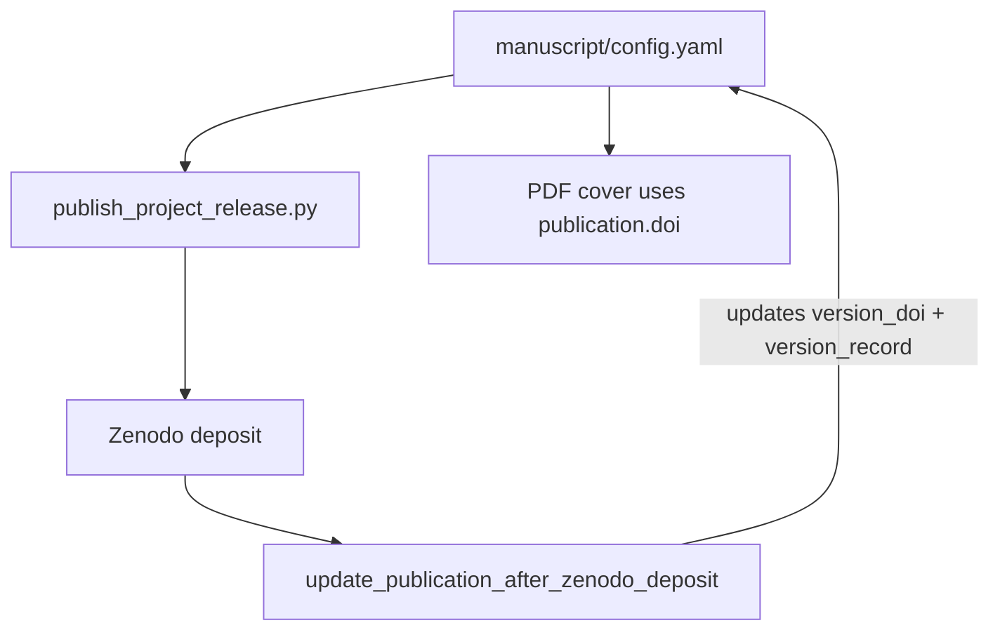

# Zenodo concept vs version DOI strategy

**Skill level:** 11–12 (publication)
**See also:** [Publishing guide](publishing-guide.md) · [`infrastructure/publishing/config_doi.py`](../../infrastructure/publishing/config_doi.py)

Zenodo mints two DOI roles for every deposit series:

| Field | Role | Resolves to | Used on PDF cover / CITATION.cff |
| --- | --- | --- | --- |
| **Concept DOI** | Stable citation identifier | Always-latest redirect | **`publication.doi`** |
| **Version DOI** | Immutable record for one deposit | Specific Zenodo record | **`publication.version_doi`** |

When `version_doi` is declared in `manuscript/config.yaml`, `scripts/publish/publish_project_release.py` (via `update_publication_after_zenodo_deposit`) updates **only** `version_doi` and `version_record` on re-deposit. It does **not** overwrite `publication.doi`, so the cover page and citation files keep the concept DOI.

## Config layout

```yaml
publication:
  doi: "10.5281/zenodo.20417136"          # concept — citation DOI
  version_doi: "10.5281/zenodo.20420368"   # latest deposit
  version_record: "https://zenodo.org/records/20420368"
  github_repository: "docxology/template_code_project"
```

Sidecars must agree on **version string** and **concept DOI**:

- `paper.version` in `config.yaml`
- `version` in `CITATION.cff` and `.zenodo.json`
- `doi` in `CITATION.cff` = concept DOI only

Rendering reads **`publication.doi` only** for the PDF title page and suggested citation block ([`_pdf_title_page.py`](../../infrastructure/rendering/_pdf_title_page.py)). It does not display `version_doi` on the cover.

## Public exemplar matrix

The source-bound matrix lives in [`../_generated/publication_records.md`](../_generated/publication_records.md). It is generated from `infrastructure.project.public_scope`, each public exemplar's `manuscript/config.yaml`, `CITATION.cff`, and `.zenodo.json`; when refreshed with `--refresh-external`, it also records current GitHub release and Zenodo Records API observations. Do not copy the DOI table into this guide.

```bash
uv run python scripts/docgen/publication_records.py --refresh-external
```

## Workflow



1. Set `publication.doi` to the **concept** DOI before the first release (or leave empty until first mint, then split on second deposit).
2. Add `version_doi:` to `config.yaml` when adopting the split layout (all public exemplars use it).
3. Run `uv run python scripts/publish/publish_project_release.py --project {name} --tag vX.Y.Z --repo docxology/{name}`.
4. After deposit, verify `version_doi` / `version_record` updated and `doi` unchanged.
5. Sync `CITATION.cff`, `.zenodo.json`, and GitHub release notes (concept + version DOI + PDF SHA-256).

## Reserve-first release (`--reserve-doi-first`)

When the combined PDF must show the minted DOI on the cover **before** the first public deposit, use the reserve-first path documented in [`publishing-guide.md`](publishing-guide.md):

```bash
uv run python scripts/publish/publish_project_release.py \
  --project templates/template_code_project \
  --tag v1.0.0 \
  --repo docxology/template_code_project \
  --reserve-doi-first
```

Flow (via [`release_workflow_zenodo.py`](../../infrastructure/publishing/release_workflow_zenodo.py)):

1. Create a Zenodo draft with `prereserve_doi=True`.
2. Write **concept DOI** to `publication.doi` and **version DOI** to `publication.version_doi`.
3. Re-render the combined PDF so the cover reads the concept DOI.
4. Upload the DOI-bearing PDF to the reserved draft and publish.
5. Create the GitHub release (optional when `--skip-github`).

Reserve-first is for **first releases** only unless `--new-version` is explicitly supported by the workflow; already-published concept DOIs should use the standard `--new-version` path instead.

## Checklist before tagging a release

- [ ] `paper.version` matches Zenodo `metadata.version` intent for this deposit
- [ ] `publication.doi` is the concept DOI (not the version suffix)
- [ ] `version_doi` and `version_record` reflect the previous latest deposit until this run completes
- [ ] `CITATION.cff` `doi:` equals `publication.doi`
- [ ] Combined PDF validates (`uv run python -m infrastructure.validation.cli pdf …`)
- [ ] Cover page shows concept DOI only

## Drift detection

`scripts/audit/check_template_drift.py` runs `check_publication_metadata_consistency` on public exemplars (see [`infrastructure/project/drift/checks.py`](../../infrastructure/project/drift/checks.py)).

## Related API

| Function | Module |
| --- | --- |
| `update_publication_after_zenodo_deposit` | `infrastructure.publishing.config_doi` |
| `uses_split_zenodo_doi_fields` | `infrastructure.publishing.config_doi` |
| `read_publication_version_doi` | `infrastructure.publishing.config_doi` |
