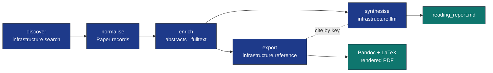

# Literature Search & References

End-to-end module guide for the **discovery → export → synthesis** workflow:
[`infrastructure/search/`](../../infrastructure/search/) finds papers,
[`infrastructure/reference/`](../../infrastructure/reference/) exports them
to BibTeX (compatible with the
[`projects/template_code_project/manuscript/references.bib`](../../projects/template_code_project/manuscript/references.bib)
syntax read by Pandoc with `--natbib`), and
[`infrastructure/llm/`](../../infrastructure/llm/) synthesises content over
the result.



## Core Pieces

| Subpackage | Job |
|---|---|
| `search.literature.backends` | `LocalBackend`, `ArxivBackend`, `CrossrefBackend`, `PaperclipBackend` (opt-in API key). |
| `search.literature.client` | `LiteratureClient` aggregator: failure-isolated, dedup-aware, defensive year filter. |
| `search.literature.cache` | JSON-file `SearchCache` with deterministic query hashing and optional TTL. |
| `search.literature.fulltext` | `AbstractFetcher`, `FulltextFetcher`, `enrich_papers`, `write_corpus`. |
| `reference.citation` | `parse_bibfile` / `render_database` / `paper_to_bibentry` / `generate_citation_key`. |

## Minimal End-to-End

```python
from infrastructure.search.literature import (
    LiteratureClient, SearchQuery, ArxivBackend, CrossrefBackend,
    AbstractFetcher, FulltextFetcher,
)
from infrastructure.reference.citation import paper_to_bibentry, write_bibfile
from infrastructure.reference.citation.models import BibDatabase

# 1. Discover
client = LiteratureClient([ArxivBackend(), CrossrefBackend(mailto="you@example.org")])
result = client.search(SearchQuery(text="protein language model fitness", max_results=15))

# 2. Enrich (abstracts + full text)
abstracts = AbstractFetcher(cache_dir="output/cache/abs")
fulltext = FulltextFetcher(cache_dir="output/cache/pdf")
for p in result.papers:
    abstracts.fetch(p)
    fulltext.fetch(p)

# 3. Export
db = BibDatabase()
for p in result.papers:
    db.add(paper_to_bibentry(p))
write_bibfile("projects/my_project/manuscript/references.bib", db)
```

## Data Model

The canonical record is `Paper` (in `infrastructure.search.literature.models`):

| Field | Source | Used by |
|---|---|---|
| `id` | Backend-prefixed (`arxiv:1412.6980`, `doi:10.1126/...`) | dedup key |
| `title`, `authors`, `year`, `doi`, `url` | Search backend | BibTeX writer |
| `venue`, `venue_type` | Search backend | Routes to `journal=` / `booktitle=` |
| `abstract` | `AbstractFetcher` (or backend) | LLM prompts |
| `pdf_url`, `fulltext` | `FulltextFetcher` | LLM prompts, archival |
| `score` | Backend | Aggregator ranking |
| `keywords`, `volume`, `issue`, `pages`, `publisher`, `edition`, `isbn` | Backend | BibTeX |

`Paper.to_dict()` / `Paper.from_dict()` round-trip cleanly through JSON, so
agent traces, caches, and corpus files are all the same shape.

## CLI Quick-Reference

```bash
# Search → JSON
uv run python -m infrastructure.search.literature.cli search \
    "scaling laws" --source arxiv,crossref -n 20

# Search → BibTeX
uv run python -m infrastructure.search.literature.cli to-bibtex \
    "GRPO hyperparameters" --source arxiv \
    --output output/grpo_refs.bib

# Validate / format an existing .bib
uv run python -m infrastructure.reference.citation.cli validate refs.bib --strict
uv run python -m infrastructure.reference.citation.cli format refs.bib

# Convert a JSON corpus → BibTeX
uv run python -m infrastructure.reference.citation.cli convert papers.json refs.bib
```

## Testing Conventions

The project's no-mocks policy is satisfied by:

* `LocalBackend` against real temp `corpus.json` files.
* HTTP backends against `pytest-httpserver` (a real local HTTP server).
* CLI exercised via real subprocess + direct `main()` calls.

200+ tests cover both modules; see
[`tests/infra_tests/reference/`](../../tests/infra_tests/reference/) and
[`tests/infra_tests/search/`](../../tests/infra_tests/search/).

## Format Compatibility

The BibTeX writer is byte-compatible with
[`projects/template_code_project/manuscript/references.bib`](../../projects/template_code_project/manuscript/references.bib):

* 2-space indent, trailing-comma-rule.
* `pages={N--M}` (auto-normalised from `-` / `–` / `—`).
* DOIs / URLs / years / volumes emitted verbatim (no LaTeX escaping).
* Unicode preserved.
* `book` / `phdthesis` / `techreport` / `misc` never receive a stray `journal=`.

## Related

* Module skills: [`infrastructure/search/SKILL.md`](../../infrastructure/search/SKILL.md), [`infrastructure/reference/SKILL.md`](../../infrastructure/reference/SKILL.md).
* Module agents: [`infrastructure/search/AGENTS.md`](../../infrastructure/search/AGENTS.md), [`infrastructure/reference/AGENTS.md`](../../infrastructure/reference/AGENTS.md).
* Exemplar project: [`projects_archive/template_search_project/`](../../projects_archive/template_search_project/).
