# Operational Documentation

## Overview

Technical guide for `docs/operational/` — operational procedures, runbooks,
build configuration, logging, performance, troubleshooting, Docker usage, and
system maintenance for the repository. This directory consolidates what was
previously split between `docs/operations/` and `docs/operational/`.

## Directory Structure

```mermaid
flowchart TB
    OP[/docs/operational//]
    OP --> META[AGENTS.md · README.md]
    OP --> OV[overview.md · diagrams.md]
    OP --> RB[runbook.md · maintenance.md]
    OP --> CW[config-wizard.md · template-usage.md]
    OP --> DOCK[docker.md]
    OP --> REP[reporting-guide.md · error-handling-guide.md]
    OP --> BUILD[/build<br/>Build system · deps · CI/CD/]
    OP --> CFG[/config<br/>Configuration & checkpoints/]
    OP --> LOG[/logging<br/>Logging system guides/]
    OP --> PERF[/performance<br/>Benchmarking guide/]
    OP --> SCR[/scripts<br/>rotate-logs.sh/]
    OP --> TS[/troubleshooting<br/>Systematic troubleshooting/]

    BUILD --> BUILD_F[README · build-system ·<br/>dependency-management · ci-cd-integration ·<br/>build-performance · build-history]
    CFG --> CFG_F[README · configuration ·<br/>checkpoint-resume · performance-optimization]
    LOG --> LOG_F[README · python-logging ·<br/>bash-logging · logging-patterns ·<br/>output-design]
    PERF --> PERF_F[README · benchmarking-guide]
    TS --> TS_F[README · common-errors · build-tools ·<br/>test-failures · environment-setup ·<br/>recovery-procedures · llm-review · llm-diagnostics]

    classDef d fill:#0f172a,stroke:#0f172a,color:#fff
    classDef pkg fill:#1e3a8a,stroke:#0f172a,color:#fff
    classDef f fill:#0f766e,stroke:#0f172a,color:#fff
    class OP d
    class BUILD,CFG,LOG,PERF,SCR,TS pkg
    class META,OV,RB,CW,DOCK,REP,BUILD_F,CFG_F,LOG_F,PERF_F,TS_F f
```



## Key Conventions

- **Runbook first** — start with [`runbook.md`](runbook.md) for incident
  response and daily/weekly/monthly checks; [`maintenance.md`](maintenance.md)
  covers log rotation, dependency updates, and backups.
- **Pipeline orchestration** → [`docs/RUN_GUIDE.md`](../RUN_GUIDE.md) (stages,
  flags, common invocations).
- **Project paths in commands**: use `--project template_code_project` in
  examples unless documenting placeholders; active names →
  [`_generated/active_projects.md`](../_generated/active_projects.md).
- **Build / dependencies / CI patterns** → [`build/`](build/)
  (`build-system.md`, `dependency-management.md`, `ci-cd-integration.md`); CI/CD
  automation itself lives under [`.github/`](../../.github/).
- **Configuration** → [`config/`](config/) (settings, checkpoint/resume,
  performance optimization).
- **Logging** → [`logging/README.md`](logging/README.md) is the comprehensive
  entry point.
- **Performance** → [`performance/benchmarking-guide.md`](performance/benchmarking-guide.md).
- **Troubleshooting** → [`troubleshooting/README.md`](troubleshooting/README.md)
  has the diagnostic flowchart.
- **Docker operations** — the compose file lives under
  [`infrastructure/docker/`](../../infrastructure/docker/); see
  [`docker.md`](docker.md).
- **Environment setup** — [`config-wizard.md`](config-wizard.md)
  (`uv sync`, `scripts/00_setup_environment.py`).
- **Scripts** — [`scripts/rotate-logs.sh`](scripts/rotate-logs.sh) automates log
  rotation per the logrotate configuration.
- All guides include cross-references to related documentation.

## Quick Commands

```bash
# Show available subcommands and flags
./run.sh --help

# Install deps and validate workspace
uv sync
uv run python scripts/00_setup_environment.py --project template_code_project

# Full / core pipeline
uv run python scripts/execute_pipeline.py --project template_code_project --core-only

# Individual stages
uv run python scripts/01_run_tests.py
uv run python scripts/03_render_pdf.py

# Debug with verbose logging
LOG_LEVEL=0 uv run python scripts/03_render_pdf.py

# Docker (from repo root; compose file is under infrastructure/docker/)
docker compose -f infrastructure/docker/docker-compose.yml --profile dev up -d
docker compose -f infrastructure/docker/docker-compose.yml down

# Log rotation (manual)
bash docs/operational/scripts/rotate-logs.sh
```

## See Also

- [README.md](README.md) — Quick navigation
- [Pipeline Orchestration](../RUN_GUIDE.md) — Pipeline stages and commands
- [logging/](logging/) · [troubleshooting/](troubleshooting/) · [build/](build/) — In-depth operational guides
- [docs/AGENTS.md](../AGENTS.md) — System-wide documentation guide
- [documentation-index.md](../documentation-index.md) — Full index
