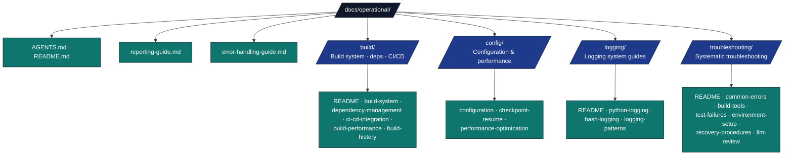

# Operational Documentation

## Overview

Technical guide for `docs/operational/` — operational procedures, build configuration, logging, troubleshooting, and system maintenance.

## Directory Structure



## Key Conventions

- **Project paths in commands**: use `--project template_code_project` in examples unless documenting placeholders; active names → [_generated/active_projects.md](../_generated/active_projects.md).
- **Pipeline orchestration** → `docs/RUN_GUIDE.md` (stages, flags, common invocations)
- **Build / dependencies / CI patterns** → `docs/operational/build/` (`build-system.md`, `dependency-management.md`, `ci-cd-integration.md`)
- **CI/CD automation** → `.github/` (workflows and repository automation docs)
- **Config files** → `config/` sub-folder (settings, checkpoints, perf)
- **Logging** → `logging/README.md` is the comprehensive entry point
- **Troubleshooting** → `troubleshooting/README.md` has the diagnostic flowchart
- All guides include cross-references to related documentation

## Quick Commands

```bash
# Full pipeline
uv run python scripts/execute_pipeline.py --project template_code_project --core-only

# Individual stages
uv run python scripts/00_setup_environment.py
uv run python scripts/01_run_tests.py
uv run python scripts/03_render_pdf.py

# Debug with verbose logging
LOG_LEVEL=0 uv run python scripts/03_render_pdf.py
```

## See Also

- [README.md](README.md) — Quick navigation
- [Pipeline Orchestration](../RUN_GUIDE.md) — Pipeline stages and commands
- [docs/AGENTS.md](../AGENTS.md) — System-wide documentation guide
- [documentation-index.md](../documentation-index.md) — Full index
