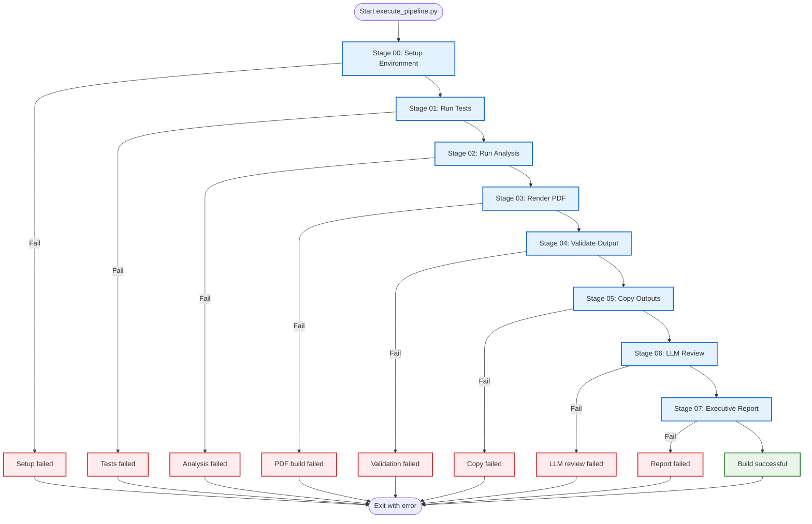
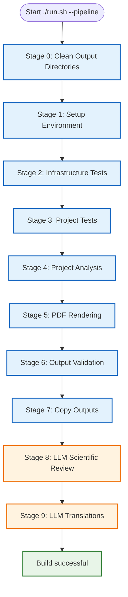

# 🏗️ Build System Documentation

> **reference** for the build pipeline, performance, and system status

**Quick Reference:** [Common Workflows](../../reference/common-workflows.md#generate-pdf-of-manuscript) | [FAQ](../../reference/faq.md) | [Architecture](../../core/architecture.md)

This document consolidates all build system information: current status, performance metrics, and historical fixes.

---

## 📊 Current System Status

**Build Time:** 84 seconds (without optional LLM review)
**Status:** ✅ **OPERATIONAL**

### Build Success Metrics

Live counts and coverage percentages drift with every commit. Rather than
hardcode a snapshot here, link to the authoritative file:

→ **[`docs/_generated/canonical_facts.md`](../../_generated/canonical_facts.md)** for current test counts, coverage percentages, and module rosters.

Indicative shape (verify the live numbers via the link above):

| Metric class | Source of truth |
| --- | --- |
| Infrastructure test count + coverage | `canonical_facts.md` → Test Status |
| Per-exemplar test counts + coverage | `canonical_facts.md` → "Exemplar `pytest --collect-only` totals" |
| Drift-checker self-tests | `canonical_facts.md` → "Drift-checker self-tests" |
| Active project roster | [`docs/_generated/active_projects.md`](../../_generated/active_projects.md) (regenerated by `scripts/generate_active_projects_doc.py`) |
| Manuscript outputs (figures / PDFs / HTML / slides counts) | Per-project `output/AGENTS.md` (template_code) or `output/` inventories (template_prose) |
| Build wall-clock | Local `time` of `./run.sh --pipeline` — varies with hardware and LLM stage opt-in |

---

## 🚀 Build Pipeline Stages

The template provides **two pipeline orchestrators** with different scope and stage structures.

### Core Pipeline: Python Orchestrator (`execute_pipeline.py`)

**10 named stages (stage 0 = Clean, then 9 numbered); `--core-only` runs 8 stages by excluding the two LLM-tagged stages — no LLM dependencies required in core mode:**



### Extended Pipeline: Interactive Orchestrator (`./run.sh --pipeline`)

**10 named stages displayed as `[0/9]` (Clean) then `[1/9]`–`[9/9]` for the nine numbered stages, includes optional LLM features:**

- Stage 1: Clean Output Directories
- Stage 2: Environment Setup
- Stage 3: Infrastructure Tests (may be skipped)
- Stage 4: Project Tests
- Stage 5: Project Analysis
- Stage 6: PDF Rendering
- Stage 7: Output Validation
- Stage 8: LLM Scientific Review (optional, requires Ollama)
- Stage 9: LLM Translations (optional, requires Ollama)
- Stage 10: Copy Outputs



### Stage Breakdown Comparison

#### Core Pipeline (execute_pipeline.py) - 84 seconds

| Stage | Time | Percentage | Description |
| ------- | ------ | ------------ | ------------- |
| **Setup Environment** | 1s | 1% | Dependency validation |
| **Run Tests** | ~35s | 36% | Pipeline-smoke infrastructure contract + selected project tests |
| **Run Analysis** | 6s | 7% | Execute project scripts |
| **Render PDF** | 50s | 60% | Generate manuscript PDFs |
| **Validate Output** | 1s | 1% | Quality checks |
| **Copy Outputs** | 0s | 0% | Final deliverables |
| **Total** | **84s** | **100%** | Core pipeline |

#### Extended Pipeline (run.sh) - ~21 minutes

| Stage | Time | Percentage | Description |
| ------- | ------ | ------------ | ------------- |
| **Clean Output Directories** | <1s | <1% | Fresh build state |
| **Setup Environment** | 1s | <1% | Dependency validation |
| **Infrastructure Tests** | ~20s | 2% | pipeline-smoke contract; full coverage gate is explicit |
| **Project Tests** | ~5s | <1% | matrix of all active projects with coverage; live counts per exemplar in `canonical_facts.md` |
| **Project Analysis** | 6s | <1% | Execute project scripts |
| **PDF Rendering** | 50s | 4% | Generate manuscript PDFs |
| **Output Validation** | 1s | <1% | Quality checks |
| **Copy Outputs** | 0s | <1% | Final deliverables |
| **LLM Scientific Review** | ~20m | 95% | AI manuscript analysis |
| **LLM Translations** | ~30s | <1% | Multi-language abstracts |
| **Total** | **~21m** | **100%** | Extended pipeline |

**Notes:**

- Core pipeline (`execute_pipeline.py`): Fast, no LLM dependencies, programmatic use
- Extended pipeline (`./run.sh --pipeline`):, includes AI features
- LLM stages (8-9) are optional and add ~20.5 minutes to execution time

---

## 📈 Detailed Performance Analysis

For detailed per-stage performance breakdowns, coverage tables, script execution details, and output file inventory, see **[Build Performance Analysis](build-performance.md)**.

**Highlights:**

- Test execution: ~30 seconds aggregate (infra + per-exemplar); current counts → `canonical_facts.md`
- Script execution: 6 seconds (5/5 successful)
- PDF rendering: 50 seconds (13 modules + combined document)
- Coverage: infrastructure ≥60% ([`docs/development/coverage-gaps.md`](../../development/coverage-gaps.md)); project exemplars → [`docs/_generated/canonical_facts.md`](../../_generated/canonical_facts.md)

## 🚨 Troubleshooting

### Build Fails

**Problem:** PDF generation fails

**Solutions:**

1. Check pandoc installed: `pandoc --version`
2. Check xelatex installed: `xelatex --version`
3. Run pipeline:

   ```bash
   # Run all stages
   uv run python scripts/execute_pipeline.py --project {name} --core-only

   # Or use unified interactive menu
   ./run.sh
   ```

### Tests Fail

**Problem:** Tests don't pass

**Solutions:**

1. Check coverage: `pytest tests/ --cov=src --cov-report=term-missing`
2. Fix missing coverage (look for lines marked `>>>>>`)
3. Ensure all tests pass before building

### Scripts Fail

**Problem:** Figure generation fails

**Solutions:**

1. Check imports: Ensure scripts import from `projects/{name}/src/` modules
2. Check file paths: Verify output directories exist
3. Run scripts individually: `uv run python projects/code_project/scripts/example_figure.py`

### References Show ??

**Problem:** Cross-references display as `??`

**Solutions:**

1. Check label exists: Search for `{#sec:labelname}`
2. Check spelling matches exactly
3. Rebuild (references need multiple passes):

   ```bash
   # Run pipeline (includes multiple LaTeX passes)
   uv run python scripts/execute_pipeline.py --project {name} --core-only
   ```

### Coverage Below 100%

**Problem:** Test coverage below requirement

**Solutions:**

1. Generate coverage report: `pytest tests/ --cov=src --cov-report=term-missing`
2. Identify missing lines (marked `>>>>>`)
3. Add tests for uncovered code paths
4. Verify improvement

**See [Common Workflows](../../reference/common-workflows.md#fix-coverage-below-requirements) for detailed steps.**

---

## 📊 Verification Steps

To verify everything works on your system:

```bash
# 1. Run pipeline (all 10 stages)
uv run python scripts/execute_pipeline.py --project {name} --core-only

# Or use unified interactive menu
./run.sh

# 2. Expected output:
# - Build completes in 84 seconds (without optional LLM review)
# - All tests pass (2118 total: 1796 infrastructure + 320 project)
# - PDFs generated in projects/{name}/output/pdf/ and copied to output/{name}/pdf/
# - Final deliverables copied to output/
# - No critical errors

# 3. Verify outputs
ls -la output/                    # Top-level deliverables
ls -la output/code_project/pdf/code_project_combined.pdf # Combined manuscript
ls -la output/code_project/slides/              # Presentation slides
ls -la output/code_project/web/                 # Web outputs

# 4. Open manuscript
open output/code_project/pdf/code_project_combined.pdf
```

**Expected result:** Professional PDF manuscript with all content properly rendered.

---

## 🎯 Best Practices

### Build Pipeline

1. **Always run tests first** - Ensures code quality
2. **Clean outputs regularly** - Fresh builds avoid caching issues
3. **Check validation output** - Address warnings before proceeding
4. **Monitor build times** - Track performance over time
5. **Verify all outputs** - Ensure expected files are generated

### Performance Optimization

1. **Parallel testing** - Use `pytest-xdist` for faster test runs
2. **Caching** - Enable pytest caching for repeated runs
3. **Incremental builds** - Only rebuild changed components when possible
4. **System dependencies** - Keep LaTeX and Pandoc updated

---

## 🔗 Related Documentation

- **[Common Workflows](../../reference/common-workflows.md)** - Step-by-step build recipes
- **[Architecture](../../core/architecture.md)** - System design overview
- **[Workflow](../../core/workflow.md)** - Development process
- **[PDF Validation](../../modules/pdf-validation.md)** - Quality checks
- **[FAQ](../../reference/faq.md)** - Common questions
- **[Documentation Index](../../documentation-index.md)** - reference

---

## ✅ Conclusion

### 🎉 **BUILD STATUS: OPERATIONAL**

The build system is **production-ready** and performs excellently:

- ✅ **All tests passing** (2118 total: 1796 infrastructure [2 skipped] + 320 project, all passing)
- ✅ **All PDFs generate correctly** (15 total: 14 sections + 1 combined)
- ✅ **All scripts execute successfully** (5/5 successful)
- ✅ **All figures and data generated** (28 total: 23 figures + 5 data files)
- ✅ **Manuscript is and properly formatted**
- ✅ **Build time is optimal** (84 seconds without optional LLM review)
- ✅ **No critical errors or warnings**

**The system is ready for research use and can generate high-quality academic manuscripts from markdown sources with full automation.**

---

**Build Version:** v2.0 (10-stage DAG pipeline, with DAG configuration in pipeline.yaml)
**Status:** ✅ **APPROVED FOR PRODUCTION USE**
