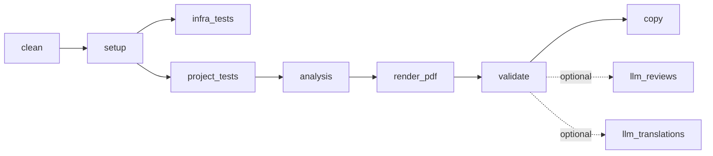

# 🏗️ Build System Documentation

> **reference** for the build pipeline, performance, and system status

**Quick Reference:** [Common Workflows](../../reference/common-workflows.md#generate-pdf-of-manuscript) | [FAQ](../../reference/faq.md) | [Architecture](../../core/architecture.md)

This document consolidates all build system information: current status, performance metrics, and historical fixes.

---

## 📊 Current System Status

This page describes the build contract; it is not a live status receipt. Build
time, pass/fail state, output inventory, and coverage are revision- and
environment-specific. Derive them from a fresh run and bind the result to its
source commit rather than copying historical timings into this guide.

### Build Success Metrics

Live counts and coverage percentages drift with every commit. Rather than
hardcode a snapshot here, link to the authoritative file:

→ **[`docs/_generated/COUNTS.md`](../../_generated/COUNTS.md)** for current test counts, coverage percentages, and module rosters.

Indicative shape (verify the live numbers via the link above):

| Metric class | Source of truth |
| --- | --- |
| Infrastructure test count + coverage | `COUNTS.md` → Test Status |
| Per-exemplar test counts + coverage | `COUNTS.md` → "Exemplar `pytest --collect-only` totals" |
| Drift-checker self-tests | `COUNTS.md` → "Drift-checker self-tests" |
| Active project roster | [`docs/_generated/active_projects.md`](../../_generated/active_projects.md) (regenerated by `scripts/docgen/active_projects.py`) |
| Manuscript outputs (figures / PDFs / HTML / slides counts) | `projects/templates/template_code_project/docs/output_inventory.md` or per-project `output/` inventories |
| Build wall-clock | Local `time` of `./run.sh --pipeline` — varies with hardware and LLM stage opt-in |

---

## 🚀 Build Pipeline Stages

`run.sh` is the thin shell front door; argument parsing and menu behavior live in
`infrastructure.orchestration`. `scripts/runner/execute_pipeline.py` is the
direct non-interactive single-project adapter. Both execute the declarative DAG
from `infrastructure/core/pipeline/pipeline.yaml`; they are not separate stage
models.

Use stable stage keys because numeric display positions change when optional
stages are filtered or inserted:

| Stable key | Role | Default behavior |
| --- | --- | --- |
| `clean` | Prepare project output root | Core |
| `setup` | Validate environment/project paths | Core |
| `infra_tests` | Focused pipeline-smoke infrastructure contract | Core; not the full 60% coverage gate |
| `project_tests` | Selected project's tests | Core; project `src/` coverage floor is 90% unless CI documents a rotating-project exception |
| `analysis` | Produce declared data and figures | Core |
| `render_pdf` | Render manuscript artifacts | Core |
| `validate` | Validate output, figures, Markdown, and evidence | Core |
| `copy` | Copy deliverables to the qualified top-level output path | Core |
| `llm_reviews`, `llm_translations` | Optional model-assisted draft feedback/translation | LLM-tagged; not independent scientific review |
| `connector_search`, `provenance_record` | Optional source/provenance lanes | Opt-in |
| `ebook_generation`, `metadata_package`, `executable_bundle`, `archival_publication` | Optional publication/bundle lanes | Opt-in |


```mermaid
flowchart LR
    Clean["clean"] --> Setup["setup"]
    Setup --> Infra["infra_tests"]
    Setup --> Project["project_tests"]
    Project --> Analysis["analysis"]
    Analysis --> Render["render_pdf"]
    Render --> Validate["validate"]
    Validate --> Copy["copy"]
    Validate -. optional .-> Review["llm_reviews"]
    Validate -. optional .-> Translation["llm_translations"]
```

Inspect the source-owned plan and current flags rather than copying a stage
count:

```bash
uv run python scripts/runner/execute_pipeline.py --help
uv run python scripts/runner/execute_pipeline.py \
  --project templates/template_code_project --core-only
```

Measure performance on the intended revision and environment (for example with
the shell's `time` command) and preserve the result as a dated, source-bound
receipt. Missing optional tooling, a skipped stage, or a historical benchmark
must not be reported as a current successful full run.

---

## 📈 Detailed Performance Analysis

For detailed per-stage performance breakdowns, coverage tables, script execution details, and output file inventory, see **[Build Performance Analysis](build-performance.md)**.

Use the dated receipts in that guide only for the revision and environment they
identify. Current measured counts and coverage belong in `COUNTS.md`; current
wall-clock measurements belong in a fresh benchmark receipt. The repository
floors are 60% for infrastructure and 90% for each public project's `src/`
unless CI explicitly documents a rotating-project exception.

## 🚨 Troubleshooting

### Build Fails

**Problem:** PDF generation fails

**Solutions:**

1. Check pandoc installed: `pandoc --version`
2. Check xelatex installed: `xelatex --version`
3. Run pipeline:

   ```bash
   # Run all stages
   uv run python scripts/runner/execute_pipeline.py \
     --project templates/template_code_project --core-only

   # Or use unified interactive menu
   ./run.sh
   ```

### Tests Fail

**Problem:** Tests don't pass

**Solutions:**

1. Run the full infrastructure contract:

   ```bash
   uv run python scripts/pipeline/stage_01_test.py \
     --infra-only --infra-scope full
   ```

2. Run one project's tests in its own pytest invocation:

   ```bash
   uv run python scripts/pipeline/stage_01_test.py \
     --project templates/template_code_project --project-only
   ```

3. Diagnose the failing behavior or coverage lines without excluding files or
   weakening the configured threshold. Do not combine every project's tests in
   one pytest process because their `tests.conftest` packages can collide.

### Scripts Fail

**Problem:** Figure generation fails

**Solutions:**

1. Check imports: Ensure scripts import from `projects/{name}/src/` modules
2. Check file paths: Verify output directories exist
3. Run scripts individually: `uv run python projects/templates/template_code_project/scripts/optimization_analysis.py`

### References Show ??

**Problem:** Cross-references display as `??`

**Solutions:**

1. Check label exists: Search for `{#sec:labelname}`
2. Check spelling matches exactly
3. Rebuild (references need multiple passes):

   ```bash
   # Run pipeline (includes multiple LaTeX passes)
   uv run python scripts/runner/execute_pipeline.py \
     --project templates/template_code_project --core-only
   ```

### Coverage Below the Configured Floor

**Problem:** Test coverage below requirement

**Solutions:**

1. Run the appropriate Stage 01 full-infrastructure or isolated-project command
   above so coverage is measured against the correct source root.
2. Identify missing lines in the emitted report.
3. Add behavior-focused tests; do not hide source with omissions, pragmas, or a
   reduced threshold.
4. Verify the applicable 60% infrastructure or 90% project `src/` floor. A
   threshold pass does not by itself establish scientific claim coverage.

**See [Common Workflows](../../reference/common-workflows.md#fix-coverage-below-requirements) for detailed steps.**

---

## 📊 Verification Steps

To verify everything works on your system:

```bash
# 1. Run the source-owned core plan for one qualified project
uv run python scripts/runner/execute_pipeline.py \
  --project templates/template_code_project --core-only

# Or use unified interactive menu
./run.sh

# 2. Expected output:
# - Core plan completes (wall-clock varies by revision, tools, and hardware)
# - All tests pass — live counts → docs/_generated/COUNTS.md
# - PDFs generated in the project output and copied under the qualified output path
# - Final deliverables copied to output/
# - No critical errors

# 3. Verify outputs (output/ is keyed by the *qualified* project name)
ls -la output/                    # Top-level deliverables
ls -la output/templates/template_code_project/pdf/template_code_project_combined.pdf
ls -la output/templates/template_code_project/slides/
ls -la output/templates/template_code_project/web/

# 4. Open manuscript
open output/templates/template_code_project/pdf/template_code_project_combined.pdf
```

**Expected result:** the command exits successfully and the named outputs exist.
Inspect the PDF, captions, statistics, citations, and accessibility semantics;
successful generation alone does not establish their quality.

---

## 🎯 Best Practices

### Build Pipeline

1. **Always run tests first** - Ensures code quality
2. **Clean outputs regularly** - Fresh builds avoid caching issues
3. **Check validation output** - Address warnings before proceeding
4. **Monitor build times** - Track performance over time
5. **Verify all outputs** - Ensure expected files are generated

### Performance Optimization

1. **Parallel testing** - Use `pytest-xdist` for faster test runs
2. **Caching** - Enable pytest caching for repeated runs
3. **Incremental builds** - Only rebuild changed components when possible
4. **System dependencies** - Keep LaTeX and Pandoc updated

---

## 🔗 Related Documentation

- **[Common Workflows](../../reference/common-workflows.md)** - Step-by-step build recipes
- **[Architecture](../../core/architecture.md)** - System design overview
- **[Workflow](../../core/workflow.md)** - Development process
- **[PDF Validation](../../modules/pdf-validation.md)** - Quality checks
- **[FAQ](../../reference/faq.md)** - Common questions
- **[Documentation Index](../../documentation-index.md)** - reference

---

## ✅ Conclusion

The repository supplies a declarative, inspectable build path. Treat its status
as unknown until the required commands pass on the intended source revision and
the resulting artifacts are reviewed. Report core execution, optional-stage
availability, coverage, rendered-artifact review, scholarship/scientific review,
owner approval, release, and publication as separate states.

The live DAG, validation results, and release receipts determine readiness for a
specific revision. This durable guide does not assign a build version or
production-approval state.
