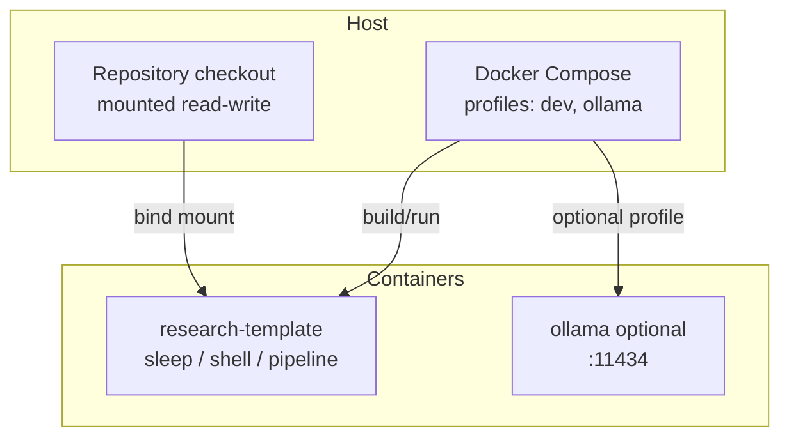
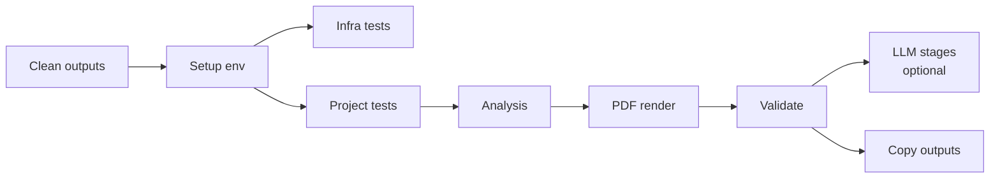
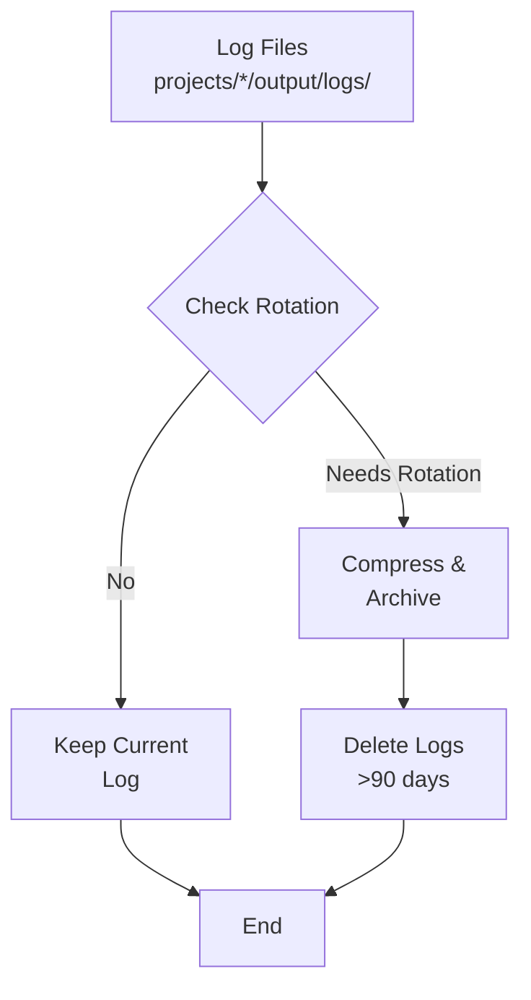
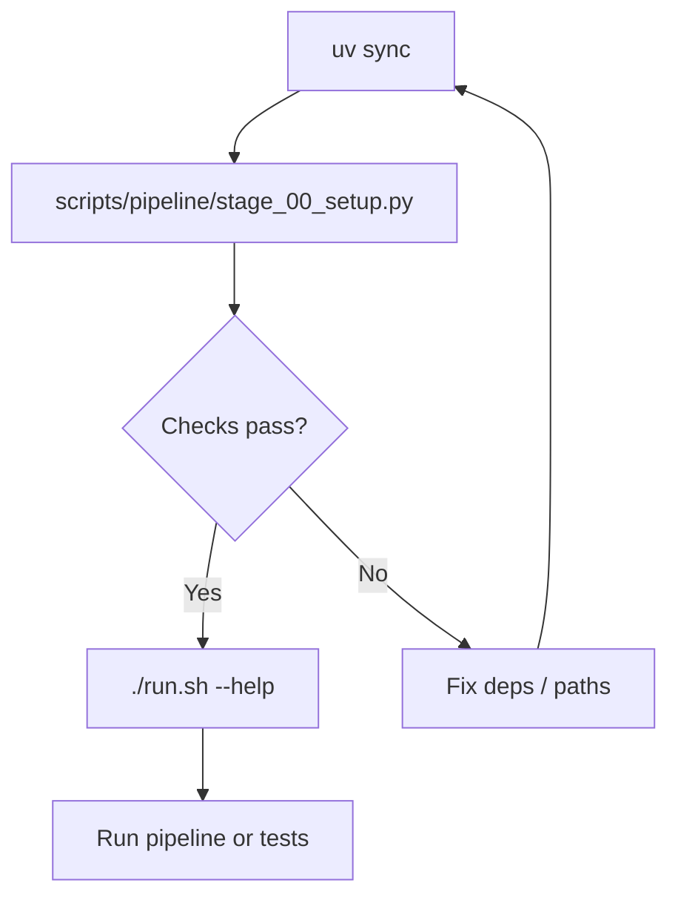

# Operations Diagrams

Deployment diagrams and operational workflows. Prefer linking to [`docs/_generated/active_projects.md`](../_generated/active_projects.md) instead of copying project names here.

## Docker deployment architecture

Compose definitions live in [`infrastructure/docker/docker-compose.yml`](../../infrastructure/docker/docker-compose.yml). Typical layout:

There is no bundled FastAPI web server in the default compose stack; port **8000** is exposed as a placeholder for optional tooling.

## Pipeline orchestration (high level)

Aligned with [`infrastructure/core/pipeline/pipeline.yaml`](../../infrastructure/core/pipeline/pipeline.yaml): clean → setup → tests → analysis → PDF → validation → optional LLM stages → copy outputs.

Use `./run.sh --pipeline` or `scripts/runner/execute_pipeline.py`; `--core-only` skips LLM-tagged stages.

## Log rotation pipeline

## Environment setup flow

See [`config-wizard.md`](config-wizard.md) for commands.
