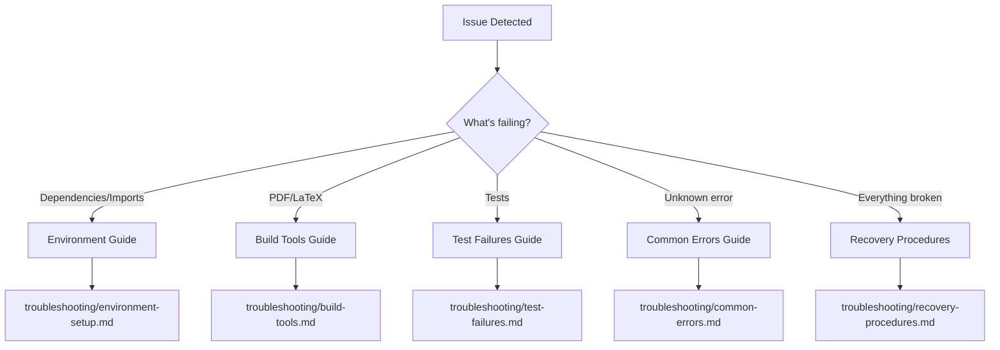

# Troubleshooting Guide

> **Systematic approach** to resolving issues and errors

**Quick Reference:** [FAQ](../reference/faq.md) | [Common Workflows](../reference/common-workflows.md) | [Build System](build-system.md)

## Topic-Specific Guides

| Issue Type | Guide | When to Use |
|------------|-------|-------------|
| 🔧 **Environment** | [troubleshooting/environment-setup.md](troubleshooting/environment-setup.md) | Python, uv, dependencies, matplotlib |
| 🏗️ **Build Tools** | [troubleshooting/build-tools.md](troubleshooting/build-tools.md) | pandoc, LaTeX, PDF generation |
| 🧪 **Tests** | [troubleshooting/test-failures.md](troubleshooting/test-failures.md) | pytest, coverage, debugging |
| ❌ **Errors** | [troubleshooting/common-errors.md](troubleshooting/common-errors.md) | Error message quick reference |
| 🔄 **Recovery** | [troubleshooting/recovery-procedures.md](troubleshooting/recovery-procedures.md) | Reset, backup, recovery |

**Specialized Guides:**

- [LLM Review Troubleshooting](llm-review-troubleshooting.md) - LLM-specific issues
- [Checkpoint and Resume](checkpoint-resume.md) - Checkpoint system
- [Performance Optimization](performance-optimization.md) - Performance issues

---

## Quick Diagnostic Flowchart



---

## Systematic Troubleshooting Approach

### Step 1: Gather Information

```bash
# System information
python --version && uv --version
pandoc --version && xelatex --version

# Environment
env | grep -E "AUTHOR|PROJECT|DOI"

# Dependency status
uv tree
```

### Step 2: Reproduce the Issue

1. **Clean state** - Start from clean output directory
2. **Isolate** - Run individual components
3. **Document** - Record exact steps
4. **Verify** - Confirm consistent behavior

### Step 3: Check Common Causes

| Issue | Likely Cause |
|-------|--------------|
| Import errors | Missing dependencies |
| Build failures | Missing tools (pandoc/LaTeX) |
| Test failures | Configuration or data issues |
| PDF issues | LaTeX packages or paths |
| Permission errors | File system access |

### Step 4: Apply Fixes

1. Start simple - try easiest fixes first
2. One change at a time - isolate what works
3. Test after each fix - verify resolution
4. Document solution - note what worked

---

## Error Message Quick Lookup

| Error | → Go To |
|-------|---------|
| `ModuleNotFoundError` | [Environment](troubleshooting/environment-setup.md) |
| `uv sync failed` | [Environment](troubleshooting/environment-setup.md) |
| `command not found` | [Build Tools](troubleshooting/build-tools.md) |
| `LaTeX Error` | [Build Tools](troubleshooting/build-tools.md) |
| `AssertionError` | [Test Failures](troubleshooting/test-failures.md) |
| `Coverage below` | [Test Failures](troubleshooting/test-failures.md) |
| `Permission denied` | [Common Errors](troubleshooting/common-errors.md) |

---

## Getting Help

**Before asking for help, collect:**

1. Error messages (full output)
2. Environment (OS, Python version)
3. Steps to reproduce
4. What you've tried

**Resources:**

- [FAQ](../reference/faq.md) - Common questions
- [GitHub Issues](https://github.com/docxology/template/issues) - Report bugs

---

**Related Documentation:**

- [FAQ](../reference/faq.md) - Frequently asked questions
- [Build System](build-system.md) - Build system details
- [Common Workflows](../reference/common-workflows.md) - Workflow troubleshooting
