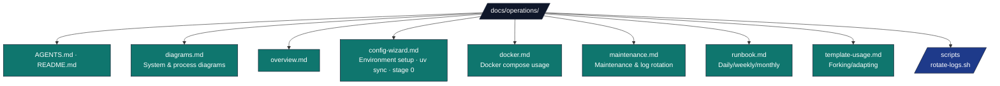

# Operations Documentation

## Overview

Technical guide for `docs/operations/` — operational runbooks, maintenance procedures, and Docker usage for the repository.

## Directory Structure



## Key Conventions

- **Runbook first** — Start with [`runbook.md`](./runbook.md) for incident response and daily checks.
- **Docker operations** — Compose file lives under [`infrastructure/docker/`](../../infrastructure/docker/); see [`docker.md`](./docker.md).
- **Environment setup** — [`config-wizard.md`](./config-wizard.md) (`uv sync`, `scripts/00_setup_environment.py`).
- **Maintenance tasks** — See [`maintenance.md`](./maintenance.md) for log rotation, dependency updates, backups.
- **Scripts** — `scripts/rotate-logs.sh` automates log rotation per the logrotate configuration.

## Quick Commands

```bash
# Environment summary (Python, optional Ollama)
./run.sh --status

# Install deps and validate workspace
uv sync
uv run python scripts/00_setup_environment.py --project template_code_project

# Docker (from repo root; compose file is under infrastructure/docker/)
docker compose -f infrastructure/docker/docker-compose.yml --profile dev up -d
docker compose -f infrastructure/docker/docker-compose.yml down

# Log rotation (manual)
bash docs/operations/scripts/rotate-logs.sh
```

## See Also

- [README.md](README.md) — Quick navigation
- [../operational/](../operational/) — In-depth operational guides (logging, troubleshooting, CI/CD)
- [../RUN_GUIDE.md](../RUN_GUIDE.md) — Pipeline orchestration
- [docs/AGENTS.md](../AGENTS.md) — System documentation guide
