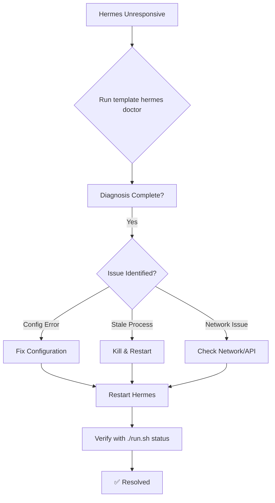

# Operations Runbook

This runbook defines standard operating procedures for maintaining the Research Project Template infrastructure.

## Table of Contents

- [Daily Operations](#daily-operations)
- [Weekly Operations](#weekly-operations)
- [Monthly Operations](#monthly-operations)
- [Incident Response](#incident-response)
- [Health Check Script](#health-check-script)

---

## Daily Operations

### System Status Check

Run the system status command to verify all components are operational:

```bash
./run.sh status
```

**Expected output:**
- Python version and environment status
- Ollama service status (indicator: `●` = running, `✗` = stopped)
- Recent log locations (projects/*/output/logs/)

If Ollama is not running, start it:

```bash
ollama serve
```

### Audit Log Review

Check the daily audit logs for errors, warnings, and unusual activity. Audit logs are located in two places:

1. **Pipeline logs** — project-specific output:
   ```
   projects/*/output/logs/
   ```

2. **Hermes agent logs** (if applicable):
   ```
   ~/.hermes/logs/
   ```

**Review checklist:**
- [ ] No ERROR or CRITICAL level entries in the last 24h
- [ ] All pipeline stages completed successfully
- [ ] No repeated failures for the same project
- [ ] Disk space is stable (not rapidly decreasing)

**Quick audit review command:**

```bash
# Check for errors across all project logs from today
find projects/*/output/logs -name "*.log" -exec grep -l "ERROR\|CRITICAL" {} \; | head -20
```

---

## Weekly Operations

### Full Pipeline Run

Execute the complete pipeline across all active projects:

```bash
./run.sh all
```

This runs:
- Infrastructure tests
- All project tests
- Analysis
- PDF rendering
- Validation

Monitor the progress and address any failures immediately. Flagged projects will appear in the console output with `❌` markers.

### Gate Duration Monitoring

Check the gate duration metrics to ensure stages are completing within acceptable time bounds. Gates are defined in `infrastructure/core/gates.py`.

**Check gate timing:**

```bash
# Look for timing data in the latest logs
find projects/*/output/logs -name "*.json" -exec grep -l "\"gate\"" {} \; | xargs jq '.gate' 2>/dev/null | head -30
```

**Acceptable thresholds:**
- Stage 1 (Tests): < 60s
- Stage 2 (Analysis): < 300s
- Stage 3 (Render): < 120s
- Stage 4 (Validate): < 30s

If any gate exceeds 150% of its threshold, investigate:
- Is the project doing excessive work?
- Are dependencies up to date?
- Is there a resource bottleneck (CPU, memory, disk)?

### Security Scan Review

Run security scans and review findings:

```bash
# Run dependency vulnerability scan
uv sync --quiet && uv pip list | cut -d' ' -f1 | xargs uv pip audit 2>&1 | tee /tmp/security_scan.txt

# If you have trivy installed, scan the Docker image
trivy image template:latest 2>&1 | tee -a /tmp/security_scan.txt
```

**Review checklist:**
- [ ] No HIGH or CRITICAL vulnerabilities in dependencies
- [ ] Docker image has no critical OS package vulnerabilities
- [ ] No secrets or credentials exposed in repo (git secrets scan)

---

## Monthly Operations

### Audit Log Rotation

Rotate out old audit logs to prevent disk fill. Logs older than 30 days are archived and compressed.

**Rotation script:**

```bash
#!/usr/bin/env bash
# docs/operations/scripts/rotate-logs.sh

LOG_DIR="$HOME/.hermes/logs"
ARCHIVE_DIR="$LOG_DIR/archive"
DAYS_THRESHOLD=30

mkdir -p "$ARCHIVE_DIR"

# Find and compress logs older than 30 days
find "$LOG_DIR" -name "*.log" -type f -mtime +$DAYS_THRESHOLD -exec sh -c '
  for f; do
    gzip "$f"
    mv "${f}.gz" "$ARCHIVE_DIR/"
  done
' sh {} +

# Also rotate project logs
find . -path "*/output/logs/*.log" -type f -mtime +$DAYS_THRESHOLD -delete
```

Run the rotation:

```bash
./docs/operations/scripts/rotate-logs.sh
```

### Backup Verification

Verify that backups are current and restorable. The backup strategy uses `rsync` to mirror critical directories.

**Backup locations:**
- Source: `~/.hermes`, `.cache/`, `output/`
- Destination: defined in backup configuration (e.g., external drive or remote server)

**Verification steps:**

```bash
# 1. Check backup freshness
rsync -avun ~/.hermes/ backup:~/.hermes/ 2>&1 | grep -E "^deleting|^\.\/" | tail -5
echo "Last backup modification:"
find backup -type f -printf '%T+ %p\n' | sort -r | head -1
```

```bash
# 2. Spot-check file integrity
diff -r ~/.hermes backup:~/.hermes 2>&1 | head -20
```

```bash
# 3. Test restore of a small sample (non-disruptive)
mkdir -p /tmp/restore-test
rsync -a backup:~/.hermes/config/ /tmp/restore-test/
echo "Restore test successful: $(ls /tmp/restore-test | wc -l) files recovered"
```

**Acceptance criteria:**
- Backup age < 24h (or per your SLA)
- No files missing (diff reports 0 differences)
- Restore test recovers expected files

### Disaster Recovery Drill

Conduct a tabletop or partial recovery drill monthly to ensure procedures work.

**Drill scenario:**
- Simulate loss of `~/.hermes`
- Restore from backup to a test directory
- Start critical services (Hermes, Ollama)
- Run a smoke test: `./run.sh --project test_project --pipeline`

**Drill checklist:**
- [ ] Backup restoration completed in < 15 minutes
- [ ] All services start cleanly
- [ ] Smoke test passes
- [ ] Document any issues and update this runbook

---

## Incident Response

### Hermes Not Responding

**Symptom:** Hermes agent is unresponsive, timeouts, or returns errors.

**Remediation:**

```bash
# 1. Check Hermes process status
ps aux | grep -i hermes | grep -v grep

# 2. Run the Hermes doctor tool to diagnose and repair
template hermes doctor

# 3. If still unresponsive, restart Hermes
template hermes restart
```

**Recovery flow:**



If the doctor tool fails, consult the logs:

```bash
tail -50 ~/.hermes/logs/hermes.log
```

### Port Conflicts

**Symptom:** Service fails to start due to port already in use (e.g., “Address already in use”).

**Diagnosis:**

```bash
# Identify process using the conflicting port (example: compose maps 8000:8000)
lsof -i :8000
```

**Remediation:**

```bash
# Option 1: Stop the conflicting process
kill <PID>

# Option 2: Change the port mapping in infrastructure/docker/docker-compose.yml
# Then restart from infrastructure/docker/: docker compose --profile dev up -d
```

For Docker port conflicts:

```bash
# Stop compose stacks using the project file
docker compose -f infrastructure/docker/docker-compose.yml down
docker stop $(docker ps -q --filter "publish=8000") 2>/dev/null || true
```

### Disk Full

**Symptom:** Write failures, pipeline crashes, or `No space left on device` errors.

**Immediate actions:**

```bash
# 1. Identify large directories
du -sh ~/.hermes .cache output projects/*/output 2>/dev/null | sort -rh | head -10

# 2. Clean temporary/cache files
rm -rf .cache/tmp/* .cache/downloads/*
find output -name "*.tmp" -delete

# 3. Remove old Docker artifacts
docker system prune -af --volumes

# 4. Archive and delete old logs (not yet rotated)
find . -name "*.log" -size +10M -exec gzip {} \;
```

**Prevention:** Ensure log rotation is active (see Monthly operations).

### High Gate Latency

**Symptom:** One or more pipeline stages take significantly longer than baseline.

**Diagnosis:**

```bash
# Check gate timing from recent runs
find projects -name "*.json" -exec grep -l "\"duration\"" {} \; | xargs jq -r '.stage + ": " + (.duration|tostring) + "s"' 2>/dev/null | sort -u
```

**Common causes & fixes:**

| Cause | Investigation | Fix |
|-------|---------------|-----|
| Large input data | Check project `data/` directory size | Archive unused datasets |
| Memory pressure | `htop` → swap usage | Close other apps; increase RAM |
| Slow disk I/O | `iostat` 1 5 | Move caches to SSD |
| Stale dependencies | Compare `uv.lock` age | Run `uv sync --upgrade` |
| Network timeout | Check `OLLAMA_HOST` reachable | Fix network; use local model |

**Escalation:** If latency persists > 2× baseline for 3 consecutive runs, create an incident ticket.

### LLM Provider Outage

**Symptom:** LLM-dependent stages (review, translation) fail with connection errors.

**Diagnosis:**

```bash
# Check Ollama status
ollama list
curl -s http://localhost:11434/api/tags | jq .models 2>/dev/null || echo "Ollama unreachable"
```

**Remediation:**

```bash
# Restart Ollama service
pkill ollama
ollama serve &

# If using OpenRouter/Hermes proxy, check that endpoint
curl -s http://localhost:8000/health || echo "Hermes proxy down"
```

**Workaround:** Skip LLM stages and run core pipeline:

```bash
./run.sh --core-only --project <name> --pipeline
```

Or disable LLM workflows globally:

```bash
export FEP_LEAN_GAUSS_WORKFLOWS=0
./run.sh --project template_code_project --pipeline
```

---

## Health Check Script

A one-liner to quickly verify system readiness:

```bash
./run.sh status && echo "✅ OK" || echo "❌ FAIL"
```

Or as a standalone check script `scripts/health-check.sh`:

```bash
#!/usr/bin/env bash
# Quick health check for CI/CD or cron

set -euo pipefail

echo "=== Health Check ==="

# 1. Python environment
python -c "import sys; print(f'Python {sys.version}')" 2>/dev/null || { echo "❌ Python missing"; exit 1; }

# 2. uv package manager
uv --version >/dev/null 2>&1 || { echo "❌ uv not found"; exit 1; }

# 3. Ollama (optional but warn)
if ! command -v ollama &>/dev/null; then
    echo "⚠️  Ollama not installed (needed for LLM stages)"
else
    echo "✅ Ollama present"
fi

# 4. Disk space (warn if < 5GB free on working dir)
FREE=$(df . | tail -1 | awk '{print $4}')
if [ "$FREE" -lt 5242880 ]; then
    echo "⚠️  Low disk space: $((FREE/1024/1024)) GB remaining"
fi

# 5. Docker (if using containerized Template)
docker --version >/dev/null 2>&1 && echo "✅ Docker available" || echo "⚠️  Docker not available"

# 6. Verify repo structure
for dir in infrastructure projects docs; do
    [ -d "$dir" ] || { echo "❌ Missing $dir"; exit 1; }
done
echo "✅ Repository structure valid"

echo "=== All checks passed ==="
```

Make it executable:

```bash
chmod +x scripts/health-check.sh
```

Integrate into CI or run manually before starting work:

```bash
./scripts/health-check.sh
```

---

*Last updated: 2026-04-27*
