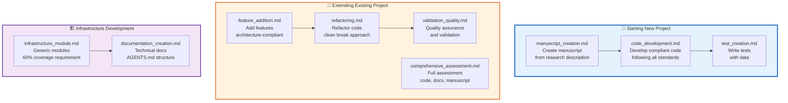

# docs/prompts/ - AI Prompt Templates

> **Expert Prompt Templates** for creating compliant, tested, and well-documented work using the Research Project Template

**Quick Reference:** [AGENTS.md](AGENTS.md) | [Manuscript Creation](manuscript_creation.md) | [Code Development](code_development.md)

## Purpose

This directory contains expertly crafted prompt templates that leverage the extensive project documentation to guide AI assistants and developers in creating work that complies with the template's standards and best practices.

## Prompt Categories

### Core Development Prompts

| Prompt | Purpose | Use Case |
|--------|---------|----------|
| [`manuscript_creation.md`](manuscript_creation.md) | Create manuscripts from scratch | New research projects requiring full manuscript structure |
| [`code_development.md`](code_development.md) | Develop code following all standards | Adding new algorithms, analysis methods, or utilities |
| [`test_creation.md`](test_creation.md) | Write tests | Testing new functionality with data (no mocks) |
| [`feature_addition.md`](feature_addition.md) | Add features compliantly | Extending project capabilities while maintaining architecture |

### Advanced Development Prompts

| Prompt | Purpose | Use Case |
|--------|---------|----------|
| [`refactoring.md`](refactoring.md) | Refactor code following best practices | Code improvement with clean break approach |
| [`infrastructure_module.md`](infrastructure_module.md) | Develop infrastructure modules | Generic utilities reusable across projects |
| [`documentation_creation.md`](documentation_creation.md) | Create documentation | Writing AGENTS.md and README.md files |
| [`validation_quality.md`](validation_quality.md) | Validation and quality assurance | Ensuring output quality and compliance |
| [`comprehensive_assessment.md`](comprehensive_assessment.md) | Comprehensive assessment and review | Full code, docs, and manuscript assessment |

## Quick Navigation Map



## How to Use Prompts

### 1. Choose the Right Prompt

Select the prompt that matches your task:

- **Creating new research?** → `manuscript_creation.md`
- **Adding code to existing project?** → `code_development.md`
- **Testing new functionality?** → `test_creation.md`
- **Extending project features?** → `feature_addition.md`

### 2. Customize the Prompt

Each prompt contains:

- **Context**: What documentation it leverages
- **Template**: Copy-and-customize prompt text
- **Requirements**: Checklist of compliance items
- **Examples**: Usage demonstrations

### 3. Provide Specific Input

When using prompts, provide:

- **Clear objectives** for what you want to create
- **Specific constraints** or requirements
- **Context about the project** (if extending existing work)
- **Expected outcomes** or deliverables

### 4. Validate Output

After generation, validate against:

- **Standards compliance** (check against `.cursorrules/`)
- **Architecture alignment** (two-layer, thin orchestrator)
- **Testing requirements** (coverage, no mocks)
- **Documentation completeness** (AGENTS.md, README.md)

## Key Standards Leveraged

### Development Standards (`.cursorrules/`)

All prompts reference and require compliance with:

| Standard | Focus | Prompts Using |
|----------|-------|---------------|
| [`testing_standards.md`](../../.cursorrules/testing_standards.md) | No mocks, coverage requirements | All prompts |
| [`code_style.md`](../../.cursorrules/code_style.md) | Black formatting, type hints | Code prompts |
| [`api_design.md`](../../.cursorrules/api_design.md) | Function signatures, parameters | Code prompts |
| [`documentation_standards.md`](../../.cursorrules/documentation_standards.md) | AGENTS.md, README.md structure | Documentation prompts |

### Architecture Principles

| Principle | Description | Prompts Using |
|-----------|-------------|---------------|
| **Two-Layer Architecture** | Infrastructure (generic) vs Project (specific) | All prompts |
| **Thin Orchestrator Pattern** | Scripts coordinate, modules compute | Code/feature prompts |
| **Clean Break Refactoring** | No backward compatibility, full migration | Refactoring prompt |

### Quality Requirements

| Requirement | Target | Prompts Using |
|-------------|--------|---------------|
| **Project Coverage** | 90% minimum | All development prompts |
| **Infrastructure Coverage** | 60% minimum | Infrastructure prompts |
| **Data Testing** | No mocks allowed | All testing prompts |
| **Documentation Standards** | AGENTS.md structure | All prompts |

## Example Usage

### Creating a New Research Project

```bash
# 1. Use manuscript creation prompt
cat docs/prompts/manuscript_creation.md
# Copy the prompt template and customize with your research topic

# 2. Use code development prompt
cat docs/prompts/code_development.md
# Copy the prompt template for implementing algorithms

# 3. Use test creation prompt
cat docs/prompts/test_creation.md
# Copy the prompt template for testing
```

### Extending an Existing Project

```bash
# 1. Use feature addition prompt
cat docs/prompts/feature_addition.md
# Plan feature with architecture compliance

# 2. Use validation prompt
cat docs/prompts/validation_quality.md
# Ensure quality and compliance
```

## See Also

### Related Documentation

- [`AGENTS.md`](AGENTS.md) - Technical documentation for all prompts
- [`../core/architecture.md`](../core/architecture.md) - System design principles
- [`../core/workflow.md`](../core/workflow.md) - Development workflow
- [`../README.md`](../README.md) - documentation hub

### Project Documentation

- [`../../projects/act_inf_metaanalysis/AGENTS.md`](../../projects/act_inf_metaanalysis/AGENTS.md) - Active project documentation
- [`../../projects/AGENTS.md`](../../projects/AGENTS.md) - Multi-project management guide

### Standards Reference

- [`../../.cursorrules/README.md`](../../.cursorrules/README.md) - Development standards overview
- [`../../.cursorrules/testing_standards.md`](../../.cursorrules/testing_standards.md) - Testing requirements
- [`../../.cursorrules/infrastructure_modules.md`](../../.cursorrules/infrastructure_modules.md) - Infrastructure development

---

## Quick Command Reference

```bash
# View all available prompts
ls docs/prompts/

# Get prompt for specific task
cat docs/prompts/manuscript_creation.md

# Check standards compliance
cat .cursorrules/testing_standards.md
```
