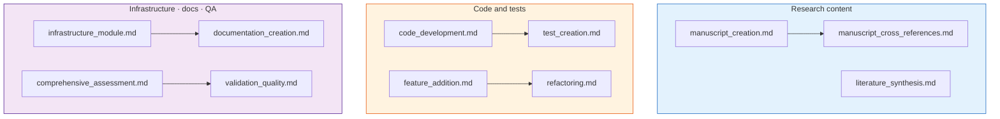

# docs/prompts/ — AI prompt templates

Prompt templates for work that must stay compliant, tested, and documented in this repository.

**Index:** [AGENTS.md](AGENTS.md) (file table and conventions)

## Purpose

Copy-paste blocks that reference real standards and commands so assistants and humans produce aligned artifacts without re-deriving policy from memory.

## Categories

### Research content

| Prompt | Use when |
|--------|----------|
| [manuscript_creation.md](manuscript_creation.md) | New manuscript + project layout from a research brief |
| [manuscript_cross_references.md](manuscript_cross_references.md) | Registry-driven manuscripts (`refs/labels.yaml`, `[[FIG:]]`, `[[THMREF:]]`, …) or auditing cross-refs |
| [literature_synthesis.md](literature_synthesis.md) | LLM blocks for per-paper and corpus synthesis after a search pipeline |

### Code and tests

| Prompt | Use when |
|--------|----------|
| [code_development.md](code_development.md) | New modules, algorithms, or utilities |
| [test_creation.md](test_creation.md) | Adding tests under the no-mocks policy |
| [feature_addition.md](feature_addition.md) | End-to-end feature work across layers |
| [refactoring.md](refactoring.md) | Clean-break refactors with migration |

### Infrastructure and docs

| Prompt | Use when |
|--------|----------|
| [infrastructure_module.md](infrastructure_module.md) | New or extended `infrastructure/*` packages |
| [documentation_creation.md](documentation_creation.md) | AGENTS.md / README.md for a directory |
| [validation_quality.md](validation_quality.md) | Validation CLI, gates, manuscript/output checks |
| [comprehensive_assessment.md](comprehensive_assessment.md) | Wide audit: tests, docs, manuscript, pipeline |

## Navigation map


```mermaid
graph TD
    subgraph Research["Research content"]
        MS[manuscript_creation.md]
        MX[manuscript_cross_references.md]
        LS[literature_synthesis.md]
    end

    subgraph Code["Code and tests"]
        CD[code_development.md]
        TC[test_creation.md]
        FA[feature_addition.md]
        RF[refactoring.md]
    end

    subgraph Ops["Infrastructure · docs · QA"]
        IM[infrastructure_module.md]
        DC[documentation_creation.md]
        VQ[validation_quality.md]
        CA[comprehensive_assessment.md]
    end

    MS --> MX
    CD --> TC
    FA --> RF
    IM --> DC
    CA --> VQ

    classDef r fill:#e3f2fd,stroke:#1565c0
    classDef c fill:#fff3e0,stroke:#e65100
    classDef o fill:#f3e5f5,stroke:#4a148c
    class Research r
    class Code c
    class Ops o
```

## How to use

1. Pick the row that matches the task; open the file and copy the **Prompt Template** / **Copy-paste prompt** block.
2. Fill bracketed placeholders (`[project]`, `[feature]`, …). Use [`_generated/active_projects.md`](../_generated/active_projects.md) for real project names.
3. Run the **Verification** / **Commands** section literally; do not substitute invented coverage numbers—use pytest output or [`_generated/canonical_facts.md`](../_generated/canonical_facts.md).

## Standards leveraged

| Resource | Role |
|----------|------|
| [`../rules/`](../rules/) | Normative coding, testing, docs, manuscripts |
| [`../guides/manuscript-semantics.md`](../guides/manuscript-semantics.md) | Pandoc cite + crossref syntax |
| [`../core/architecture.md`](../core/architecture.md) | Two layers, thin orchestrator |
| [`.github/AGENTS.md`](../../.github/AGENTS.md) | CI jobs and coverage floors |

## Example commands

```bash
ls docs/prompts/
uv run pytest projects/template_code_project/tests/ \
  --cov=projects/template_code_project/src --cov-fail-under=90 -q
```

## See also

- [`../README.md`](../README.md) — documentation hub
- [`../development/contributing.md`](../development/contributing.md)
- [`../../CLAUDE.md`](../../CLAUDE.md) — command cheat sheet
