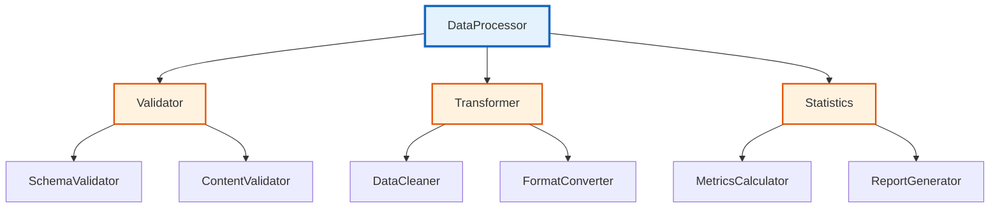
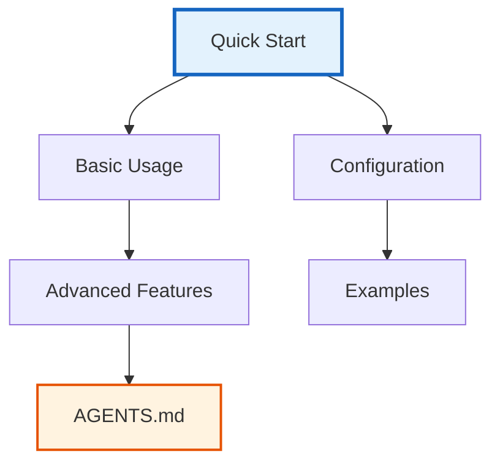

# Documentation Creation Prompt

## Purpose

Create technical documentation (AGENTS.md) and quick reference guides (README.md) that follow the template's documentation standards and provide clear navigation.

## Context

This prompt leverages the documentation standards to create professional documentation:

- [`../../.cursorrules/documentation_standards.md`](../../.cursorrules/documentation_standards.md) - Documentation writing standards
- [`../AGENTS.md`](../AGENTS.md) - Documentation organization guide
- [`../../projects/act_inf_metaanalysis/AGENTS.md`](../../projects/act_inf_metaanalysis/AGENTS.md) - Project documentation example

## Prompt Template

```
You are creating documentation for the Research Project Template. All documentation must follow the AGENTS.md and README.md standards with clear structure, technical details, and proper cross-referencing.

DOCUMENTATION TARGET: [Specify what to document: "module", "project", "feature", "system"]
TARGET NAME: [Name of the module/project/feature/system]
TARGET PATH: [File/directory path being documented]

DOCUMENTATION REQUIREMENTS:

## 1. AGENTS.md Technical Documentation

Create technical documentation following the AGENTS.md standard:

### Required Structure
```markdown
# [Target Name]

> **[Brief description]** - [Purpose and scope]

**[Quick Reference:** [Related docs and navigation links]

## Overview

[description of what is being documented, its purpose, architecture, and integration points.]

## [Section 1 - Core Concept]

[Detailed technical information about the core functionality, design decisions, and implementation details.]

### [Subsection - Specific Technical Details]

[Deep technical information with code examples, API details, and implementation specifics.]

## [Section 2 - Architecture/Structure]

[Architecture description, component relationships, data flow, and system integration.]

### [Subsection - Component Details]

[Specific component information with diagrams and technical specifications.]

## [Section 3 - API Reference/Usage]

[API documentation or usage instructions with examples.]

### Classes/Functions/Modules

#### `[ClassName/FunctionName]`

[Detailed documentation for each public API with parameters, return values, exceptions, and examples.]

## [Section 4 - Implementation Details]

[Internal implementation details, algorithms, data structures, and technical decisions.]

## [Section 5 - Integration/Dependencies]

[How this integrates with other systems, dependencies, and compatibility requirements.]

## [Section 6 - Testing/Validation]

[Testing approach, coverage information, and validation procedures.]

## [Section 7 - Performance/Quality]

[Performance characteristics, quality metrics, and optimization information.]

## Error Handling

[Exception hierarchy, error conditions, and recovery procedures.]

## Configuration

[Configuration options, environment variables, and setup requirements.]

## See Also

[Cross-references to related documentation with proper relative paths.]

---

## [Technical Implementation Notes]

[Advanced technical details for experienced users.]
```

### Content Requirements

**Show, Don't Tell:**
```markdown
# ❌ BAD: Vague explanation
This module provides data processing capabilities with various algorithms.

# ✅ GOOD: Concrete examples
```python
from data_processing import DataProcessor

# Process CSV data with validation
processor = DataProcessor(config={'validate': True})
result = processor.process_csv('data.csv')

# Result includes validated data and processing statistics
assert result['valid_rows'] == 1000
assert result['processing_time'] < 5.0
```
```

**API Documentation:**
```markdown
#### `DataProcessor`

Main class for data processing operations with validation and error handling.

**Parameters:**
- `config` (Dict[str, Any]): Configuration dictionary
  - `validate` (bool): Enable input validation (default: True)
  - `parallel` (bool): Enable parallel processing (default: False)
  - `chunk_size` (int): Processing chunk size (default: 1000)

**Methods:**

##### `process_csv(file_path: Path) -> ProcessingResult`
Process CSV file with validation and transformation.

**Parameters:**
- `file_path`: Path to CSV file to process

**Returns:**
ProcessingResult with processed data and statistics

**Raises:**
- `FileNotFoundError`: If input file doesn't exist
- `ValidationError`: If data validation fails
- `ProcessingError`: If processing encounters errors

**Example:**
```python
processor = DataProcessor({'validate': True})
result = processor.process_csv(Path('data.csv'))

print(f"Processed {result.valid_rows} rows")
print(f"Execution time: {result.execution_time:.2f}s")
```
```

**Architecture Diagrams:**


## 2. README.md Quick Reference

Create concise quick reference guide following README.md standards:

### Required Structure
```markdown
# [Target Name]

> **[Brief description]** - [Purpose and key features]

**[Quick Reference:** [Essential links and commands]

## Overview

[2-3 sentence description of what this is and why it's useful.]

## Quick Start

[Essential usage example with 1-2 code blocks.]

## Features

- **[Feature 1]**: [Brief description]
- **[Feature 2]**: [Brief description]

## Installation/Setup

[Basic setup instructions if needed.]

## Usage Examples

[2-3 practical examples showing common use cases.]

## Documentation

See [`AGENTS.md`](AGENTS.md) for technical documentation.

## See Also

[Links to related documentation and resources.]
```

### Content Guidelines

**Essential Information Only:**
- Focus on most common use cases
- Include runnable code examples
- Provide clear navigation to detailed docs
- Use Mermaid diagrams for complex relationships

**Navigation Mermaid:**


## 3. Cross-Referencing System

### Internal References
```markdown
# Link to other AGENTS.md files
See [`../module/AGENTS.md`](../module/AGENTS.md) for module details.

# Link to related documentation
See [`../../docs/core/architecture.md`](../../docs/core/architecture.md) for architecture information.

# Link to standards
See [`../../../.cursorrules/testing_standards.md`](../../../.cursorrules/testing_standards.md) for testing requirements.
```

### Standards References
```markdown
# Reference development standards
See [`.cursorrules/code_style.md`](../../../.cursorrules/code_style.md) for code formatting standards.

# Reference documentation standards
See [`.cursorrules/documentation_standards.md`](../../../.cursorrules/documentation_standards.md) for documentation guidelines.
```

## 4. Content Quality Standards

### Technical Accuracy
- All code examples must be runnable and correct
- API signatures must match implementation
- Configuration options must be accurate
- Performance claims must be verifiable

### Completeness Requirements
- All public APIs must be documented
- All configuration options must be explained
- All error conditions must be described
- All integration points must be covered

### Consistency Standards
- Use consistent terminology throughout
- Follow established naming conventions
- Maintain consistent formatting
- Use approved diagram styles

## 5. Documentation Maintenance

### Update Procedures
```markdown
# When code changes, update documentation:
1. Review affected documentation sections
2. Update API signatures and examples
3. Test all code examples
4. Validate cross-references
5. Update version information
```

### Quality Validation
```bash
# Validate documentation quality
./validate_documentation.py AGENTS.md README.md

# Check cross-references
./validate_links.py AGENTS.md

# Test code examples
./test_documentation_examples.py AGENTS.md
```

## Key Requirements

- [ ] AGENTS.md with technical documentation structure
- [ ] README.md with quick reference and navigation
- [ ] All public APIs documented with examples
- [ ] Cross-references using relative paths
- [ ] Show-don't-tell approach with runnable examples
- [ ] Mermaid diagrams for complex relationships
- [ ] Technical accuracy and completeness
- [ ] Consistent formatting and terminology

## Standards Compliance Checklist

### Documentation Standards ([`../../.cursorrules/documentation_standards.md`](../../.cursorrules/documentation_standards.md))
- [ ] AGENTS.md structure with all required sections
- [ ] README.md with Mermaid navigation diagrams
- [ ] Code examples that are runnable and correct
- [ ] Cross-references with relative paths
- [ ] Show-don't-tell approach throughout

### Content Standards
- [ ] Technical accuracy (all APIs, configs, examples correct)
- [ ] Completeness (all public interfaces documented)
- [ ] Consistency (terminology, formatting, style)
- [ ] Quality (examples work, links valid, diagrams correct)

### Integration Standards
- [ ] Proper cross-referencing to related documentation
- [ ] Integration with documentation navigation system
- [ ] Standards compliance references included
- [ ] Version and maintenance information included

## Example Usage

**Input:**
```
DOCUMENTATION TARGET: module
TARGET NAME: Data Quality Assessment Module
TARGET PATH: infrastructure/data_quality/
```

**Expected Output:**
- `infrastructure/data_quality/AGENTS.md` with full technical documentation
- Concise `infrastructure/data_quality/README.md` with quick reference
- All APIs documented with examples
- Architecture diagrams and integration information
- Cross-references to related modules and standards

## Related Documentation

- [`../../.cursorrules/documentation_standards.md`](../../.cursorrules/documentation_standards.md) - Documentation writing standards
- [`../AGENTS.md`](../AGENTS.md) - Documentation organization guide
- [`../../projects/act_inf_metaanalysis/AGENTS.md`](../../projects/act_inf_metaanalysis/AGENTS.md) - Project documentation example
- [`../../README.md`](../../README.md) - README.md standards example
```
