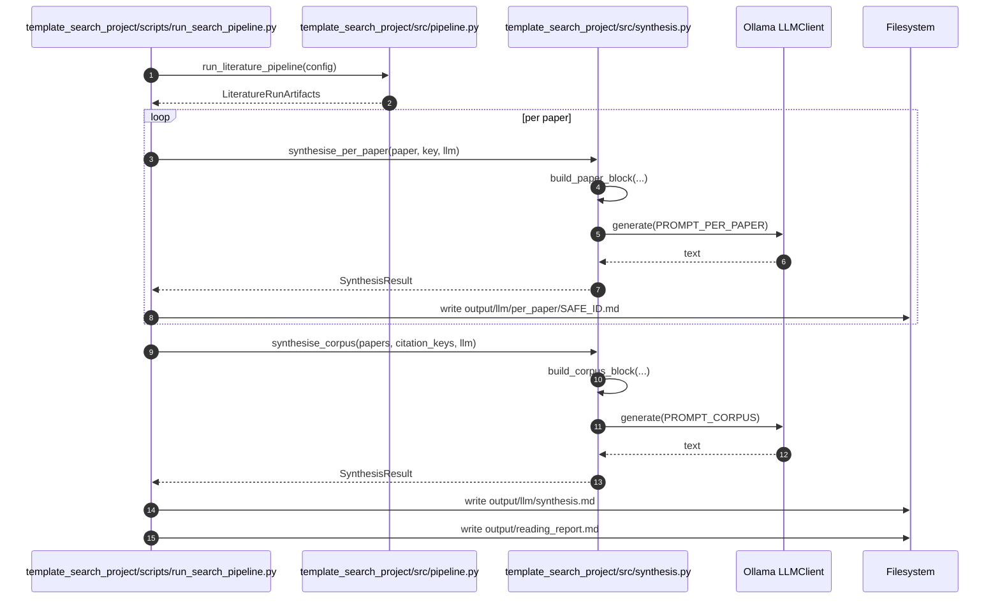

# Prompt: Literature Synthesis

Reusable prompt blocks for LLM-driven synthesis of literature search
results, intended to be loaded as templates by
`infrastructure.llm.templates.get_template` or composed inline.

## Prompt Composition Flow



## Inputs

These prompts assume each paper is rendered as

```
### {citation_key} — {title} ({year})
**Authors:** {authors}
**DOI / URL:** {doi or url}
**Abstract:** {abstract}
[fulltext truncated to N tokens, optional]
```

…built from a list of `infrastructure.search.literature.Paper` records.

## Per-Paper Analysis

```
You are a careful research analyst. Read the paper below and write a
structured note in this exact form:

CONTRIBUTION: <one sentence — what does the paper claim is new?>
METHOD: <2-3 bullets — the approach in plain language>
EVIDENCE: <2-3 bullets — what experiments / proofs support the claim?>
LIMITATION: <one bullet — the most important caveat>
TAGS: <3-7 lowercase tags>

Cite the paper as [{citation_key}] in any in-line reference.

PAPER
{paper_block}
```

## Cross-Paper Synthesis

```
You are a literature synthesiser. The corpus below contains {n} papers
indexed by citation key. Your task is to:

1. Group the papers into 3-7 thematic clusters. Name each cluster.
2. Within each cluster, summarise the dominant approach in 2-4 sentences.
3. Identify methodological agreements (≥2 papers) and disagreements.
4. List 3 open questions that no paper in the corpus answers cleanly.

Cite every claim using square-bracket citation keys, e.g.
[{example_key1}, {example_key2}]. Do NOT introduce papers outside the
corpus.

CORPUS
{joined_paper_blocks}
```

## Gap Analysis

```
The following research goal is given:

GOAL
{goal_paragraph}

The corpus below contains the {n} papers most closely related to this
goal. For each paper, decide:

- COVERS: which sub-claims of the goal does it address?
- LACKS: which sub-claims does it leave open?

Then propose 3 specific follow-up experiments that would close the
largest remaining gaps. Cite supporting / non-supporting papers by key.

CORPUS
{joined_paper_blocks}
```

## Style Notes

* **Cite, do not paraphrase obliquely.** Bracket-key citations are
  resolvable by `infrastructure.reference.citation`; bare title strings
  rot.
* **Bound the input.** `FulltextFetcher(max_chars=…)` truncates fulltext;
  also drop the abstract when only the title fits the context.
* **Pin seeds for replay.** `OllamaClientConfig(temperature=0.0,
  seed=42)` is the recommended default for review-style synthesis.
* **Validate claim/citation alignment.** A second pass with
  `infrastructure.llm.validation.validate_complete` flags hallucinations
  before they hit a manuscript.

## Programmatic Use

```python
from infrastructure.llm import LLMClient, OllamaClientConfig

PROMPT = """
You are a careful research analyst...
PAPER
{paper_block}
"""

def per_paper_block(paper):
    return (
        f"### {citation_key} — {paper.title} ({paper.year})\n"
        f"**Authors:** {', '.join(paper.authors)}\n"
        f"**DOI / URL:** {paper.doi or paper.url}\n"
        f"**Abstract:** {paper.abstract or '(missing)'}\n"
    )

llm = LLMClient(OllamaClientConfig(model="gemma3:4b", seed=42, temperature=0.0))
for paper in papers:
    response = llm.generate(PROMPT.format(paper_block=per_paper_block(paper)))
    Path(f"output/llm/per_paper/{paper.id}.md").write_text(response.text)
```

See [`projects/template_search_project/`](../../projects/template_search_project/)
for a fully wired implementation including caching, error handling, and
markdown rendering.
