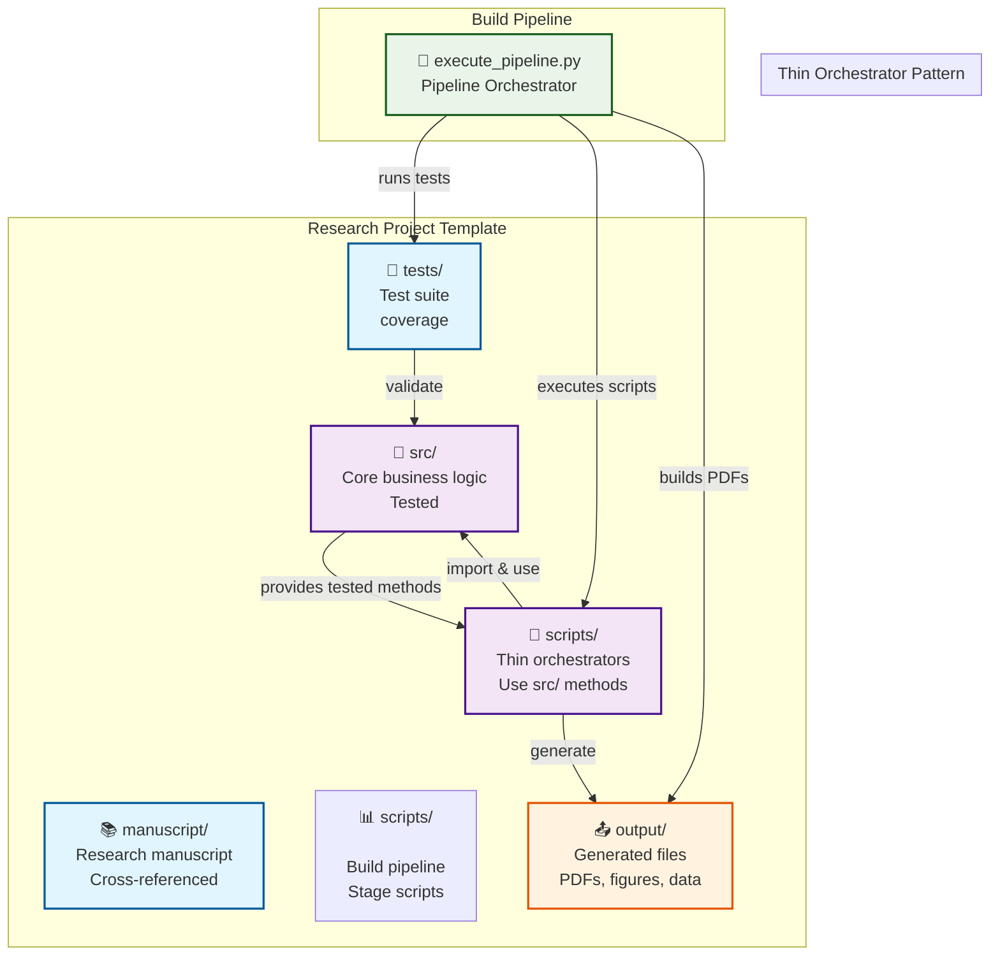
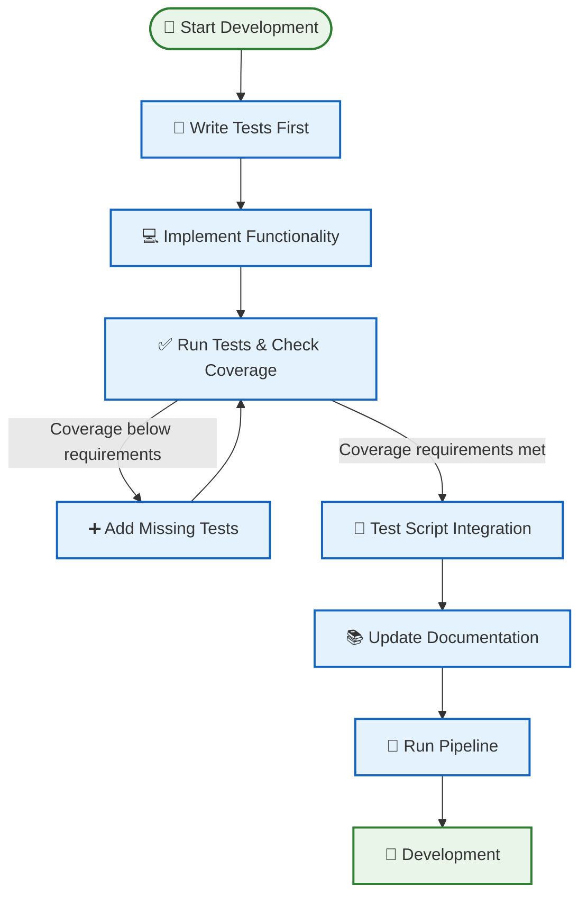
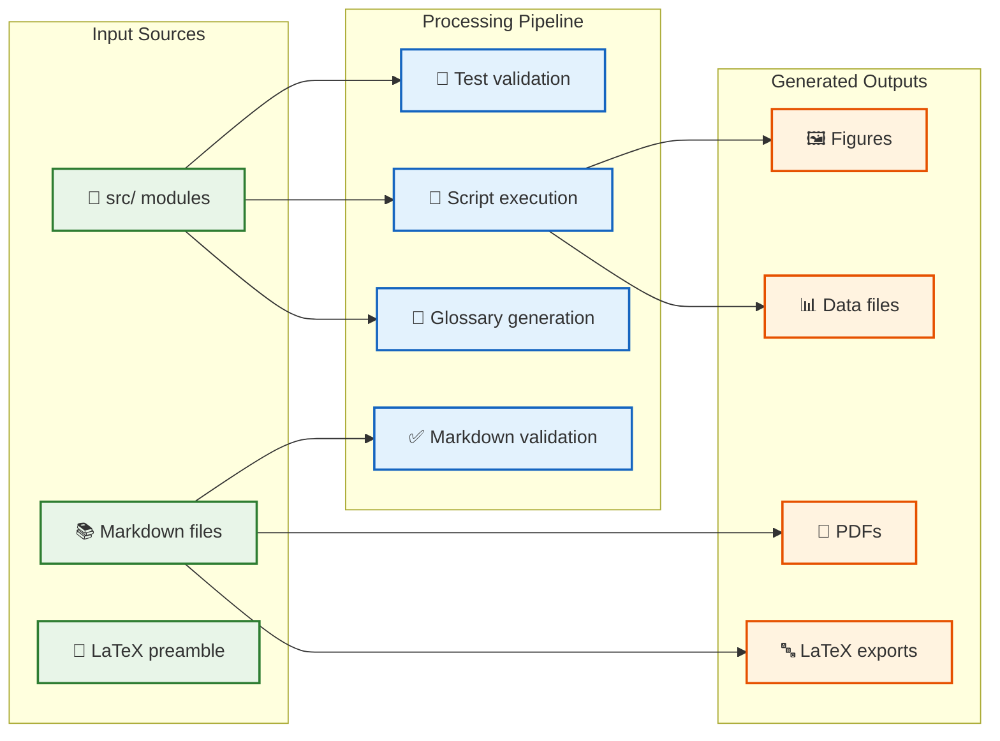

# 📋 Copypasta — Architecture Diagrams & Comparisons

> **Ready-to-use diagrams and tables** for presentations and documentation

**See also:** [Copypasta — Descriptions & Code](copypasta.md) | [Copypasta — Outreach](copypasta-outreach.md)

---

## 🗺️ System Architecture Diagrams

### 🏗️ System Overview

### ⚡ Development Workflow

### 📊 Output Generation Flow

---

## 📊 Feature Comparison Table

| Feature | Traditional Approach | This Template | Benefit |
|---------|---------------------|---------------|---------|
| **Project Structure** | Manual organization | 🏗️ Standardized structure | Consistency across projects |
| **Testing** | Optional coverage | 🧪 Coverage requirements enforced | Reliable, bug-free code |
| **Documentation** | Manual updates | 📚 Auto-synchronized | Code-doc always in sync |
| **PDF Generation** | Manual LaTeX editing | 🚀 Automated from markdown | Save hours of formatting |
| **Figure Integration** | Manual file management | 🖼️ Automated generation | Seamless figure inclusion |
| **Cross-referencing** | Manual numbering | 🔗 Automatic system | Professional academic output |
| **Quality Assurance** | Manual review | ✅ Automated validation | Consistent high quality |
| **Collaboration** | Ad-hoc workflows | 🤝 Standardized processes | Team efficiency |

---

## 🔗 Quick Links Section

### 🌐 Essential URLs

🔗 **[GitHub Template](https://github.com/docxology/template)** — Click "Use this template"  
📚 **[Documentation](https://github.com/docxology/template#readme)** — Project overview  
🐛 **[Issues](https://github.com/docxology/template/issues)** — Report bugs & request features  
💬 **[Discussions](https://github.com/docxology/template/discussions)** — Join the community  

### 🚀 Key Features to Highlight

✅ **Test-driven development** with coverage  
✅ **Automated PDF generation** from markdown  
✅ **Professional LaTeX output** with cross-referencing  
✅ **Automated figure generation** from Python scripts  
✅ **Cross-referencing system** for equations & figures  
✅ **Standardized project structure** for consistency  
✅ **Thin orchestrator pattern** for maintainability  
✅ **Publication-ready outputs** for academic use  

### 📖 Documentation Navigation

🚀 **[How To Use Guide](../core/how-to-use.md)** — Usage guide from basic to advanced  
🏗️ **[Architecture Guide](../core/architecture.md)** — System design overview  
⚡ **[Workflow Guide](../core/workflow.md)** — Development process  
📝 **[Markdown Guide](../usage/markdown-template-guide.md)** — Writing & formatting  
🎯 **[Examples Showcase](../usage/examples-showcase.md)** — Real-world usage  
🔧 **[Thin Orchestrator Summary](../architecture/thin-orchestrator-summary.md)** — Pattern implementation  
🗺️ **[Development Roadmap](../development/roadmap.md)** — Future plans  
🤝 **[Contributing Guide](../development/contributing.md)** — How to contribute  
❓ **[FAQ](../reference/faq.md)** — Common questions

---

**Related:** [Copypasta — Descriptions & Code](copypasta.md) | [Copypasta — Outreach](copypasta-outreach.md)
