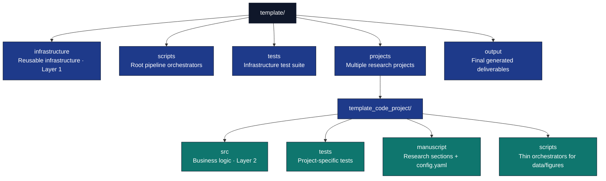

# ⚡ Quick Start Cheatsheet

> **One-page reference** for essential commands and workflows

**New to the template?** Start with **[Getting Started Guide](../guides/getting-started.md)** | **[FAQ](../reference/faq.md)**

## 🚀 Essential Commands

### Setup Commands
```bash
# Clone template
git clone https://github.com/docxology/template.git

# Install dependencies
uv sync

# Run build
uv run python scripts/execute_pipeline.py --project {name} --core-only
```

### Daily Workflow Commands
```bash
# Run tests only
uv run pytest projects/templates/template_code_project/tests/ --cov=projects/templates/template_code_project/src --cov-report=html

# Generate figures only
uv run python scripts/pipeline/stage_02_analysis.py --project template_code_project

# Validate markdown
uv run python -m infrastructure.validation.cli markdown projects/templates/template_code_project/manuscript/

# Open manuscript
open output/templates/template_code_project/pdf/template_code_project_combined.pdf  # Top-level output (example project)
```

### Build Pipeline Commands
```bash
# pipeline execution
uv run python scripts/execute_pipeline.py --project {name} --core-only

# With specific stage
uv run python scripts/pipeline/stage_00_setup.py --project template_code_project
uv run python scripts/pipeline/stage_01_test.py --project template_code_project
uv run python scripts/pipeline/stage_02_analysis.py --project template_code_project
uv run python scripts/pipeline/stage_03_render.py --project template_code_project
uv run python scripts/pipeline/stage_04_validate.py --project template_code_project

# Validate PDFs (after copy stage or use project working tree)
uv run python -m infrastructure.validation.cli pdf output/templates/template_code_project/pdf/template_code_project_combined.pdf
```

## 📁 Directory Structure Quick Reference



## 🔧 Common Workflows

### Create a New Document Section
```bash
# 1. Create markdown file
vim projects/templates/template_code_project/manuscript/07_new_section.md

# 2. Add content with section label
echo "# New Section {#sec:new_section}" > projects/templates/template_code_project/manuscript/07_new_section.md

# 3. Rebuild
uv run python scripts/execute_pipeline.py --project {name} --core-only
```

### Add a New Figure
```bash
# 1. Create script in project's scripts/ directory
vim projects/templates/template_code_project/scripts/my_figure.py

# 2. Import from src/ (thin orchestrator pattern)
# from src.optimizer import gradient_descent

# 3. Generate and save to output/figures/
# 4. Reference in manuscript:
# \includegraphics{../output/figures/my_figure.png}
```

### Add New Source Code
```bash
# 1. Create module
vim projects/templates/template_code_project/src/my_module.py

# 2. Create tests (90% minimum coverage required)
vim projects/templates/template_code_project/tests/test_my_module.py

# 3. Run tests
uv run pytest projects/templates/template_code_project/tests/test_my_module.py --cov=projects/templates/template_code_project/src/my_module

# 4. Use in scripts (thin orchestrator pattern)
# from projects.template_code_project.src.my_module import my_function
```

### Fix Test Coverage
```bash
# 1. Check coverage
uv run pytest projects/templates/template_code_project/tests/ --cov=projects/templates/template_code_project/src --cov-report=term-missing

# 2. Find missing lines (marked with ">>>>>")
# 3. Add tests for uncovered code
# 4. Re-run until ≥90% (project src/ gate)
```

## 📝 Quick Syntax Reference

### Cross-References
```markdown
# Section reference
See Section \ref{sec:methodology}

# Equation reference
From Equation \eqref{eq:objective}

# Figure reference
Figure \ref{fig:convergence_plot} shows...
```

### Equations
```markdown
\begin{equation}\label{eq:my_equation}
f(x) = x^2 + 2x + 1
\end{equation}

Reference it: \eqref{eq:my_equation}
```

### Figures
```markdown
\begin{figure}[h]
\centering
\includegraphics[width=0.8\textwidth]{../output/figures/my_figure.png}
\caption{My figure caption}
\label{fig:my_figure}
\end{figure}

Reference it: \ref{fig:my_figure}
```

## 🐛 Quick Troubleshooting

| Problem | Quick Fix |
|---------|-----------|
| **Tests fail** | `uv run pytest projects/templates/template_code_project/tests/ -v` to see details |
| **Coverage below gate** | `uv run pytest --cov=projects/templates/template_code_project/src --cov-report=term-missing --cov-fail-under=90` |
| **Import errors** | Check `PYTHONPATH` or use `uv run` |
| **PDF fails** | Check `pandoc --version` and `xelatex --version` |
| **Figures missing** | Run `uv run python scripts/pipeline/stage_02_analysis.py --project template_code_project` first |
| **References show ??** | Check label spelling and existence |
| **Project not discovered** | Ensure the directory is under `projects/`, has `src/` with Python files, and has `tests/`; add `manuscript/config.yaml` before rendering |
| **Stage 4 fails silently** | Check root pyproject.toml has project deps ([details](../guides/new-project-setup.md#pitfall-6-root-venv)) |
| **Config warnings** | Nest custom keys under `project_config:` |

## 📊 Key Metrics

**Current System Status (verify locally):**
- **Tests**: `uv run pytest tests/infra_tests/ projects/<name>/tests/` (thresholds in `pyproject.toml`)
- **Coverage**: 90% minimum project `src/`, 60% minimum `infrastructure/` (enforced by pytest)
- **Build time**: measure with `/usr/bin/time` on your project; depends on manuscript size and machine
- **Documentation**: see [documentation-index.md](../documentation-index.md)

**See [Pipeline Orchestration](../RUN_GUIDE.md) for details**

## 🎯 Quick Decision Tree

**I want to...**

- **Just write documents** → [Getting Started Guide](../guides/getting-started.md)
- **Add figures** → [Figures and Analysis](../guides/figures-and-analysis.md)
- **Write tests** → [Testing and Reproducibility](../guides/testing-and-reproducibility.md)
- **Understand architecture** → [Architecture](../core/architecture.md)
- **Contribute** → [Contributing](../development/contributing.md)
- **Fix a problem** → [FAQ](../reference/faq.md)

## 🔗 Essential Links

- **[Guide](../core/how-to-use.md)** - All 12 skill levels
- **[Common Workflows](../reference/common-workflows.md)** - Step-by-step recipes
- **[FAQ](../reference/faq.md)** - Common questions
- **[Glossary](../reference/glossary.md)** - Terms and definitions
- **[Documentation Index](../documentation-index.md)** - All docs

## 💡 Pro Tips

1. **Always run tests first**: `uv run pytest projects/templates/template_code_project/tests/` before building
2. **Use thin orchestrator pattern**: Scripts import from `projects/{name}/src/`
3. **Coverage requirements**: 90% minimum for project code, 60% for infrastructure
4. **Run pipeline**: `uv run python scripts/execute_pipeline.py --project {name} --core-only` executes all stages
5. **Pipeline stages**: Core `--core-only` run is **eight** stages by default (clean through copy); see [RUN_GUIDE.md](../RUN_GUIDE.md)
6. **Read build logs**: Check `projects/{name}/output/logs/pipeline.log` for errors
7. **Individual stages**: Run `uv run python scripts/0X_stage_name.py --project {name}` for specific stages
8. **CI/CD friendly**: Pipeline scripts support automated builds

---

**Need more details?** See **[Documentation Index](../documentation-index.md)**

**System Status**: ✅ All operational | [Pipeline Orchestration](../RUN_GUIDE.md)

