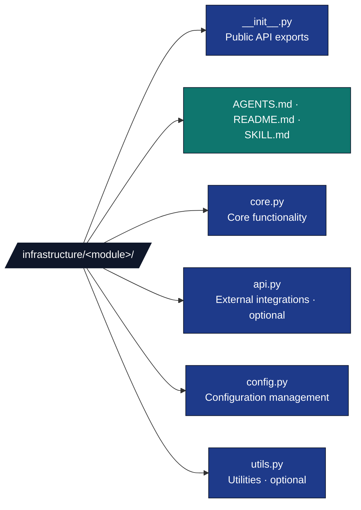
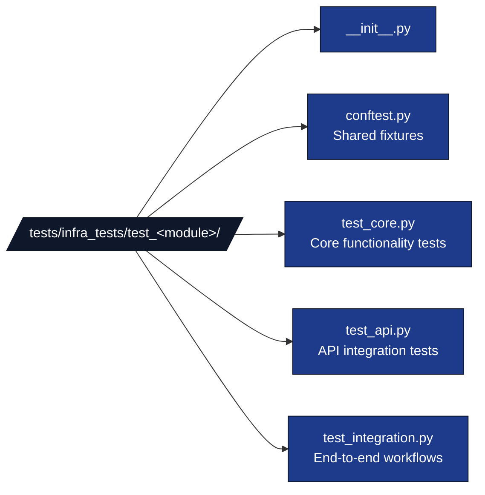
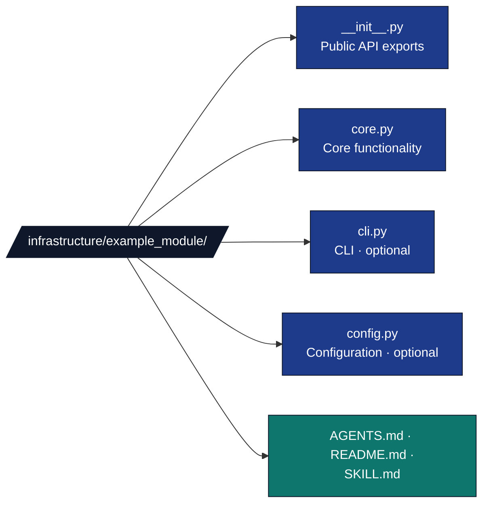

# Infrastructure Module Development Rules

## Overview

The `infrastructure/` directory contains **reusable, generic build and validation tools** that apply to any research project. All new infrastructure modules must follow these standards.

## Module Structure Standards

### Subfolder Organization



### Module Requirements

1. **Generic First**: Reusable across all projects
2. **Domain-Independent**: No research-specific assumptions
3. **Well-Tested**: 60% minimum coverage with data (current % — see [coverage-gaps.md](../development/coverage-gaps.md))
4. **Well-Documented**: AGENTS.md and README.md
5. **Type-Hinted**: All public APIs have type annotations

## Testing Standards

### Test Organization



### Coverage Requirements

- **60% minimum coverage** required for infrastructure code (current % — see [coverage-gaps.md](../development/coverage-gaps.md))
- **No mock methods** - test with data
- **Integration tests** demonstrating workflows
- **Edge cases** and error conditions tested

## Import Standards

### From Infrastructure

```python
# Good: Import from infrastructure package
from infrastructure.reporting import generate_pipeline_report
from infrastructure.llm import LLMClient
from infrastructure.rendering import RenderManager
from infrastructure.reporting import generate_pipeline_report, get_error_aggregator

# Bad: Relative imports outside package
from ..reporting import generate_pipeline_report  # DON'T
```

### Exception Handling

```python
# Good: Use infrastructure exceptions
from infrastructure.core.exceptions import (  # noqa: docs-lint
    ReportingError,
    LLMConnectionError,
    RenderingError
)

# Good: Raise with context
raise ReportingError(
    "Report generation failed",
    context={"format": "html", "stage": stage_name}
)
```

### Logging

```python
# Good: Use infrastructure logging
from infrastructure.core.logging.utils import get_logger

logger = get_logger(__name__)
logger.info(f"Processing {count} items")

# See python_logging.md for full guidelines
```

## Module-Specific Guidelines

### Documentation Module

- **Standards enforcement**: Validate AGENTS.md and README.md structure
- **Cross-referencing**: Check internal link integrity
- **Template generation**: Auto-generate documentation scaffolds
- **Coverage tracking**: Monitor documentation completeness

### LLM Module

- **Local-first**: Prefer local models (Ollama)
- **Privacy**: No data sent to external services by default
- **Fallback**: Graceful degradation when models unavailable
- **Templates**: Reusable prompts for common tasks

### Rendering Module

- **Format-agnostic**: Support multiple output formats
- **Quality checks**: Validate all generated outputs
- **Incremental**: Support incremental builds
- **Caching**: Cache intermediate results

### Publishing Module

- **Platform-independent**: Support multiple publishing platforms
- **Metadata-rich**: metadata for all outputs
- **Compliance**: Check platform-specific requirements
- **Automation**: Minimize manual intervention

### Reporting Module

- **Multi-format**: Generate reports in JSON, HTML, and Markdown
- **Actionable**: Include specific recommendations and fixes
- **Integrated**: Automatically integrated into pipeline stages
- **Error aggregation**: Categorize and prioritize errors
- **Performance tracking**: Monitor resource usage and bottlenecks

## Configuration Management

### Environment Variables

- Prefix with module name: `REPORTING_OUTPUT_DIR`
- Document in module README.md
- Provide sensible defaults

### Config Files

- Use `<module>/config.py` for configuration classes
- Support loading from environment variables
- Use dataclasses for type safety

```python
@dataclass
class ModuleConfig:
    setting: str = "default"

    @classmethod
    def from_env(cls) -> ModuleConfig:
        return cls(
            setting=os.getenv("MODULE_SETTING", "default")
        )
```

## API Design

### Public API

- Export in `__init__.py`
- Document with docstrings
- Type-hint all parameters and returns
- Use descriptive names

### Private Implementation

- Prefix with `_` for internal functions
- Keep in separate modules if complex
- Document for maintainers

## Error Handling

### Use Specific Exceptions

```python
# Good
raise ReportingError("Report generation failed")

# Bad
raise Exception("Query failed")
```

### Chain Exceptions

```python
try:
    api_call()
except RequestException as e:
    raise ReportingError("Report generation failed") from e
```

## Documentation Requirements

### AGENTS.md

- **Purpose**: What the module does
- **Architecture**: How it's organized
- **Usage**: Code examples
- **Configuration**: All options documented
- **Testing**: How to run tests

### README.md

- **Quick Start**: Minimal example
- **Features**: Key capabilities
- **Installation**: Dependencies (if any)

### Code Documentation

```python
def function_name(arg: str) -> str:
    """One-line summary.

    Detailed description of what the function does,
    including any important behavior or edge cases.

    Args:
        arg: Description of argument

    Returns:
        Description of return value

    Raises:
        ExceptionType: When this happens

    Example:
        >>> function_name("input")
        'output'
    """
```

## Integration with Build System

### Scripts Integration

Infrastructure modules are integrated into the build pipeline through:

1. **Setup** (`scripts/00_setup_environment.py`) - Environment validation
2. **Testing** (`scripts/01_run_tests.py`) - Infrastructure and project tests
3. **Analysis** (`scripts/02_run_analysis.py`) - Project script discovery and execution
4. **PDF Rendering** (`scripts/03_render_pdf.py`) - Document generation
5. **Validation** (`scripts/04_validate_output.py`) - Quality assurance

**Pipeline Entry Points**: Two orchestrators available:

- `./run.sh --pipeline`: 9 stages (shown as [1/9]..[9/9]) with an initial clean step shown as [0/9]; optional LLM stages are included when configured/enabled
- `uv run python scripts/execute_pipeline.py --project {name} --core-only`: core pipeline without LLM stages

Update these scripts to discover and use new infrastructure modules as needed.

## Quality Checklist

Before committing:

- [ ] Test coverage requirements met (60% minimum for infrastructure)
- [ ] All tests pass
- [ ] AGENTS.md - [ ] README.md written
- [ ] Type hints on all public APIs
- [ ] Docstrings on all functions
- [ ] infrastructure/**init**.py updated
- [ ] infrastructure/AGENTS.md updated
- [ ] No linter errors
- [ ] Wrapper script created (if needed)

## Common Pitfalls

### ❌ Don't

- Import from project-specific code
- Hardcode paths or values
- Skip error handling
- Use mock methods in tests
- Assume specific research domain

### ✅ Do

- Keep modules focused and single-purpose
- Use configuration for flexibility
- Provide clear error messages
- Test with data
- Design for reusability

## Example Module

### Module Structure



### **init**.py Example

```python
"""Example module - brief description.

module description including main features and use cases.

Example:
    >>> from infrastructure.example_module import process_data
    >>> result = process_data("input")
    >>> print(result)
    'processed'
"""

from .core import process_data, validate_input, ExampleError
from .config import ExampleConfig

__all__ = [
    "process_data",
    "validate_input",
    "ExampleError",
    "ExampleConfig",
]
```

### core.py Example

```python
"""Core functionality for example module."""

from infrastructure.core.logging.utils import get_logger
from infrastructure.core.exceptions import ValidationError

logger = get_logger(__name__)

class ExampleError(Exception):
    """Example module error."""
    pass

def process_data(data: str) -> str:
    """Process data.

    Args:
        data: Input data

    Returns:
        Processed result

    Raises:
        ValidationError: If data is invalid

    Example:
        >>> process_data("hello")
        'HELLO'
    """
    logger.debug(f"Processing data: {data}")

    try:
        result = validate_input(data)
        logger.info(f"Processing completed: {result}")
        return result.upper()
    except ValueError as e:
        logger.error(f"Processing failed: {e}")
        raise ValidationError("Invalid data") from e

def validate_input(data: str) -> str:
    """Validate input data.

    Args:
        data: Input to validate

    Returns:
        Validated data

    Raises:
        ValueError: If invalid
    """
    if not isinstance(data, str):
        raise ValueError("Data must be string")
    if len(data) == 0:
        raise ValueError("Data cannot be empty")
    return data
```

### config.py Example

```python
"""Configuration for example module."""

from dataclasses import dataclass
import os

@dataclass
class ExampleConfig:
    """Example module configuration."""

    timeout: int = 30
    retries: int = 3
    debug: bool = False

    @classmethod
    def from_env(cls) -> "ExampleConfig":
        """Load configuration from environment variables.

        Environment variables:
            EXAMPLE_TIMEOUT: Request timeout in seconds (default: 30)
            EXAMPLE_RETRIES: Number of retries (default: 3)
            EXAMPLE_DEBUG: Enable debug mode (default: false)

        Returns:
            ExampleConfig instance
        """
        return cls(
            timeout=int(os.getenv("EXAMPLE_TIMEOUT", "30")),
            retries=int(os.getenv("EXAMPLE_RETRIES", "3")),
            debug=os.getenv("EXAMPLE_DEBUG", "false").lower() == "true",
        )
```

### cli.py Example

```python
"""Command-line interface for example module."""

import argparse
from infrastructure.core.logging.utils import get_logger
from .core import process_data
from .config import ExampleConfig

logger = get_logger(__name__)

def main() -> int:
    """Main entry point.

    Returns:
        Exit code
    """
    parser = argparse.ArgumentParser(description="Example module CLI")
    parser.add_argument("data", help="Data to process")
    parser.add_argument("--debug", action="store_true", help="Enable debug mode")

    args = parser.parse_args()

    try:
        config = ExampleConfig(debug=args.debug)
        result = process_data(args.data)
        print(f"Result: {result}")
        return 0
    except Exception as e:
        logger.error(f"Error: {e}", exc_info=True)
        return 1

if __name__ == "__main__":
    exit(main())
```

## Integration Checklist

Before merging a new infrastructure module:

- [ ] Module structure matches recommended organization
- [ ] Test coverage requirements met (60% minimum for infrastructure)
- [ ] All public APIs have type hints
- [ ] AGENTS.md covers all features
- [ ] README.md has working quick-start
- [ ] Error handling uses custom exceptions
- [ ] Logging uses unified system
- [ ] Configuration documented
- [ ] CLI interface working (if applicable)
- [ ] No imports from project-specific code
- [ ] infrastructure/**init**.py updated
- [ ] infrastructure/AGENTS.md updated
- [ ] Tests pass locally
- [ ] No linter errors

## References

- [Infrastructure AGENTS.md](../../infrastructure/AGENTS.md) - Module organization
- [Modules Guide](../modules/modules-guide.md) - guide to all advanced modules
- [API Reference](../reference/api-reference.md) - API documentation for all modules
- [Two-Layer Architecture](../architecture/two-layer-architecture.md) - Architecture explanation
- [Testing Guide](testing_standards.md) - Testing infrastructure code
- [Error Handling Guide](error_handling.md) - Exception patterns
- [Logging Guide](python_logging.md) - Logging standards
- [Documentation Guide](documentation_standards.md) - Writing module docs
- [Type Hints Guide](type_hints_standards.md) - Type annotation patterns
