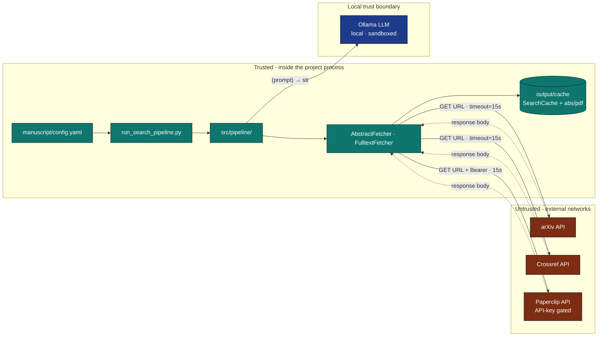

# Security Considerations: Literature Fetch

Pulling content from the open web introduces a small but real attack
surface. This note documents the mitigations baked into
`infrastructure/search/literature/` and the residual risks that callers
should track.

## Trust Boundaries

## Threat Model

| Asset | Threat | Mitigation |
|---|---|---|
| Local files | Malicious server returns content that, when written to disk, escapes the cache directory. | All cache paths are derived from `_safe_id(paper.id)` (regex-filtered to `[A-Za-z0-9._-]`); no caller-controlled component reaches `Path(...)` unsanitised. |
| Local CPU | Server returns a 10 GB body to exhaust memory. | `FulltextFetcher(max_chars=…)` truncates extracted text. Underlying HTTP read is bounded by `urllib`'s default behaviour; for very-large-file resilience set `timeout` low and run inside a process limit. |
| Local time | Server hangs indefinitely. | Every backend has a `timeout=` argument (defaults: 15 s search, 60 s fulltext). |
| Process integrity | Server returns a malicious PDF that exploits the parser. | `pypdf` is a pure-Python parser; recent CVEs are around DoS, not RCE. Keep the dependency current via `uv lock --upgrade`. |
| Outbound traffic | Egress to unintended hosts. | Default base URLs are pinned in code (`api.crossref.org`, `export.arxiv.org`, `paperclip.gxl.ai`); `base_url` overrides are explicit at construction. |
| Credentials | Paperclip API key leaks via logs. | `PaperclipBackend` reads the key from `api_key=`; the key is never logged, never written to cache files, and never echoed by the CLI. |
| Replay | A cached `search_*.json` is committed but contains a transient leak (e.g. private email in a hit). | Cache files are pretty-printed JSON — easy to grep before commit. Add a CI check if your domain mandates one. |

## Hardening Recommendations

### Production deployments

1. **Set explicit timeouts.** The defaults are tuned for interactive use;
   in batch jobs use lower values (e.g. `timeout=8.0`).
2. **Pin a `mailto`** in `CrossrefBackend(mailto="ops@example.org")`.
   Required for the polite pool; also gives Crossref a contact for abuse.
3. **Rotate Paperclip keys** on the same cadence as other API tokens.
4. **Run the LLM behind a private endpoint.** Ollama is local by default;
   if you swap in a remote model, route via your existing API gateway.
5. **Audit cache contents periodically.** `output/cache/` may accumulate
   PDFs whose retention you have not formally approved.

### Untrusted environments

If you must run this code on arbitrary user input:

1. **Constrain the corpus** — replace `ArxivBackend()` with
   `LocalBackend("vetted_corpus.json")`.
2. **Disable PDF fetching** — omit `FulltextFetcher` from the pipeline;
   abstracts alone are usually enough.
3. **Sandbox the process** — wrap the call in a subprocess with restricted
   filesystem and network namespaces.

## Logging

* Search backends log via `infrastructure.core.logging.get_logger`. They
  log query metadata and per-source counts but **not** the response
  bodies (which can be large or sensitive).
* Backend errors are recorded into `SearchResult.errors` rather than
  raised; logging is the caller's responsibility.

## What Is *Not* Mitigated

* **Robots.txt compliance.** The CLI does not check `robots.txt`. Use
  domain-specific backends, not arbitrary URL fetchers.
* **Licensing.** PDF text extracted by `FulltextFetcher` may be
  copyrighted; the fetcher does not enforce TDM licences. You are
  responsible for publication rights.
* **Phishing-style redirects.** `urllib` follows redirects by default. If
  this matters, swap in an `HttpClient` that disables them.

## Incident Response

If a malicious response is suspected:

1. Quarantine the cache: `mv output/cache output/cache.suspect`.
2. Inspect: `find output/cache.suspect -name '*.json' -exec grep -l '<suspicious string>' {} +`.
3. Rotate any keys that may have been observed (Paperclip).
4. Re-run with `--no-cache --tolerate-errors` to verify the issue is
   reproducible vs. cached.

## See Also

* [`docs/security/secure_execution.md`](secure_execution.md) — generic
  process hardening.
* [`docs/security/hashing_and_manifests.md`](hashing_and_manifests.md) —
  artefact integrity tooling.
* `infrastructure/core/security.py` — repository security primitives.
