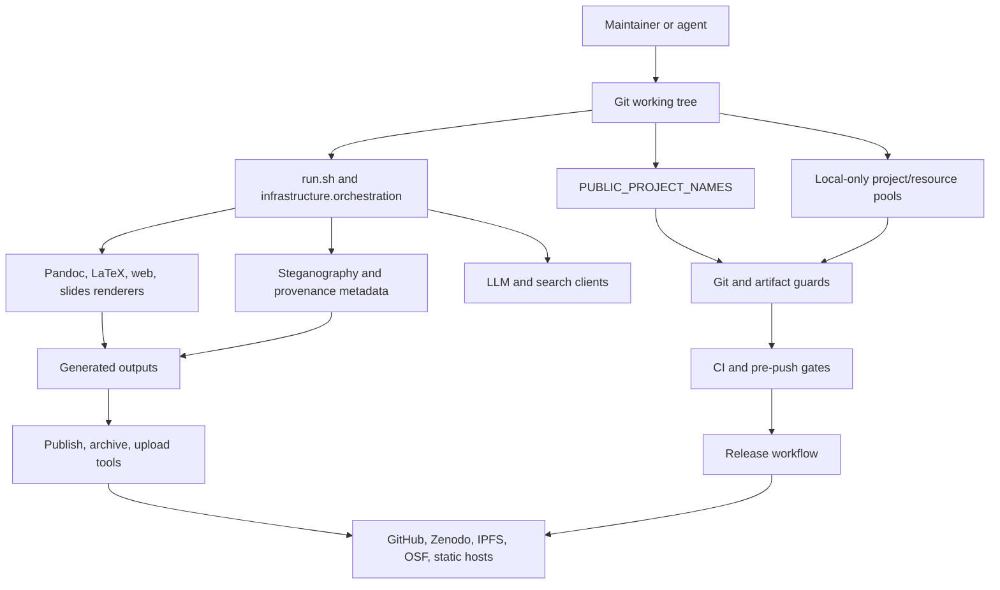

# Template Repository Threat Model

Generated: 2026-07-17 · Relocated to `docs/security/` 2026-07-24.

Scope: `docxology/template` style public research-project template checkout.

## Executive Summary

This repository's primary security problem is not a network perimeter. It is a
public research-template supply chain: local/private project material must never
enter public git history or generated public artifacts, release/publishing tools
must not accidentally publish the wrong payload, and CI/security gates must keep
the reusable Layer-1 infrastructure honest as templates are added.

The strongest repository-visible controls are:

- Public scope is centralized in `infrastructure/project/public_scope.py`.
- Git-index confidentiality guards derive allowed public project paths from that
  roster in `infrastructure/project/git_guards.py`.
- Generated/local artifacts and oversized public-template outputs are rejected by
  `infrastructure/project/git_guards.py`.
- CI runs with `contents: read` for normal jobs in `.github/workflows/ci.yml`
  and includes Ruff, mypy, tracked-artifact, confidentiality, pip-audit, Bandit,
  and shell-injection sweeps.
- Publishing tools share payload and metadata preflight controls. Their commit
  semantics are deliberately not uniform: `archive_publication.py` and the
  upload runner require `--commit`, while `publish_project_release.py` performs
  real publication unless the operator supplies `--dry-run` (Zenodo uses its
  sandbox unless `--production` is also selected).

The main residual risks are:

- Sensitive areas have a bus factor of 1 across every queried category. The
  ownership map found no orphaned sensitive code, but all sensitive tags are
  historically controlled by one owner.
- The root `TO-DO.md` is now future-only; shipped remediation history remains in
  the dated review record and historical release notes.
- `.github/CODEOWNERS` has a default catch-all and its explicit
  `projects/templates/*` roster is generated/parity-checked against the current
  `PUBLIC_PROJECT_NAMES` list.
- Publication, archival, and upload tools accept real credentials from env or
  local config; explicit rehearsals lower risk, and the shared payload/metadata
  preflight now runs before provider invocation. Hostile rendering and the
  offline promotion validator are shipped; private-sidecar promotion wiring
  and external ownership enforcement remain open.
- LLM, rendering, and steganography surfaces intentionally process manuscript
  content and external/local model inputs. They need strong scoping,
  sanitization, and "do not upload private paths" guarantees.
- Private control-plane projects may carry adjacent high-risk backlogs; their
  promotion into this repository's shipped/public/deployed boundary requires an
  explicit security checklist and risk acceptance.

## Scope And Assumptions

In scope:

- Layer-1 infrastructure under `infrastructure/`.
- Orchestration and publishing scripts under `scripts/`, `run.sh`, and
  `secure_run.sh`.
- CI/CD, CODEOWNERS, security policy, dependency and pre-commit gates under
  `.github/`, `.pre-commit-config.yaml`, `bandit.yaml`, `pyproject.toml`, and
  `uv.lock`.
- Public canonical exemplars derived from
  `infrastructure.project.public_scope.PUBLIC_PROJECT_NAMES`.
- Local-only confidentiality boundaries for `projects/`, `fonds/`, `rules/`,
  and `tools`.
- Release/publishing/upload paths that can contact GitHub, Zenodo, arXiv,
  IPFS providers, HuggingFace, OSF, Netlify, Cloudflare, and similar services.
- LLM, search, rendering, and steganography subsystems because they process
  untrusted project/manuscript content or talk to external/local services.

Out of scope:

- Runtime security of private project code that remains local-only and untracked.
- GitHub organization settings that are not visible in the checkout, except as
  explicit assumptions or external acceptance checks.
- Secrets themselves. No `.env` or local credential files were read.
- A full vulnerability audit of every project exemplar's domain logic.

Assumptions requiring owner validation:

- Branch protection requires the intended CI jobs on `main`; this cannot be
  proven from repository files alone.
- Publishing tokens are not configured in CI except where visible workflow files
  declare them. Local publish tools may use operator environment variables.
- AskOS remains outside the public template release boundary unless explicitly
  promoted.
- Historical git authorship approximates ownership. It is not a formal
  responsibility model.

## System Model

Primary components:

- Entry points: `run.sh`, `secure_run.sh`, and `python -m infrastructure.orchestration`.
- Public-scope resolver: `infrastructure.project.public_scope`.
- Confidentiality/artifact guards: `infrastructure.project.git_guards` and
  `scripts/audit/check_tracked_all.py`.
- Renderers: PDF, web, slides, ebook, and supporting Pandoc/LaTeX/Chrome tooling.
- Publishing stack: release workflow, publish scripts, archival providers, upload
  runners, and HTTP adapter helpers.
- External API clients: literature/search connectors and LLM review/generation
  tools.
- Provenance/crypto subsystem: steganography, hash manifests, metadata, optional
  encryption, and watermarking.
- CI/CD: GitHub Actions, pre-commit/pre-push hooks, Bandit, pip-audit, Ruff,
  mypy, generated-artifact guards, docs gates, and regression tests.
- Ownership controls: `.github/CODEOWNERS`, `.github/SECURITY.md`, and
  `.github/sensitive-ownership.yaml`.

Trust boundaries:

- Public git history vs local-only working/archive/ongoing/private sidecars.
- Checked-in template infrastructure vs project manuscript/content inputs.
- Local dry-run rendering vs credentialed publication/deposit operations.
- GitHub Actions read-only CI vs release workflow with `contents: write`.
- Local model/LLM usage vs external API providers.
- Generated outputs vs tracked source files.
- Provenance metadata vs sensitive recipient/project/operator identifiers.

## Assets And Security Objectives

| Asset | Objective | Evidence |
| --- | --- | --- |
| Local/private project contents | Never tracked, published, indexed, or exposed through generated docs/manifests | `infrastructure/project/git_guards.py`, `scripts/audit/check_tracked_all.py`, `.github/SECURITY.md` |
| Public project roster | One authoritative source for CI, docs, guards, and publishing | `infrastructure/project/public_scope.py` |
| Credentials and tokens | Load only from intended local/env sources, never log or commit values | `infrastructure/core/credentials.py`, `scripts/publish/publish_project_release.py`, `scripts/runner/archive_publication.py` |
| Release artifacts | Publish only intended files from public scope, with repeatable metadata | `scripts/publish/publish_project_release.py`, `infrastructure/publishing/_adapter_http.py` |
| CI/security gates | Enforce formatting, typing, dependency, secret/confidentiality, generated-artifact, and security scans | `.github/workflows/ci.yml`, `.pre-commit-config.yaml` |
| LLM/search inputs | Avoid prompt/data exfiltration and sanitize user-facing prompt paths | `infrastructure/llm/core/sanitization.py`, `infrastructure/llm/core/client.py` |
| Rendering subprocesses | Avoid shell injection, resource hangs, unsafe generated HTML, and unbounded local file reads | `infrastructure/rendering/pdf_renderer.py`, `infrastructure/rendering/web_renderer.py` |
| Provenance metadata | Prove origin without leaking recipient secrets or overclaiming tamper resistance | `infrastructure/steganography/THREAT_MODEL.md`, `infrastructure/steganography/core.py` |
| Ownership continuity | Sensitive surfaces have explicit reviewers, and single-owner areas carry a documented exception | `.github/CODEOWNERS`, `.github/sensitive-ownership.yaml`, `tests/infra_tests/project/test_codeowners_parity.py` |

## Attacker Model

Capabilities:

- Opens a pull request that modifies infrastructure, public exemplars, docs, or
  CI configuration.
- Adds malicious or malformed manuscript Markdown, BibTeX, LaTeX, images, SVG,
  Mermaid, notebook outputs, or generated artifacts.
- Attempts to force-add local-only files from `projects/working`,
  `projects/archive`, `projects/ongoing`, `fonds`, `rules`, or `tools`.
- Attempts to bypass dry-run publication or cause a maintainer to run a real
  publish/deposit command on the wrong payload.
- Tries prompt injection through manuscript text, generated text, or search/LLM
  inputs.
- Tries dependency or GitHub Action supply-chain manipulation.
- Tries to exploit single-maintainer review gaps or stale ownership policy.

Non-capabilities assumed:

- Cannot read local `.env` or `~/.config` credential files unless a local command
  leaks them.
- Cannot modify branch protection or repository secrets through this checkout.
- Cannot bypass GitHub's permission model for CI jobs.
- Cannot execute code on maintainer machines except through commands the
  maintainer/agent chooses to run.

## Entry Points And Attack Surfaces

| Surface | Entry | Trust boundary | Existing controls | Residual risk |
| --- | --- | --- | --- | --- |
| Orchestration | `run.sh`, `secure_run.sh`, `infrastructure.orchestration` | CLI args and project paths into pipeline execution | Shell scripts exec Python orchestrator; `secure_run.sh` syncs optional steganography extras before secure mode | Malicious project content can trigger expensive or unsafe local tool paths if guards are incomplete |
| Public roster | `PUBLIC_PROJECT_NAMES` | Public exemplars vs local-only trees | Central roster in `public_scope.py`; guards derive allowed dirs | Any alternate discovery surface that does not intersect tracked/public paths can leak local names |
| Git guards | `check_tracked_all.py`, `git_guards.py` | Git index vs ignored/private work | Four resource-pool confidentiality checks plus generated-artifact checks | New top-level resource pools need explicit coverage |
| CI | `.github/workflows/ci.yml` | PR content into runner | Pinned checkout, read-only normal permissions, lint/type/security/docs gates | Branch-protection requirements and repo settings are external to code |
| Release | `.github/workflows/release.yml` | Manual dispatch/tag into write-permission release | Existing tag verification and pinned release action | Release job has `contents: write`; branch/tag protections must be enforced outside repo |
| Publish/archive | `scripts/publish/*`, `scripts/runner/archive_publication.py`, `upload_runner.py` | Local artifacts and tokens into external services | Shared preflight, explicit token checks, documented command-specific commit semantics | A missing `--dry-run` on the unified release publisher can cause real external writes |
| Credentials | `CredentialManager`, `.env`, env vars, local credential JSON | Secret stores into runtime | Optional dotenv, safe YAML load, env substitution, bearer header helper | Logging and receipt objects must never include token values or credentialed URLs |
| Rendering | Pandoc, LaTeX, web/slides renderers | Manuscript content into subprocesses/HTML/PDF | List-based subprocess calls, timeouts, HTML hardening helpers | Renderer toolchains are large; untrusted content should be isolated for hostile inputs |
| LLM/search | LLM clients and search connectors | Manuscript/content into models and external APIs | Prompt sanitization default and raw-query warning | `query_raw` and opt-out sanitization rely on caller discipline |
| Steganography | Metadata, hashes, barcodes, encryption | Project/recipient metadata into PDF outputs | Existing steganography threat model and standard primitives | Per-recipient secrets and embedded metadata can become privacy risk if misconfigured |
| Ownership | CODEOWNERS and actual git history | Review intent vs actual control | Default CODEOWNERS catch-all, security policy | Explicit template roster drift and all sensitive categories have single-owner history |

## Top Abuse Paths

1. Local-only leak through an unscoped discovery/indexing surface.
   - Path: add or symlink private content under `projects/working` or a resource
     pool, then regenerate docs/manifests with a command that walks untracked
     paths.
   - Current controls: git guards, public roster, generated-artifact guard.
   - Gap: every new discovery surface must prove it intersects public/tracked
     paths. The current regression suite covers the public-scope and generated
     artifact boundaries; every new discovery or manifest surface still needs
     the same invariant.

2. Accidental real publication of wrong payload.
   - Path: maintainer runs a publish/archive/upload command with credentials and
     a commit-enabled archive/upload command, or omits `--dry-run` from the
     unified release publisher, against private or stale generated files.
   - Current controls: shared preflight, provider-specific token checks, and
     explicit command-specific rehearsal guidance.
   - Current status: archive and upload dispatch now require the shared exact
     payload/credential-source preflight before provider invocation; the full
     offline publishing suite covers local-only paths, duplicates, metadata
     secrets, and invalid payloads.

3. CI/release supply-chain downgrade.
   - Path: alter workflow permissions, action pins, installer URLs, audit ignore
     files, or Bandit skip policy.
   - Current controls: pinned actions, read-only normal CI permissions, security
     workflow, Bandit low sweep, pip-audit.
   - Gap: release workflow necessarily has `contents: write`; branch/tag
     protection and required reviews must be checked externally.

4. Prompt or model-context exfiltration.
   - Path: manuscript text embeds instructions that cause LLM review/generation
     to reveal hidden repo context, secrets, or local paths.
   - Current controls: sanitization is default in `LLMClient.query()` and
     `stream_query()`.
   - Current status: the allowlist is fail-closed for named callers, every
     source bypass is inventoried, and the offline LLM suite covers refusal and
     approved boundary paths.

5. Rendering toolchain abuse.
   - Path: malicious Markdown/LaTeX/SVG/Mermaid/HTML content triggers a Pandoc,
     LaTeX, browser, or filter behavior that reads local files, hangs, or emits
     unsafe HTML.
   - Current controls: list-based subprocess calls, timeouts, HTML hardening and
     path normalization.
   - Current status: the explicit untrusted-render profile isolates environment,
     credentials, time, and output roots; active-content/file-inclusion fixtures
     fail before tool invocation and process-group timeout cleanup is tested.

6. Provenance metadata privacy failure.
   - Path: per-recipient or project identifiers are embedded into PDFs and later
     distributed beyond intended scope, or recipient keys are committed.
   - Current controls: existing steganography threat model says no tracking on
     open and keys stay outside the repo.
   - Current status: publication preflight classifies embedded metadata and
     refuses credential-like values before provider invocation; secure-render
     and publication negative tests cover the refusal paths.

7. CODEOWNERS drift hides review intent.
   - Path: new templates are added to `PUBLIC_PROJECT_NAMES`; default `*` still
     covers them, but explicit project ownership lines do not communicate the
     intended review owner.
   - Current controls: `.github/CODEOWNERS` catch-all.
   - Current status: generated roster parity is enforced by the CODEOWNERS
     generator and its regression gate; external branch protection remains an
     administrator-owned control.

8. Single-maintainer sensitive-area concentration.
   - Path: all sensitive categories are historically owned by one person, so a
     compromised account or unavailable maintainer can alter high-risk surfaces
     without independent code-history counterweight.
   - Current controls: public CI and local gates.
   - Gap: governance, not code: external branch protection must require the
     Regression Tier and sensitive-area review; the sole-owner exceptions are
     documented in the ownership map.

9. Private control-plane promotion without closing auth/export policy gaps.
   - Path: a private project becomes active/public/deployed while TODO gaps
     remain for identity verification, policy evaluation, redaction,
     secret-store, route, and protocol tests.
   - Current controls: private projects remain adjacent/local, outside the
     public template security boundary.
   - Gap: promotion blocker should require closing or explicitly risk-accepting
     those project-specific security TODOs.

## Threat Register

| ID | Threat | Likelihood | Impact | Severity | Evidence | Recommended mitigation |
| --- | --- | --- | --- | --- | --- | --- |
| TM-001 | Private/local project names or content leak into public docs/manifests/published artifacts | Medium | Critical | Critical | `infrastructure/project/git_guards.py`, `infrastructure/project/public_scope.py`, `scripts/audit/check_tracked_all.py` | Keep tracked/public-scope invariant tests close to every discovery and manifest generator; active follow-up is tracked in `TO-DO.md` |
| TM-002 | Real publish/deposit uploads wrong payload or local-only files | Medium | High | High | `scripts/publish/publish_project_release.py`, `scripts/runner/archive_publication.py`, `infrastructure/publishing/_adapter_http.py` | Keep the shared redacted payload/metadata preflight mandatory and require an explicit dry-run rehearsal for the unified release publisher |
| TM-003 | Credential value or credentialed URL leaks in logs, receipts, config display, or generated reports | Low-Medium | High | High | `infrastructure/core/credentials.py`, `scripts/publish/publish_project_release.py` | Keep secret-redaction coverage for publish receipts/logging and token-shaped URLs |
| TM-004 | CI/release workflow modified to weaken security gates or run with excess permissions | Medium | High | High | `.github/workflows/ci.yml`, `.github/workflows/release.yml`, `.pre-commit-config.yaml` | Protect workflow files through CODEOWNERS and branch protection; audit `permissions` deltas in CI |
| TM-005 | Dependency/action supply chain compromise | Medium | High | High | `.github/workflows/ci.yml`, `bandit.yaml`, `uv.lock` | Keep action pins immutable, keep pip-audit exceptions time-bounded, and require review for lockfile/security config deltas |
| TM-006 | LLM prompt injection or raw-query misuse leaks hidden context/private content | Medium | High | High | `infrastructure/llm/core/sanitization.py`, `infrastructure/llm/core/client.py`, `infrastructure/llm/core/bypass.py` | Keep `query_raw()` and sanitization opt-outs restricted to named callers, and expand offline tests preventing raw calls on project/manuscript text |
| TM-007 | Rendering hostile manuscripts causes local file disclosure, command execution, unsafe HTML, or denial of service | Medium | High | High | `infrastructure/rendering/pdf_renderer.py`, `infrastructure/rendering/web_renderer.py`, `infrastructure/rendering/security.py` | Keep hostile inputs on the untrusted render profile with process, environment, path, and timeout isolation |
| TM-008 | Provenance/watermark metadata leaks recipient/operator identifiers or keys | Low-Medium | High | High | `infrastructure/steganography/THREAT_MODEL.md`, `infrastructure/steganography/encryption.py`, `infrastructure/steganography/core.py`, `infrastructure/publishing/preflight.py` | Keep metadata classification in publication preflight and preserve its secure-render/publish negative coverage |
| TM-009 | CODEOWNERS explicit project roster drifts from public roster | High | Medium | Medium | `.github/CODEOWNERS`, `infrastructure/project/public_scope.py`, `tests/infra_tests/project/test_codeowners_parity.py` | Keep generated CODEOWNERS project stanza and parity test in the release gate |
| TM-010 | Security-sensitive ownership has bus factor 1 | High | Medium-High | High | `.github/sensitive-ownership.yaml`, `docs/security/ownership-and-promotion.md` | Maintain sole-owner exceptions, required Regression Tier review, and external branch-protection acceptance |
| TM-011 | Generated artifacts or oversized outputs are force-added | Low-Medium | High | High | `infrastructure/project/git_guards.py`, `.pre-commit-config.yaml` | Keep generated-artifact guard required in CI and pre-push; extend patterns when new output roots appear |
| TM-012 | Private control-plane auth/policy/export gaps become in-scope without owner authorization | Medium if promoted | Critical | Conditional Critical | `TO-DO.md` `SECURITY-PRIVATE-PROMOTION-1`, `infrastructure/project/promotion/` | Keep the two promotion evidence contracts and exact-revision composite gate, then require an external owner promotion receipt before active/public/deployed status |

## TODO Scope

The active security backlog is maintained in [`TO-DO.md`](../../TO-DO.md). Current
cross-cutting entries are `SECURITY-OWNERSHIP-1` and
`SECURITY-PRIVATE-PROMOTION-1`; publication, LLM, hostile-render, and metadata
preflight controls are shipped and are not repeated as backlog items.

## Ownership Map Summary

> **Historical snapshot (2026-07-17), not re-runnable here.** This section records
> a one-off analysis by an external ownership-mapping tool (`run_ownership_map.py`)
> that is **not shipped in this repository**, run against a different checkout of
> this project (the recorded `repo` path is not this working tree, which is why the
> 22381-file count exceeds it). The tool and its `security-analysis/` inputs and
> outputs are absent here, so the command is deliberately not reproduced and the
> analysis cannot be re-run from this repo. The numbers below are still auditable:
> the generating artifact remains in git history at
> `git show 72e6a0487^:security-analysis/ownership-map/summary.json`.
> The *reproducible* ownership controls are `.github/CODEOWNERS`,
> `.github/sensitive-ownership.yaml`, and
> `tests/infra_tests/project/test_codeowners_parity.py`.

Key results at the time of that run:

- Commits analyzed: 1008.
- People identified: 3.
- Files represented: 22381.
- Co-change edges emitted: 35192.
- Orphaned sensitive code: none.
- Hidden-owner categories: orchestration, rendering_subprocess, external_api,
  dependency_policy, ci_cd, publishing, security_policy, security_gate,
  credentials, entrypoint, confidentiality_guard, artifact_guard,
  provenance_crypto, and ownership_policy all show 100 percent control by
  `danielarifriedman@gmail.com` in the historical map.

Focused tag results:

- `credentials`: `infrastructure/core/credentials.py`, bus factor 1.
- `confidentiality_guard`: `git_guards.py`, `public_scope.py`,
  `sidecar_linking.py`, `check_tracked_all.py`, all bus factor 1.
- `publishing`: publishing package and scripts, bus factor 1.
- `ci_cd`: `.github/`, workflow, security, dependency, and CODEOWNERS files,
  bus factor 1.
- `external_api`: LLM/search modules, bus factor 1.
- `rendering_subprocess`: rendering package, bus factor 1.
- `provenance_crypto`: steganography package, bus factor 1.

GraphML was not emitted because NetworkX GraphML serialization cannot represent
list-valued attributes from this map. CSV/JSON outputs were emitted and used.

## Focus Paths For Security Review

Review these paths first for a deep security audit:

- `infrastructure/project/git_guards.py`
- `infrastructure/project/public_scope.py`
- `scripts/audit/check_tracked_all.py`
- `scripts/audit/check_tracked_generated_artifacts.py`
- `infrastructure/core/credentials.py`
- `scripts/publish/publish_project_release.py`
- `scripts/runner/archive_publication.py`
- `infrastructure/publishing/`
- `.github/workflows/ci.yml`
- `.github/workflows/release.yml`
- `.github/CODEOWNERS`
- `.github/SECURITY.md`
- `.pre-commit-config.yaml`
- `bandit.yaml`
- `infrastructure/llm/core/client.py`
- `infrastructure/llm/core/sanitization.py`
- `infrastructure/rendering/pdf_renderer.py`
- `infrastructure/rendering/web_renderer.py`
- `infrastructure/steganography/`
- Each private project's security TODOs before promotion into active/public/deployed
  scope; do not copy private paths into this public threat model.

## Quality Check

- Repository-grounded: yes. Every threat above is anchored to files and current
  scan artifacts.
- Ownership map run: yes, with repo-specific sensitive-path configuration.
- Orphaned sensitive files: none reported.
- Bus-factor hotspots: yes, all sensitive categories have single-owner history.
- Assumptions explicit: yes.
- TODO scoped: yes, including stale root TODO correction and security follow-ups.
- Secrets inspected: no.
- Code changed: no runtime code changed by this threat model.
