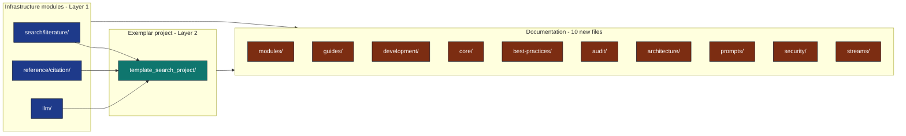

# Stream 019 — Literature Search & Synthesis

## Stream summary

Adds two new infrastructure subpackages and one exemplar project that,
together, take a research topic from "free-text query" to "publication-ready
references and an LLM-synthesised reading report" with no manual steps.

* `infrastructure/search/literature/` — multi-source paper search
  (arXiv, Crossref, local corpus, Paperclip), JSON cache, fulltext
  enrichment.
* `infrastructure/reference/citation/` — BibTeX read/write/convert
  byte-compatible with the Pandoc-consumed
  `projects/template_code_project/manuscript/references.bib`.
* [`projects_archive/template_search_project/`](../../projects_archive/template_search_project/) — fully wired exemplar (copy locally under `projects/` to run; not git-tracked).

## Stream Map

## Goals

1. **Reproducible discovery** — a topic string + `config.yaml` always
   produce the same `references.bib` and reading list.
2. **Failure-isolated aggregation** — one offline backend never breaks
   the workflow; partial coverage is reported, not raised.
3. **Agent-friendly normalisation** — every backend produces the same
   `Paper` record, so prompts, exporters, and visualisations are
   backend-agnostic.
4. **Auditability** — every fetched abstract / PDF lands in a
   deterministic on-disk cache with a stable id.

## Non-goals

* Not a full-text search of millions of papers — `LocalBackend` targets
  curated reading lists.
* Not a CSL-JSON exporter — the format target is BibTeX matching the
  exemplar `references.bib`.
* Not a remote-LLM wrapper — synthesis uses the existing local Ollama
  bridge in `infrastructure/llm/`.

## Design Principles

* **One canonical record (`Paper`).** Every backend, every cache, every
  CLI emits the same shape. Easy to extend; impossible to fork.
* **Errors are values.** `SearchResult.errors`, `FetchResult.status`.
  Callers decide what's fatal.
* **No hidden network.** Every constructor accepts `base_url=` and
  `http_client=` so tests never reach the public internet.
* **Deterministic caches.** Hashes derive from canonical query identity,
  not from `repr()` or pickled bytes.
* **No mocks.** `pytest-httpserver` for HTTP, real temp files for I/O,
  real subprocess for CLIs.

## Components

| Layer | Module | Lines | Tests |
|---|---|---|---|
| Search | `infrastructure/search/literature/` | ~1100 | 71 + 15 (fulltext) |
| Reference | `infrastructure/reference/citation/` | ~700 | 105 + 11 (cli-direct) |
| Project | [`projects_archive/template_search_project/`](../../projects_archive/template_search_project/) | ~600 | included in suite when checked out locally |

## Roadmap (post-merge)

1. **Crossref TDM** — full-text fetch for non-arXiv DOIs that expose a
   licensable TDM endpoint.
2. **CSL-JSON exporter** — alongside the BibTeX writer, for downstream
   tools (Zotero, Pandoc CSL).
3. **bioRxiv / medRxiv backends** — straightforward to add; the MCP
   server [`claude.ai_bioRxiv`](https://docs.biorxiv.org/) provides a
   useful schema reference.
4. **Vector recall on `LocalBackend`** — optional; adds an embedding
   index when a corpus exceeds ~1000 papers.

## Risks / Mitigations

| Risk | Mitigation |
|---|---|
| External API drift | Real-payload tests in `test_backends_http.py`; updated when responses change. |
| Crossref rate limit hit in CI | `SearchCache` + committed cache files for replayable runs. |
| LLM output divergence | `OllamaClientConfig(seed=42, temperature=0.0)` documented in prompts/. |
| Paperclip dependency | Off by default; entirely opt-in via `PAPERCLIP_API_KEY`. |
| `pypdf` optional | Documented in `[rendering]` group; graceful degradation message when missing. |

## See Also

* [`docs/architecture/discovery-export-synthesis.md`](../architecture/discovery-export-synthesis.md)
* [`docs/audit/archived/literature-modules-audit-2026-05-01.md`](../audit/archived/literature-modules-audit-2026-05-01.md) (archived 2026-05 — point-in-time snapshot; use `scripts/lint_docs.py` for current state)
* [`docs/best-practices/literature-search-best-practices.md`](../best-practices/literature-search-best-practices.md)
