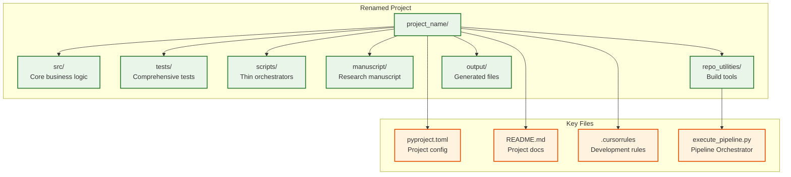
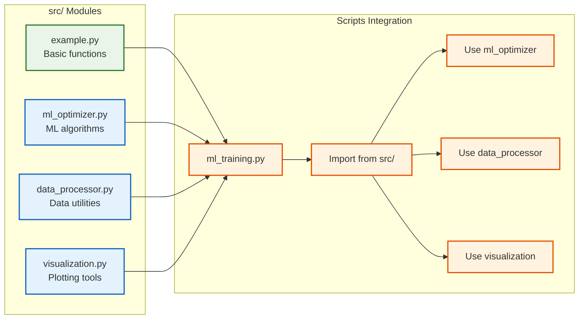

# 📋 Project Renaming Examples

> **Step-by-step guide** for transforming the template into specific research projects

**Quick Reference:** [Examples Showcase](../usage/EXAMPLES_SHOWCASE.md) | [Architecture](../core/ARCHITECTURE.md) | [How To Use](../core/HOW_TO_USE.md)

This file shows examples of how to customize the template into specific research projects using configuration files and environment variables. For related information, see **[`EXAMPLES_SHOWCASE.md`](../usage/EXAMPLES_SHOWCASE.md)**, **[`CONFIGURATION.md`](../operational/CONFIGURATION.md)**, **[`README.md`](README.md)**, and **[`../core/ARCHITECTURE.md`](../core/ARCHITECTURE.md)**.

## Example 1: Machine Learning Research Project

**Configuration in `project/manuscript/config.yaml` (or environment variables):**
```bash
# Project Identity
PROJECT_NAME="deep-learning-optimization"
PROJECT_CALLSIGN="DLO"
PROJECT_DESCRIPTION="Advanced optimization algorithms for deep neural networks using novel gradient-free methods"

# Author Information
AUTHOR_NAME="Dr. Alex Chen"
AUTHOR_ORCID="0000-0001-2345-6789"
AUTHOR_EMAIL="alex.chen@research.edu"
DOI="10.5281/zenodo.98765432"

# Technical Details
PYTHON_VERSION=">=3.10"
LICENSE="MIT"
```

**What gets updated:**
- `pyproject.toml`: name becomes "deep-learning-optimization"
- `README.md`: Title becomes "Deep Learning Optimization"
- All markdown files: Generic references become project-specific
- Pipeline scripts: Default author becomes "Dr. Alex Chen" (via config.yaml or environment variables)

## Example 2: Data Science Package

**Configuration in `project/manuscript/config.yaml` (or environment variables):**
```bash
# Project Identity
PROJECT_NAME="pandas-extension-toolkit"
PROJECT_CALLSIGN="PET"
PROJECT_DESCRIPTION="A comprehensive toolkit of pandas extensions for advanced data manipulation and analysis"

# Author Information
AUTHOR_NAME="Sarah Johnson"
AUTHOR_ORCID="0000-0002-3456-7890"
AUTHOR_EMAIL="sarah.johnson@datascience.com"
DOI=""  # Not published yet

# Technical Details
PYTHON_VERSION=">=3.8"
LICENSE="Apache-2.0"
```

## Example 3: Academic Paper

**Configuration in `project/manuscript/config.yaml` (or environment variables):**
```bash
# Project Identity
PROJECT_NAME="quantum-computing-survey"
PROJECT_CALLSIGN="QCS"
PROJECT_DESCRIPTION="A comprehensive survey of quantum computing algorithms and their applications in optimization"

# Author Information
AUTHOR_NAME="Prof. Michael Rodriguez"
AUTHOR_ORCID="0000-0003-4567-8901"
AUTHOR_EMAIL="m.rodriguez@university.edu"
DOI="10.1000/182.2024.001"

# Technical Details
PYTHON_VERSION=">=3.9"
LICENSE="CC-BY-4.0"
```

## Project Structure After Renaming

After running `rename_project.sh`, your project will have this structure:



## Usage Workflow

### 1. Edit Configuration
Edit `project/manuscript/config.yaml` or set environment variables:

```bash
# Project Identity
PROJECT_NAME="your-project-name"
PROJECT_CALLSIGN="YPN"
PROJECT_DESCRIPTION="Your project description here"

# Author Information
AUTHOR_NAME="Your Name"
AUTHOR_ORCID="0000-0000-0000-0000"
AUTHOR_EMAIL="your.email@example.com"
DOI="10.5281/zenodo.12345678"

# Technical Details
PYTHON_VERSION=">=3.9"
LICENSE="MIT"
```

### 2. Configure Your Project

**Option A: Use config.yaml (Recommended)**
```bash
# Copy the example config
cp project/manuscript/config.yaml.example project/manuscript/config.yaml

# Edit with your information
vim project/manuscript/config.yaml
```

**Option B: Use Environment Variables**
```bash
export AUTHOR_NAME="Your Name"
export AUTHOR_ORCID="0000-0000-0000-0000"
export AUTHOR_EMAIL="your.email@example.com"
export PROJECT_TITLE="Your Project Title"
export DOI="10.5281/zenodo.12345678"  # Optional
```

### 3. Test the Build Process
Validate that everything works:
```bash
# Pipeline automatically handles cleanup
python3 scripts/execute_pipeline.py --core-only
```

### 5. Customize Further
Edit additional files as needed:
- `.project_config` - Project metadata
- `.env.template` - Environment variables
- Manuscript files in `manuscript/`

## Generated Files

After configuring your project, you'll have:

### Configuration Files
- **`.project_config`** - Project configuration (sourceable in scripts)
- **`.env.template`** - Environment variable template
- **Updated `pyproject.toml`** - Project name and metadata
- **Updated `README.md`** - Project-specific documentation

### Updated Documentation
- **All markdown files** - Generic references become project-specific
- **`.cursorrules`** - Development guidelines updated
- **Pipeline configuration** - Author information updated (config.yaml or environment variables)

## Project Customization Examples

### Adding Project-Specific Source Code



### Example: Adding ML Optimization Module

1. **Create `src/ml_optimizer.py`:**
```python
"""Machine learning optimization algorithms."""

def gradient_descent(loss_fn, initial_params, learning_rate=0.01, max_iter=1000):
    """Gradient descent optimization."""
    # Implementation here
    pass

def adam_optimizer(loss_fn, initial_params, learning_rate=0.001):
    """Adam optimizer implementation."""
    # Implementation here
    pass
```

2. **Create `tests/test_ml_optimizer.py`:**
```python
"""Tests for ML optimizer module."""

def test_gradient_descent():
    # Test implementation
    pass

def test_adam_optimizer():
    # Test implementation
    pass
```

3. **Create `scripts/ml_training.py`:**
```python
#!/usr/bin/env python3
"""ML training script using src/ methods."""

from ml_optimizer import gradient_descent, adam_optimizer
from data_processor import load_data, preprocess_data

def main():
    # Use src/ methods for computation
    data = load_data("dataset.csv")
    processed_data = preprocess_data(data)
    
    # Train using src/ optimization methods
    params = gradient_descent(loss_fn, initial_params)
    
    # Generate and save results
    # ... visualization code ...
```

## Tips for Successful Renaming

### Project Naming
- Use kebab-case for `PROJECT_NAME` (good for URLs and package names)
- Keep `PROJECT_DESCRIPTION` concise but descriptive
- Choose a meaningful `PROJECT_CALLSIGN` (2-3 characters)

### Author Information
- Set `DOI=""` if the project isn't published yet
- Use your actual ORCID if you have one
- Choose appropriate license for your use case

### Technical Details
- Match `PYTHON_VERSION` to your development environment
- Consider license implications for your use case
- The script is idempotent - you can run it multiple times safely

## Validation Checklist

After renaming, ensure:

- [ ] All tests pass with required coverage
- [ ] Scripts can import from src/ modules
- [ ] Markdown validation passes
- [ ] PDF generation works
- [ ] Project metadata is correct
- [ ] License information is appropriate

## Troubleshooting

### Common Issues

1. **Permission denied**: Make script executable with `chmod +x repo_utilities/rename_project.sh`
2. **Script not found**: Ensure you're in the project root directory
3. **Build failures**: Check that all dependencies are installed
4. **Markdown errors**: Validate markdown files after renaming

### Getting Help

- Check the `repo_utilities/README.md` for detailed documentation
- Review the test output for specific error messages
- Ensure all required dependencies are installed
- Verify the thin orchestrator pattern is maintained

## Summary

The `rename_project.sh` script transforms the generic template into a project-specific structure while maintaining:

- **Thin orchestrator pattern** - Scripts use src/ methods
- **Comprehensive test coverage** - All functionality validated
- **Automated build pipeline** - Complete PDF generation
- **Generic utilities** - Reusable across projects
- **Clear architecture** - Separation of concerns

This enables rapid project setup while maintaining the high-quality standards established by the template.

For more examples and showcase projects, see **[`EXAMPLES_SHOWCASE.md`](../usage/EXAMPLES_SHOWCASE.md)**.
