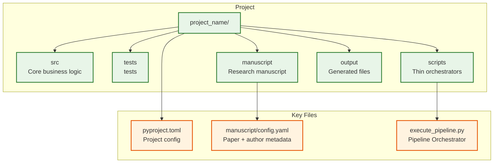
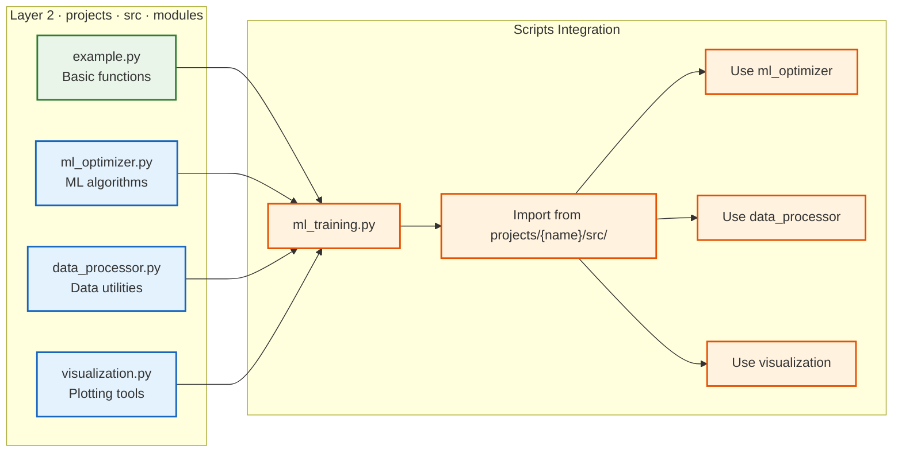

# 📋 Project Configuration Examples

> **Step-by-step guide** for configuring the template into specific research projects

**Quick Reference:** [Examples Showcase](../usage/examples-showcase.md) | [Architecture](../core/architecture.md) | [How To Use](../core/how-to-use.md)

This file shows examples of how to customize the template into specific research projects using each project's `manuscript/config.yaml` plus a small set of supported environment overrides. For related information, see **[`examples-showcase.md`](../usage/examples-showcase.md)**, **[`configuration.md`](../operational/config/configuration.md)**, **[`README.md`](README.md)**, and **[`../core/architecture.md`](../core/architecture.md)**.

## How Configuration Works

Project identity and metadata live in `projects/{name}/manuscript/config.yaml`.
There is **no automated renaming script** and **no `.project_config` / `.env.template`
generation** — you edit `config.yaml` directly (copy from `config.yaml.example`) and,
optionally, override a few fields at runtime via environment variables.

The config loader (`infrastructure/core/config/loader.py`) reads `config.yaml` and
exports exactly these values, which may also be supplied via environment variables:

- `PROJECT_TITLE`
- `AUTHOR_NAME`
- `AUTHOR_ORCID`
- `AUTHOR_EMAIL`
- `AUTHOR_DETAILS`
- `DOI`

Environment variables that are already set take precedence over `config.yaml`.
Other identifiers (project directory name, package name in `pyproject.toml`) are
set by how you create the project directory and edit `pyproject.toml` — not by any
env var named `PROJECT_NAME`, `PROJECT_CALLSIGN`, or `PROJECT_DESCRIPTION`.

## Example 1: Machine Learning Research Project

**`projects/{name}/manuscript/config.yaml`:**

```yaml
paper:
  title: "Deep Learning Optimization"
  version: "1.0"

authors:
  - name: "Dr. Alex Chen"
    orcid: "0000-0001-2345-6789"
    email: "alex.chen@research.edu"
    affiliation: "Research University"
    corresponding: true

publication:
  doi: "10.5281/zenodo.98765432"

keywords:
  - "deep learning"
  - "optimization"
```

## Example 2: Data Science Package

**`projects/{name}/manuscript/config.yaml`:**

```yaml
paper:
  title: "Pandas Extension Toolkit"
  version: "0.1"

authors:
  - name: "Sarah Johnson"
    orcid: "0000-0002-3456-7890"
    email: "sarah.johnson@datascience.com"
    affiliation: "Data Science Lab"
    corresponding: true

# DOI omitted — not published yet

keywords:
  - "pandas"
  - "data manipulation"
```

## Example 3: Academic Paper

**`projects/{name}/manuscript/config.yaml`:**

```yaml
paper:
  title: "Quantum Computing Survey"
  version: "1.0"

authors:
  - name: "Prof. Michael Rodriguez"
    orcid: "0000-0003-4567-8901"
    email: "m.rodriguez@university.edu"
    affiliation: "University"
    corresponding: true

publication:
  doi: "10.1000/182.2024.001"

keywords:
  - "quantum computing"
  - "algorithms"
```

## Project Structure

A configured project has this structure:



## Usage Workflow

### 1. Create the config

**Option A: Edit `config.yaml` (recommended)**

```bash
# Copy the example config
cp projects/{name}/manuscript/config.yaml.example projects/{name}/manuscript/config.yaml

# Edit with your information
vim projects/{name}/manuscript/config.yaml
```

**Option B: Override fields via environment variables**

```bash
export PROJECT_TITLE="Your Project Title"
export AUTHOR_NAME="Your Name"
export AUTHOR_ORCID="0000-0000-0000-0000"
export AUTHOR_EMAIL="your.email@example.com"
export DOI="10.5281/zenodo.12345678"  # Optional
```

### 2. Test the Build Process

```bash
# Pipeline automatically handles cleanup
uv run python scripts/runner/execute_pipeline.py --project {name} --core-only
```

### 3. Customize Further

Edit additional files as needed:

- `pyproject.toml` — package name and dependencies
- Manuscript files in `manuscript/`

## Project Customization Examples

### Adding Project-Specific Source Code



### Example: Adding ML Optimization Module

1. **Create `projects/templates/template_code_project/src/ml_optimizer.py`:**

```python
"""Machine learning optimization algorithms."""

def gradient_descent(loss_fn, initial_params, learning_rate=0.01, max_iter=1000):
    """Gradient descent optimization."""
    # Implementation here
    pass

def adam_optimizer(loss_fn, initial_params, learning_rate=0.001):
    """Adam optimizer implementation."""
    # Implementation here
    pass
```

1. **Create `projects/templates/template_code_project/tests/test_ml_optimizer.py`:**

```python
"""Tests for ML optimizer module."""

def test_gradient_descent():
    # Test implementation
    pass

def test_adam_optimizer():
    # Test implementation
    pass
```

1. **Create `projects/templates/template_code_project/scripts/ml_training.py`:**

```python
#!/usr/bin/env python3
"""ML training script using src/ methods."""

from ml_optimizer import gradient_descent, adam_optimizer
from data_processor import load_data, preprocess_data

def main():
    # Use projects/{name}/src/ methods for computation
    data = load_data("dataset.csv")
    processed_data = preprocess_data(data)

    # Train using projects/{name}/src/ optimization methods
    params = gradient_descent(loss_fn, initial_params)

    # Generate and save results
    # ... visualization code ...
```

## Tips for Successful Configuration

### Project Naming

- Use kebab-case for the package name in `pyproject.toml` (good for URLs and package names)
- Keep the manuscript `keywords` concise but descriptive
- Pick a clear, descriptive `paper.title`

### Author Information

- Omit `publication.doi` (or set `DOI=""`) if the project isn't published yet
- Use your actual ORCID if you have one
- Choose an appropriate license for your use case

## Validation Checklist

After configuring, ensure:

- [ ] All tests pass with required coverage
- [ ] Scripts can import from src/ modules
- [ ] Markdown validation passes
- [ ] PDF generation works
- [ ] Project metadata is correct
- [ ] License information is appropriate

## Troubleshooting

### Common Issues

1. **Permission denied**: Make script executable with `chmod +x scripts/runner/execute_pipeline.py`
2. **Script not found**: Ensure you're in the project root directory
3. **Build failures**: Check that all dependencies are installed
4. **Markdown errors**: Validate markdown files after editing

### Getting Help

- Review the test output for specific error messages
- Ensure all required dependencies are installed
- Verify the thin orchestrator pattern is maintained

## Summary

Per-project `manuscript/config.yaml` (plus the supported env overrides) configures the
generic template into a project-specific deliverable while maintaining:

- **Thin orchestrator pattern** - Scripts use projects/{name}/src/ methods
- **test coverage** - All functionality validated
- **Automated build pipeline** - PDF generation
- **Generic utilities** - Reusable across projects
- **Clear architecture** - Separation of concerns

For more examples and showcase projects, see **[`examples-showcase.md`](../usage/examples-showcase.md)**.
