# Infrastructure Layer - Modular Architecture

## Overview

The Infrastructure layer provides reusable, modular tools for building, validating, and managing research projects. Organized by functionality into submodules, each with clear responsibilities and testing.

## Modular Architecture (v2.1)

The infrastructure has been reorganized into focused modules grouping related functionalities.
Each subpackage has a `SKILL.md` file (YAML frontmatter) for agent skill discovery in Cursor, Claude Code, and similar tools—see also the canonical list in `infrastructure/SKILL.md` and the machine-readable manifest `.cursor/skill_manifest.json` (maintained by `infrastructure/skills/`).

```mermaid
flowchart TB
    INFRA[/infrastructure<br/>SKILL.md · top-level infrastructure skill/]

    INFRA --> AUTO[/autoresearch<br/>Deterministic readiness plans<br/>stage gates · artifacts · evidence/]
    INFRA --> BENCH[/benchmark<br/>Deterministic exemplar scoring/]
    INFRA --> CORE[/core<br/>Foundation utilities/]
    INFRA --> CFG[/config<br/>Repository configuration templates/]
    INFRA --> DOCK[/docker<br/>Containerization/]
    INFRA --> SK[/skills<br/>SKILL.md discovery · skill_manifest.json/]
    INFRA --> VAL[/validation<br/>Quality &amp; validation tools/]
    INFRA --> DOC[/documentation<br/>Figure &amp; markdown management/]
    INFRA --> PROJ[/project<br/>Multi-project management/]
    INFRA --> SCI[/scientific<br/>Scientific development/]
    INFRA --> LLM[/llm<br/>LLM integration/]
    INFRA --> METH[/methods<br/>Methods orchestration<br/>DAG · prose · artifacts · evidence/]
    INFRA --> REND[/rendering<br/>Multi-format rendering/]
    INFRA --> PUB[/publishing<br/>Academic publishing/]
    INFRA --> REP[/reporting<br/>Pipeline reports · error aggregation/]
    INFRA --> STEG[/steganography<br/>Secure PDF post-processing/]
    INFRA --> SEARCH[/search<br/>Multi-source literature search/]
    INFRA --> SIA[/sia<br/>Self-improvement harness<br/>fixture replay · evaluation/]
    INFRA --> REF[/reference<br/>BibTeX read · write · convert/]
    INFRA --> ORCH[/orchestration<br/>run.sh-equivalent CLI · menu · PipelineRunner<br/>stage logs · secure_run wrapper/]
    INFRA --> PRS[/prose<br/>Readability metrics · outline · editorial flags · CLI/]

    AUTO --> AUTO_F[config · models · planner · validation · reports · cli]
    CORE --> CORE_F[exceptions · logging · config/loader ·<br/>pipeline · stage_registry · post_run_reporting · hitl_cli · single_stage ·<br/>runtime/checkpoint · setup_checks · source_improve · cache_gate ·<br/>runtime/retry · runtime/function_profiler · security ·<br/>runtime/environment · files/operations · telemetry/]
    VAL --> VAL_F[content/pdf_validator · content/markdown_validator · content/discovery ·<br/>line_count · security_gate · plugin_export · docs/lint_runner ·<br/>integrity/checks · repo/audit_orchestrator · repo/scanner · cli/main]
    DOC --> DOC_F[figure_manager · image_manager ·<br/>markdown_integration · glossary_gen]
    SCI --> SCI_F[benchmarking · stability · validation · templates]
    LLM --> LLM_F[core · templates · validation · review · prompts]
    METH --> METH_F[models · orchestration · cli]
    REND --> REND_F[core · pdf_renderer · slides_renderer ·<br/>web_renderer · preflight · latex_utils · cli]
    PUB --> PUB_F[zenodo · github · arxiv · citations · metadata ·<br/>archival · executable_bundle · cli]
    REP --> REP_F[report_generator · error_aggregator · executive_reporter ·<br/>_dashboard_matplotlib · _dashboard_charts ·<br/>_dashboard_health · _dashboard_pipeline ·<br/>_dashboard_outputs · _dashboard_codebase · _dashboard_csv]
    STEG --> STEG_F[core · config · overlays · barcodes ·<br/>metadata · hashing · encryption]
    SEARCH --> SEARCH_F[literature/ · models · backends ·<br/>client · cache · fulltext · cli]
    SIA --> SIA_F[task_layout · loop_runner · evaluation_runner ·<br/>context_ledger · execution_logs · live_llm · cli]
    REF --> REF_F[citation/ · models · escape ·<br/>bibtex_writer · bibtex_parser · converter · cli]
    ORCH --> ORCH_F[cli · discovery · menu · pipeline_runner<br/>stage_logger · secure_run]
    PRS --> PRS_F[analysis/metrics · structure · quality<br/>markdown · report · cli]
    BENCH --> BENCH_F[template_harness · rubrics · template_smoke_manifest.json]

    classDef hub fill:#0f172a,stroke:#0f172a,color:#fff
    classDef pkg fill:#1e3a8a,stroke:#0f172a,color:#fff
    classDef files fill:#0f766e,stroke:#0f172a,color:#fff
    class INFRA hub
    class AUTO,BENCH,CORE,CFG,DOCK,SK,VAL,DOC,PROJ,SCI,LLM,METH,REND,PUB,REP,STEG,SEARCH,SIA,REF,ORCH,PRS pkg
    class AUTO_F,BENCH_F,CORE_F,VAL_F,DOC_F,SCI_F,LLM_F,METH_F,REND_F,PUB_F,REP_F,STEG_F,SEARCH_F,SIA_F,REF_F,ORCH_F,PRS_F files
```



> Each Layer-1 Python package ships `AGENTS.md`, `README.md`, and `SKILL.md` (YAML frontmatter for editors). Non-package configuration folders such as `logrotate.d/` carry local docs but are not skill-discovered. The manifest aggregator lives in [`infrastructure/skills/`](skills/).

## Thin-orchestrator modules (refactor inventory)

Measured coverage and gate thresholds → [`docs/_generated/canonical_facts.md`](../docs/_generated/canonical_facts.md) and [`docs/development/coverage-gaps.md`](../docs/development/coverage-gaps.md).

| Module | Role |
| --- | --- |
| `autoresearch/` | Opt-in deterministic readiness plans and reports over domain profiles, experiment plans, pipeline contracts, evidence, artifacts, and thin-orchestrator drift |
| `sia/` | Self-Improvement Agent harness: task layout validation, fixture replay loop, evaluation runner, context ledger, CLI |
| `benchmark/` | Deterministic benchmark manifests and scoring for public template exemplar outputs |
| `methods/` | Read-only methods orchestration plans over pipeline contracts, manuscript methods prose, artifact manifests, evidence registries, and validation commands |
| `core/pipeline/post_run_reporting.py` | Post-run summary + JSON report after pipeline stages |
| `core/pipeline/hitl_cli.py` | Human-in-the-loop CLI for `execute_pipeline.py` |
| `core/pipeline/stage_registry.py` | Canonical stage-key → script map (`STAGE_DISPATCH`, `MENU_KEY_TO_STAGE`) |
| `core/pipeline/single_stage.py` | Subprocess single-stage runner for `execute_pipeline.py --stage` and menu keys |
| `core/pipeline/multi_project_cli.py` | Multi-project serial/parallel CLI (`scripts/execute_multi_project.py`) |
| `core/runtime/setup_checks.py` | Stage 0: `sync_workspace_dependencies`, `validate_project_discovery`, `run_optional_setup_hook` |
| `core/source_improve.py` | Mechanical Python hygiene (`scripts/batch_cogsec_improve.py`) |
| `core/cache_gate.py` | Hermes/cache opt-in gate (`scripts/gates/gate_cache.py`) |
| `validation/line_count.py` | Module line-count scanner (Layer 1 + all `projects/*/scripts/`) |
| `validation/security_gate.py` | Bandit-backed security report writer |
| `validation/plugin_export.py` | Plugin export directory diff |
| `validation/docs/lint_runner.py` | Markdown lint orchestration |
| `project/workspace.py` | Workspace sync/status (`scripts/manage_workspace.py`) |
| `project/info.py` | Project introspection (`scripts/show_project_info.py`) |
| `project/git_guards.py` | Tracked-project and generated-artifact guards |
| `publishing/executable_bundle.py` | Stage 10 bundle (`scripts/08_executable_bundle.py`) |
| `rendering/preflight.py` | Manuscript preflight (exemplar `00_preflight.py` scripts) |

## P1 quality backlog (deferred splits)

Tracked after the P0 composability pass (stage registry, unified markdown discovery, output-pipeline rename). CI line-count gate: warn ≥800 / fail ≥950 for `infrastructure/` + `scripts/`.

| Module | Lines (approx.) | Planned split / move |
| --- | ---: | --- |
| `search/literature/backends.py` | 748 | One module per backend (`arxiv_backend.py`, `crossref_backend.py`, …) |
| `doctor/detectors.py` | 739 | Package `doctor/detectors/` with one file per detector + registry |
| `reporting/_dashboard_charts.py` | 735 | Split by chart family (health / pipeline / outputs) |
| `rendering/_pdf_latex_helpers.py` | 729 | Split preamble vs title-page vs log parsing (see thermo-nuclear audit 2026-05-29) |
| `validation/content/markdown_validator.py` | 713 | Extract image/ref/math validators + `markdown_strip.py` + pitfalls/citations leaves (discovery in `content/discovery.py`) |
| `core/pipeline/multi_project.py` | — | Move `format_multi_project_detailed_report()` to `reporting/` |
| `validation` ↔ `rendering` | — | Shared pre-render leaf (`validation/content/prerender.py`) so rendering does not import the full markdown validator |
| `validation/integrity/link_extract.py` | 655 | P2: move skip/policy frozensets into `link_policies.py` or data file |
| `validation/integrity/checks.py` | 651 | P2: split manifest (`integrity/manifest.py`) vs completeness (`integrity/completeness.py`) |
| `rendering/_pdf_latex_helpers.py` (refined) | 765 | Split **title-page/front-matter** → `_pdf_title_page.py`, **log parse** → `_latex_log_parse.py` (bibliography lives elsewhere) |
| `rendering/pipeline.py` | 610 | P2: `rendering/_manuscript_source.py` + `rendering/_combined_exports.py` |
| `rendering/render_all_cli.py` | — | Remove `sys.path.insert`; use `--project` / discovery like other CLIs |
| Package barrels | — | Lazy `__getattr__` on wide `__init__.py` hubs (`validation`, `reporting`, `publishing`, `doctor`) |

## Function Signatures

### Core Module

#### exceptions.py

- `class TemplateError(Exception):`
- `class ConfigurationError(TemplateError):`
- `class ValidationError(TemplateError):`
- `class BuildError(TemplateError):`
- `class FileOperationError(TemplateError):`
- `class DependencyError(TemplateError):`
- `class TestError(TemplateError):`
- `class IntegrationError(TemplateError):`
- `class LiteratureSearchError(TemplateError):`
- `class APIRateLimitError(LiteratureSearchError):`
- `class LLMError(TemplateError):`
- `class LLMConnectionError(LLMError):`
- `class LLMTemplateError(LLMError):`
- `class RenderingError(TemplateError):`
- `class FormatError(RenderingError):`
- `class PublishingError(TemplateError):`
- `class UploadError(PublishingError):`
- `def raise_with_context(exception_class, message, **context) -> None:`
- `def format_file_context(file_path, line=None) -> dict:`
- `def chain_exceptions(new_exception, original) -> TemplateError:`

#### logging/utils.py

- `class ProjectLogger:`
- `def get_project_logger(name: str, level: Optional[int] = None) -> ProjectLogger:`
- `def setup_project_logging(name: str, level: Optional[int] = None, ...):`
- `def get_log_level_from_env() -> int:`
- `def setup_logger(name: str, level: Optional[int] = None, ...) -> logging.Logger:`
- `def get_logger(name: str) -> logging.Logger:`
- `def log_operation(func: Callable, logger: Optional[logging.Logger] = None) -> Callable:`
- `def log_operation_silent(func: Callable, logger: Optional[logging.Logger] = None) -> Callable:`
- `def log_timing(func: Callable, logger: Optional[logging.Logger] = None) -> Callable:`
- `def log_function_call(logger: Optional[logging.Logger] = None) -> Callable:`
- `def log_success(message: str, logger: Optional[logging.Logger] = None) -> None:`
- `def log_header(message: str, logger: Optional[logging.Logger] = None) -> None:`
- `def log_progress(current: int, total: int, message: str = "", ...) -> None:`
- `def log_stage(stage_name: str, stage_num: Optional[int] = None, ...) -> None:`
- `def log_substep(message: str, logger: Optional[logging.Logger] = None) -> None:`
- `def set_global_log_level(level: int) -> None:`
- `def log_stage_with_eta(stage_name: str, current: int, total: int, ...) -> None:`
- `def log_resource_usage(logger: Optional[logging.Logger] = None) -> None:`

#### config/loader.py

- `def load_config(config_path: Path | str) -> Optional[Dict[str, Any]]:`
- `def find_config_file(repo_root: Path | str) -> Optional[Path]:`
- `def get_config_as_dict(repo_root: Path | str) -> Dict[str, str]:`
- `def get_config_as_env_vars(repo_root: Path | str, respect_existing: bool = True) -> Dict[str, str]:`
- `def get_translation_languages(repo_root: Path | str, project_name: str = "project") -> List[str]:`
- `def format_author_name(authors: List[AuthorConfig]) -> str:`
- `def format_author_details(authors: List[AuthorConfig], doi: str = "") -> str:`

#### runtime/checkpoint.py

- `class PipelineCheckpoint:`
- `class CheckpointManager:`
- `def create_checkpoint_dir(base_dir: Path) -> Path:`
- `def save_checkpoint(checkpoint: PipelineCheckpoint, checkpoint_dir: Path) -> None:`
- `def load_checkpoint(checkpoint_dir: Path) -> Optional[PipelineCheckpoint]:`
- `def validate_checkpoint(checkpoint: PipelineCheckpoint) -> bool:`

#### files/operations.py

- `def clean_output_directory(output_dir: Path, project_name: str) -> None:`
- `def copy_final_deliverables(output_dir: Path, final_dir: Path, project_name: str) -> None:`
- `def ensure_directory_exists(directory: Path) -> None:`
- `def get_file_size_mb(file_path: Path) -> float:`
- `def calculate_directory_size(directory: Path) -> int:`

#### runtime/function_profiler.py

- `class ProfilingMetrics:`
- `class CodeProfiler:`
- `def get_performance_monitor() -> CodeProfiler:`
- `def monitor_performance(operation_name: str, track_memory: bool = True) -> Callable:`
- `def profile_memory_usage(func: Callable, *args, **kwargs) -> dict[str, Any]:`

### Validation Module

#### content/pdf_validator.py

- `def validate_pdf_rendering(pdf_path: Path) -> dict:`
- `def extract_text_from_pdf(pdf_path: Path) -> str:`
- `def scan_for_issues(text: str) -> dict[str, int]:`

#### content/discovery.py

- `def discover_markdown_files(root: Path, *, scope: Literal["tree", "repo", "link_audit"] = "tree", repo_root: Path | None = None) -> list[Path]:`

#### content/markdown_validator.py

- `def validate_markdown(markdown_dir: str | Path, repo_root: str | Path, strict: bool = False) -> tuple[list[DiagnosticEvent], int]:`
- `def find_manuscript_directory(repo_root: str | Path, project_name: str = "project") -> Path:`
- `def collect_symbols(md_paths: list[str]) -> tuple[set[str], set[str]]:`
- `def validate_images(md_paths: list[str], repo_root: str | Path) -> list[DiagnosticEvent]:`
- `def validate_refs(md_paths: list[str], repo_root: str | Path, labels: set[str], anchors: set[str]) -> list[DiagnosticEvent]:`
- `def validate_math(md_paths: list[str], repo_root: str | Path) -> list[DiagnosticEvent]:`

#### integrity/checks.py

- `def verify_output_integrity(output_dir: Path) -> dict:`
- `def verify_file_integrity(file_path: Path) -> bool:`
- `def verify_cross_references(manuscript_dir: Path) -> dict:`
- `def verify_data_consistency(data_dir: Path) -> dict:`
- `def verify_academic_standards(manuscript_dir: Path) -> dict:`
- `def generate_integrity_report(report: dict) -> str:`

#### repo/audit_orchestrator.py

- `def run_comprehensive_audit(project_path: Path) -> dict:`
- `def generate_audit_report(audit_results: dict) -> str:`

#### content/issue_categorizer.py

- `def categorize_by_type(issues: List) -> dict:`
- `def assign_severity(issues: List) -> List:`
- `def filter_false_positives(issues: List) -> List:`
- `def prioritize_issues(issues: List) -> List:`

### Rendering Module

#### pdf_renderer.py

- `def render_pdf_manuscript(manuscript_dir: Path, output_dir: Path, ...) -> Path:`
- `def render_individual_sections(manuscript_dir: Path, output_dir: Path) -> List[Path]:`
- `def combine_sections_to_pdf(section_files: List[Path], output_file: Path) -> None:`
- `def render_ide_friendly_pdf(source_file: Path, output_file: Path) -> None:`

#### latex_utils.py

- `def compile_latex_to_pdf(tex_file: Path, output_dir: Path, ...) -> Path:`
- `def extract_latex_errors(log_content: str) -> List[str]:`
- `def clean_latex_auxiliary_files(output_dir: Path) -> None:`

#### core.py

- `class RenderManager:`
- `def render_pdf(self, manuscript_dir: Path, output_dir: Path, ...) -> Path:`
- `def render_html(self, manuscript_dir: Path, output_dir: Path) -> Path:`
- `def render_all(self, source_file: Path) -> list[Path]:`

### LLM Module

#### core.py

- `class OllamaClientConfig:`
- `class LLMClient:`
- `def query(self, prompt: str, options: Optional[GenerationOptions] = None) -> str:`
- `def apply_template(self, template_name: str, **kwargs) -> str:`

#### templates.py

- `def get_template(template_name: str) -> str:`
- `def list_available_templates() -> List[str]:`
- `def apply_template_with_context(template_name: str, context: Dict[str, Any]) -> str:`

### Publishing Module

#### metadata.py / `_metadata_extraction.py`

- `def extract_publication_metadata(markdown_files: list[Path]) -> PublicationMetadata:`
- `def validate_doi(doi: str) -> bool:`

#### zenodo/ (re-exported via `api.py`, `platforms.py`)

- `class ZenodoClient(config: ZenodoConfig)`
- `class ZenodoConfig(access_token: str, sandbox: bool = True, base_url: str | None = None)`
- `class DepositionResult(deposition_id: str, bucket_url: str)`
- `def publish_to_zenodo(metadata, file_paths, access_token, sandbox=True, *, base_url=None) -> PublishResult:`

#### github/release.py (re-exported via `platforms.py`)

- `def create_github_release(tag_name, release_name, description, assets, token, repo, *, base_url=...) -> str:`

#### arxiv/submission.py (re-exported via `platforms.py`)

- `def prepare_arxiv_submission(output_dir: Path, metadata: PublicationMetadata) -> Path:`

#### archival.py / executable_bundle.py

- `def archive_publication(bundle, *, providers, dry_run=True, ...) -> ArchivalRun:`
- `def bundle_project(project_root, output_dir, ...) -> Path:`

#### citations.py

- `def generate_citation_bibtex(metadata: PublicationMetadata) -> str:`
- `def generate_citation_apa(metadata: PublicationMetadata) -> str:`
- `def generate_citation_mla(metadata: PublicationMetadata) -> str:`

### SIA Module (`sia/`)

#### task_layout.py

- `def validate_task_dir(path: Path | str) -> TaskLayout:`

#### loop_runner.py

- `def run_sia_loop(config: RunConfig) -> list[GenerationArtifacts]:`

#### evaluation_runner.py

- `def run_evaluation(script: Path, *, gen_dir: Path, task_dir: Path, timeout_sec: int = 60) -> EvaluationResult:`
- `def read_results_json(path: Path) -> EvaluationResult:`
- `def write_results_json(path: Path, result: EvaluationResult) -> None:`

#### context_ledger.py

- `def init_context(path: Path, *, task_name: str) -> Path:`
- `def append_generation(path: Path, *, artifacts: GenerationArtifacts, improvement_excerpt: str = "") -> None:`

#### execution_logs.py

- `def load_agent_execution(path: Path) -> AgentExecutionLog:`

#### models.py

- `class RunConfig:` — `task_dir`, `output_dir`, `run_id`, `max_generations`, `live`, `fixtures_dir`, `target_timeout_sec`, `llm_model`
- `class TaskLayout:` — validated public/private/reference paths
- `class EvaluationResult:` — `metric_name`, `metric_value`, `n_samples`, `extra`

#### live_llm.py

- `def generate_improvement_markdown(*, generation: int, metric_name: str, metric_value: float, llm_model: str) -> str | None:`

### Scientific Module

#### benchmarking.py

- `def benchmark_function(func: Callable, test_inputs: List[Any], ...) -> BenchmarkReport:`
- `def compare_implementations(functions: Dict[str, Callable], ...) -> ComparisonReport:`

#### stability.py

- `def check_numerical_stability(func: Callable, test_inputs: List[Any], ...) -> StabilityReport:`
- `def assess_algorithm_stability(func: Callable, input_ranges: Dict[str, Tuple[float, float]]) -> Dict[str, Any]:`

#### validation.py

- `def validate_scientific_code(file_path: Path) -> ValidationReport:`
- `def check_best_practices(code_content: str) -> List[str]:`

### Reporting Module

#### pipeline_report_model.py

- `def generate_pipeline_report(stage_results: List[Dict[str, Any]], total_duration: float, repo_root: Path, ...) -> PipelineReport:`

#### error_aggregator.py

- `def aggregate_errors(log_files: List[Path]) -> ErrorSummary:`
- `def categorize_errors(error_messages: List[str]) -> Dict[str, List[str]]:`
- `def generate_error_report(errors: ErrorSummary, output_dir: Path) -> Path:`

#### executive_reporter.py

- `def generate_executive_report(project_dirs: List[Path], output_dir: Path) -> Path:`
- `def aggregate_project_metrics(project_dirs: List[Path]) -> Dict[str, Any]:`

### Documentation Module

#### figure_manager.py

- `class FigureManager:`
- `def register_figure(self, figure_path: Path, caption: str, label: str) -> str:`
- `def get_figure_reference(self, label: str) -> str:`
- `def validate_figure_references(self, content: str) -> List[str]:`

#### markdown_integration.py

- `def integrate_figures_into_markdown(content: str, figure_manager: FigureManager) -> str:`
- `def integrate_tables_into_markdown(content: str) -> str:`
- `def validate_markdown_integrity(content: str) -> List[str]:`

## Key Design Principles

### 1. Layered Architecture

- **Layer 1 (infrastructure/)**: Generic, reusable tools for any project
- All code is domain-independent
- 60%+ test coverage required (measured baseline → [`docs/development/coverage-gaps.md`](../docs/development/coverage-gaps.md))
- Can be copied to other projects

### 2. Thin Orchestrator Pattern

- **Business logic**: Implemented in module core (e.g., `core.py`)
- **Orchestration**: Delegated to CLI wrappers and entry points
- **Scripts**: Only coordinate, never duplicate logic
- **Reusability**: Each module stands alone or integrates with others

### 3. Module Standardization

- Each module has:
  - `__init__.py` - Public API exports
  - `core.py` - Core business logic (coverage per module → [`docs/development/coverage-gaps.md`](../docs/development/coverage-gaps.md))
  - `cli.py` - Command-line interface (optional)
  - `config.py` - Configuration management (optional)
  - `AGENTS.md` - Detailed documentation
  - `README.md` - Quick reference
- All public APIs have type hints and docstrings

### 4. Mandatory `__all__` for Re-Exporting Modules (MED5)

Every module that re-exports symbols at module top level **MUST** declare an explicit `__all__`. Concretely: any `.py` file with at least one top-level `from X import Y  # noqa: F401` statement (the canonical marker for an intentional backwards-compat re-export) is a re-exporter and must list its public surface.

**Why:**
- `mypy --strict` flags every downstream caller of an undeclared re-export with `[attr-defined]`. A single missing `__all__` cascades to dozens of false-positives.
- `from module import *` honours `__all__`; without it the public surface is implicit and easy to break.
- An explicit list documents intent and lets reviewers audit the public API at a glance.

**Audit:**

```bash
# Run locally
uv run python -m infrastructure.skills check-all-exports

# Via the unified skills CLI
uv run python -m infrastructure.skills check --all-exports
```

**Gates:**
- CI: the `Lint & Type Check` job in [`.github/workflows/ci.yml`](../.github/workflows/ci.yml) runs the audit after `mypy`.
- Pre-push: the `all-exports-check` hook in [`.pre-commit-config.yaml`](../.pre-commit-config.yaml).

**Conventions:**
- Group `__all__` entries by source submodule with `#` comment headers.
- Do **not** add `__all__` to leaf modules that don't re-export — bogus lists go stale, and the audit ignores them.
- Filenames starting with `_` are private and skipped by the audit; `__init__.py` is treated as public.

See [`docs/rules/api_design.md`](../docs/rules/api_design.md#mandatory-__all__-for-re-exporting-modules-med5) for the full convention and worked example.

## Module Organization

### Core Module (`core/`)

**Foundation utilities used by all other modules.**

- `exceptions.py` - Exception hierarchy with context preservation
  - `TemplateError` - Base exception
  - Module-specific exceptions (LLM, Rendering, Publishing)
  - Context utilities and exception chaining

- `logging/utils.py` - Unified Python logging system
  - Environment-based configuration (LOG_LEVEL 0-3)
  - Context managers for operation tracking
  - Decorators for function logging
  - TTY-aware color output

- `config/loader.py` - Configuration management
  - YAML configuration file loading
  - Environment variable integration
  - Author and metadata formatting

- `progress.py` - Progress tracking utilities
  - `ProgressBar` - Visual progress indicators
  - `SubStageProgress` - Nested progress tracking

- `runtime/checkpoint.py` - Pipeline checkpoint management
  - `CheckpointManager` - Save/restore pipeline state
  - `PipelineCheckpoint` - Checkpoint data structures

- `runtime/retry.py` - Retry logic with backoff
  - `retry_with_backoff` - Exponential backoff retries
  - `RetryableOperation` - Retryable operation wrapper

- `runtime/function_profiler.py` - Function-level performance profiling
  - `CodeProfiler` - cProfile/tracemalloc-based profiling
  - `monitor_performance` - Decorator for function monitoring

- `runtime/environment.py` - Environment setup and validation
  - Dependency checking and installation
  - Build tool verification
  - Directory structure setup

- `script_discovery.py` - Script discovery and execution
  - `discover_analysis_scripts` - Find project scripts
  - `discover_orchestrators` - Find orchestrator scripts

- `files/operations.py` - File management utilities
  - `clean_output_directory` - Cleanup operations
  - `copy_final_deliverables` - Output copying

**Usage:**

```python
from infrastructure.core import (
    get_logger, TemplateError,
    CheckpointManager, ProgressBar
)
from infrastructure.core.config.loader import load_config
from infrastructure.core.runtime.function_profiler import CodeProfiler
```

### Validation Module (`validation/`)

**Quality assurance and validation tools.**

- `content/pdf_validator.py` - PDF rendering validation
  - Text extraction and analysis
  - Issue detection (unresolved references, warnings)
  - Document structure verification

- `content/markdown_validator.py` - Markdown structure validation
  - Image reference validation
  - Cross-reference verification
  - Mathematical equation validation
  - Link integrity checking

- `integrity/checks.py` - File integrity & cross-reference validation
  - SHA-256 hash verification
  - Cross-reference validation
  - Data consistency checking
  - Academic standards compliance

**CLI:**

```bash
uv run python -m infrastructure.validation.cli.main pdf output/{project_name}/pdf/{project_name}_combined.pdf
uv run python -m infrastructure.validation.cli.main markdown projects/{project_name}/manuscript/
uv run python -m infrastructure.validation.cli.main integrity output/{project_name}/
```

### Documentation Module (`documentation/`)

**Figure management and documentation tools.**

- `figure_manager.py` - Automatic figure numbering
  - Registry management with JSON persistence
  - LaTeX figure block generation
  - Cross-reference generation

- `image_manager.py` - Image insertion
  - Markdown insertion
  - Reference creation
  - Validation

- `markdown_integration.py` - Figure/reference integration
  - Section detection
  - Figure insertion into sections
  - Table of figures generation

- `glossary_gen.py` - API documentation generation
  - AST-based API extraction
  - Markdown table generation
  - Marker-based content injection

**CLI:**

```bash
uv run python infrastructure/documentation/generate_glossary_cli.py src/ manuscript/98_symbols_glossary.md
```

### Scientific Module (`scientific/`)

**Scientific computing utilities.**

- `benchmarking.py` - Performance benchmarking utilities
- `stability.py` - Numerical stability checking
- `validation.py` - Scientific best practices validation
- `documentation.py` - Scientific documentation generation
- `templates.py` - Module/workflow scaffolding templates

### LLM Module (`llm/`)

**Local LLM integration for research assistance.**

Features:

- Ollama integration for local models
- Research prompt templates
- Multi-turn conversation support
- Streaming responses

**Usage:**

```python
from infrastructure.llm import LLMClient

client = LLMClient()
summary = client.apply_template("summarize_abstract", text=abstract)
```

### Rendering Module (`rendering/`)

**Multi-format output generation.**

Supports:

- PDF generation (standard & IDE-friendly)
- HTML presentation (reveal.js)
- Slide decks (Beamer & reveal.js)
- Scientific posters
- Web output with MathJax

**CLI:**

```bash
uv run python -m infrastructure.rendering.cli pdf manuscript.tex
uv run python -m infrastructure.rendering.cli all manuscript.tex
uv run python -m infrastructure.rendering.cli slides presentation.md --format revealjs
```

### Reporting Module (`reporting/`)

**Pipeline reporting and error aggregation.**

Features:

- Consolidated pipeline reports (JSON, HTML, Markdown)
- Test results reporting with coverage metrics
- validation reports with actionable recommendations
- Performance metrics and bottleneck analysis
- Error aggregation with categorized fixes
- HTML templates for visual reports
- Output statistics and summaries

**Key Functions:**

- `generate_pipeline_report` - Main pipeline report generation
- `generate_test_report` - Test results reporting
- `generate_validation_report` - Validation results reporting
- `get_error_aggregator` - Error collection and categorization
- `generate_output_summary` - Output file statistics

**Usage:**

```python
from infrastructure.reporting import (
    generate_pipeline_report,
    save_pipeline_report,
    get_error_aggregator,
    generate_multi_project_report
)
from infrastructure.reporting.coverage_reporter import generate_test_report

# Generate pipeline report
report = generate_pipeline_report(
    stage_results=[...],
    total_duration=60.5,
    repo_root=Path("."),
)
saved_files = save_pipeline_report(report, Path("output/reports"))

# Generate multi-project executive report
exec_report = generate_multi_project_report(
    repo_root=Path("."),
    project_names=["template_code_project"],
    output_dir=Path("output/executive_summary")
)

# Aggregate errors
aggregator = get_error_aggregator()
aggregator.add_error("test_failure", "Test failed", stage="tests")
aggregator.save_report(Path("output/reports"))
```

**Integration:**

- Automatically integrated into `scripts/execute_pipeline.py`
- Test reports generated by `scripts/01_run_tests.py`
- Validation reports generated by `scripts/04_validate_output.py`
- Reports saved to `project/output/reports/`

### Publishing Module (`publishing/`)

**Academic publishing and dissemination.**

Features:

- Publication metadata extraction
- Citation generation (BibTeX from the CLI; BibTeX, APA, and MLA through Python helpers)
- Zenodo integration with DOI minting
- arXiv submission preparation
- GitHub release automation

**CLI:**

```bash
uv run python -m infrastructure.publishing.cli extract-metadata manuscript/
uv run python -m infrastructure.publishing.cli generate-citation manuscript/ --format bibtex
uv run python -m infrastructure.publishing.cli publish-zenodo output/ --title "My Research"

# GitHub release wrapper (expects output/pdf/*.pdf in cwd)
uv run python -m infrastructure.publishing.publish_cli \
  --token $GITHUB_TOKEN --repo owner/repo --tag v1.0.0 --name "Release 1.0.0"

# Archival dry-run (Stage 11)
uv run python -m infrastructure.publishing.archival_cli \
  --bundle output/template_code_project/executable_bundle --providers zenodo
```

## Design Principles

### 1. Modular Organization

- Each module has a single, clear responsibility
- Modules can be used independently or together
- Related functionality grouped logically
- Minimal cross-module dependencies

### 2. Documentation

- Each module includes:
  - `SKILL.md` - Agent skill descriptor (YAML frontmatter) for Cursor, Claude Code, and similar tools
  - `AGENTS.md` - Detailed architecture and API
  - `README.md` - Quick reference and examples
  - Inline docstrings for all public APIs
  - Usage examples in documentation

### 3. Unified Infrastructure

- All modules use:
  - Shared `core/` utilities (logging, config, exceptions)
  - Consistent error handling
  - Standard logging patterns
  - Common environment variable support

### 4. CLI Integration

- Each module with external functionality includes `cli.py`
- Thin orchestrators calling module business logic
- Consistent argument parsing
- Helpful error messages

### 5. Testing

- Measured infrastructure coverage (≥60% gate) → [`docs/development/coverage-gaps.md`](../docs/development/coverage-gaps.md)
- Real data analysis, no mocks
- Integration tests for module interoperability
- CI/CD compatible

## Integration with Build Pipeline

### Automatic Execution

The rendering pipeline (`scripts/02_run_analysis.py`, `scripts/03_render_pdf.py`, `scripts/04_validate_output.py`) automatically uses infrastructure modules:

1. **Setup** - Load configuration via `core.config_loader`
2. **Testing** - Initialize logging via `core.logging_utils`
3. **Analysis** - Run project scripts with error handling via `core.exceptions`
4. **Rendering** - Generate PDFs via `rendering/`
5. **Validation** - Verify quality via `validation/`
6. **Documentation** - Generate glossary via `documentation.glossary_gen`

### Validation Gates

Before PDF generation:

- Markdown validation via `validation/`
- File integrity checks via `validation/integrity`

## Configuration

### Environment Variables

All modules respect standard environment variables:

```bash
# Logging
export LOG_LEVEL=0  # 0=DEBUG, 1=INFO, 2=WARN, 3=ERROR

# Paper metadata
export AUTHOR_NAME="Dr. Jane Smith"
export AUTHOR_ORCID="0000-0000-0000-1234"
export PROJECT_TITLE="Novel Framework"
export DOI="10.5281/zenodo.12345678"

# API tokens (for publishing)
export ZENODO_TOKEN="..."
export GITHUB_TOKEN="..."

# LLM configuration
export OLLAMA_HOST="http://localhost:11434"

# Disable colorized output
export NO_COLOR=1
```

### Configuration File

For persistent configuration, use `projects/{project_name}/manuscript/config.yaml`:

```yaml
paper:
  title: "Novel Optimization Framework"
  version: "1.0"

authors:
  - name: "Dr. Jane Smith"
    orcid: "0000-0000-0000-1234"
    email: "jane@example.edu"
    affiliation: "University of Example"

publication:
  doi: "10.5281/zenodo.12345678"
  license: "Apache-2.0"
```

## Usage Examples

### Example: Summarization → Publication

```python
# 1. Summarize with LLM
from infrastructure.llm import LLMClient
client = LLMClient()
for paper in papers:
    summary = client.apply_template("summarize_abstract", text=paper.abstract)
    print(summary)

# 3. Render manuscript
from infrastructure.rendering import RenderManager
renderer = RenderManager()
pdf = renderer.render_pdf(Path("manuscript.tex"))

# 4. Validate quality
from infrastructure.validation import validate_pdf_rendering
report = validate_pdf_rendering(pdf)
print(f"Quality issues: {report['issues']['total_issues']}")

# 5. Publish to Zenodo
from infrastructure.publishing import publish_to_zenodo
result = publish_to_zenodo(metadata, [pdf], token)
print(f"Published with DOI: {result.doi}")
```

### CLI Example: Full Workflow

```bash
# Validate manuscript
uv run python -m infrastructure.validation.cli.main markdown projects/{project_name}/manuscript/
uv run python -m infrastructure.validation.cli.main integrity output/{project_name}/

# Generate API documentation
uv run python infrastructure/documentation/generate_glossary_cli.py \
  projects/{project_name}/src/ \
  projects/{project_name}/manuscript/98_symbols_glossary.md

# Render to multiple formats
uv run python -m infrastructure.rendering.cli all manuscript.tex

# Publish to Zenodo
uv run python -m infrastructure.publishing.cli publish-zenodo output/{project_name}/ --title "My Research"

# GitHub release
uv run python -m infrastructure.publishing.publish_cli \
  --token $GITHUB_TOKEN --repo owner/repo --tag v1.0.0 --name "Release 1.0.0"
```

## Testing

### Run All Tests

```bash
# All infrastructure tests
uv run pytest tests/infra_tests/ -v

# Specific module
uv run pytest tests/infra_tests/validation/ -v

# With coverage
uv run pytest tests/infra_tests/ --cov=infrastructure --cov-report=html
```

### Coverage Status

Infrastructure test coverage: see [`docs/development/coverage-gaps.md`](../docs/development/coverage-gaps.md) (≥60% minimum enforced in CI).

Run coverage report:

```bash
uv run pytest tests/infra_tests/ --cov=infrastructure --cov-report=term-missing
```

## Troubleshooting

### Import Errors

If you see `ModuleNotFoundError: No module named 'infrastructure.xxx'`:

1. Verify you're using the correct modular import path:

   ```python
   from infrastructure.validation.content.pdf_validator import validate_pdf_rendering
   from infrastructure.documentation.figure_manager import FigureManager
   from infrastructure.core.config.loader import load_config
   from infrastructure.core.logging.utils import get_logger
   from infrastructure.core.exceptions import TemplateError
   ```

2. Verify the module `__init__.py` exists with proper exports

### Configuration Issues

If configuration isn't loading:

1. Check `projects/{project_name}/manuscript/config.yaml` exists
2. Verify YAML is well-formed
3. Fall back to environment variables as needed

## Architecture Advantages

1. **Clarity** - Related functionality grouped logically
2. **Maintainability** - Each module has focused responsibility
3. **Reusability** - Modules can be used independently
4. **Scalability** - Easy to add modules without cluttering core
5. **Documentation** - Each module documented
6. **Testing** - Real data testing; measured coverage → [`docs/development/coverage-gaps.md`](../docs/development/coverage-gaps.md)
7. **Flexibility** - Use individual modules or pipeline

## Future Enhancements

Planned additions:

- LLM template library
- Additional rendering formats (EPUB, docx)
- Extended publishing platform support
- Data visualization utilities
- Collaboration features

## See Also

**Module Documentation:**

- Each module has detailed docs: `infrastructure/[module]/AGENTS.md`
- Each module has a skill file: `infrastructure/[module]/SKILL.md` (hub: [`SKILL.md`](SKILL.md))
- Quick reference guides: `infrastructure/[module]/README.md`

**Cross-Module Reference:**

- [`README.md`](README.md) - Quick start guide for all modules
- [`SKILL.md`](SKILL.md) - Top-level infrastructure skill
- [`../docs/best-practices/best-practices.md`](../docs/best-practices/best-practices.md) - Development best practices
- [`../docs/reference/api-reference.md`](../docs/reference/api-reference.md) - API reference

**System Documentation:**

- [`../AGENTS.md`](../AGENTS.md) - system documentation
- [`../docs/core/architecture.md`](../docs/core/architecture.md) - System architecture overview
- [`../docs/architecture/thin-orchestrator-summary.md`](../docs/architecture/thin-orchestrator-summary.md) - Orchestrator pattern details
