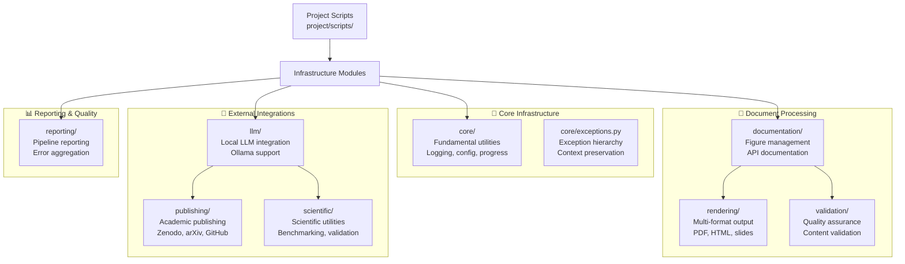
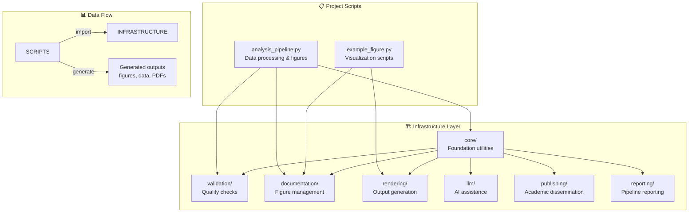
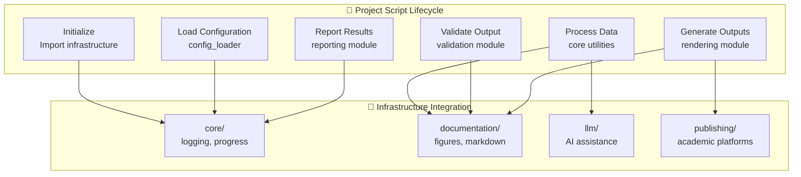

# Infrastructure Modules

Reusable build tools, validation systems, and integration components that support research projects. These modules provide the foundation for reproducible, high-quality research workflows.

## Overview

The infrastructure layer provides generic, reusable functionality that can be applied across different research projects. All modules follow the **thin orchestrator pattern** - scripts coordinate business logic implemented in these infrastructure modules.

## Module Categories


```mermaid
graph TD
    subgraph "🔧 Core Infrastructure"
        CORE[core/<br/>Fundamental utilities<br/>Logging, config, progress]
        EXCEPTIONS[core/exceptions.py<br/>Exception hierarchy<br/>Context preservation]
    end

    subgraph "📝 Document Processing"
        DOC[documentation/<br/>Figure management<br/>API documentation]
        RENDER[rendering/<br/>Multi-format output<br/>PDF, HTML, slides]
        VALIDATION[validation/<br/>Quality assurance<br/>Content validation]
    end

    subgraph "🔗 External Integrations"
        LLM[llm/<br/>Local LLM integration<br/>Ollama support]
        PUBLISHING[publishing/<br/>Academic publishing<br/>Zenodo, arXiv, GitHub]
        SCIENTIFIC[scientific/<br/>Scientific utilities<br/>Benchmarking, validation]
    end

    subgraph "📊 Reporting & Quality"
        REPORTING[reporting/<br/>Pipeline reporting<br/>Error aggregation]
    end

    PROJECT_SCRIPTS[Project Scripts<br/>project/scripts/]
    INFRASTRUCTURE[Infrastructure Modules]

    PROJECT_SCRIPTS --> INFRASTRUCTURE
    INFRASTRUCTURE --> CORE
    INFRASTRUCTURE --> DOC
    INFRASTRUCTURE --> LLM
    INFRASTRUCTURE --> REPORTING

    DOC --> RENDER
    DOC --> VALIDATION

    LLM --> PUBLISHING
    LLM --> SCIENTIFIC

    class CORE,EXCEPTIONS core
    class DOC,RENDER,VALIDATION doc
    class LLM,PUBLISHING,SCIENTIFIC integration
    class REPORTING build
```

## Infrastructure Dependencies


```mermaid
flowchart TD
    subgraph "📋 Project Scripts"
        ANALYSIS[analysis_pipeline.py<br/>Data processing & figures]
        FIGURES[example_figure.py<br/>Visualization scripts]
    end

    subgraph "🏗️ Infrastructure Layer"
        CORE_MOD[core/<br/>Foundation utilities]
        VALIDATION_MOD[validation/<br/>Quality checks]
        DOCUMENTATION_MOD[documentation/<br/>Figure management]
        RENDERING_MOD[rendering/<br/>Output generation]
        LLM_MOD[llm/<br/>AI assistance]
        PUBLISHING_MOD[publishing/<br/>Academic dissemination]
        REPORTING_MOD[reporting/<br/>Pipeline reporting]
    end

    subgraph "📊 Data Flow"
        SCRIPTS -->|import| INFRASTRUCTURE
        SCRIPTS -->|generate| OUTPUTS[Generated outputs<br/>figures, data, PDFs]
    end

    ANALYSIS --> CORE_MOD
    ANALYSIS --> DOCUMENTATION_MOD
    ANALYSIS --> VALIDATION_MOD

    FIGURES --> DOCUMENTATION_MOD
    FIGURES --> RENDERING_MOD

    CORE_MOD --> VALIDATION_MOD
    CORE_MOD --> DOCUMENTATION_MOD
    CORE_MOD --> RENDERING_MOD
    CORE_MOD --> LLM_MOD
    CORE_MOD --> PUBLISHING_MOD
    CORE_MOD --> REPORTING_MOD

    class ANALYSIS,FIGURES scripts
    class CORE_MOD,VALIDATION_MOD,DOCUMENTATION_MOD,RENDERING_MOD,LLM_MOD,PUBLISHING_MOD,REPORTING_MOD infra
    class OUTPUTS output
```


## Module Dependency Flow


```mermaid
flowchart TD
    A[Project Scripts] --> B[Infrastructure Modules]
    B --> C[Core Module]
    B --> D[Documentation Module]
    B --> E[Validation Module]
    B --> F[Rendering Module]
    B --> G[LLM Module]
    B --> H[Publishing Module]
    B --> I[Scientific Module]
    B --> J[Reporting Module]

    C --> K[exceptions.py<br/>Base exception classes]
    C --> L[logging_utils.py<br/>Unified logging system]
    C --> M[config_loader.py<br/>YAML configuration]
    C --> N[progress.py<br/>Progress tracking]
    C --> O[checkpoint.py<br/>Pipeline state]
    C --> P[retry.py<br/>Exponential backoff]
    C --> Q[stage_monitor.py<br/>Resource monitoring]
    C --> R[environment.py<br/>Setup validation]
    C --> S[script_discovery.py<br/>Dynamic discovery]
    C --> T[file_operations.py<br/>I/O utilities]

    D --> U[figure_manager.py<br/>Figure registration]
    D --> V[image_manager.py<br/>Image handling]
    D --> W[markdown_integration.py<br/>Auto-insertion]
    D --> X[glossary_gen.py<br/>API documentation]

    E --> Y[pdf_validator.py<br/>PDF quality checks]
    E --> Z[markdown_validator.py<br/>Markdown validation]
    E --> AA[integrity.py<br/>Cross-reference validation]

    F --> BB[core.py<br/>RenderManager orchestrator]
    F --> CC[latex_utils.py<br/>LaTeX processing]
    F --> DD[web_renderer.py<br/>Web output]

    G --> EE[llm/core/client.py<br/>Ollama integration]
    G --> FF[llm/templates/<br/>Research templates]
    G --> GG[llm/core/context.py<br/>Context management]

    H --> HH[api.py<br/>Platform API clients]
    H --> II[package.py<br/>Submission packaging]
    H --> JJ[platforms.py<br/>Release automation]
    H --> KK[citations.py<br/>BibTeX/APA/MLA]

    I --> LL[benchmarking.py<br/>Performance analysis]
    I --> MM[validation.py<br/>Scientific standards]
    I --> NN[templates.py<br/>Research workflows]

    J --> OO[pipeline_reporter.py<br/>Build reports]
    J --> PP[error_aggregator.py<br/>Error categorization]
    J --> QQ[html_templates.py<br/>Visual reports]

    class A start
    class C,K,L,M,N,O,P,Q,R,S,T core
    class D,U,V,W,X doc
    class E,Y,Z,AA validation
    class F,BB,CC,DD rendering
    class G,EE,FF,GG llm
    class H,HH,II,JJ,KK publishing
    class I,LL,MM,NN scientific
    class J,OO,PP,QQ reporting
```

## Data Flow Through Infrastructure

```mermaid
flowchart LR
    subgraph Input["📥 Input Sources"]
        YAML[config.yaml<br/>Project metadata]
        SRC[src/<br/>Scientific code]
        MANUSCRIPT[manuscript/<br/>Research content]
        SCRIPTS[scripts/<br/>Orchestrators]
    end

    subgraph Processing["⚙️ Infrastructure Processing"]
        CONFIG[config_loader<br/>Load settings]
        VALIDATE[validation/<br/>Quality checks]
        RENDER[rendering/<br/>Generate outputs]
        LOGGING[logging_utils<br/>Track progress]
        REPORT[reporting/<br/>Generate reports]
    end

    subgraph Output["📤 Generated Outputs"]
        PDF[output/{project_name}/pdf/<br/>Manuscript PDFs]
        FIGURES[output/{project_name}/figures/<br/>Publication plots]
        REPORTS[output/{project_name}/reports/<br/>Validation reports]
        HTML[output/{project_name}/web/<br/>HTML versions]
    end

    YAML --> CONFIG
    SRC --> VALIDATE
    MANUSCRIPT --> RENDER
    SCRIPTS --> LOGGING

    CONFIG --> VALIDATE
    VALIDATE --> RENDER
    RENDER --> REPORT
    LOGGING --> REPORT

    RENDER --> PDF
    RENDER --> FIGURES
    REPORT --> REPORTS
    RENDER --> HTML

    class Input input
    class Processing process
    class Output output
```

### Core Infrastructure

- **[core/](core/)** - Fundamental utilities (logging, configuration, progress tracking)
- **Exception handling** - Custom exception hierarchy and error handling

### Document Processing
- **[documentation/](documentation/)** - Figure management and API documentation generation
- **[rendering/](rendering/)** - Multi-format output generation (PDF, HTML, slides)
- **[validation/](validation/)** - Quality assurance and content validation

### External Integrations

- **[llm/](llm/)** - Local Large Language Model integration
- **[publishing/](publishing/)** - Academic publishing workflows
- **[scientific/](scientific/)** - Scientific computing utilities

### Reporting & Quality

- **[reporting/](reporting/)** - Pipeline reporting and error aggregation

### Project Management

- **[project/](project/)** - Multi-project discovery, validation, and lifecycle management

### Security & Integrity

- **[steganography/](steganography/)** - Cryptographic watermarking, PDF metadata injection, and hashing

## Usage in Projects

Infrastructure modules are imported by project-specific scripts:

```python
# In project/scripts/analysis.py
from infrastructure.rendering import RenderManager
from infrastructure.validation import validate_markdown
from infrastructure.llm.core import LLMClient

# Use infrastructure components
renderer = RenderManager()
client = LLMClient()
```

### Usage Patterns


```mermaid
flowchart TD
    subgraph "🚀 Project Script Lifecycle"
        INIT[Initialize<br/>Import infrastructure]
        CONFIG[Load Configuration<br/>config_loader]
        PROCESS[Process Data<br/>core utilities]
        VALIDATE[Validate Output<br/>validation module]
        RENDER[Generate Outputs<br/>rendering module]
        REPORT[Report Results<br/>reporting module]
    end

    subgraph "🔧 Infrastructure Integration"
        CORE[core/<br/>logging, progress]
        DOC[documentation/<br/>figures, markdown]
        LLM[llm/<br/>AI assistance]
        PUBLISH[publishing/<br/>academic platforms]
    end

    INIT --> CORE
    CONFIG --> CORE
    PROCESS --> DOC
    VALIDATE --> DOC
    RENDER --> DOC
    REPORT --> CORE

    PROCESS --> LLM
    RENDER --> PUBLISH

    class INIT,CONFIG,PROCESS,VALIDATE,RENDER,REPORT script
    class CORE,DOC,LLM,PUBLISH infra
```

## Testing

Infrastructure modules maintain **83.33% test coverage** (exceeds 60% requirement):

```bash
# Test all infrastructure
pytest tests/infra_tests/ --cov=infrastructure --cov-report=term-missing

# Test specific module
pytest tests/infra_tests/core/ -v
```

## Architecture Principles

### Thin Orchestrator Pattern
- **Business logic** resides in infrastructure modules
- **Scripts** provide thin orchestration layer
- **Clean separation** between reusable code and project-specific logic

### Data Policy
- **No mock methods** in business logic
- **computations** with actual data
- **Deterministic outputs** for reproducibility

### Validation
- **Quality assurance** for all outputs
- **Integration testing** across modules
- **Error handling** with informative messages

## Development

### Adding New Infrastructure

1. Create module in appropriate category
2. Implement business logic with tests
3. Add AGENTS.md documentation
4. Update integration tests
5. Ensure 60%+ test coverage

### Module Structure
```
infrastructure/new_module/
├── __init__.py      # Public API exports
├── core.py          # Main functionality
├── utils.py         # Helper functions
├── cli.py           # Command-line interface (if needed)
├── AGENTS.md        # Technical documentation
└── README.md        # Quick reference
```

## Quality Standards

- **Test Coverage**: Minimum 60% for infrastructure modules
- **Documentation**: AGENTS.md for all modules
- **Error Handling**: exception handling
- **Performance**: Efficient resource usage
- **Security**: Safe credential handling

## See Also

- [AGENTS.md](AGENTS.md) - infrastructure documentation
- [../tests/infra_tests/](../tests/infra_tests/) - Infrastructure test suite
- [../scripts/](../scripts/) - Orchestration scripts