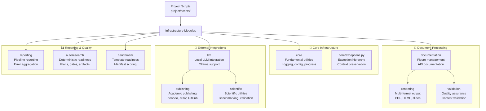
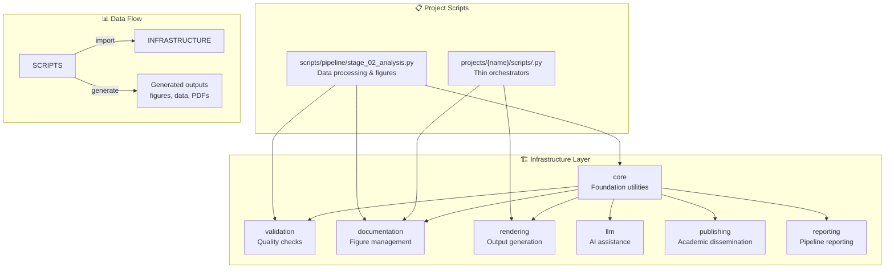
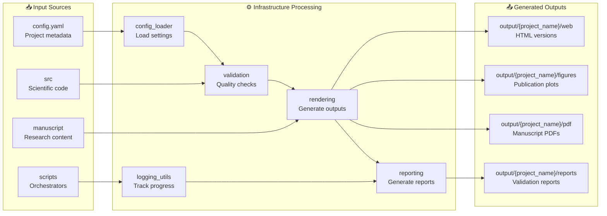
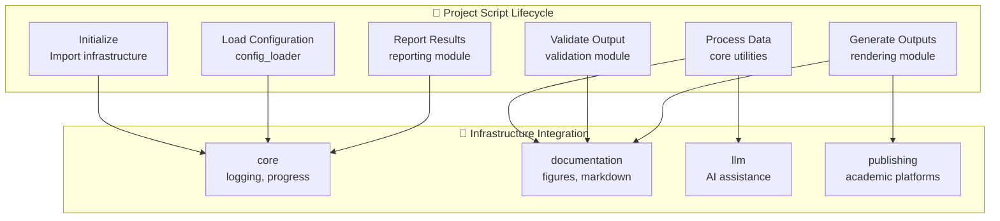
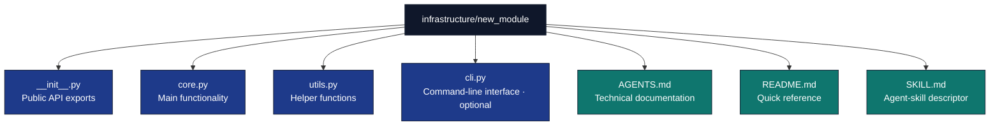

# Infrastructure Modules

Reusable build tools, validation systems, and integration components that support research projects. These modules provide the foundation for reproducible, high-quality research workflows.

## Overview

The infrastructure layer provides generic, reusable functionality that can be applied across different research projects. All modules follow the **thin orchestrator pattern** - scripts coordinate business logic implemented in these infrastructure modules.

## Agent skills (`SKILL.md`)

Each subpackage (and the package root) includes a **`SKILL.md`** with YAML frontmatter (`name`, `description`) so assistants can route work to the right module. **Discovery:** open [`.cursor/skill_manifest.json`](../.cursor/skill_manifest.json) (or `@.cursor/skill_manifest.json` in Cursor), search `infrastructure/**/SKILL.md`, open the hub [SKILL.md](SKILL.md), or use `@infrastructure/SKILL.md` / `@infrastructure/<module>/SKILL.md`. Regenerate the manifest after skill changes: `uv run python -m infrastructure.skills write`.

| Path | Frontmatter `name` | Description |
| --- | --- | --- |
| [SKILL.md](SKILL.md) | `infrastructure-overview` | Top-level routing for the infrastructure layer — module discovery, import patterns, two-layer architecture, and the skill manifest. |
| [autoresearch/SKILL.md](autoresearch/SKILL.md) | `infrastructure-autoresearch` | Deterministic AutoResearch readiness planning — opt-in `autoresearch.yaml` controls, stage-gate readiness, and evidence-grounded claims. |
| [benchmark/SKILL.md](benchmark/SKILL.md) | `infrastructure-benchmark` | Deterministic benchmark harnesses scoring generated project outputs against manifests; bounded no-network readiness checks. |
| [config/SKILL.md](config/SKILL.md) | `infrastructure-config` | Repository-scoped configuration — `.env` patterns, default secure/steganography YAML, and project config overrides. |
| [core/SKILL.md](core/SKILL.md) | `infrastructure-core` | Logging, configuration, exceptions, checkpoints/retry, pipeline execution, security, and multi-project orchestration. |
| [core/telemetry/SKILL.md](core/telemetry/SKILL.md) | `telemetry` | Unified pipeline telemetry — per-stage performance metrics and diagnostic events into structured JSON/text reports. |
| [docker/SKILL.md](docker/SKILL.md) | `infrastructure-docker` | Container build and compose assets for reproducing CI/cloud environments and wiring Ollama sidecars. |
| [doctor/SKILL.md](doctor/SKILL.md) | `infrastructure-doctor` | Repository-level diagnostics with safe, reversible automated repair (backups + action journal). |
| [documentation/SKILL.md](documentation/SKILL.md) | `infrastructure-documentation` | Figure management, image handling, markdown integration, and API glossary generation. |
| [fonds/SKILL.md](fonds/SKILL.md) | `infrastructure-fonds` | Discovery, validation, scope, and private-sidecar symlink sync for the top-level `fonds/` directory. |
| [llm/SKILL.md](llm/SKILL.md) | `infrastructure-llm` | Local LLM integration via Ollama — clients, prompt templates, output validation, reviews, and model management. |
| [metadata/SKILL.md](metadata/SKILL.md) | `infrastructure-metadata` | Shared publication-metadata leaves — repository-URL normalization and ONIX/metadata.json/EPUB OPF generation. |
| [methods/SKILL.md](methods/SKILL.md) | `infrastructure-methods` | Methods orchestration contract builder mapping pipeline stages, evidence registries, and validation commands into one reproducible plan. |
| [orchestration/SKILL.md](orchestration/SKILL.md) | `infrastructure-orchestration` | Python CLI and interactive menu orchestration for pipeline runs — project picker, PipelineRunner, per-stage logs. |
| [project/SKILL.md](project/SKILL.md) | `infrastructure-project` | Multi-project discovery, structure validation, and project metadata extraction. |
| [prose/SKILL.md](prose/SKILL.md) | `infrastructure-prose` | Prose analysis utilities — readability metrics, heading outlines, editorial quality flags, and manuscript reports. |
| [provenance/SKILL.md](provenance/SKILL.md) | `provenance-dag` | Content-addressed provenance DAG recording which pipeline stage produced which artifact, with review/validation passes. |
| [publishing/SKILL.md](publishing/SKILL.md) | `infrastructure-publishing` | Academic publishing workflows — citations, DOIs, Zenodo/arXiv/GitHub/PyPI, site deployment, and multi-target archival. |
| [reference/SKILL.md](reference/SKILL.md) | `infrastructure-reference` | BibTeX read/write/convert plus deterministic reference-existence verification against Crossref/OpenAlex/arXiv. |
| [reference/citation/SKILL.md](reference/citation/SKILL.md) | `infrastructure-reference-citation` | BibTeX parse/render/convert with house-style citation-key generation and LaTeX escaping. |
| [reference/verification/SKILL.md](reference/verification/SKILL.md) | `reference-verification` | Deterministic anti-hallucination gate resolving cited references against Crossref, OpenAlex, and arXiv (offline-first). |
| [rendering/SKILL.md](rendering/SKILL.md) | `infrastructure-rendering` | Multi-format output generation — PDF manuscripts, HTML pages, and Beamer/Reveal.js slides. |
| [reporting/SKILL.md](reporting/SKILL.md) | `infrastructure-reporting` | Pipeline reporting, error aggregation, executive summaries, dashboards, and multi-project reports. |
| [research/SKILL.md](research/SKILL.md) | `research-workflow` | Seven-stage research workflow (SCOPE→LITERATURE→REASON→DESIGN→COMPUTE→SYNTHESIZE→WRITE) with config-driven stage overrides. |
| [rules/SKILL.md](rules/SKILL.md) | `infrastructure-rules` | Discovery, validation, scope, and private-sidecar symlink sync for the top-level `rules/` directory. |
| [scientific/SKILL.md](scientific/SKILL.md) | `infrastructure-scientific` | Numerical stability checks, performance benchmarking, and improvement confirmation beyond the noise band. |
| [search/SKILL.md](search/SKILL.md) | `infrastructure-search` | Discovery utilities hosting `literature`, `exa`, `monid`, `connectors`, and `deep_research` subpackages. |
| [search/connectors/SKILL.md](search/connectors/SKILL.md) | `scientific-connectors` | Uniform Connector interface over 8+ scientific databases for literature, biology, and protein/PDB queries. |
| [search/literature/SKILL.md](search/literature/SKILL.md) | `infrastructure-search-literature` | Paperclip-style multi-source literature search across arXiv, Crossref, and local corpora with dedup and caching. |
| [search/monid/SKILL.md](search/monid/SKILL.md) | `infrastructure-search-monid` | Monid HTTP API client (discover/inspect/run/poll/balance) with an offline search-API pricing comparison table. |
| [sia/SKILL.md](sia/SKILL.md) | `infrastructure-sia` | Self-Improvement Agent (SIA) harness contract — layouts, artifact trees, evaluation runners, and replay loops. |
| [skills/SKILL.md](skills/SKILL.md) | `infrastructure-skills` | Programmatic discovery of agent SKILL.md files and `.cursor/skill_manifest.json` validation/writing. |
| [steganography/SKILL.md](steganography/SKILL.md) | `infrastructure-steganography` | QR codes, hash manifests, metadata payloads, and document-wide overlay processing for PDFs. |
| [tools/SKILL.md](tools/SKILL.md) | `infrastructure-tools` | Discovery, validation, scope, and private-sidecar symlink sync for the top-level `tools/` directory. |
| [transmission/SKILL.md](transmission/SKILL.md) | `infrastructure-transmission` | Rendered-release transmission leaves — LaTeX single-page bookends, Stage 04 page checks, barcode strips, and figure embedding. |
| [validation/SKILL.md](validation/SKILL.md) | `infrastructure-validation` | PDF/markdown validation, output integrity, link verification, documentation audits, and repository scanning. |
| [validation/publication/SKILL.md](validation/publication/SKILL.md) | `publication-readiness-audit` | Deterministic publication-readiness audit across tests, methods, evidence, artifacts, figures, and outputs of public exemplars. |

Pair each `SKILL.md` with the matching **`AGENTS.md`** for full API tables.

## Module Categories


```mermaid
graph TD
    subgraph "🔧 Core Infrastructure"
        CORE[core<br/>Fundamental utilities<br/>Logging, config, progress]
        EXCEPTIONS[core/exceptions.py<br/>Exception hierarchy<br/>Context preservation]
    end

    subgraph "📝 Document Processing"
        DOC[documentation<br/>Figure management<br/>API documentation]
        RENDER[rendering<br/>Multi-format output<br/>PDF, HTML, slides]
        VALIDATION[validation<br/>Quality assurance<br/>Content validation]
    end

    subgraph "🔗 External Integrations"
        LLM[llm<br/>Local LLM integration<br/>Ollama support]
        PUBLISHING[publishing<br/>Academic publishing<br/>Zenodo, arXiv, GitHub]
        SCIENTIFIC[scientific<br/>Scientific utilities<br/>Benchmarking, validation]
    end

    subgraph "📊 Reporting & Quality"
        REPORTING[reporting<br/>Pipeline reporting<br/>Error aggregation]
        AUTORESEARCH[autoresearch<br/>Deterministic readiness<br/>Plans, gates, artifacts]
        BENCHMARK[benchmark<br/>Template readiness<br/>Manifest scoring]
    end

    PROJECT_SCRIPTS[Project Scripts<br/>project/scripts/]
    INFRASTRUCTURE[Infrastructure Modules]

    PROJECT_SCRIPTS --> INFRASTRUCTURE
    INFRASTRUCTURE --> CORE
    INFRASTRUCTURE --> DOC
    INFRASTRUCTURE --> LLM
    INFRASTRUCTURE --> REPORTING
    INFRASTRUCTURE --> AUTORESEARCH
    INFRASTRUCTURE --> BENCHMARK

    DOC --> RENDER
    DOC --> VALIDATION

    LLM --> PUBLISHING
    LLM --> SCIENTIFIC

    class CORE,EXCEPTIONS core
    class DOC,RENDER,VALIDATION doc
    class LLM,PUBLISHING,SCIENTIFIC integration
    class REPORTING,AUTORESEARCH,BENCHMARK build
```

Diagrams above are selective. These packages also exist under `infrastructure/` (or nested): **`benchmark/`** (deterministic exemplar readiness scoring), **`config/`** (`.env.template`, `secure_config.yaml`), **`docker/`** (`Dockerfile`, compose), **`project/`** (discovery, structure checks), **`steganography/`** (PDF hardening), **`skills/`** (`discover_skills`, manifest for Cursor), **`core/telemetry/`** (`TelemetryCollector`, per-stage resource + diagnostic reports).
`autoresearch/` adds opt-in deterministic readiness planning over the existing pipeline, project, validation, and reporting modules. `methods/` adds a read-only methods orchestration plan that links stage contracts, manuscript methodology prose, artifact manifests, evidence registries, and validation commands.

## Infrastructure Dependencies


```mermaid
flowchart TD
    subgraph "📋 Project Scripts"
        ANALYSIS[scripts/pipeline/stage_02_analysis.py<br/>Data processing & figures]
        FIGURES["projects/{name}/scripts/<analysis>.py<br/>Thin orchestrators"]
    end

    subgraph "🏗️ Infrastructure Layer"
        CORE_MOD[core<br/>Foundation utilities]
        VALIDATION_MOD[validation<br/>Quality checks]
        DOCUMENTATION_MOD[documentation<br/>Figure management]
        RENDERING_MOD[rendering<br/>Output generation]
        LLM_MOD[llm<br/>AI assistance]
        PUBLISHING_MOD[publishing<br/>Academic dissemination]
        REPORTING_MOD[reporting<br/>Pipeline reporting]
    end

    subgraph "📊 Data Flow"
        SCRIPTS -->|import| INFRASTRUCTURE
        SCRIPTS -->|generate| OUTPUTS[Generated outputs<br/>figures, data, PDFs]
    end

    ANALYSIS --> CORE_MOD
    ANALYSIS --> DOCUMENTATION_MOD
    ANALYSIS --> VALIDATION_MOD

    FIGURES --> DOCUMENTATION_MOD
    FIGURES --> RENDERING_MOD

    CORE_MOD --> VALIDATION_MOD
    CORE_MOD --> DOCUMENTATION_MOD
    CORE_MOD --> RENDERING_MOD
    CORE_MOD --> LLM_MOD
    CORE_MOD --> PUBLISHING_MOD
    CORE_MOD --> REPORTING_MOD

    class ANALYSIS,FIGURES scripts
    class CORE_MOD,VALIDATION_MOD,DOCUMENTATION_MOD,RENDERING_MOD,LLM_MOD,PUBLISHING_MOD,REPORTING_MOD infra
    class OUTPUTS output
```

## Module Dependency Flow


```mermaid
flowchart TD
    A[Project Scripts] --> B[Infrastructure Modules]
    B --> C[Core Module]
    B --> D[Documentation Module]
    B --> E[Validation Module]
    B --> F[Rendering Module]
    B --> G[LLM Module]
    B --> H[Publishing Module]
    B --> I[Scientific Module]
    B --> J[Reporting Module]

    C --> K[exceptions.py<br/>Base exception classes]
    C --> L[logging/utils.py<br/>Unified logging system]
    C --> M[config/loader.py<br/>YAML configuration]
    C --> N[progress.py<br/>Progress tracking]
    C --> O[runtime/checkpoint.py<br/>Pipeline state]
    C --> P[runtime/retry.py<br/>Exponential backoff]
    C --> Q[pipeline/stage_monitor.py<br/>Resource monitoring]
    C --> R[runtime/environment.py<br/>Setup validation]
    C --> S[script_discovery.py<br/>Dynamic discovery]
    C --> T[files/operations.py<br/>I/O utilities]

    D --> U[figure_manager.py<br/>Figure registration]
    D --> V[image_manager.py<br/>Image handling]
    D --> W[markdown_integration.py<br/>Auto-insertion]
    D --> X[glossary_gen.py<br/>API documentation]

    E --> Y[output/pdf_validator.py<br/>PDF quality checks]
    E --> Z[content/markdown_validator.py<br/>Markdown validation]
    E --> AA[integrity/checks.py<br/>Cross-reference validation]

    F --> BB[core.py<br/>RenderManager orchestrator]
    F --> CC[latex_utils.py<br/>LaTeX processing]
    F --> DD[web_renderer.py<br/>Web output]

    G --> EE[llm/core/client.py<br/>Ollama integration]
    G --> FF[llm/templates<br/>Research templates]
    G --> GG[llm/core/context.py<br/>Context management]

    H --> HH[api.py<br/>Platform API clients]
    H --> II[package.py<br/>Submission packaging]
    H --> JJ[platforms.py<br/>Release automation]
    H --> KK[citations.py<br/>BibTeX CLI target<br/>APA/MLA helpers]

    I --> LL[benchmarking.py<br/>Performance analysis]
    I --> MM[validation.py<br/>Scientific standards]
    I --> NN[templates.py<br/>Research workflows]

    J --> OO[pipeline_reporter.py<br/>Build reports]
    J --> PP[error_aggregator.py<br/>Error categorization]
    J --> QQ[html_templates.py<br/>Visual reports]

    class A start
    class C,K,L,M,N,O,P,Q,R,S,T core
    class D,U,V,W,X doc
    class E,Y,Z,AA validation
    class F,BB,CC,DD rendering
    class G,EE,FF,GG llm
    class H,HH,II,JJ,KK publishing
    class I,LL,MM,NN scientific
    class J,OO,PP,QQ reporting
```

## Data Flow Through Infrastructure


```mermaid
flowchart LR
    subgraph Input["📥 Input Sources"]
        YAML[config.yaml<br/>Project metadata]
        SRC[src<br/>Scientific code]
        MANUSCRIPT[manuscript<br/>Research content]
        SCRIPTS[scripts<br/>Orchestrators]
    end

    subgraph Processing["⚙️ Infrastructure Processing"]
        CONFIG[config_loader<br/>Load settings]
        VALIDATE[validation<br/>Quality checks]
        RENDER[rendering<br/>Generate outputs]
        LOGGING[logging_utils<br/>Track progress]
        REPORT[reporting<br/>Generate reports]
    end

    subgraph Output["📤 Generated Outputs"]
        PDF["output/{project_name}/pdf<br/>Manuscript PDFs"]
        FIGURES["output/{project_name}/figures<br/>Publication plots"]
        REPORTS["output/{project_name}/reports<br/>Validation reports"]
        HTML["output/{project_name}/web<br/>HTML versions"]
    end

    YAML --> CONFIG
    SRC --> VALIDATE
    MANUSCRIPT --> RENDER
    SCRIPTS --> LOGGING

    CONFIG --> VALIDATE
    VALIDATE --> RENDER
    RENDER --> REPORT
    LOGGING --> REPORT

    RENDER --> PDF
    RENDER --> FIGURES
    REPORT --> REPORTS
    RENDER --> HTML

    class Input input
    class Processing process
    class Output output
```

### Core Infrastructure

- **[core/](core/)** - Fundamental utilities (logging, configuration, progress tracking)
- **Exception handling** - Custom exception hierarchy and error handling

### Document Processing

- **[documentation/](documentation/)** - Figure management and API documentation generation
- **[rendering/](rendering/)** - Multi-format output generation (PDF, HTML, slides)
- **[validation/](validation/)** - Quality assurance and content validation
- **[prose/](prose/)** - Readability metrics, outline analysis, editorial quality flags for manuscripts

### External Integrations

- **[llm/](llm/)** - Local Large Language Model integration
- **[publishing/](publishing/)** - Academic publishing workflows
- **[scientific/](scientific/)** - Scientific computing utilities
- **[search/](search/)** - Multi-source literature search (arXiv, Crossref, Paperclip, local)
- **[reference/](reference/)** - BibTeX read / write / convert (`parse_bibfile`, `render_database`)

### Reporting & Quality

- **[reporting/](reporting/)** - Pipeline reporting and error aggregation

### Project Management

- **[project/](project/)** - Multi-project discovery, validation, and lifecycle management
- **[orchestration/](orchestration/)** - Pipeline CLI, interactive menu, stage logging, secure-run wrapper (backs `run.sh` / `secure_run.sh`)

### Diagnostics & Repair

- **[doctor/](doctor/)** - Repository diagnostics and safe, reversible automated repair (`uv run python -m infrastructure.doctor`)

### Security & Integrity

- **[steganography/](steganography/)** - Cryptographic watermarking, PDF metadata injection, and hashing

### Pipeline Telemetry

- **[core/telemetry/](core/telemetry/)** - Unified per-stage resource + diagnostic tracking (`TelemetryCollector`)

## Usage in Projects

Infrastructure modules are imported by project-specific scripts:

```python
# In project/scripts/analysis.py
from infrastructure.rendering import RenderManager
from infrastructure.validation import validate_markdown
from infrastructure.llm.core import LLMClient

# Use infrastructure components
renderer = RenderManager()
client = LLMClient()
```

### Usage Patterns


```mermaid
flowchart TD
    subgraph "🚀 Project Script Lifecycle"
        INIT[Initialize<br/>Import infrastructure]
        CONFIG[Load Configuration<br/>config_loader]
        PROCESS[Process Data<br/>core utilities]
        VALIDATE[Validate Output<br/>validation module]
        RENDER[Generate Outputs<br/>rendering module]
        REPORT[Report Results<br/>reporting module]
    end

    subgraph "🔧 Infrastructure Integration"
        CORE[core<br/>logging, progress]
        DOC[documentation<br/>figures, markdown]
        LLM[llm<br/>AI assistance]
        PUBLISH[publishing<br/>academic platforms]
    end

    INIT --> CORE
    CONFIG --> CORE
    PROCESS --> DOC
    VALIDATE --> DOC
    RENDER --> DOC
    REPORT --> CORE

    PROCESS --> LLM
    RENDER --> PUBLISH

    class INIT,CONFIG,PROCESS,VALIDATE,RENDER,REPORT script
    class CORE,DOC,LLM,PUBLISH infra
```

## Testing

Infrastructure modules maintain **≥60% test coverage** (live overall % → [`docs/development/coverage-gaps.md`](../docs/development/coverage-gaps.md)):

```bash
# Test all infrastructure
uv run pytest tests/infra_tests/ --cov=infrastructure --cov-report=term-missing

# Test specific module
uv run pytest tests/infra_tests/core/ -v
```

## Architecture Principles

### Thin Orchestrator Pattern

- **Business logic** resides in infrastructure modules
- **Scripts** provide thin orchestration layer
- **Clean separation** between reusable code and project-specific logic

### Data Policy

- **No mock methods** in business logic
- **computations** with actual data
- **Deterministic outputs** for reproducibility

### Validation

- **Quality assurance** for all outputs
- **Integration testing** across modules
- **Error handling** with informative messages

## Development

### Adding New Infrastructure

1. Create module in appropriate category
2. Implement business logic with tests
3. Add AGENTS.md documentation
4. Update integration tests
5. Ensure 60%+ test coverage

### Module Structure


```mermaid
flowchart TB
    NM[infrastructure/new_module]
    NM --> INIT[__init__.py<br/>Public API exports]
    NM --> CORE[core.py<br/>Main functionality]
    NM --> UTILS[utils.py<br/>Helper functions]
    NM --> CLI[cli.py<br/>Command-line interface · optional]
    NM --> AG[AGENTS.md<br/>Technical documentation]
    NM --> RD[README.md<br/>Quick reference]
    NM --> SK[SKILL.md<br/>Agent-skill descriptor]

    classDef d fill:#0f172a,stroke:#0f172a,color:#fff
    classDef code fill:#1e3a8a,stroke:#0f172a,color:#fff
    classDef doc fill:#0f766e,stroke:#0f172a,color:#fff
    class NM d
    class INIT,CORE,UTILS,CLI code
    class AG,RD,SK doc
```

## Quality Standards

- **Test Coverage**: Minimum 60% for infrastructure modules
- **Documentation**: AGENTS.md for all modules
- **Error Handling**: exception handling
- **Performance**: Efficient resource usage
- **Security**: Safe credential handling

## See Also

- [AGENTS.md](AGENTS.md) - infrastructure documentation
- [../tests/infra_tests/](../tests/infra_tests/) - Infrastructure test suite
- [../scripts/](../scripts/) - Orchestration scripts

<!-- foam-orphan-nav:start (hand-maintained: links sub-docs so they are reachable; no generator refreshes or validates this block) -->

## Directory & sub-document map

Navigation links to in-tree documents (keeps them discoverable):

- [Methods Orchestration](methods/README.md)
- [Steganography Module](steganography/README.md)

<!-- foam-orphan-nav:end -->
