# Infrastructure Modules

Reusable build tools, validation systems, and integration components that support research projects. These modules provide the foundation for reproducible, high-quality research workflows.

## Overview

The infrastructure layer provides generic, reusable functionality that can be applied across different research projects. All modules follow the **thin orchestrator pattern** - scripts coordinate business logic implemented in these infrastructure modules.

## Module Categories


## Infrastructure Dependencies

```mermaid
flowchart TD
    subgraph "📋 Project Scripts"
        ANALYSIS[analysis_pipeline.py<br/>Data processing & figures]
        FIGURES[example_figure.py<br/>Visualization scripts]
    end

    subgraph "🏗️ Infrastructure Layer"
        CORE_MOD[core/<br/>Foundation utilities]
        VALIDATION_MOD[validation/<br/>Quality checks]
        DOCUMENTATION_MOD[documentation/<br/>Figure management]
        RENDERING_MOD[rendering/<br/>Output generation]
        LLM_MOD[llm/<br/>AI assistance]
        PUBLISHING_MOD[publishing/<br/>Academic dissemination]
        REPORTING_MOD[reporting/<br/>Pipeline reporting]
    end

    subgraph "📊 Data Flow"
        SCRIPTS -->|import| INFRASTRUCTURE
        SCRIPTS -->|generate| OUTPUTS[Generated outputs<br/>figures, data, PDFs]
    end

    ANALYSIS --> CORE_MOD
    ANALYSIS --> DOCUMENTATION_MOD
    ANALYSIS --> VALIDATION_MOD

    FIGURES --> DOCUMENTATION_MOD
    FIGURES --> RENDERING_MOD

    CORE_MOD --> VALIDATION_MOD
    CORE_MOD --> DOCUMENTATION_MOD
    CORE_MOD --> RENDERING_MOD
    CORE_MOD --> LLM_MOD
    CORE_MOD --> PUBLISHING_MOD
    CORE_MOD --> REPORTING_MOD

    classDef scripts fill:#e3f2fd,stroke:#1565c0,stroke-width:2px
    classDef infra fill:#f3e5f5,stroke:#4a148c,stroke-width:2px
    classDef output fill:#e8f5e8,stroke:#2e7d32,stroke-width:2px

    class ANALYSIS,FIGURES scripts
    class CORE_MOD,VALIDATION_MOD,DOCUMENTATION_MOD,RENDERING_MOD,LLM_MOD,PUBLISHING_MOD,REPORTING_MOD infra
    class OUTPUTS output
```


    classDef orchestrator fill:#fce4ec,stroke:#c2185b,stroke-width:3px

    class CORE,EXCEPTIONS core
    class DOC,RENDER,VALIDATION doc
    class LLM,PUBLISHING,SCIENTIFIC integration
    class REPORTING build
    class PROJECT_SCRIPTS orchestrator
```

## Module Dependency Flow


## Data Flow Through Infrastructure

```mermaid
flowchart LR
    subgraph Input["📥 Input Sources"]
        YAML[config.yaml<br/>Project metadata]
        SRC[src/<br/>Scientific code]
        MANUSCRIPT[manuscript/<br/>Research content]
        SCRIPTS[scripts/<br/>Orchestrators]
    end

    subgraph Processing["⚙️ Infrastructure Processing"]
        CONFIG[config_loader<br/>Load settings]
        VALIDATE[validation/<br/>Quality checks]
        RENDER[rendering/<br/>Generate outputs]
        LOGGING[logging_utils<br/>Track progress]
        REPORT[reporting/<br/>Generate reports]
    end

    subgraph Output["📤 Generated Outputs"]
        PDF[output/pdf/<br/>Manuscript PDFs]
        FIGURES[output/figures/<br/>Publication plots]
        REPORTS[output/reports/<br/>Validation reports]
        HTML[output/web/<br/>HTML versions]
    end

    YAML --> CONFIG
    SRC --> VALIDATE
    MANUSCRIPT --> RENDER
    SCRIPTS --> LOGGING

    CONFIG --> VALIDATE
    VALIDATE --> RENDER
    RENDER --> REPORT
    LOGGING --> REPORT

    RENDER --> PDF
    RENDER --> FIGURES
    REPORT --> REPORTS
    RENDER --> HTML

    classDef input fill:#e3f2fd,stroke:#1565c0,stroke-width:2px
    classDef process fill:#fff3e0,stroke:#e65100,stroke-width:2px
    classDef output fill:#e8f5e8,stroke:#2e7d32,stroke-width:2px

    class Input input
    class Processing process
    class Output output
```



### Core Infrastructure
- **[core/](core/)** - Fundamental utilities (logging, configuration, progress tracking)
- **Exception handling** - Custom exception hierarchy and error handling

### Document Processing
- **[documentation/](documentation/)** - Figure management and API documentation generation
- **[rendering/](rendering/)** - Multi-format output generation (PDF, HTML, slides)
- **[validation/](validation/)** - Quality assurance and content validation

### External Integrations
- **[llm/](llm/)** - Local Large Language Model integration
- **[publishing/](publishing/)** - Academic publishing workflows
- **[scientific/](scientific/)** - Scientific computing utilities

### Reporting & Quality
- **[reporting/](reporting/)** - Pipeline reporting and error aggregation

## Usage in Projects

Infrastructure modules are imported by project-specific scripts:

```python
# In project/scripts/analysis.py
from infrastructure.rendering import RenderManager
from infrastructure.validation import validate_markdown
from infrastructure.llm.core import LLMClient

# Use infrastructure components
renderer = RenderManager()
client = LLMClient()
```

### Usage Patterns

```mermaid
flowchart TD
    subgraph "🚀 Project Script Lifecycle"
        INIT[Initialize<br/>Import infrastructure]
        CONFIG[Load Configuration<br/>config_loader]
        PROCESS[Process Data<br/>core utilities]
        VALIDATE[Validate Output<br/>validation module]
        RENDER[Generate Outputs<br/>rendering module]
        REPORT[Report Results<br/>reporting module]
    end

    subgraph "🔧 Infrastructure Integration"
        CORE[core/<br/>logging, progress]
        DOC[documentation/<br/>figures, markdown]
        LLM[llm/<br/>AI assistance]
        PUBLISH[publishing/<br/>academic platforms]
    end

    INIT --> CORE
    CONFIG --> CORE
    PROCESS --> DOC
    VALIDATE --> DOC
    RENDER --> DOC
    REPORT --> CORE

    PROCESS --> LLM
    RENDER --> PUBLISH

    classDef script fill:#e3f2fd,stroke:#1565c0,stroke-width:2px
    classDef infra fill:#f3e5f5,stroke:#4a148c,stroke-width:2px

    class INIT,CONFIG,PROCESS,VALIDATE,RENDER,REPORT script
    class CORE,DOC,LLM,PUBLISH infra
```



## Testing

Infrastructure modules maintain **83.33% test coverage** (exceeds 60% requirement):

```bash
# Test all infrastructure
pytest tests/infrastructure/ --cov=infrastructure --cov-report=term-missing

# Test specific module
pytest tests/infrastructure/core/ -v
```

## Architecture Principles

### Thin Orchestrator Pattern
- **Business logic** resides in infrastructure modules
- **Scripts** provide thin orchestration layer
- **Clean separation** between reusable code and project-specific logic

### Real Data Policy
- **No mock methods** in business logic
- **Real computations** with actual data
- **Deterministic outputs** for reproducibility

### Comprehensive Validation
- **Quality assurance** for all outputs
- **Integration testing** across modules
- **Error handling** with informative messages

## Development

### Adding New Infrastructure

1. Create module in appropriate category
2. Implement business logic with tests
3. Add AGENTS.md documentation
4. Update integration tests
5. Ensure 60%+ test coverage

### Module Structure
```
infrastructure/new_module/
├── __init__.py      # Public API exports
├── core.py          # Main functionality
├── utils.py         # Helper functions
├── cli.py           # Command-line interface (if needed)
├── AGENTS.md        # Technical documentation
└── README.md        # Quick reference
```

## Quality Standards

- **Test Coverage**: Minimum 60% for infrastructure modules
- **Documentation**: Complete AGENTS.md for all modules
- **Error Handling**: Comprehensive exception handling
- **Performance**: Efficient resource usage
- **Security**: Safe credential handling

## See Also

- [AGENTS.md](AGENTS.md) - Complete infrastructure documentation
- [../tests/infrastructure/](../tests/infrastructure/) - Infrastructure test suite
- [../scripts/](../scripts/) - Orchestration scripts