# Core Module - Quick Reference

Foundation utilities: exceptions, logging, and configuration.

## Quick Start

```python
from infrastructure.core import (
    get_logger,
    TemplateError,
    load_config,
    log_operation
)

# Logging
logger = get_logger(__name__)
logger.info("Starting analysis")

# Exception handling
try:
    result = operation()
except Exception as e:
    raise TemplateError("Operation failed") from e

# Configuration
config = load_config(Path("config.yaml"))
env_vars = get_config_as_dict(Path("."))

# Operation tracking
with log_operation("Processing", logger):
    process_data()
```

## Architecture Overview


## Data Flow Architecture

```mermaid
flowchart LR
    subgraph Input["📥 Input Sources"]
        YAML[config.yaml<br/>Project metadata]
        ENV[Environment<br/>Variables]
        SCRIPTS[Project Scripts<br/>Analysis workflows]
        DEPS[Dependencies<br/>System requirements]
    end

    subgraph Processing["⚙️ Core Processing"]
        CONFIG[config_loader<br/>Load & merge config]
        VALIDATE[environment<br/>Validate system]
        LOGGING[logging_utils<br/>Track operations]
        PROGRESS[progress<br/>Show progress]
        SECURITY[security<br/>Validate inputs]
    end

    subgraph Output["📤 Outputs"]
        LOGS[Log Files<br/>Operation tracking]
        METRICS[Performance<br/>Resource usage]
        ERRORS[Error Reports<br/>Failure analysis]
        RESULTS[Configuration<br/>Validated settings]
    end

    YAML --> CONFIG
    ENV --> CONFIG
    SCRIPTS --> VALIDATE
    DEPS --> VALIDATE
    CONFIG --> LOGGING
    VALIDATE --> LOGGING
    LOGGING --> PROGRESS
    PROGRESS --> SECURITY
    SECURITY --> RESULTS
    LOGGING --> LOGS
    PROGRESS --> METRICS
    SECURITY --> ERRORS

    classDef input fill:#e3f2fd,stroke:#1565c0,stroke-width:2px
    classDef process fill:#fff3e0,stroke:#e65100,stroke-width:2px
    classDef output fill:#e8f5e8,stroke:#2e7d32,stroke-width:2px

    class Input input
    class Processing process
    class Output output
```



## Usage Patterns

```mermaid
flowchart TD
    subgraph Initialization["🚀 Initialization"]
        A[Import core modules]
        B[Setup logging]
        C[Load configuration]
        D[Validate environment]
    end

    subgraph Operation["⚙️ Operation"]
        E[Start progress tracking]
        F[Execute with error handling]
        G[Monitor performance]
        H[Handle retries]
    end

    subgraph Completion["✅ Completion"]
        I[Save checkpoint]
        J[Log results]
        K[Clean up]
    end

    A --> B --> C --> D
    D --> E --> F --> G --> H
    H --> I --> J --> K

    F -->|Error| H
    G -->|Performance issue| J

    classDef init fill:#e3f2fd,stroke:#1565c0,stroke-width:2px
    classDef op fill:#fff3e0,stroke:#e65100,stroke-width:2px
    classDef complete fill:#e8f5e8,stroke:#2e7d32,stroke-width:2px

    class Initialization init
    class Operation op
    class Completion complete
```



## Error Handling Flow


## Modules

### Core Modules

| Module | Purpose | Key Classes/Functions |
|--------|---------|----------------------|
| **exceptions.py** | Exception hierarchy with context preservation | `TemplateError`, `ValidationError`, `BuildError`, `raise_with_context()`, `chain_exceptions()` |
| **logging_utils.py** | Unified logging system with environment config | `get_logger()`, `setup_logger()`, `log_operation()`, `log_timing()`, `log_function_call()` |
| **config_loader.py** | YAML config loading with environment overrides | `load_config()`, `get_config_as_dict()`, `get_config_as_env_vars()`, `find_config_file()` |
| **health_check.py** | System health monitoring and component status | `SystemHealthChecker`, `get_health_api()`, `quick_health_check()`, `get_health_status()` |
| **security.py** | Input validation and security monitoring | `SecurityValidator`, `SecurityHeaders`, `RateLimiter`, `validate_llm_input()` |
| **progress.py** | Progress tracking with visual indicators | `ProgressBar`, `LLMProgressTracker`, `SubStageProgress` |
| **checkpoint.py** | Pipeline state management for resume capability | `CheckpointManager`, `PipelineCheckpoint`, `StageResult` |
| **retry.py** | Exponential backoff retry logic | `retry_with_backoff()`, `RetryableOperation` |
| **performance.py** | Resource monitoring and performance metrics | `PerformanceMonitor`, `ResourceUsage`, `StagePerformanceTracker` |
| **environment.py** | System validation and dependency checking | `check_python_version()`, `check_dependencies()`, `setup_directories()` |
| **script_discovery.py** | Dynamic script finding and execution coordination | `discover_analysis_scripts()`, `discover_orchestrators()` |
| **file_operations.py** | File management and output handling | `clean_output_directory()`, `copy_final_deliverables()` |
| **credentials.py** | Credential management from multiple sources | `CredentialManager` |
| **logging_progress.py** | Advanced progress logging utilities | `calculate_eta()`, `log_with_spinner()`, `StreamingProgress` |
| **logging_formatters.py** | Specialized logging formatters | `JSONFormatter`, `TemplateFormatter` |
| **performance_monitor.py** | Detailed performance monitoring and benchmarking | `monitor_performance()`, `benchmark_function()`, `benchmark_llm_query()` |
| **config_cli.py** | Configuration command-line interface | `main()` |

### Module Dependencies


## Key Classes & Functions

### Exception Handling & Context
- **`TemplateError`** - Base exception with context, suggestions, and recovery commands
- **`ConfigurationError`**, **`ValidationError`**, **`BuildError`** - Domain-specific error hierarchies
- **`LLMError`**, **`RenderingError`**, **`PublishingError`** - Module-specific exceptions
- **`raise_with_context()`** - Raise exceptions with structured context information
- **`chain_exceptions()`** - Preserve original exception context when re-raising
- **`format_file_context()`** - Format file path and line number for error context

### Logging & Monitoring
- **`get_logger()`**, **`setup_logger()`** - Unified logging with environment-based configuration
- **`log_operation()`** - Context manager for operation start/completion tracking
- **`log_timing()`** - Performance timing with automatic duration logging
- **`log_function_call()`** - Decorator for automatic function entry/exit logging
- **`log_progress()`**, **`log_stage()`**, **`log_substep()`** - Hierarchical progress logging
- **`set_global_log_level()`** - Environment-controlled logging verbosity (0-3)

### Configuration Management
- **`load_config()`** - YAML configuration file loading with validation
- **`get_config_as_dict()`** - Convert config to environment variable format
- **`get_config_as_env_vars()`** - Export config as shell environment variables
- **`find_config_file()`** - Discover config at standard `project/manuscript/config.yaml` location
- **`get_translation_languages()`** - Extract LLM translation languages from config
- **`get_testing_config()`** - Load test failure tolerance settings

### Security & Health Monitoring
- **`SecurityValidator`** - Input sanitization and threat detection
- **`SecurityHeaders`** - HTTP security header generation
- **`RateLimiter`** - Configurable request rate limiting
- **`SecurityMonitor`** - Security event tracking and alerting
- **`SystemHealthChecker`** - Component-level health monitoring
- **`get_health_api()`**, **`quick_health_check()`** - Health status APIs

### Progress & Checkpoint Management
- **`ProgressBar`** - Visual progress indicators with ETA calculation
- **`LLMProgressTracker`** - Token-based progress for LLM operations
- **`SubStageProgress`** - Nested progress tracking for multi-stage operations
- **`CheckpointManager`** - Pipeline state persistence for resume capability
- **`PipelineCheckpoint`**, **`StageResult`** - Checkpoint data structures

### Retry & Error Recovery
- **`retry_with_backoff()`** - Exponential backoff decorator with jitter
- **`retry_on_transient_failure()`** - Simplified retry for common transient errors
- **`RetryableOperation`** - Manual retry control with context manager

### Performance & Resource Monitoring
- **`PerformanceMonitor`** - Resource usage tracking (CPU, memory, I/O)
- **`monitor_performance()`** - Context manager for operation performance monitoring
- **`benchmark_function()`**, **`benchmark_llm_query()`** - Performance benchmarking
- **`get_system_resources()`** - System resource queries (psutil integration)
- **`StagePerformanceTracker`** - Pipeline stage performance analysis

### Environment & Dependency Management
- **`check_python_version()`** - Python version validation (3.8+ required)
- **`check_dependencies()`** - Package availability verification
- **`install_missing_packages()`** - Automatic dependency installation via uv
- **`check_build_tools()`** - Build tool validation (pandoc, xelatex, etc.)
- **`setup_directories()`** - Automated directory structure creation
- **`verify_source_structure()`** - Project layout validation
- **`set_environment_variables()`** - Environment variable configuration

### Script & File Operations
- **`discover_analysis_scripts()`** - Find project scripts in `projects/{name}/scripts/`
- **`discover_orchestrators()`** - Locate pipeline orchestrator scripts
- **`verify_analysis_outputs()`** - Validate script-generated outputs
- **`clean_output_directory()`** - Safe output directory cleanup
- **`copy_final_deliverables()`** - Copy outputs to final `output/{name}/` location

### Credential Management
- **`CredentialManager`** - Multi-source credential loading (.env, YAML, environment)
- **`get_zenodo_credentials()`**, **`get_github_credentials()`** - Platform-specific credentials
- **Optional `python-dotenv`** - Graceful fallback for .env file support

## Integration Patterns

### Pipeline Stage Integration
```python
# Typical pipeline stage using core modules
from infrastructure.core import (
    get_logger, log_operation, ProgressBar,
    CheckpointManager, TemplateError
)

logger = get_logger(__name__)
checkpoint = CheckpointManager()

with log_operation("Stage execution", logger):
    try:
        with ProgressBar(total=100, task="Processing") as pbar:
            for i in range(100):
                # Stage logic here
                pbar.update(1)

        # Save checkpoint after successful completion
        checkpoint.save_checkpoint(
            pipeline_start_time=time.time(),
            last_stage_completed=stage_num,
            stage_results=[...],
            total_stages=total_stages
        )

    except Exception as e:
        raise TemplateError(
            f"Stage {stage_num} failed",
            context={'stage': stage_num, 'error': str(e)}
        ) from e
```

### Error Handling Integration
```python
# Comprehensive error handling pattern
from infrastructure.core import (
    TemplateError, ValidationError,
    raise_with_context, chain_exceptions
)

def validate_input(data: dict) -> None:
    """Validate input with proper error context."""
    try:
        if 'required_field' not in data:
            raise_with_context(
                ValidationError,
                "Missing required field 'required_field'",
                field='required_field',
                data_keys=list(data.keys())
            )
    except KeyError as e:
        # Chain original exception
        raise chain_exceptions(
            ValidationError("Invalid data structure"),
            e
        )
```

### Performance Monitoring Integration
```python
# Performance-aware operation
from infrastructure.core import monitor_performance, get_system_resources

def heavy_computation(data_size: int):
    with monitor_performance("Data processing") as monitor:
        # Computation logic here
        result = process_large_dataset(data_size)

    # Log resource usage
    resources = get_system_resources()
    logger.info(f"Peak memory: {resources.get('memory_percent', 'N/A')}%")

    return result
```

### Configuration Integration
```python
# Configuration-aware module initialization
from infrastructure.core import load_config, get_config_as_dict

def initialize_module():
    """Initialize with configuration."""
    # Load from standard location
    config = load_config()  # project/manuscript/config.yaml

    # Get as environment variables for subprocess
    env_vars = get_config_as_dict()

    # Use configuration
    author = env_vars.get('AUTHOR_NAME', 'Unknown Author')
    log_level = int(env_vars.get('LOG_LEVEL', '1'))

    return author, log_level
```

## Environment Variables

```bash
# Set logging level (0=DEBUG, 1=INFO, 2=WARNING, 3=ERROR)
export LOG_LEVEL=0

# Disable emoji output
export NO_EMOJI=1
```

## Testing

```bash
pytest tests/infrastructure/test_core/
```

For detailed documentation, see [AGENTS.md](AGENTS.md).

