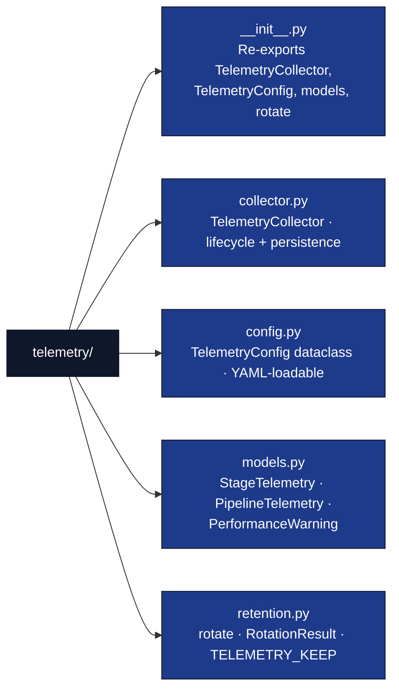

# 🤖 AGENTS.md — infrastructure/core/telemetry/

## Purpose

Unified pipeline telemetry: bridges per-stage resource tracking (CPU, memory, I/O) with diagnostic event aggregation into a single `TelemetryCollector` that produces structured `PipelineTelemetry` reports.

## Module Structure



## Key Classes

| Class | File | Responsibility |
| --- | --- | --- |
| `TelemetryConfig` | `config.py` | Configuration surface; loadable from `pipeline.yaml` |
| `TelemetryCollector` | `collector.py` | Stage lifecycle tracking, warning detection, report persistence |
| `StageTelemetry` | `models.py` | Per-stage metrics: timing, resources, diagnostic counts |
| `PipelineTelemetry` | `models.py` | Full pipeline report with warnings and system info |
| `PerformanceWarning` | `models.py` | Individual anomaly (slow stage / high memory / high CPU) |
| `RotationResult` | `retention.py` | Frozen dataclass: `archived`, `pruned`, `kept` counts |

## Public API

| Function | Module | Purpose |
| --- | --- | --- |
| `rotate(reports_dir, *, keep=10, archive_subdir=".history") -> RotationResult` | `retention.py` | Move the previous run's `telemetry.json` into `<reports_dir>/<archive_subdir>/telemetry-<ts>.json` and prune archived files beyond `keep`. Idempotent. Honors `TELEMETRY_KEEP` env var when called from `TelemetryCollector._persist_report()`. |

## Integration Points

- **`PipelineExecutor`** (`executor.py`): Instantiates `TelemetryCollector` in `__init__`, calls `start_stage()`/`end_stage()` in `_execute_stage()`, calls `finalize()` after `_execute_pipeline()`.
- **`pipeline.yaml`**: Optional `telemetry:` block parsed by `load_telemetry_config()` in `dag.py`.
- **`DiagnosticReporter`** (`core/logging/diagnostic.py`): Passed to collector for per-stage event counting.

## Configuration (pipeline.yaml)

```yaml
telemetry:
  enabled: true
  track_resources: true
  track_diagnostics: true
  output_formats: [json, text]
  persist_report: true
  slow_stage_multiplier: 2.0
  high_memory_mb: 1024
  high_cpu_percent: 90.0
```

## Output Files

| File | Format | Contents |
| --- | --- | --- |
| `reports/telemetry.json` | JSON | Full structured report (current run) |
| `reports/telemetry.txt` | Text | Human-readable summary table (current run) |
| `reports/.history/telemetry-<unix_ts>.json` | JSON | Archived prior runs, oldest pruned beyond `TELEMETRY_KEEP` |

## Retention

| Env var | Default | Behaviour |
| --- | --- | --- |
| `TELEMETRY_KEEP` | `10` | Maximum archived `telemetry.json` files retained in `<reports_dir>/.history/`. `0` = archive then prune everything. Negative or non-integer values fall back to the default. |

The collector calls `rotate()` from `_persist_report()` *before* writing
the new report so the in-flight file is never affected. Failures inside
`rotate()` are logged at WARNING and never block the new write.

## Testing

Tests:
- `tests/infra_tests/core/test_telemetry.py` — 21 tests, Zero-Mock.
- `tests/infra_tests/core/telemetry/test_retention.py` — 10 tests for `rotate()` (synthetic 12-run pruning, idempotence, edge cases, collision handling, end-to-end collector integration).
