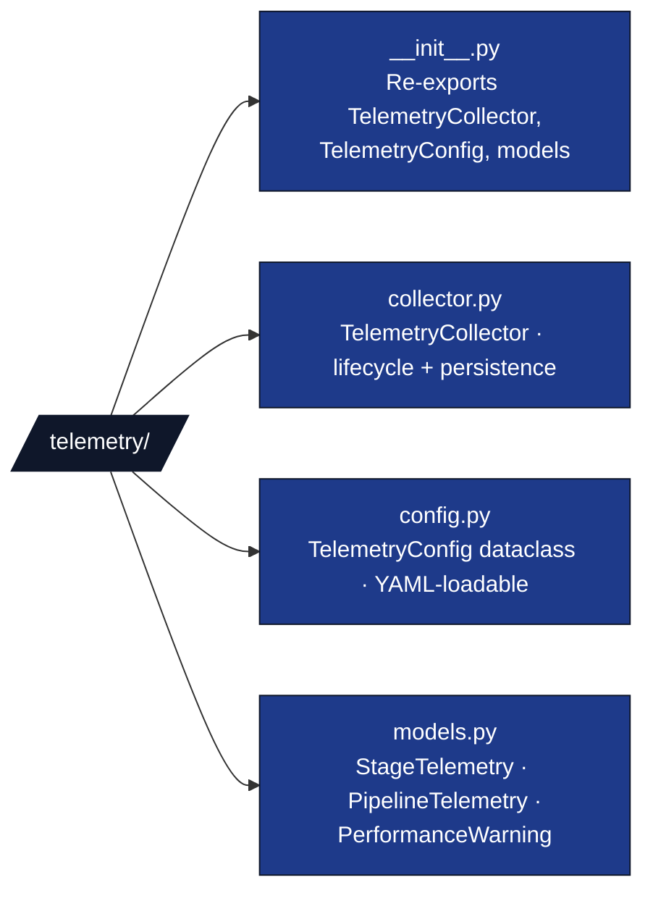

# 🤖 AGENTS.md — infrastructure/core/telemetry/

## Purpose

Unified pipeline telemetry: bridges per-stage resource tracking (CPU, memory, I/O) with diagnostic event aggregation into a single `TelemetryCollector` that produces structured `PipelineTelemetry` reports.

## Module Structure



## Key Classes

| Class | File | Responsibility |
| --- | --- | --- |
| `TelemetryConfig` | `config.py` | Configuration surface; loadable from `pipeline.yaml` |
| `TelemetryCollector` | `collector.py` | Stage lifecycle tracking, warning detection, report persistence |
| `StageTelemetry` | `models.py` | Per-stage metrics: timing, resources, diagnostic counts |
| `PipelineTelemetry` | `models.py` | Full pipeline report with warnings and system info |
| `PerformanceWarning` | `models.py` | Individual anomaly (slow stage / high memory / high CPU) |

## Integration Points

- **`PipelineExecutor`** (`executor.py`): Instantiates `TelemetryCollector` in `__init__`, calls `start_stage()`/`end_stage()` in `_execute_stage()`, calls `finalize()` after `_execute_pipeline()`.
- **`pipeline.yaml`**: Optional `telemetry:` block parsed by `load_telemetry_config()` in `dag.py`.
- **`DiagnosticReporter`** (`core/logging/diagnostic.py`): Passed to collector for per-stage event counting.

## Configuration (pipeline.yaml)

```yaml
telemetry:
  enabled: true
  track_resources: true
  track_diagnostics: true
  output_formats: [json, text]
  persist_report: true
  slow_stage_multiplier: 2.0
  high_memory_mb: 1024
  high_cpu_percent: 90.0
```

## Output Files

| File | Format | Contents |
| --- | --- | --- |
| `reports/telemetry.json` | JSON | Full structured report |
| `reports/telemetry.txt` | Text | Human-readable summary table |

## Testing

Tests: `tests/infra_tests/core/test_telemetry.py` — 21 tests, Zero-Mock.
