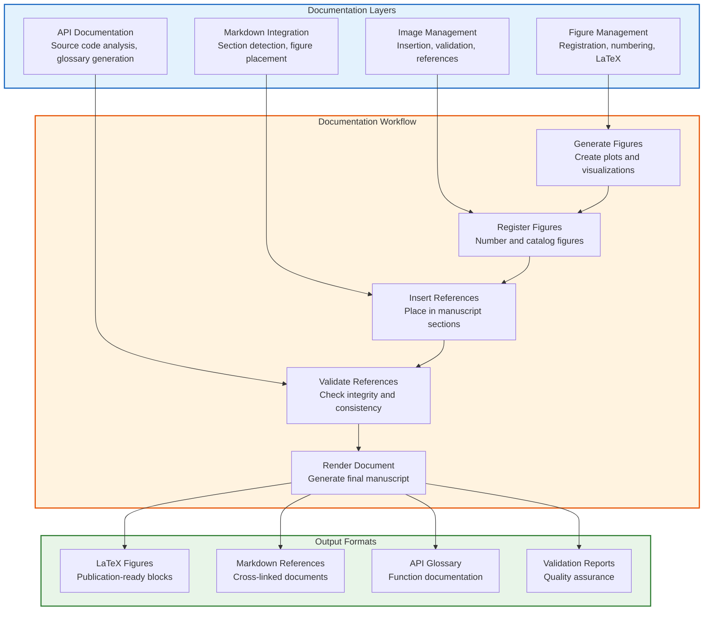
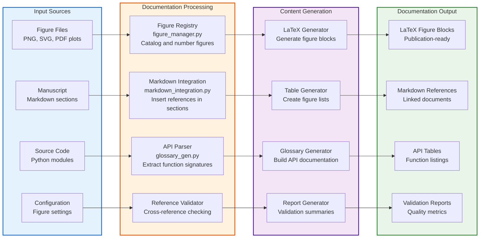

# Documentation Module - Figure and Content Management

Advanced tools for managing research figures, images, markdown integration, and automatic API documentation generation.

## Architecture Overview



## Data Flow Architecture



## Usage Patterns

```mermaid
flowchart TD
    subgraph FigureWorkflow["Figure Management Workflow"]
        A[Generate Plot<br/>Create visualization]
        B[Register Figure<br/>FigureManager.register_figure()]
        C[Generate LaTeX<br/>FigureManager.generate_latex_figure_block()]
        D[Insert Reference<br/>ImageManager.insert_figure()]
        E[Validate References<br/>ImageManager.validate_figure_references()]
        F[Render Document<br/>Include in manuscript]
    end

    subgraph APIWorkflow["API Documentation Workflow"]
        G[Parse Source<br/>build_api_index()]
        H[Generate Table<br/>generate_markdown_table()]
        I[Inject Content<br/>inject_between_markers()]
        J[Update Glossary<br/>Replace markers in manuscript]
        K[Validate Links<br/>Check cross-references]
    end

    subgraph IntegrationWorkflow["Manuscript Integration"]
        L[Detect Sections<br/>MarkdownIntegration.detect_sections()]
        M[Insert Figures<br/>insert_figure_in_section()]
        N[Update References<br/>update_cross_references()]
        O[Generate ToF<br/>generate_table_of_figures()]
        P[Validate Manuscript<br/>validate_manuscript()]
    end

    A --> B --> C --> D --> E --> F
    G --> H --> I --> J --> K
    L --> M --> N --> O --> P

    classDef figure fill:#e3f2fd,stroke:#1565c0,stroke-width:2px
    classDef api fill:#fff3e0,stroke:#e65100,stroke-width:2px
    classDef integration fill:#e8f5e8,stroke:#2e7d32,stroke-width:2px

    class FigureWorkflow figure
    class APIWorkflow api
    class IntegrationWorkflow integration
```

## Quick Start

```python
from infrastructure.documentation import (
    FigureManager,
    ImageManager,
    MarkdownIntegration,
    build_api_index,
    generate_markdown_table,
    inject_between_markers
)

# Figure management workflow
fm = FigureManager()
im = ImageManager(fm)
mi = MarkdownIntegration(Path("manuscript"))

# 1. Register figure with automatic numbering
metadata = fm.register_figure(
    filename="convergence_plot.png",
    caption="Algorithm convergence over iterations",
    label="fig:convergence",  # or auto-generated if None
    section="Results"
)

# 2. Generate LaTeX figure block for publication
latex_block = fm.generate_latex_figure_block(
    "fig:convergence",
    width=0.8,  # 80% of text width
    placement="h"  # 'here' placement
)

# 3. Insert figure reference into markdown manuscript
success = im.insert_figure(
    Path("manuscript/03_results.md"),
    "fig:convergence",
    section="Results"  # Insert in specific section
)

# 4. Generate API documentation
entries = build_api_index("src/")
api_table = generate_markdown_table(entries)

# 5. Inject API documentation into manuscript
updated_content = inject_between_markers(
    manuscript_content,
    "<!-- API_GLOSSARY_BEGIN -->",
    "<!-- API_GLOSSARY_END -->",
    api_table
)

# 6. Generate table of figures
mi.generate_table_of_figures(
    Path("manuscript/table_of_figures.md"),
    format="markdown"
)

# 7. Validate entire manuscript
validation_results = mi.validate_manuscript()
if validation_results['errors']:
    print("Manuscript validation errors:", validation_results['errors'])
```

## Module Organization

| Module | Purpose | Key Classes/Functions | Integration Point |
|--------|---------|----------------------|------------------|
| **figure_manager.py** | Figure registration and LaTeX generation | `FigureManager`, `FigureMetadata` | Build pipeline figure numbering |
| **image_manager.py** | Image insertion and validation | `ImageManager` | Markdown manuscript updates |
| **markdown_integration.py** | Section-aware figure placement | `MarkdownIntegration` | Manuscript structure management |
| **glossary_gen.py** | API documentation from source | `build_api_index()`, `generate_markdown_table()` | Automatic glossary generation |
| **generate_glossary_cli.py** | CLI for glossary generation | `main()` | Pipeline integration script |

## Figure Management

### Figure Registration and Numbering

```python
# Automatic figure numbering and registry management
fm = FigureManager()

# Register with automatic label generation
metadata = fm.register_figure(
    filename="experiment_results.png",
    caption="Experimental results showing statistical significance",
    section="Results"  # Used for organization
)
print(f"Figure registered with label: {metadata.label}")
print(f"Figure number: {metadata.number}")

# Manual label specification
metadata2 = fm.register_figure(
    filename="methodology_diagram.png",
    caption="Research methodology overview",
    label="fig:methodology",
    section="Methods"
)
```

### LaTeX Figure Block Generation

```python
# Generate publication-ready LaTeX figure blocks
latex_code = fm.generate_latex_figure_block(
    "fig:results",
    width=0.9,        # 90% of text width
    placement="htbp"  # LaTeX placement options
)

print(latex_code)
# Output:
# \begin{figure}[htbp]
#     \centering
#     \includegraphics[width=0.9\textwidth]{experiment_results.png}
#     \caption{Experimental results showing statistical significance}
#     \label{fig:results}
# \end{figure}
```

### Figure Registry Persistence

```python
# Persistent figure registry across pipeline runs
fm = FigureManager()  # Loads existing registry if available

# Registry is automatically saved to JSON
fm.save_registry()  # Manual save
fm.load_registry()  # Manual load

# Get registry statistics
stats = fm.get_statistics()
print(f"Total figures: {stats['total_figures']}")
print(f"Figures by section: {stats['by_section']}")
```

## Markdown Integration System

### Section-Aware Figure Insertion

```python
# Intelligent figure placement in manuscript sections
mi = MarkdownIntegration(Path("manuscript"))

# Detect available sections in manuscript
sections = mi.detect_sections(Path("manuscript/03_results.md"))
print(f"Available sections: {sections}")

# Insert figure in specific section
success = mi.insert_figure_in_section(
    Path("manuscript/03_results.md"),
    "fig:convergence",
    "Results",  # Section name
    width=0.8
)

# Update cross-references across all manuscript files
markdown_files = [
    Path("manuscript/01_abstract.md"),
    Path("manuscript/02_introduction.md"),
    Path("manuscript/03_results.md")
]
mi.update_cross_references(markdown_files)
```

### Table of Figures Generation

```python
# Automatic table of figures creation
mi.generate_table_of_figures(
    Path("manuscript/table_of_figures.md"),
    format="markdown"  # or "latex"
)

# Markdown format output:
# # Table of Figures
#
# 1. Figure 1: Experimental results showing statistical significance (Results)
# 2. Figure 2: Research methodology overview (Methods)
# 3. Figure 3: Algorithm convergence over iterations (Results)
```

### Manuscript Validation

```python
# manuscript validation
validation = mi.validate_manuscript()

print("Validation Results:")
print(f"Total sections: {validation['total_sections']}")
print(f"Figures referenced: {validation['figures_referenced']}")
print(f"Cross-references: {validation['cross_references']}")

if validation['errors']:
    print("Errors found:")
    for error in validation['errors']:
        print(f"  - {error}")

if validation['warnings']:
    print("Warnings:")
    for warning in validation['warnings']:
        print(f"  - {warning}")
```

## API Documentation Generation

### Source Code Analysis

```python
# Extract public API from Python source code
entries = build_api_index("src/")

print(f"Found {len(entries)} API entries")

for entry in entries[:5]:  # Show first 5
    print(f"{entry.kind}: {entry.name}")
    print(f"  Module: {entry.module}")
    print(f"  Signature: {entry.signature}")
    if entry.docstring:
        print(f"  Description: {entry.docstring[:100]}...")
    print()
```

### Markdown Table Generation

```python
# Generate publication-ready API documentation
api_table = generate_markdown_table(entries)

# Output format:
# | Function/Class | Module | Description |
# |----------------|--------|-------------|
# | `analyze_data()` | `data_processing` | Performs statistical analysis of experimental data |
# | `DataProcessor` | `data_processing` | Main class for data processing operations |
```

### Content Injection

```python
# Inject API documentation into manuscript
manuscript_content = """
# API Reference

<!-- API_GLOSSARY_BEGIN -->
<!-- This content will be automatically replaced -->
<!-- API_GLOSSARY_END -->

# Implementation Details
"""

updated_content = inject_between_markers(
    manuscript_content,
    "<!-- API_GLOSSARY_BEGIN -->",
    "<!-- API_GLOSSARY_END -->",
    api_table
)
```

## CLI Integration

### Figure Registry Management

```bash
# Generate API glossary for manuscript
python3 infrastructure/documentation/generate_glossary_cli.py

# This updates manuscript/98_symbols_glossary.md with current API
```

### Pipeline Integration

The documentation module integrates with the build pipeline:

```bash
# scripts/02_run_analysis.py - Figure generation and registration
python3 scripts/02_run_analysis.py --project project
# - Runs project figure generation scripts
# - Registers generated figures automatically

# scripts/03_render_pdf.py - Documentation generation
python3 scripts/03_render_pdf.py --project project
# - Generates API glossary
# - Updates manuscript with current documentation
```

## Advanced Features

### Figure Statistics and Analytics

```python
# Collect figure statistics
stats = mi.collect_figure_statistics()

print("Figure Statistics:")
print(f"Total figures: {stats['total_figures']}")
print(f"Figures by section: {stats['by_section']}")
print(f"Most referenced: {stats['most_referenced']}")
print(f"Average figures per section: {stats['avg_per_section']}")
```

### Cross-Reference Validation

```python
# Validate all figure references in manuscript
im = ImageManager(fm)

errors = im.validate_figure_references(
    Path("manuscript/complete_manuscript.md"),
    available_labels=fm.get_all_labels()
)

if errors:
    print("Reference validation errors:")
    for error in errors:
        print(f"  - {error}")
```

### Registry Management

```python
# Advanced registry operations
fm = FigureManager()

# Bulk operations
all_figures = fm.get_all_figures()
figures_by_section = fm.get_figures_by_section("Results")

# Registry maintenance
fm.clear_registry()  # Reset for fresh build
fm.backup_registry()  # Create backup before major changes

# Export for external tools
registry_data = fm.export_registry(format="json")
```

## Configuration

### Figure Registry Location

```python
# Custom registry file location
fm = FigureManager(
    registry_file=Path("output/figures/custom_registry.json")
)
```

### Manuscript Integration Settings

```python
# Configure manuscript integration
mi = MarkdownIntegration(
    manuscript_dir=Path("manuscript"),
    figure_section_marker="#",  # Section header marker
    reference_format="markdown"  # or "latex"
)
```

## Testing

```bash
# Run all documentation tests
pytest tests/infrastructure/test_documentation/ -v

# Test specific components
pytest tests/infrastructure/test_documentation/test_figure_manager.py -v
pytest tests/infrastructure/test_documentation/test_glossary_gen.py -v

# Integration tests
pytest tests/integration/test_documentation_pipeline.py -v

# With coverage
pytest tests/infrastructure/test_documentation/ --cov=infrastructure.documentation --cov-report=html
```

## Performance Considerations

### Large Manuscript Handling

- **Streaming Processing**: Process large manuscripts without loading entirely
- **Incremental Updates**: Update only changed sections
- **Caching**: Cache figure registry and API index
- **Parallel Processing**: Process multiple files concurrently

### Memory Optimization

- **Lazy Loading**: Load figure registry on demand
- **Garbage Collection**: Clean up temporary objects
- **File Streaming**: Process large files in chunks

## Troubleshooting

### Figure Registration Issues

**Problem**: Figures not appearing in registry
```python
# Check registry file permissions
registry_path = fm.registry_file
print(f"Registry path: {registry_path}")
print(f"Writable: {registry_path.parent.exists() and os.access(registry_path.parent, os.W_OK)}")

# Manual registry inspection
registry_data = fm.export_registry()
print(f"Registered figures: {len(registry_data)}")
```

**Problem**: Figure numbering incorrect
```python
# Check for duplicate labels
all_labels = fm.get_all_labels()
duplicates = [label for label in all_labels if all_labels.count(label) > 1]
if duplicates:
    print(f"Duplicate labels: {duplicates}")

# Reset numbering
fm.clear_registry()
# Re-register figures in desired order
```

### Markdown Integration Problems

**Problem**: Figures not inserted in correct sections
```python
# Debug section detection
sections = mi.detect_sections(markdown_file)
print(f"Detected sections: {sections}")

# Check section name matching
target_section = "Results"
if target_section not in sections:
    print(f"Section '{target_section}' not found")
    print("Available sections:", sections)
```

**Problem**: Cross-references not updating
```python
# Manual cross-reference update
files_to_update = [Path("manuscript/01_intro.md"), Path("manuscript/03_results.md")]
success = mi.update_cross_references(files_to_update)
print(f"Cross-reference update: {'successful' if success else 'failed'}")
```

### API Documentation Issues

**Problem**: API index incomplete or empty
```python
# Debug source directory scanning
src_dir = "src"
if not Path(src_dir).exists():
    print(f"Source directory '{src_dir}' does not exist")

# Check Python files
py_files = list(Path(src_dir).rglob("*.py"))
print(f"Found {len(py_files)} Python files")

# Test AST parsing
try:
    entries = build_api_index(src_dir)
    print(f"Successfully parsed {len(entries)} API entries")
except Exception as e:
    print(f"AST parsing failed: {e}")
```

## Best Practices

### Figure Management

- **Consistent Naming**: Use descriptive, consistent figure labels
- **Early Registration**: Register figures immediately after generation
- **Version Control**: Commit figure registry for reproducibility
- **Documentation**: Document figure generation parameters

### API Documentation

- **Docstrings**: Ensure all public functions have docstrings
- **Type Hints**: Use type annotations for better documentation
- **Examples**: Include usage examples in docstrings
- **Regular Updates**: Keep API documentation current with code changes

### Manuscript Integration

- **Section Structure**: Maintain consistent section naming conventions
- **Reference Validation**: Validate references before final rendering
- **Incremental Updates**: Update documentation incrementally, not all at once
- **Backup Strategy**: Backup manuscripts before automated updates

### Performance Optimization

- **Batch Operations**: Process multiple figures/documents together
- **Caching Strategy**: Cache expensive operations (API parsing, figure generation)
- **Selective Updates**: Update only changed content
- **Resource Monitoring**: Monitor memory and disk usage for large projects

For detailed function signatures and API documentation, see [AGENTS.md](AGENTS.md).

## Key Classes

### FigureManager
- `register_figure()` - Register with automatic numbering
- `generate_latex_figure_block()` - LaTeX code generation
- `generate_reference()` - Cross-reference generation
- `get_all_figures()` - Retrieve registered figures

### ImageManager
- `insert_figure()` - Insert figure into markdown
- `insert_reference()` - Add figure reference
- `validate_figures()` - Check figure integrity
- `get_figure_list()` - Get referenced figures

### MarkdownIntegration
- `detect_sections()` - Find markdown sections
- `insert_figure_in_section()` - Insert figure in section
- `generate_table_of_figures()` - Create figure listing
- `update_all_references()` - Sync all references
- `validate_manuscript()` - Check document integrity

## Key Functions

### API Documentation
- `build_api_index(src_dir)` - Parse source for public APIs
- `generate_markdown_table(entries)` - Create Markdown table
- `inject_between_markers()` - Update content sections

## API Glossary Generation

The module includes a script for generating API documentation:

```bash
# Generate API glossary from source code
python3 infrastructure/documentation/generate_glossary_cli.py
```

This script automatically scans `projects/{name}/src/` for public APIs and updates `projects/{name}/manuscript/98_symbols_glossary.md`.

## Testing

```bash
pytest tests/infrastructure/test_documentation/
```

For detailed documentation, see [AGENTS.md](AGENTS.md).

