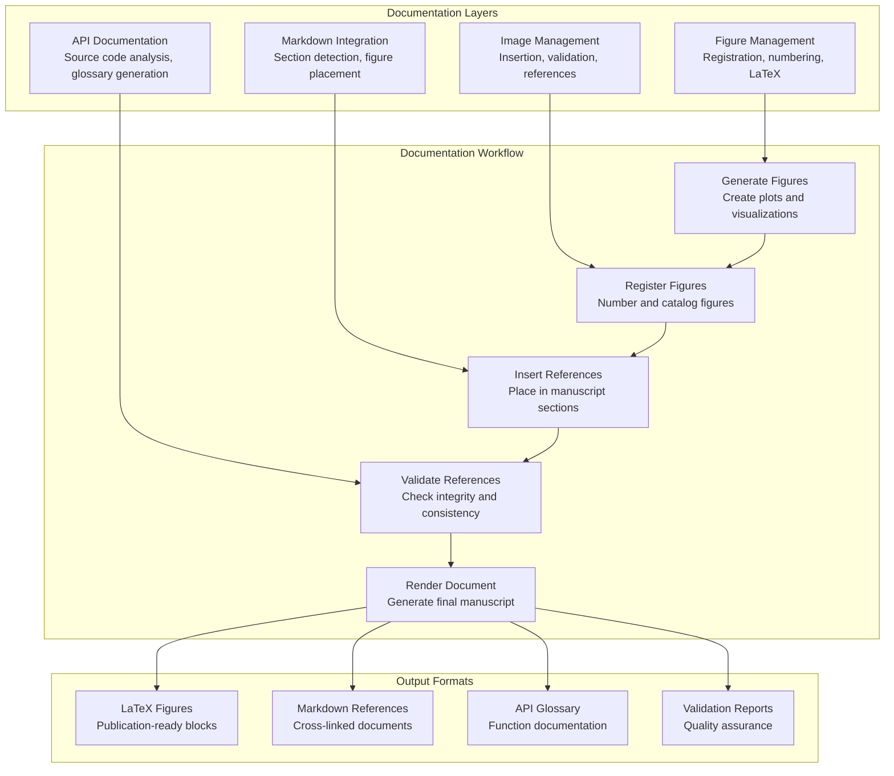
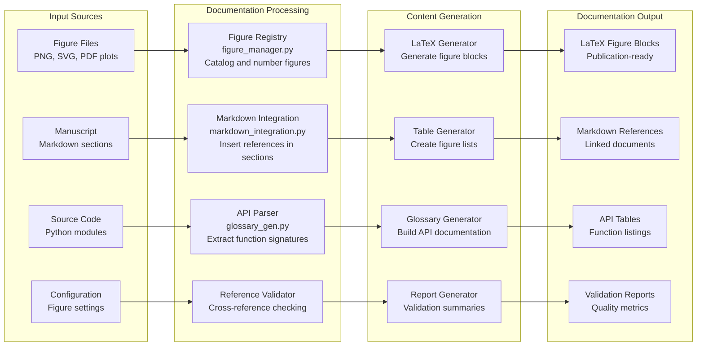

# Documentation Module - Figure and Content Management

Advanced tools for managing research figures, images, markdown integration, and automatic API documentation generation.

## Architecture Overview


```mermaid
graph TD
    subgraph DocumentationLayers["Documentation Layers"]
        FIGURE[Figure Management<br/>Registration, numbering, LaTeX]
        IMAGE[Image Management<br/>Insertion, validation, references]
        MARKDOWN[Markdown Integration<br/>Section detection, figure placement]
        API[API Documentation<br/>Source code analysis, glossary generation]
    end

    subgraph DocumentationWorkflow["Documentation Workflow"]
        GENERATE[Generate Figures<br/>Create plots and visualizations]
        REGISTER[Register Figures<br/>Number and catalog figures]
        INSERT[Insert References<br/>Place in manuscript sections]
        VALIDATE[Validate References<br/>Check integrity and consistency]
        RENDER[Render Document<br/>Generate final manuscript]
    end

    subgraph DocumentationOutput["Output Formats"]
        LATEX[LaTeX Figures<br/>Publication-ready blocks]
        MARKDOWN_MD[Markdown References<br/>Cross-linked documents]
        GLOSSARY[API Glossary<br/>Function documentation]
        REPORTS[Validation Reports<br/>Quality assurance]
    end

    FIGURE --> GENERATE
    IMAGE --> REGISTER
    MARKDOWN --> INSERT
    API --> VALIDATE

    GENERATE --> REGISTER
    REGISTER --> INSERT
    INSERT --> VALIDATE
    VALIDATE --> RENDER

    RENDER --> LATEX
    RENDER --> MARKDOWN_MD
    RENDER --> GLOSSARY
    RENDER --> REPORTS

    class DocumentationLayers layers
    class DocumentationWorkflow workflow
    class DocumentationOutput output
```

## Data Flow Architecture


```mermaid
flowchart LR
    subgraph Sources["Input Sources"]
        FIGURES[Figure Files<br/>PNG, SVG, PDF plots]
        SRC_CODE[Source Code<br/>Python modules]
        MANUSCRIPT[Manuscript<br/>Markdown sections]
        CONFIG[Configuration<br/>Figure settings]
    end

    subgraph Processing["Documentation Processing"]
        REGISTRY[Figure Registry<br/>figure_manager.py<br/>Catalog and number figures]
        INTEGRATION[Markdown Integration<br/>markdown_integration.py<br/>Insert references in sections]
        API_PARSER[API Parser<br/>glossary_gen.py<br/>Extract function signatures]
        VALIDATOR[Reference Validator<br/>Cross-reference checking]
    end

    subgraph Generation["Content Generation"]
        LATEX_GEN[LaTeX Generator<br/>Generate figure blocks]
        TABLE_GEN[Table Generator<br/>Create figure lists]
        GLOSSARY_GEN[Glossary Generator<br/>Build API documentation]
        REPORT_GEN[Report Generator<br/>Validation summaries]
    end

    subgraph Output["Documentation Output"]
        LATEX_BLOCKS[LaTeX Figure Blocks<br/>Publication-ready]
        MD_REFS[Markdown References<br/>Linked documents]
        API_TABLES[API Tables<br/>Function listings]
        VALIDATION[Validation Reports<br/>Quality metrics]
    end

    FIGURES --> REGISTRY
    SRC_CODE --> API_PARSER
    MANUSCRIPT --> INTEGRATION
    CONFIG --> VALIDATOR

    REGISTRY --> LATEX_GEN
    INTEGRATION --> TABLE_GEN
    API_PARSER --> GLOSSARY_GEN
    VALIDATOR --> REPORT_GEN

    LATEX_GEN --> LATEX_BLOCKS
    TABLE_GEN --> MD_REFS
    GLOSSARY_GEN --> API_TABLES
    REPORT_GEN --> VALIDATION

    class Sources sources
    class Processing processing
    class Generation generation
    class Output output
```

## Usage Patterns


```mermaid
flowchart TD
    subgraph FigureWorkflow["Figure Management Workflow"]
        A[Generate Plot<br/>Create visualization]
        B["Register Figure<br/>FigureManager.register_figure"]
        C["Generate LaTeX<br/>FigureManager.generate_latex_figure_block"]
        D["Insert Reference<br/>ImageManager.insert_figure"]
        E["Validate References<br/>ImageManager.validate_figures"]
        F[Render Document<br/>Include in manuscript]
    end

    subgraph APIWorkflow["API Documentation Workflow"]
        G["Parse Source<br/>build_api_index"]
        H["Generate Table<br/>generate_markdown_table"]
        I["Inject Content<br/>inject_between_markers"]
        J["Update Glossary<br/>Replace markers in manuscript"]
        K["Validate Links<br/>Check cross-references"]
    end

    subgraph IntegrationWorkflow["Manuscript Integration"]
        L["Detect Sections<br/>MarkdownIntegration.detect_sections"]
        M["Insert Figures<br/>insert_figure_in_section"]
        N["Update References<br/>update_all_references"]
        O["Generate ToF<br/>generate_table_of_figures"]
        P["Validate Manuscript<br/>validate_manuscript"]
    end

    A --> B --> C --> D --> E --> F
    G --> H --> I --> J --> K
    L --> M --> N --> O --> P

    class FigureWorkflow figure
    class APIWorkflow api
    class IntegrationWorkflow integration
```

## Quick Start

```python
from pathlib import Path

from infrastructure.documentation import (
    FigureManager,
    ImageManager,
    MarkdownIntegration,
    build_api_index,
    generate_markdown_table,
)
from infrastructure.documentation.glossary_gen import inject_between_markers

# Figure management workflow
fm = FigureManager()
im = ImageManager(fm)
mi = MarkdownIntegration(Path("manuscript"))

# 1. Register figure with automatic numbering
metadata = fm.register_figure(
    filename="convergence_plot.png",
    caption="Algorithm convergence over iterations",
    label="fig:convergence",  # or auto-generated if None
    section="Results"
)

# 2. Generate LaTeX figure block for publication
#    (width/placement come from the registered FigureMetadata)
latex_block = fm.generate_latex_figure_block("fig:convergence")

# 3. Insert figure reference into markdown manuscript
success = im.insert_figure(
    Path("manuscript/03_results.md"),
    "fig:convergence",
    section="Results"  # Insert in specific section
)

# 4. Generate API documentation
entries = build_api_index("src/")
api_table = generate_markdown_table(entries)

# 5. Inject API documentation into manuscript
updated_content = inject_between_markers(
    manuscript_content,
    "<!-- API_GLOSSARY_BEGIN -->",
    "<!-- API_GLOSSARY_END -->",
    api_table
)

# 6. Generate table of figures (returns the written Path)
mi.generate_table_of_figures(Path("manuscript/00_table_of_figures.md"))

# 7. Validate entire manuscript
#    Returns {file_path: [(label, error), ...]} for files with errors.
validation_results = mi.validate_manuscript()
for md_path, errors in validation_results.items():
    print(f"{md_path}:")
    for label, error in errors:
        print(f"  - {label}: {error}")
```

## Module Organization

| Module | Purpose | Key Classes/Functions | Integration Point |
|--------|---------|----------------------|------------------|
| **figure_manager.py** | Stateful figure registration and LaTeX generation | `FigureManager`, `FigureMetadata` | Interactive figure numbering |
| **generated_figure_registry.py** | Deterministic fail-closed figure publication and registry persistence | `build_generated_figure_registry`, `publish_generated_figures`, `write_generated_figure_registry` | Project analysis pipelines |
| **image_manager.py** | Image insertion and validation | `ImageManager` | Markdown manuscript updates |
| **markdown_integration.py** | Section-aware figure placement | `MarkdownIntegration` | Manuscript structure management |
| **glossary_gen.py** | API documentation from source | `build_api_index()`, `generate_markdown_table()` | Automatic glossary generation |
| **generate_glossary_cli.py** | CLI for glossary generation | `main()` | Pipeline integration script |
| **architecture_overview.py** | One-page architecture diagram from live repo state | `build_architecture_mermaid()`, `render_architecture_svg()` | Driven by `scripts/docgen/architecture_overview.py` |
| **active_projects_doc.py** | Render the authoritative public active-projects doc | `render_active_projects_doc()`, `write_active_projects_doc()` | Generates `docs/_generated/active_projects.md` |
| **publication_records.py** | Load/render project publication metadata (DOIs, archives) | `PublicationRecord`, `load_publication_records()`, `render_publication_records_doc()`, `refresh_external_records()` | Publication doc + GitHub README block |
| **publication_standalone.py** | Render and update source-owned publication identity blocks | `render_standalone_publication_block()`, `replace_standalone_publication_block()`, `extract_standalone_publication_block()` | Every canonical exemplar's `STANDALONE.md` |

## Figure Management

### Figure Registration and Numbering

```python
# Automatic figure numbering and registry management
fm = FigureManager()

# Register with automatic label generation
metadata = fm.register_figure(
    filename="experiment_results.png",
    caption="Experimental results showing statistical significance",
    section="Results"  # Used for organization
)
print(f"Figure registered with label: {metadata.label}")
print(f"Figure id: {metadata.figure_id}")

# Manual label specification
metadata2 = fm.register_figure(
    filename="methodology_diagram.png",
    caption="Research methodology overview",
    label="fig:methodology",
    section="Methods"
)
```

### LaTeX Figure Block Generation

```python
# Generate publication-ready LaTeX figure blocks.
# Width/placement are taken from the registered FigureMetadata
# (set them at register_figure() time via width=/placement=).
latex_code = fm.generate_latex_figure_block("fig:results")

print(latex_code)
# Output:
# \begin{figure}[h]
#     \centering
#     \includegraphics[width=0.8\textwidth]{../output/figures/experiment_results.png}
#     \caption{Experimental results showing statistical significance}
#     \label{fig:results}
# \end{figure}
```

### Figure Registry Persistence

```python
# Persistent figure registry across pipeline runs.
# FigureManager loads the existing registry on construction and saves
# automatically after each register_figure() call (atomic JSON write).
fm = FigureManager()  # Loads existing registry if available

# Inspect all registered figures
for fig in fm.get_all_figures():
    print(f"{fig.figure_id}: {fig.label} ({fig.section})")

# Aggregate statistics live on MarkdownIntegration
mi = MarkdownIntegration(Path("manuscript"), fm)
stats = mi.get_figure_statistics()
print(f"Total figures: {stats['total_figures']}")
print(f"Figures by section: {stats['figures_by_section']}")
```

## Markdown Integration System

### Section-Aware Figure Insertion

```python
# Intelligent figure placement in manuscript sections
mi = MarkdownIntegration(Path("manuscript"))

# Detect available sections in manuscript
# (returns dicts with keys: name, level, anchor, position, line_number)
sections = mi.detect_sections(Path("manuscript/03_results.md"))
print(f"Available sections: {[s['name'] for s in sections]}")

# Insert figure in specific section
success = mi.insert_figure_in_section(
    Path("manuscript/03_results.md"),
    "fig:convergence",
    "Results",       # Section name
    position="after"  # before | after
)

# Update figure references within a single manuscript file
# (returns the number of references added)
markdown_files = [
    Path("manuscript/01_abstract.md"),
    Path("manuscript/02_introduction.md"),
    Path("manuscript/03_results.md"),
]
for md in markdown_files:
    mi.update_all_references(md)
```

### Table of Figures Generation

```python
# Automatic table of figures creation (Markdown; returns the written Path).
# With no argument it defaults to manuscript_dir/00_table_of_figures.md.
mi.generate_table_of_figures(Path("manuscript/00_table_of_figures.md"))

# Markdown output (one section per figure):
# # Table of Figures
#
# ## fig:results
# **Caption**: Experimental results showing statistical significance
# **Section**: Results
# **File**: `experiment_results.png`
```

### Manuscript Validation

```python
# Manuscript validation.
# Returns {file_path: [(label, error), ...]} for files that have errors;
# an empty dict means every figure validated cleanly.
validation = mi.validate_manuscript()

if not validation:
    print("All figures validated cleanly.")
else:
    print("Validation Results:")
    for md_path, errors in validation.items():
        print(f"{md_path}:")
        for label, error in errors:
            print(f"  - {label}: {error}")
```

## API Documentation Generation

### Source Code Analysis

```python
# Extract public API from Python source code
entries = build_api_index("src/")

print(f"Found {len(entries)} API entries")

for entry in entries[:5]:  # Show first 5
    print(f"{entry.kind}: {entry.name}")
    print(f"  Module: {entry.module}")
    print(f"  Signature: {entry.signature}")
    if entry.docstring:
        print(f"  Description: {entry.docstring[:100]}...")
    print()
```

### Markdown Table Generation

```python
# Generate publication-ready API documentation
api_table = generate_markdown_table(entries)

# Output format:
# | Function/Class | Module | Description |
# |----------------|--------|-------------|
# | `analyze_data()` | `data_processing` | Performs statistical analysis of experimental data |
# | `DataProcessor` | `data_processing` | Main class for data processing operations |
```

### Content Injection

```python
# Inject API documentation into manuscript
manuscript_content = """
# API Reference

<!-- API_GLOSSARY_BEGIN -->
<!-- This content will be automatically replaced -->
<!-- API_GLOSSARY_END -->

# Implementation Details
"""

updated_content = inject_between_markers(
    manuscript_content,
    "<!-- API_GLOSSARY_BEGIN -->",
    "<!-- API_GLOSSARY_END -->",
    api_table
)
```

## CLI Integration

### Figure Registry Management

```bash
# Generate API glossary for manuscript
uv run python infrastructure/documentation/generate_glossary_cli.py

# This updates manuscript/98_symbols_glossary.md with current API
```

### Pipeline Integration

The documentation module integrates with the build pipeline:

```bash
# scripts/pipeline/stage_02_analysis.py - Figure generation and registration
uv run python scripts/pipeline/stage_02_analysis.py --project project
# - Runs project figure generation scripts
# - Registers generated figures automatically

# scripts/pipeline/stage_03_render.py - Documentation generation
uv run python scripts/pipeline/stage_03_render.py --project project
# - Generates API glossary
# - Updates manuscript with current documentation
```

## Advanced Features

### Figure Statistics and Analytics

```python
# Collect figure statistics
stats = mi.get_figure_statistics()

print("Figure Statistics:")
print(f"Total figures: {stats['total_figures']}")
print(f"Figures by section: {stats['figures_by_section']}")
print(f"Figures by generator: {stats['figures_by_generator']}")
print(f"Registered labels: {stats['registered_labels']}")
```

### Cross-Reference Validation

```python
# Validate all figure references in a markdown file.
# Returns a list of (figure_label, error_message) tuples; labels are
# checked against the ImageManager's FigureManager registry.
im = ImageManager(fm)

errors = im.validate_figures(Path("manuscript/complete_manuscript.md"))

if errors:
    print("Reference validation errors:")
    for label, error in errors:
        print(f"  - {label}: {error}")
```

### Registry Management

```python
# Registry operations
fm = FigureManager()

# Retrieve all registered figures, then filter in Python as needed
all_figures = fm.get_all_figures()
figures_by_section = [f for f in all_figures if f.section == "Results"]

# The registry is persisted automatically (atomic JSON write) on each
# register_figure() call; the on-disk file lives at fm.registry_file.
# To start fresh, delete fm.registry_file before constructing a new
# FigureManager. A corrupted registry is auto-backed-up on load.
print(f"Registry file: {fm.registry_file}")
```

## Configuration

### Figure Registry Location

```python
# Custom registry file location
fm = FigureManager(
    registry_file=Path("output/figures/custom_registry.json")
)
```

### Manuscript Integration Settings

```python
# Configure manuscript integration
# Constructor accepts manuscript_dir and an optional shared FigureManager.
mi = MarkdownIntegration(
    manuscript_dir=Path("manuscript"),
    figure_manager=FigureManager(),  # optional; a new one is created if omitted
)
```

## Testing

```bash
# Run all documentation tests
uv run pytest tests/infra_tests/documentation/ -v

# Test specific components
uv run pytest tests/infra_tests/documentation/test_figure_manager.py -v
uv run pytest tests/infra_tests/documentation/test_glossary_gen.py -v

# With coverage
uv run pytest tests/infra_tests/documentation/ --cov=infrastructure.documentation --cov-report=html
```

## Performance Considerations

### Large Manuscript Handling

- **Streaming Processing**: Process large manuscripts without loading entirely
- **Incremental Updates**: Update only changed sections
- **Caching**: Cache figure registry and API index
- **Parallel Processing**: Process multiple files concurrently

### Memory Optimization

- **Lazy Loading**: Load figure registry on demand
- **Garbage Collection**: Clean up temporary objects
- **File Streaming**: Process large files in chunks

## Troubleshooting

### Figure Registration Issues

**Problem**: Figures not appearing in registry
```python
# Check registry file permissions
registry_path = fm.registry_file
print(f"Registry path: {registry_path}")
print(f"Writable: {registry_path.parent.exists() and os.access(registry_path.parent, os.W_OK)}")

# Manual registry inspection
registry_data = fm.get_all_figures()
print(f"Registered figures: {len(registry_data)}")
```

**Problem**: Figure numbering incorrect
```python
# Check for duplicate labels
all_labels = [f.label for f in fm.get_all_figures()]
duplicates = [label for label in all_labels if all_labels.count(label) > 1]
if duplicates:
    print(f"Duplicate labels: {duplicates}")

# Reset numbering: delete the on-disk registry, then re-construct
fm.registry_file.unlink(missing_ok=True)
fm = FigureManager(registry_file=str(fm.registry_file))
# Re-register figures in desired order
```

### Markdown Integration Problems

**Problem**: Figures not inserted in correct sections
```python
# Debug section detection (detect_sections returns dicts)
sections = mi.detect_sections(markdown_file)
section_names = [s["name"] for s in sections]
print(f"Detected sections: {section_names}")

# Check section name matching
target_section = "Results"
if target_section not in section_names:
    print(f"Section '{target_section}' not found")
    print("Available sections:", section_names)
```

**Problem**: Cross-references not updating
```python
# Manual cross-reference update (per file; returns count of refs added)
files_to_update = [Path("manuscript/01_intro.md"), Path("manuscript/03_results.md")]
for md in files_to_update:
    added = mi.update_all_references(md)
    print(f"{md}: {added} reference(s) added")
```

### API Documentation Issues

**Problem**: API index incomplete or empty
```python
# Debug source directory scanning
src_dir = "src"
if not Path(src_dir).exists():
    print(f"Source directory '{src_dir}' does not exist")

# Check Python files
py_files = list(Path(src_dir).rglob("*.py"))
print(f"Found {len(py_files)} Python files")

# Test AST parsing
try:
    entries = build_api_index(src_dir)
    print(f"Successfully parsed {len(entries)} API entries")
except Exception as e:
    print(f"AST parsing failed: {e}")
```

## Best Practices

### Figure Management

- **Consistent Naming**: Use descriptive, consistent figure labels
- **Early Registration**: Register figures immediately after generation
- **Version Control**: Commit figure registry for reproducibility
- **Documentation**: Document figure generation parameters

### API Documentation

- **Docstrings**: Ensure all public functions have docstrings
- **Type Hints**: Use type annotations for better documentation
- **Examples**: Include usage examples in docstrings
- **Regular Updates**: Keep API documentation current with code changes

### Manuscript Integration

- **Section Structure**: Maintain consistent section naming conventions
- **Reference Validation**: Validate references before final rendering
- **Incremental Updates**: Update documentation incrementally, not all at once
- **Backup Strategy**: Backup manuscripts before automated updates

### Performance Optimization

- **Batch Operations**: Process multiple figures/documents together
- **Caching Strategy**: Cache expensive operations (API parsing, figure generation)
- **Selective Updates**: Update only changed content
- **Resource Monitoring**: Monitor memory and disk usage for large projects

For detailed function signatures and API documentation, see [AGENTS.md](AGENTS.md).

## Key Classes

### FigureManager
- `register_figure()` - Register with automatic numbering
- `generate_latex_figure_block()` - LaTeX code generation
- `generate_reference()` - Cross-reference generation
- `get_all_figures()` - Retrieve registered figures

### ImageManager
- `insert_figure()` - Insert figure into markdown
- `insert_reference()` - Add figure reference
- `validate_figures()` - Check figure integrity
- `get_figure_list()` - Get referenced figures

### MarkdownIntegration
- `detect_sections()` - Find markdown sections
- `insert_figure_in_section()` - Insert figure in section
- `generate_table_of_figures()` - Create figure listing
- `update_all_references()` - Sync all references
- `validate_manuscript()` - Check document integrity

## Key Functions

### API Documentation
- `build_api_index(src_dir)` - Parse source for public APIs
- `generate_markdown_table(entries)` - Create Markdown table
- `inject_between_markers()` - Update content sections

### Pipeline Stage-Table Generator
- `stage_table.build_stage_table(yaml_path)` - Render the canonical
  pipeline stage table from `infrastructure/core/pipeline/pipeline.yaml`
  (4 columns: Stage | Script | Tags | Failure mode)
- `stage_table.inject_stage_table(md_path, table)` - Replace the block
  between `<!-- BEGIN:STAGE_TABLE -->` / `<!-- END:STAGE_TABLE -->`
  in a Markdown file (idempotent)
- Driver: [`scripts/docgen/stage_table.py`](../../scripts/docgen/stage_table.py)
  updates `README.md`, `.github/README.md`, `scripts/AGENTS.md`,
  `docs/RUN_GUIDE.md`, and `docs/core/workflow.md` in lockstep

### Public API Reference Generator
- `api_reference_gen.walk_public_api(package_root)` - Parse one
  `infrastructure/<pkg>/__init__.py`, extract `__all__`, resolve each
  symbol to its source-module definition (follows re-export chains),
  and return `ModuleAPI` records (name, kind, signature, summary).
- `api_reference_gen.build_api_reference_markdown(packages)` - Render
  alphabetised per-package sections — fenced Python signatures plus
  first-line docstring as prose.
- `api_reference_gen.inject_api_reference(md_path, content)` - Replace
  the block between `<!-- BEGIN:API_REFERENCE -->` /
  `<!-- END:API_REFERENCE -->` (idempotent).
- Driver: [`scripts/docgen/api_reference.py`](../../scripts/docgen/api_reference.py)
  with `--write` (apply) and `--check` (CI gate) flags. Target:
  [`docs/reference/api-reference.md`](../../docs/reference/api-reference.md).
  Drift fails the `validate` job in `.github/workflows/ci.yml`.

## API Glossary Generation

The module includes a script for generating API documentation:

```bash
# Generate API glossary from source code
uv run python infrastructure/documentation/generate_glossary_cli.py
```

This script automatically scans `projects/{name}/src/` for public APIs and updates `projects/{name}/manuscript/98_symbols_glossary.md`.

## Testing

```bash
uv run pytest tests/infra_tests/documentation/
```

For detailed documentation, see [AGENTS.md](AGENTS.md).
