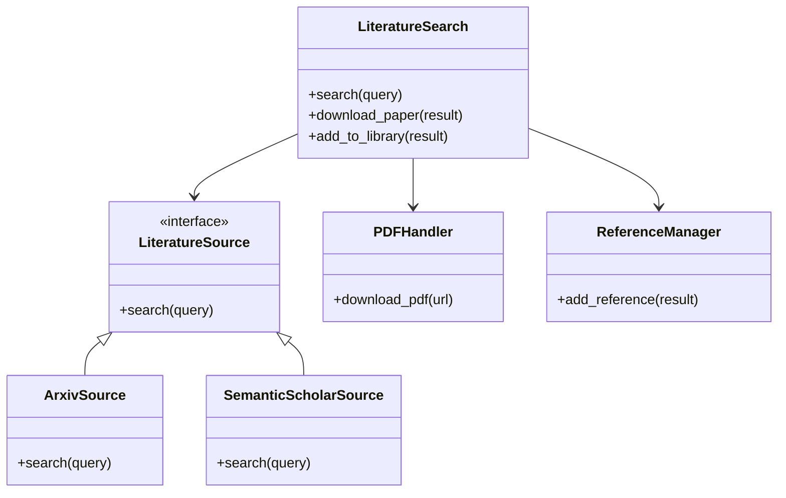

# Literature Search Module

## Purpose

The Literature Search module provides a unified interface for discovering scientific papers, managing references, and downloading full-text PDFs. It abstracts away the complexity of interacting with multiple academic databases (arXiv, Semantic Scholar, etc.) and handling different response formats.

## Architecture

This module follows the **thin orchestrator pattern**:
- **Core Logic**: Centralized in `core.py`, coordinating sources and handlers.
- **Adapters**: `api.py` contains adapters for each external API.
- **Handlers**: Specialized handlers for PDFs and references.
- **Configuration**: Centralized configuration management.

### Class Structure



## Usage

### Basic Search

```python
from infrastructure.literature import LiteratureSearch

lit = LiteratureSearch()
results = lit.search("large language models", limit=5)

for paper in results:
    print(f"{paper.title} ({paper.year})")
```

### Download and Cite

```python
# Download PDF
pdf_path = lit.download_paper(results[0])

# Add to BibTeX
citation_key = lit.add_to_library(results[0])
```

## Configuration

Configuration is managed via `LiteratureConfig` or environment variables.

| Option | Description | Default |
|--------|-------------|---------|
| `max_results` | Maximum results to return | 100 |
| `download_dir` | Directory for PDFs | `literature/pdfs` |
| `bibtex_file` | Path to BibTeX file | `literature/references.bib` |

## Sources

### arXiv
- **API**: Public API
- **Rate Limit**: 3 seconds between requests (handled automatically)
- **Features**: Full text links, primary categories

### Semantic Scholar
- **API**: Graph API
- **Auth**: Optional API key (higher limits)
- **Features**: Citation counts, influential citations

## Testing

Run tests with:
```bash
pytest tests/infrastructure/test_literature/
```

Tests use cached responses to avoid hitting external APIs during routine testing.

