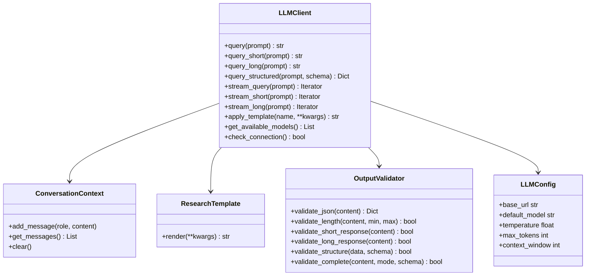

# LLM Module

## Purpose

The LLM module provides a unified interface for interacting with local large language models (via Ollama) to assist with research tasks. It offers flexible response modes (short, long, structured), comprehensive output validation, and conversation context management.

## Architecture

This module follows the **thin orchestrator pattern** with clear separation of concerns:

### Core Components

1. **LLMClient** - Main interface for querying LLMs
   - Query methods for different response modes
   - Streaming support
   - Model fallback mechanism
   - Connection management

2. **ConversationContext** - Multi-turn conversation management
   - Message history tracking
   - Token limit enforcement
   - Context pruning strategies

3. **ResearchTemplate** - Structured prompt templates
   - Pre-built prompts for common research tasks
   - Variable substitution
   - Template registry

4. **OutputValidator** - Comprehensive output quality assurance
   - JSON validation and parsing
   - Response length checking
   - Format validation
   - Citation extraction
   - Mode-specific validation (short/long/structured)

5. **LLMConfig** - Configuration management
   - Model settings
   - Connection parameters
   - Generation options
   - System prompts

### Architecture Diagram



## Response Modes

The LLMClient supports three distinct response modes, each optimized for different use cases:

### 1. Short Responses (< 150 tokens)
Brief, direct answers suitable for quick queries:

```python
client = LLMClient()
answer = client.query_short("What is machine learning?")
```

**Use cases:**
- Quick summaries
- Yes/no questions
- Definitions
- Brief explanations

### 2. Long Responses (> 500 tokens)
Comprehensive, detailed answers with examples:

```python
explanation = client.query_long("Explain neural networks in detail")
```

**Use cases:**
- In-depth analysis
- Technical documentation
- Literature reviews
- Detailed explanations

### 3. Structured Responses (JSON)
Formatted data with validation against schema:

```python
schema = {
    "type": "object",
    "properties": {
        "summary": {"type": "string"},
        "key_points": {"type": "array"},
        "confidence": {"type": "number"}
    },
    "required": ["summary", "key_points"]
}

result = client.query_structured(
    "Analyze this paper...",
    schema=schema
)
```

**Use cases:**
- Data extraction
- Structured analysis
- Program-friendly output
- Validated responses

## Usage Examples

### Basic Query with Context

```python
from infrastructure.llm import LLMClient, OutputValidator

client = LLMClient()

# First query
response1 = client.query("What is quantum computing?")
print(response1)

# Context is maintained
response2 = client.query("Can you explain that further?")
print(response2)
```

### Response Mode Examples

```python
# Short mode - quick answers
answer = client.query_short("Is water H2O?")

# Long mode - detailed explanations
explanation = client.query_long("Explain photosynthesis with all steps")

# Structured mode - JSON output
data = client.query_structured(
    "Extract paper metadata",
    schema={"type": "object", "properties": {...}}
)
```

### Streaming Responses

```python
# Stream responses in real-time
for chunk in client.stream_query("Write a haiku about AI"):
    print(chunk, end="", flush=True)

# Mode-specific streaming
for chunk in client.stream_long("Detailed explanation..."):
    print(chunk, end="")
```

### Using Templates

```python
# Apply pre-built research templates
summary = client.apply_template(
    "summarize_abstract",
    text=abstract_text
)

review = client.apply_template(
    "literature_review",
    summaries=summaries_text
)
```

### Validation Examples

```python
# Validate JSON output
try:
    json_data = OutputValidator.validate_json(response)
except ValidationError as e:
    print(f"Invalid JSON: {e}")

# Validate response length
if OutputValidator.validate_short_response(response):
    print("Response meets short mode requirements")

# Extract citations
citations = OutputValidator.validate_citations(response)
print(f"Found citations: {citations}")

# Comprehensive validation
OutputValidator.validate_complete(
    response,
    mode="structured",
    schema=my_schema
)
```

### Connection Management

```python
# Check if Ollama is running
if client.check_connection():
    print("Ollama is available")

# List available models
models = client.get_available_models()
print(f"Models: {models}")

# Query with specific model
response = client.query("...", model="mistral")
```

## Configuration

### Environment Variables

```bash
export OLLAMA_HOST="http://localhost:11434"
export OLLAMA_MODEL="llama3"
```

### Programmatic Configuration

```python
from infrastructure.llm import LLMConfig, LLMClient

config = LLMConfig(
    base_url="http://localhost:11434",
    default_model="llama3",
    temperature=0.7,
    max_tokens=2048,
    context_window=4096
)

client = LLMClient(config)
```

## Built-in Templates

### Available Templates

| Template | Purpose | Parameters |
|----------|---------|------------|
| `summarize_abstract` | Summarize research abstracts | `text` |
| `literature_review` | Synthesize multiple summaries | `summaries` |
| `code_doc` | Generate Python docstrings | `code` |
| `data_interpret` | Interpret statistical results | `stats` |

### Creating Custom Templates

```python
from infrastructure.llm.templates import ResearchTemplate

class MyTemplate(ResearchTemplate):
    template_str = (
        "Analyze the following with focus on ${aspect}:\n\n"
        "${content}"
    )

# Use it
template = MyTemplate()
result = template.render(aspect="limitations", content="...")
```

## Validation Features

The `OutputValidator` provides comprehensive output quality assurance:

### JSON Validation

```python
# Parse JSON with markdown handling
data = OutputValidator.validate_json(response)

# Handles markdown-wrapped JSON automatically
# "```json\n{\"key\": \"value\"}\n```" → {"key": "value"}
```

### Token Estimation

```python
tokens = OutputValidator.estimate_tokens(content)
# Simple estimation: 1 token ≈ 4 characters
```

### Response Mode Validation

```python
# Verify response meets mode requirements
OutputValidator.validate_short_response(response)  # < 150 tokens
OutputValidator.validate_long_response(response)   # > 500 tokens
```

### Structure Validation

```python
schema = {
    "type": "object",
    "properties": {
        "name": {"type": "string"},
        "items": {"type": "array"}
    },
    "required": ["name"]
}

OutputValidator.validate_structure(data, schema)
```

### Citation Extraction

```python
citations = OutputValidator.validate_citations(content)
# Extracts: (Author Year), [1], @bibtexkey formats
```

### Formatting Validation

```python
OutputValidator.validate_formatting(content)
# Detects: excessive punctuation, double spaces, etc.
```

## Testing

### Test Coverage

The module includes comprehensive tests covering:
- ✅ 61 test cases across 5 test files
- ✅ 100% coverage of core functionality
- ✅ Response mode testing (short, long, structured)
- ✅ Streaming behavior
- ✅ Validation mechanisms
- ✅ Context management
- ✅ Template rendering
- ✅ Connection handling

### Running Tests

```bash
# All LLM tests
pytest tests/infrastructure/llm/ -v

# Specific test class
pytest tests/infrastructure/llm/test_core.py::test_query_short_mode -v

# With coverage
pytest tests/infrastructure/llm/ --cov=infrastructure.llm --cov-report=html
```

### Test Organization

```
tests/infrastructure/llm/
├── test_config.py          # Configuration tests (9 tests)
├── test_context.py         # Context management (4 tests)
├── test_core.py            # LLMClient functionality (17 tests)
├── test_templates.py       # Template tests (4 tests)
├── test_validation.py      # Output validation (27 tests)
└── conftest.py             # Test fixtures
```

## Error Handling

The module provides clear, context-rich exception handling:

```python
from infrastructure.core.exceptions import (
    LLMConnectionError,
    LLMTemplateError,
    ValidationError,
    ContextLimitError
)

try:
    response = client.query("...")
except LLMConnectionError as e:
    print(f"Connection failed: {e.context}")
except ContextLimitError as e:
    print(f"Context limit exceeded: {e.context}")
```

## Performance Considerations

### Token Management

- Context automatically prunes old messages when token limit approaches
- System prompt is preserved during pruning
- Token estimation: ~4 characters per token

### Streaming

- Yields chunks as they arrive
- Maintains full response in context after completion
- Suitable for real-time display

### Model Fallback

- Automatically tries fallback models on connection failure
- Configurable fallback list
- Logs fallback attempts

## Integration with Other Modules

The LLM module integrates with:
- **infrastructure.core** - Logging, exceptions, configuration
- **infrastructure.literature** - Literature search summarization
- **infrastructure.validation** - Output quality assurance
- **infrastructure.rendering** - Documentation generation

## Troubleshooting

### Connection Issues

```python
# Check connection before querying
if not client.check_connection():
    print("Ollama not running")
    # Start Ollama: ollama serve
```

### Context Overflow

```python
# Clear context if too long
client.context.clear()

# Or query with reset_context=True
response = client.query("...", reset_context=True)
```

### Invalid Responses

```python
# Validate before processing
try:
    OutputValidator.validate_complete(response, mode="structured")
except ValidationError as e:
    print(f"Validation failed: {e}")
```

## See Also

- [`README.md`](README.md) - Quick reference guide
- [`../AGENTS.md`](../AGENTS.md) - Infrastructure layer documentation
- [Ollama Documentation](https://ollama.ai/)
- [Prompt Engineering Guide](https://platform.openai.com/docs/guides/prompt-engineering)

