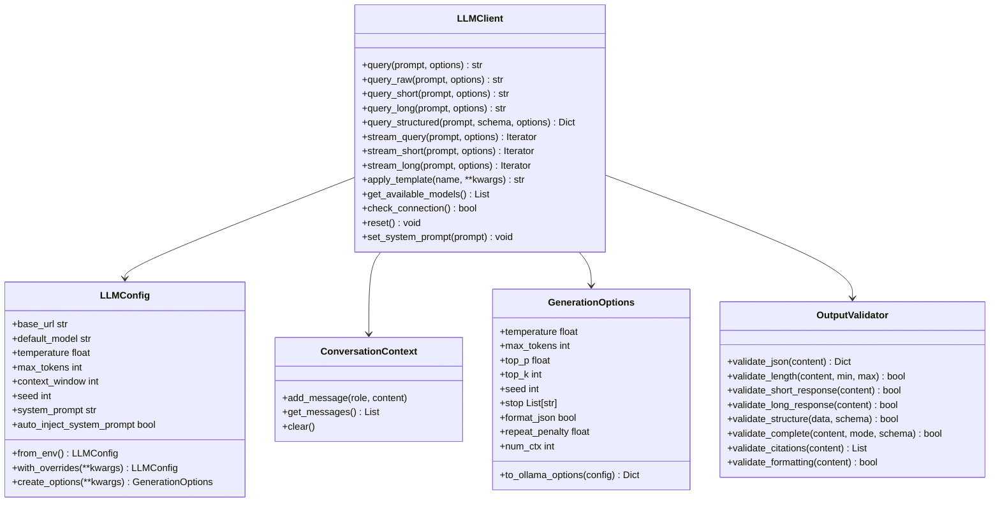

# LLM Module

## Purpose

The LLM module provides a unified interface for interacting with local large language models (via Ollama) to assist with research tasks. It offers:

- **Flexible response modes**: Short, long, structured (JSON), raw
- **Per-query configuration**: Temperature, seed, stop sequences, max_tokens
- **Comprehensive output validation**: JSON, length, structure, citations
- **Conversation context management**: System prompt injection, token limits
- **Environment-based configuration**: OLLAMA_* and LLM_* environment variables

## Architecture

This module follows the **thin orchestrator pattern** with clear separation of concerns:

### Core Components

1. **LLMClient** - Main interface for querying LLMs
   - Query methods for different response modes (short, long, structured, raw)
   - Streaming support with per-query options
   - Model fallback mechanism
   - Connection management
   - System prompt injection

2. **LLMConfig** - Configuration management
   - Environment variable loading (OLLAMA_HOST, OLLAMA_MODEL, LLM_*)
   - Model settings and generation defaults
   - Response mode token limits
   - System prompt configuration

3. **GenerationOptions** - Per-query generation control
   - Temperature, max_tokens, top_p, top_k
   - Seed for reproducibility
   - Stop sequences
   - Native JSON format mode
   - Repeat penalty, num_ctx

4. **ConversationContext** - Multi-turn conversation management
   - Message history tracking
   - Token limit enforcement
   - Context pruning strategies
   - System prompt preservation

5. **ResearchTemplate** - Structured prompt templates
   - Pre-built prompts for common research tasks
   - Variable substitution
   - Template registry

6. **OutputValidator** - Comprehensive output quality assurance
   - JSON validation and parsing
   - Response length checking
   - Format validation
   - Citation extraction
   - Mode-specific validation (short/long/structured)

### Architecture Diagram



## Configuration

### Environment Variables

The module reads configuration from environment variables:

| Variable | Default | Description |
|----------|---------|-------------|
| `OLLAMA_HOST` | `http://localhost:11434` | Ollama server URL |
| `OLLAMA_MODEL` | `llama3` | Default model name |
| `LLM_TEMPERATURE` | `0.7` | Generation temperature |
| `LLM_MAX_TOKENS` | `2048` | Maximum tokens per response |
| `LLM_CONTEXT_WINDOW` | `4096` | Context window size |
| `LLM_TIMEOUT` | `60` | Request timeout (seconds) |
| `LLM_NUM_CTX` | `None` | Ollama num_ctx parameter |
| `LLM_SEED` | `None` | Default seed for reproducibility |
| `LLM_SYSTEM_PROMPT` | Research assistant | Custom system prompt |

### Programmatic Configuration

```python
from infrastructure.llm import LLMConfig, LLMClient

config = LLMConfig(
    base_url="http://localhost:11434",
    default_model="llama3",
    temperature=0.7,
    max_tokens=2048,
    context_window=4096,
    seed=42,  # For reproducibility
    system_prompt="You are an expert research assistant.",
    auto_inject_system_prompt=True,
)

client = LLMClient(config)

# Create override configuration
fast_config = config.with_overrides(temperature=0.0, timeout=30.0)
```

## Response Modes

The LLMClient supports four distinct response modes:

### 1. Standard Query
Conversational query with context management:

```python
client = LLMClient()
response = client.query("What is quantum computing?")
# Context maintained for follow-up
response2 = client.query("Can you explain that further?")
```

### 2. Short Responses (< 150 tokens)
Brief, direct answers with limited token output:

```python
answer = client.query_short("What is machine learning?")
# Automatically limits max_tokens to short_max_tokens (200)
```

**Use cases:**
- Quick summaries
- Yes/no questions
- Definitions
- Brief explanations

### 3. Long Responses (> 500 tokens)
Comprehensive, detailed answers with extended output:

```python
explanation = client.query_long("Explain neural networks in detail")
# Automatically sets max_tokens to long_max_tokens (4096)
```

**Use cases:**
- In-depth analysis
- Technical documentation
- Literature reviews
- Detailed explanations

### 4. Structured Responses (JSON)
Formatted data with validation against schema:

```python
schema = {
    "type": "object",
    "properties": {
        "summary": {"type": "string"},
        "key_points": {"type": "array"},
        "confidence": {"type": "number"}
    },
    "required": ["summary", "key_points"]
}

result = client.query_structured(
    "Analyze this paper...",
    schema=schema,
    use_native_json=True  # Uses Ollama format="json"
)
```

**Use cases:**
- Data extraction
- Structured analysis
- Program-friendly output
- Validated responses

### 5. Raw Queries
Direct prompts without system prompt or instructions:

```python
response = client.query_raw("Complete: The quick brown fox")
# Bypasses context and system prompt
```

## Per-Query Generation Options

Control generation behavior per-query with `GenerationOptions`:

```python
from infrastructure.llm import GenerationOptions

# Deterministic output
opts = GenerationOptions(
    temperature=0.0,
    seed=42,
)
response = client.query("...", options=opts)

# Full control
opts = GenerationOptions(
    temperature=0.7,      # Creativity (0.0=deterministic, 2.0=creative)
    max_tokens=1000,      # Max output tokens (num_predict)
    top_p=0.9,            # Nucleus sampling threshold
    top_k=40,             # Top-k sampling limit
    seed=42,              # Random seed for reproducibility
    stop=["END", "STOP"], # Stop sequences
    format_json=True,     # Force JSON output (Ollama native)
    repeat_penalty=1.1,   # Penalty for repetition
    num_ctx=8192,         # Context window for this query
)
```

### Options Precedence

1. Per-query `GenerationOptions` (highest priority)
2. `LLMConfig` defaults
3. Environment variables (via `LLMConfig.from_env()`)

## System Prompt Management

### Automatic Injection

By default, the system prompt is automatically injected:

```python
config = LLMConfig(
    system_prompt="You are an expert researcher.",
    auto_inject_system_prompt=True,  # Default
)
client = LLMClient(config)
# System prompt is first message in context
```

### Manual Control

```python
# Disable automatic injection
config = LLMConfig(auto_inject_system_prompt=False)
client = LLMClient(config)

# Set new system prompt (resets context)
client.set_system_prompt("New persona...")

# Reset context and re-inject system prompt
client.reset()
```

## Streaming Responses

### Basic Streaming

```python
for chunk in client.stream_query("Write a haiku about AI"):
    print(chunk, end="", flush=True)
```

### Mode-Specific Streaming

```python
# Short mode streaming
for chunk in client.stream_short("What is X?"):
    print(chunk, end="")

# Long mode streaming
for chunk in client.stream_long("Detailed explanation..."):
    print(chunk, end="")
```

### Streaming with Options

```python
opts = GenerationOptions(temperature=0.9, seed=42)
for chunk in client.stream_query("...", options=opts):
    print(chunk, end="")
```

## Templates

### Available Templates

| Template | Purpose | Parameters |
|----------|---------|------------|
| `summarize_abstract` | Summarize research abstracts | `text` |
| `literature_review` | Synthesize multiple summaries | `summaries` |
| `code_doc` | Generate Python docstrings | `code` |
| `data_interpret` | Interpret statistical results | `stats` |

### Using Templates

```python
summary = client.apply_template(
    "summarize_abstract",
    text=abstract_text
)

review = client.apply_template(
    "literature_review",
    summaries=summaries_text
)
```

### Creating Custom Templates

```python
from infrastructure.llm.templates import ResearchTemplate

class MyTemplate(ResearchTemplate):
    template_str = (
        "Analyze the following with focus on ${aspect}:\n\n"
        "${content}"
    )

# Use it
template = MyTemplate()
result = template.render(aspect="limitations", content="...")
```

## Validation

The `OutputValidator` provides comprehensive output quality assurance:

### JSON Validation

```python
# Parse JSON with markdown handling
data = OutputValidator.validate_json(response)

# Handles markdown-wrapped JSON automatically
# "```json\n{\"key\": \"value\"}\n```" → {"key": "value"}
```

### Response Mode Validation

```python
# Verify response meets mode requirements
OutputValidator.validate_short_response(response)  # < 150 tokens
OutputValidator.validate_long_response(response)   # > 500 tokens
```

### Structure Validation

```python
schema = {
    "type": "object",
    "properties": {
        "name": {"type": "string"},
        "items": {"type": "array"}
    },
    "required": ["name"]
}

OutputValidator.validate_structure(data, schema)
```

### Citation Extraction

```python
citations = OutputValidator.validate_citations(content)
# Extracts: (Author Year), [1], @bibtexkey formats
```

### Comprehensive Validation

```python
OutputValidator.validate_complete(
    response,
    mode="structured",
    schema=my_schema
)
```

## Testing

### No Mocks Policy

Following the project's **No Mocks Policy**, LLM tests are structured as:

1. **Pure Logic Tests** (93 tests) - Test configuration, validation, context, templates
   - Use real data and computations
   - No MagicMock, mocker.patch, or unittest.mock
   - Run without network access

2. **Integration Tests** (12 tests) - Test actual Ollama interactions
   - Marked with `@pytest.mark.requires_ollama`
   - Auto-skip when Ollama unavailable
   - Test real LLM responses

### Test Coverage

| Test File | Tests | Coverage |
|-----------|-------|----------|
| `test_config.py` | 38 | Configuration & environment |
| `test_core.py` | 26 | LLMClient pure logic + integration |
| `test_context.py` | 4 | Context management |
| `test_templates.py` | 4 | Template rendering |
| `test_validation.py` | 26 | Output validation |
| **Total** | **98+** | **95%+** |

### Running Tests

```bash
# Pure logic tests only (no Ollama required)
pytest tests/infrastructure/llm/ -m "not requires_ollama" -v

# All tests (requires running Ollama)
pytest tests/infrastructure/llm/ -v

# Integration tests only
pytest tests/infrastructure/llm/ -m requires_ollama -v

# With coverage
pytest tests/infrastructure/llm/ --cov=infrastructure.llm --cov-report=html
```

## Error Handling

```python
from infrastructure.core.exceptions import (
    LLMConnectionError,
    LLMTemplateError,
    ValidationError,
    ContextLimitError
)

try:
    response = client.query("...")
except LLMConnectionError as e:
    print(f"Connection failed: {e.context}")
except ContextLimitError as e:
    print(f"Context limit exceeded: {e.context}")
```

## Performance Considerations

### Token Management

- Context automatically prunes old messages when token limit approaches
- System prompt is preserved during pruning
- Token estimation: ~4 characters per token

### Reproducibility

- Use `seed` parameter for deterministic outputs
- Set via `GenerationOptions(seed=42)` or `LLM_SEED` env var
- Combined with `temperature=0.0` for fully reproducible results

### Model Fallback

- Automatically tries fallback models on connection failure
- Configurable fallback list in `LLMConfig.fallback_models`
- Logs fallback attempts

## Integration with Other Modules

The LLM module integrates with:
- **infrastructure.core** - Logging, exceptions, configuration
- **infrastructure.literature** - Literature search summarization
- **infrastructure.validation** - Output quality assurance
- **infrastructure.rendering** - Documentation generation

## Troubleshooting

### Connection Issues

```python
if not client.check_connection():
    print("Ollama not running")
    # Start Ollama: ollama serve
```

### Context Overflow

```python
# Clear context if too long
client.reset()

# Or query with reset_context=True
response = client.query("...", reset_context=True)
```

### Invalid Responses

```python
try:
    OutputValidator.validate_complete(response, mode="structured")
except ValidationError as e:
    print(f"Validation failed: {e}")
```

## See Also

- [`README.md`](README.md) - Quick reference guide
- [`../AGENTS.md`](../AGENTS.md) - Infrastructure layer documentation
- [Ollama Documentation](https://ollama.ai/)
