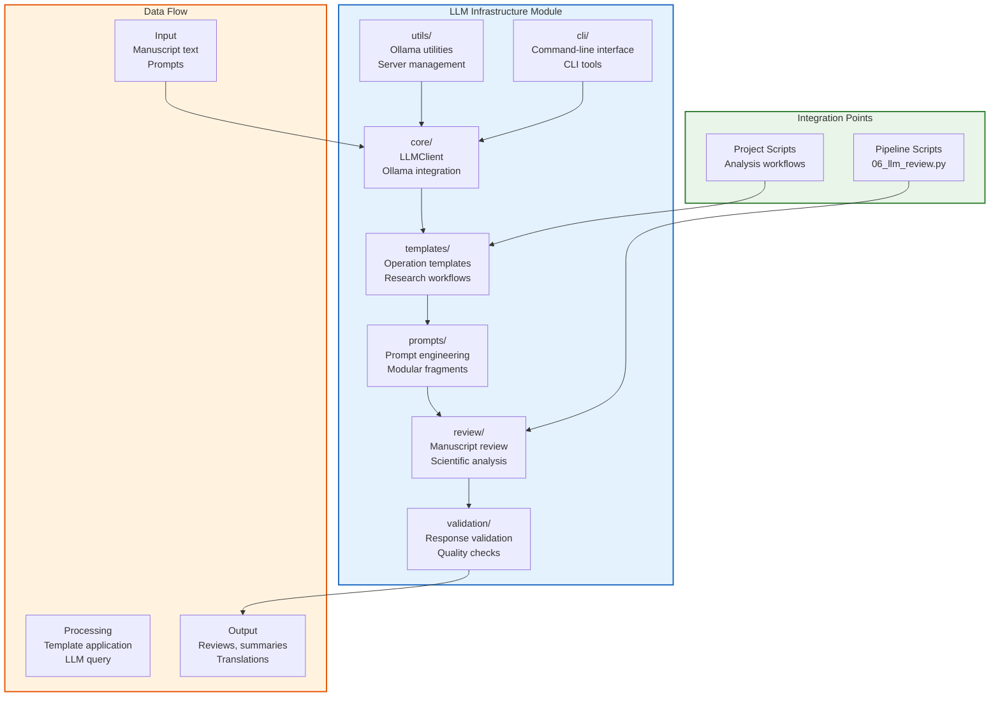

# LLM Infrastructure

Local Large Language Model (LLM) integration for research workflows, providing manuscript review, summarization, and analysis capabilities using Ollama.

## Quick Start

```bash
# Install and start Ollama
ollama serve

# Pull a model
ollama pull gemma3:4b

# Run manuscript review
python3 scripts/06_llm_review.py --review manuscript.md
```

## Features

- **Manuscript Review**: academic paper evaluation
- **Summarization**: Research paper and document summaries
- **Prompt Engineering**: Modular prompt templates and fragments
- **Local Processing**: Privacy-first with no external API calls
- **Multi-Format Support**: Markdown, JSON, and structured outputs

## Architecture



### Module Structure

```
infrastructure/llm/
├── core/           # Core LLM client and configuration
├── templates/      # High-level operation templates
├── prompts/        # Prompt engineering system
├── review/         # Manuscript review functionality
├── utils/          # Ollama server utilities
├── validation/     # Response validation and quality checks
└── cli/            # Command-line interface
```

## Configuration

### Model Selection

The default model is **`gemma3:4b`** - a reliable model with good quality (~30 tokens/sec).

**Override for quality reviews:**
```bash
export OLLAMA_MODEL="gemma3:4b"       # Good quality, medium speed
export OLLAMA_MODEL="llama3-gradient"  # Best quality, slower
```

**Speed Tiers (approximate on Apple Silicon):**

| Model | Size | Speed | Use Case |
|-------|------|-------|----------|
| `smollm2` | 102 MB | ~100+ tok/s | Fast testing |
| `deepcoder:1.5b` | 1.1 GB | ~70 tok/s | Quick iterations |
| `gemma2:2b` | 1.4 GB | ~50 tok/s | Good balance |
| `gemma3:4b` | 3.3 GB | ~30 tok/s | Quality reviews (default) |
| `llama3-gradient` | 4.7 GB | ~15 tok/s | Best quality, 256K context |

### Environment Variables

```bash
# Model selection
export OLLAMA_MODEL="gemma3:4b"        # Override default model
export OLLAMA_HOST="http://localhost:11434"  # Ollama server URL

# Generation parameters
export LLM_TEMPERATURE="0.7"           # Response creativity (0.0-1.0)
export LLM_MAX_TOKENS="2048"            # Max response length
export LLM_LONG_MAX_TOKENS="16384"      # For long reviews/translations
export LLM_CONTEXT_WINDOW="131072"      # Context window size

# Timeout and monitoring
export LLM_TIMEOUT="60"                 # Request timeout (seconds)
export LLM_REVIEW_TIMEOUT="300"         # Review stage timeout
```


## Usage Examples

### Basic Review
```python
from infrastructure.llm.templates import ManuscriptReviewTemplate
from infrastructure.llm.core import LLMClient

client = LLMClient()
template = ManuscriptReviewTemplate(client)

result = template.apply(manuscript="Your manuscript text here")
print(result.content)
```

### Custom Prompts
```python
from infrastructure.llm.prompts import PromptComposer

composer = PromptComposer()
prompt = composer.compose_prompt('manuscript_reviews', {
    'manuscript_content': manuscript,
    'review_type': 'technical'
})
```

## Testing

```bash
# Run all LLM tests
pytest tests/infrastructure/llm/ -v

# Skip Ollama-dependent tests
pytest tests/infrastructure/llm/ -m "not requires_ollama" -v
```

## See Also

- [AGENTS.md](AGENTS.md) - Detailed technical documentation
- [core/](core/) - Core LLM client implementation
- [templates/](templates/) - Operation templates
- [prompts/](prompts/) - Prompt engineering