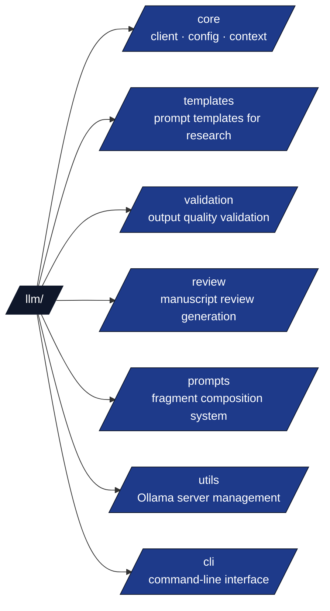

# LLM Module

Local Large Language Model integration for research assistance via Ollama.

## Module Structure



## LLM Client (`core/client.py`)

```python
from infrastructure.llm import LLMClient, OllamaClientConfig, GenerationOptions

# Initialize with defaults
client = LLMClient()

# Custom configuration
config = OllamaClientConfig(default_model="gemma3:4b", temperature=0.7)
client = LLMClient(config)

# Generate a response
response = client.query("Summarize this paper...", options=GenerationOptions(
    max_tokens=2000,
    temperature=0.3,
))
```

## Conversation Context (`core/context.py`)

```python
from infrastructure.llm.core import ConversationContext, Message

context = ConversationContext()
context.add_message(role="user", content="What is active inference?")
context.add_message(role="assistant", content="Active inference is...")
```

## Prompt Templates (`templates/`)

Pre-built research task templates:

```python
from infrastructure.llm import get_template
from infrastructure.llm.templates import (
    ResearchTemplate, PaperSummarization,
    ManuscriptExecutiveSummary, ManuscriptQualityReview,
    ManuscriptMethodologyReview, ManuscriptImprovementSuggestions,
    ManuscriptTranslationAbstract,
)

# Get a template by name
template = get_template("paper_summarization")

# Use specific template classes
summary_template = ManuscriptExecutiveSummary()
prompt = summary_template.render(text=text)
```

## Output Validation (`validation/`)

Validation was decomposed into module-level functions in v0.6.0 — the
previous `OutputValidator` class is gone; call the individual checks
directly.

```python
from infrastructure.llm import is_off_topic
from infrastructure.llm.validation import (
    detect_repetition,
    check_format_compliance, validate_section_completeness,
    calculate_unique_content_ratio, deduplicate_sections,
)

# Individual checks
if is_off_topic(response_text):
    logger.warning("Response appears off-topic")

if detect_repetition(response_text):
    logger.warning("Response contains repeated content")

ratio = calculate_unique_content_ratio(response_text)
```

## Manuscript Review Generation (`review/`)

```python
from infrastructure.llm.review import (
    create_review_client, select_and_start_ollama_model, warmup_model,
    extract_manuscript_text, generate_review_with_metrics,
    generate_llm_executive_summary, generate_improvement_suggestions,
    generate_translation, save_review_outputs,
)
from infrastructure.llm.review.generator import (
    generate_quality_review, generate_methodology_review,
)

# Full review workflow
client = create_review_client()
warmup_model(client)
text = extract_manuscript_text(manuscript_dir)

executive = generate_llm_executive_summary(client, text)
quality = generate_quality_review(client, text)
methodology = generate_methodology_review(client, text)
suggestions = generate_improvement_suggestions(client, text)

save_review_outputs(output_dir, executive=executive, quality=quality,
                    methodology=methodology, suggestions=suggestions)
```

## Ollama Utilities (`utils/`)

```python
from infrastructure.llm.utils import (
    is_ollama_running, start_ollama_server, ensure_ollama_ready,
    get_model_names, select_best_model,
    select_small_fast_model, preload_model, check_model_loaded,
)

# Check and start Ollama
if not is_ollama_running():
    start_ollama_server()

ensure_ollama_ready()
models = get_model_names()
best = select_best_model()
```

## Prompt Composition (`prompts/`)

```python
from infrastructure.llm.prompts import PromptFragmentLoader, PromptComposer

loader = PromptFragmentLoader()
composer = PromptComposer(loader)
prompt = composer.compose_template(
    "manuscript_reviews.json#manuscript_executive_summary",
    text=manuscript_text,
)
```

## CLI Usage

```bash
# Query the LLM
uv run python -m infrastructure.llm.cli.main query "What is machine learning?"

# Check Ollama status
uv run python -m infrastructure.llm.cli.main check

# List available models
uv run python -m infrastructure.llm.cli.main models

# List available research templates
uv run python -m infrastructure.llm.cli.main template --list

# Apply a research template (reads input from --input or stdin)
uv run python -m infrastructure.llm.cli.main template paper_summarization --input "Abstract text..."
```
