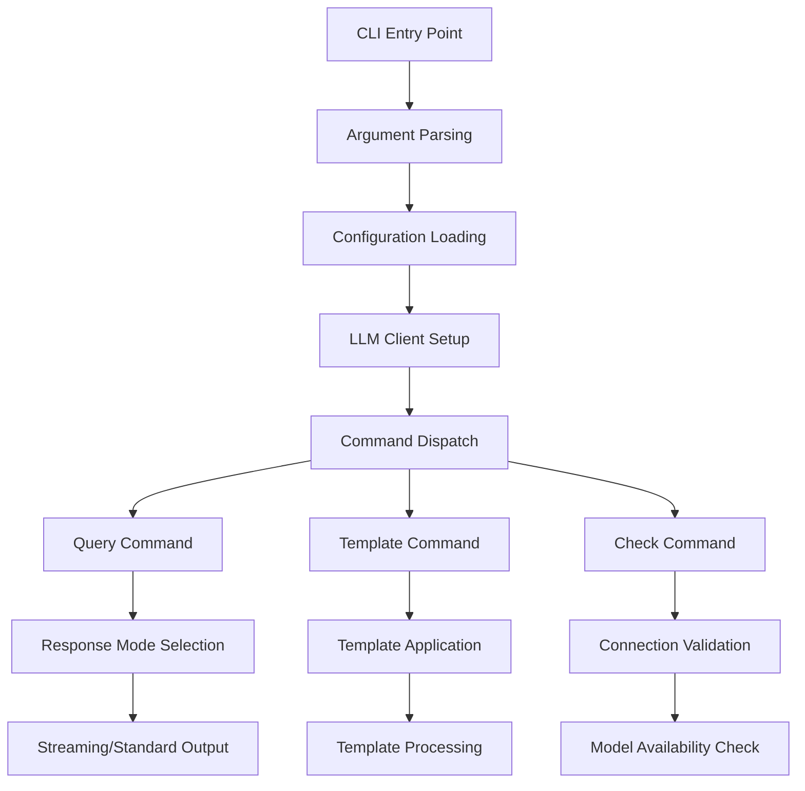

# LLM CLI - Command-Line Interface

Terminal interface for interacting with Large Language Models using Ollama.

## Overview

The LLM CLI provides command-line access to all LLM functionality, enabling interactive queries, batch processing, and integration with shell scripts.

## Quick Start

```bash
# Check Ollama connection
python3 -m infrastructure.llm.cli.main check

# Query the LLM
python3 -m infrastructure.llm.cli.main query "Explain quantum computing"

# Short response mode
python3 -m infrastructure.llm.cli.main query --short "What is machine learning?"

# Streaming output
python3 -m infrastructure.llm.cli.main query --stream "Write a haiku about AI"
```

## Command Reference

### Core Commands

#### check
Validate Ollama connection and model availability.

```bash
python3 -m infrastructure.llm.cli.main check
```

#### query
Send a query to the LLM with various response modes.

```bash
# Basic query
python3 -m infrastructure.llm.cli.main query "Your prompt here"

# Response modes
python3 -m infrastructure.llm.cli.main query --short "Brief answer needed"
python3 -m infrastructure.llm.cli.main query --long "Detailed explanation needed"

# Output options
python3 -m infrastructure.llm.cli.main query --stream "Real-time output"
python3 -m infrastructure.llm.cli.main query --json "Structured response"

# Generation parameters
python3 -m infrastructure.llm.cli.main query --temperature 0.7 --max-tokens 1000 "Custom settings"
```

#### template
Apply research prompt templates.

```bash
# List available templates
python3 -m infrastructure.llm.cli.main template --list

# Apply template
python3 -m infrastructure.llm.cli.main template summarize_abstract --input "Abstract text..."
python3 -m infrastructure.llm.cli.main template literature_review --input "Paper summaries..."
```

### Advanced Options

#### Generation Parameters

| Option | Description | Default |
|--------|-------------|---------|
| `--temperature` | Sampling temperature (0.0-2.0) | 0.7 |
| `--max-tokens` | Maximum tokens to generate | Model default |
| `--top-p` | Nucleus sampling threshold | 0.9 |
| `--top-k` | Top-k sampling limit | 40 |
| `--seed` | Random seed for reproducibility | None |
| `--stop` | Stop sequences (comma-separated) | None |
| `--num-ctx` | Context window size | Model default |

#### Response Modes

| Mode | Description | Use Case |
|------|-------------|----------|
| `--short` | Brief responses (< 150 tokens) | Quick answers, definitions |
| `--long` | Detailed responses (> 500 tokens) | Explanations, analysis |
| `--stream` | Real-time streaming output | Interactive sessions |
| `--json` | Structured JSON responses | Data extraction, APIs |

## Examples

### Basic Usage

```bash
# Simple query
python3 -m infrastructure.llm.cli.main query "What is the capital of France?"

# Deterministic output
python3 -m infrastructure.llm.cli.main query --temperature 0.0 --seed 42 "Consistent response"

# Long-form content
python3 -m infrastructure.llm.cli.main query --long "Explain the theory of relativity in detail"
```

### Research Applications

```bash
# Literature analysis
python3 -m infrastructure.llm.cli.main query "Summarize the key findings from this abstract..." --max-tokens 500

# Code review
python3 -m infrastructure.llm.cli.main query "Review this Python function for best practices..." --long

# Academic writing
python3 -m infrastructure.llm.cli.main query "Help me outline a research paper on..." --structured
```

### Template Usage

```bash
# Summarize research
echo "Abstract text..." | python3 -m infrastructure.llm.cli.main template summarize_abstract

# Literature synthesis
python3 -m infrastructure.llm.cli.main template literature_review --input "Summary 1... Summary 2..."
```

### Scripting Integration

```bash
#!/bin/bash
# Process multiple queries
QUERIES=("What is AI?" "Explain machine learning" "Future of robotics")

for query in "${QUERIES[@]}"; do
    echo "Query: $query"
    python3 -m infrastructure.llm.cli.main query "$query" --short
    echo "---"
done
```

## Configuration

The CLI respects all environment variables from the LLM infrastructure:

```bash
# Set model and connection
export OLLAMA_HOST="http://localhost:11434"
export OLLAMA_MODEL="gemma3:4b"
export LLM_TEMPERATURE="0.7"
export LLM_MAX_TOKENS="2048"

# Use in commands
python3 -m infrastructure.llm.cli.main query "Test query"
```

## Error Handling

The CLI provides clear error messages and exit codes:

```bash
# Connection issues
$ python3 -m infrastructure.llm.cli.main check
Error: Cannot connect to Ollama at http://localhost:11434

# Model not found
$ python3 -m infrastructure.llm.cli.main query "test"
Error: Model 'unknown-model' not found. Available: gemma3:4b, llama3.2:3b

# Exit codes
# 0: Success
# 1: Connection error
# 2: Model error
# 3: Validation error
# 4: Configuration error
```

## Performance Tips

### Batch Processing

```bash
# Process multiple queries efficiently
cat queries.txt | while read -r query; do
    python3 -m infrastructure.llm.cli.main query "$query" --short >> results.txt
done
```

### Memory Management

```bash
# Limit context for memory-constrained systems
python3 -m infrastructure.llm.cli.main query --num-ctx 4096 "Limited context query"

# Use shorter responses for faster processing
python3 -m infrastructure.llm.cli.main query --short "Quick answer needed"
```

## Integration

### Shell Scripts

```bash
#!/bin/bash
# research_analysis.sh

ABSTRACT=$(cat manuscript/abstract.md)
SUMMARY=$(python3 -m infrastructure.llm.cli.main template summarize_abstract --input "$ABSTRACT")

echo "Summary generated:"
echo "$SUMMARY"
```

### Makefiles

```makefile
.PHONY: analyze summarize

analyze:
	python3 scripts/analysis.py

summarize:
	@echo "Generating summary..."
	@python3 -m infrastructure.llm.cli.main template summarize_abstract --input "$(shell cat manuscript/abstract.md)" > summary.txt

research: analyze summarize
	@echo "Research workflow"
```

## Troubleshooting

### Common Issues

**Connection Failed**
```bash
# Check Ollama status
ollama serve  # Start if not running

# Verify connection
python3 -m infrastructure.llm.cli.main check

# Check host configuration
export OLLAMA_HOST="http://localhost:11434"
```

**Model Not Available**
```bash
# List available models
ollama list

# Pull required model
ollama pull gemma3:4b

# Set as default
export OLLAMA_MODEL="gemma3:4b"
```

**Slow Responses**
```bash
# Use smaller model
export OLLAMA_MODEL="llama3.2:1b"

# Reduce context window
python3 -m infrastructure.llm.cli.main query --num-ctx 2048 "Query"

# Use short mode
python3 -m infrastructure.llm.cli.main query --short "Brief answer"
```

**Memory Issues**
```bash
# Monitor memory usage
python3 -c "
import psutil
import os
process = psutil.Process(os.getpid())
print(f'Memory usage: {process.memory_info().rss / 1024 / 1024:.1f} MB')
"

# Use streaming for large responses
python3 -m infrastructure.llm.cli.main query --stream "Large response needed"
```

## Architecture



## See Also

- [AGENTS.md](AGENTS.md) - CLI documentation
- [../core/README.md](../core/README.md) - LLM core functionality
- [../templates/README.md](../templates/README.md) - Template system
- [../../../AGENTS.md](../../../AGENTS.md) - LLM infrastructure overview