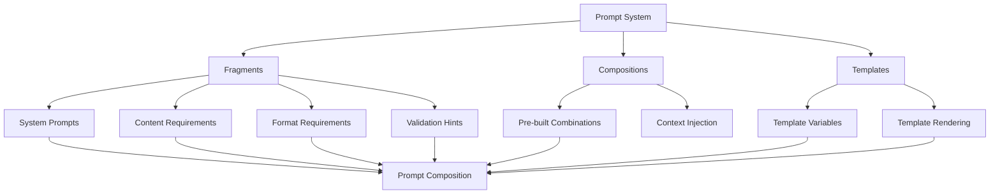

# LLM Prompts - Quick Reference

Prompt composition system for structured LLM interactions.

## Overview

The prompts module provides a flexible system for composing, managing, and applying prompts for LLM interactions. It supports fragments, compositions, and templates for consistent, high-quality prompt engineering.

## Quick Start

```python
from infrastructure.llm.prompts import PromptComposer

# Create composer
composer = PromptComposer()

# Compose prompt from fragments
prompt = composer.compose(
    fragments=["system_prompt", "task_description", "format_requirements"],
    context={"topic": "machine learning", "length": "short"}
)

# Apply to LLM
response = llm_client.query(prompt)
```

## Key Components

### Prompt Fragments

Reusable prompt components stored in JSON:

```python
from infrastructure.llm.prompts.loader import load_fragments

# Load fragment library
fragments = load_fragments()

# Access specific fragment
system_prompt = fragments["system_prompts"]["research_assistant"]
```

### Prompt Compositions

Pre-built prompt combinations:

```python
from infrastructure.llm.prompts.composer import compose_prompt

# Use composition
prompt = compose_prompt(
    composition="manuscript_review",
    context={"manuscript": manuscript_text}
)
```

### Prompt Templates

Template-based prompt generation:

```python
from infrastructure.llm.prompts.templates import apply_template

# Apply template
prompt = apply_template(
    template="summarize_abstract",
    variables={"abstract": abstract_text}
)
```

## Common Usage Patterns

### Research Review Prompts

```python
# Comprehensive manuscript review
review_prompt = composer.compose(
    fragments=[
        "system_prompts.research_reviewer",
        "content_requirements.comprehensive_analysis",
        "format_requirements.structured_output"
    ],
    context={"manuscript": text}
)
```

### Literature Synthesis

```python
# Literature review synthesis
synthesis_prompt = composer.compose(
    fragments=[
        "system_prompts.literature_analyst",
        "content_requirements.synthesis",
        "validation_hints.citation_check"
    ],
    context={"papers": paper_summaries}
)
```

### Code Review Prompts

```python
# Code review with quality focus
code_review_prompt = composer.compose(
    fragments=[
        "system_prompts.code_reviewer",
        "content_requirements.code_quality",
        "format_requirements.bullet_points"
    ],
    context={"code": code_snippet}
)
```

## Fragment Library

### System Prompts

Pre-defined system roles:
- `research_assistant` - General research help
- `research_reviewer` - Manuscript review
- `code_reviewer` - Code quality assessment
- `literature_analyst` - Paper analysis

### Content Requirements

Content specification fragments:
- `comprehensive_analysis` - Detailed analysis requirements
- `brief_summary` - Concise summary requirements
- `structured_output` - Format specifications

### Format Requirements

Output formatting:
- `structured_output` - JSON/structured format
- `bullet_points` - Bullet point format
- `paragraph_format` - Paragraph format

## Template System

### Available Templates

```python
# List available templates
templates = list_templates()

# Apply template
prompt = apply_template(
    template="manuscript_review",
    variables={
        "manuscript": text,
        "focus_areas": ["methodology", "results"]
    }
)
```

## Architecture



## See Also

- [AGENTS.md](AGENTS.md) - Complete prompts module documentation
- [fragments/README.md](fragments/README.md) - Fragment library details
- [compositions/README.md](compositions/README.md) - Composition system
- [templates/README.md](templates/README.md) - Template system