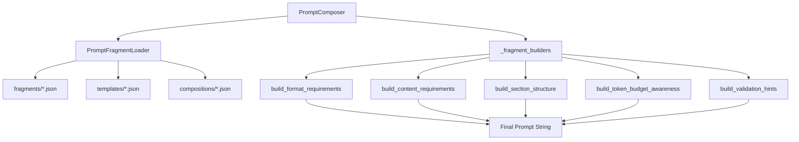

# LLM Prompts - Quick Reference

Prompt composition system for structured LLM interactions.

## Overview

The prompts module provides `PromptFragmentLoader` and `PromptComposer` for loading
JSON-based prompt fragments, templates, and compositions, then assembling them into
complete prompts with `${variable}` substitution and fragment building.

The two public symbols exported from `infrastructure.llm.prompts` are:

| Symbol | Source | Purpose |
| --- | --- | --- |
| `PromptFragmentLoader` | `loader.py` | Load and cache JSON fragments, templates, and compositions |
| `PromptComposer` | `composer.py` | Assemble complete prompts from a template definition |

## Quick Start

```python
from infrastructure.llm.prompts import PromptFragmentLoader, PromptComposer

# Load a fragment directly
loader = PromptFragmentLoader()
system_prompt = loader.get_system_prompt("manuscript_review")

# Compose a full prompt from a template
composer = PromptComposer(loader=loader)
prompt = composer.compose_template(
    "manuscript_reviews.json#manuscript_executive_summary",
    text=manuscript_text,
    max_tokens=1000,
)
```

## Key Components

### PromptFragmentLoader

Loads JSON from `fragments/`, `templates/`, and `compositions/` subdirectories with
in-process caching. References use the `"filename.json#key"` or `"filename.json#key.subkey"`
dot-notation for nested lookups.

```python
from infrastructure.llm.prompts import PromptFragmentLoader

loader = PromptFragmentLoader()

# Load a fragment by file + key reference
system_prompt = loader.load_fragment("system_prompts.json#manuscript_review")

# Load a template definition dict
template = loader.load_template("manuscript_reviews.json#manuscript_executive_summary")

# Load a composition entry (e.g. retry reinforcement)
retry = loader.load_composition("retry_prompts.json#off_topic_reinforcement")

# Convenience shorthand for system prompts
prompt_str = loader.get_system_prompt("manuscript_review")
```

### PromptComposer

Takes a template reference, resolves each `fragments` entry via `_fragment_builders`,
substitutes all `${variable}` placeholders in `base_template`, and returns the final
prompt string.

```python
from infrastructure.llm.prompts import PromptComposer

composer = PromptComposer()

# Compose a manuscript executive summary prompt
prompt = composer.compose_template(
    "manuscript_reviews.json#manuscript_executive_summary",
    text=manuscript_text,
    max_tokens=1000,
)

# Prepend a retry reinforcement block when the LLM goes off-topic
reinforced = composer.add_retry_prompt(prompt, retry_type="off_topic")
```

## Data Directories

### `fragments/` — Reusable prompt building blocks (JSON)

Each file is a JSON object whose values are consumed by `PromptFragmentLoader.load_fragment()`.
The builder functions in `_fragment_builders.py` dispatch on the fragment reference string
and call the matching builder:

| File | Builder | Purpose |
| --- | --- | --- |
| `system_prompts.json` | loaded directly | Role definitions (e.g. `manuscript_review`) |
| `format_requirements.json` | `build_format_requirements` | Markdown header list instructions |
| `content_requirements.json` | `build_content_requirements` | Quality and anti-hallucination rules |
| `section_structures.json` | `build_section_structure` | Per-review-type section headers + descriptions |
| `token_budget_awareness.json` | `build_token_budget_awareness` | Token and word-count budget guidance |
| `validation_hints.json` | `build_validation_hints` | Checklist of what will be validated |

### `templates/` — Template definitions (JSON, data-only)

JSON files; no Python package. Each top-level key is a template definition consumed
by `loader.load_template()` and then assembled by `PromptComposer.compose_template()`.

| File | Templates defined |
| --- | --- |
| `manuscript_reviews.json` | `manuscript_executive_summary`, `manuscript_quality_review`, `manuscript_methodology_review`, `manuscript_improvement_suggestions`, `manuscript_translation_abstract` |
| `paper_summarization.json` | `paper_summarization` |

### `compositions/` — Retry and format enforcement entries (JSON, data-only)

JSON files; no Python package. Entries are loaded by `loader.load_composition()` and
injected by `PromptComposer.add_retry_prompt()`.

| File | Keys |
| --- | --- |
| `retry_prompts.json` | `off_topic_reinforcement`, `format_enforcement.executive_summary`, `format_enforcement.quality_review`, `format_enforcement.methodology_review`, `format_enforcement.improvement_suggestions` |

## Template JSON Schema

Each template definition in `templates/*.json` has this shape:

```json
{
  "template_key": {
    "version": "1.0",
    "base_template": "...${variable}... ${fragment_key}...",
    "fragments": {
      "fragment_key": "fragment_file.json#optional_key"
    },
    "variables": {
      "word_count_range": [400, 600],
      "required_elements": ["..."]
    },
    "section_config": {
      "structure_key": "section_structures_key",
      "sections": 5
    }
  }
}
```

`base_template` uses `${key}` placeholders. `fragments` maps placeholder names to
`PromptFragmentLoader` references; each is resolved via `_fragment_builders.build_fragment()`.
Caller-supplied `**variables` override `variables` defaults before substitution.

## Architecture


```mermaid
graph TD
    A[PromptComposer] --> B[PromptFragmentLoader]
    A --> C[_fragment_builders]

    B --> D[fragments/*.json]
    B --> E[templates/*.json]
    B --> F[compositions/*.json]

    C --> G[build_format_requirements]
    C --> H[build_content_requirements]
    C --> I[build_section_structure]
    C --> J[build_token_budget_awareness]
    C --> K[build_validation_hints]

    G --> L[Final Prompt String]
    H --> L
    I --> L
    J --> L
    K --> L
```

## See Also

- [AGENTS.md](AGENTS.md) - prompts module documentation
- [fragments/README.md](fragments/README.md) - Fragment JSON files
- [compositions/README.md](compositions/README.md) - Composition JSON files
- [templates/README.md](templates/README.md) - Template JSON files
