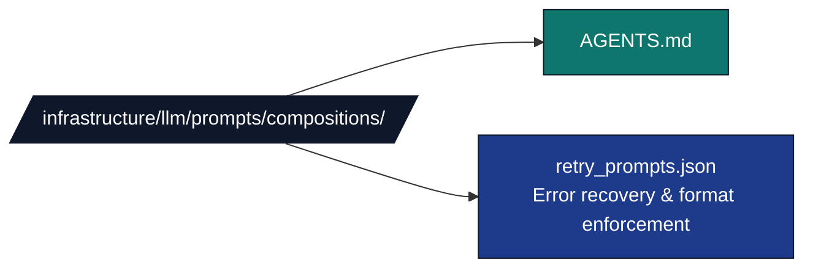

# LLM Prompt Compositions

## Overview

The `infrastructure/llm/prompts/compositions/` directory is a **data-only** directory
containing JSON files. There is no Python package here. Compositions are pre-written
reinforcement strings loaded by `PromptFragmentLoader.load_composition()` and
prepended to an existing prompt by `PromptComposer.add_retry_prompt()` when an LLM
response fails a quality or relevance check.

## Directory Structure



## Public API

Compositions are accessed through `PromptFragmentLoader` and `PromptComposer`,
both exported from `infrastructure.llm.prompts`:

```python
from infrastructure.llm.prompts import PromptFragmentLoader, PromptComposer

loader = PromptFragmentLoader()
composer = PromptComposer(loader=loader)

# Load a composition entry by reference
entry = loader.load_composition("retry_prompts.json#off_topic_reinforcement")
# → {"version": "1.0", "content": "IMPORTANT: You must review..."}

# Prepend off-topic reinforcement to an existing prompt
reinforced = composer.add_retry_prompt(base_prompt, retry_type="off_topic")

# add_retry_prompt constructs: f"retry_prompts.json#{retry_type}_reinforcement"
# and prepends the "content" value before base_prompt.
# If the key is not found, base_prompt is returned unchanged.
```

## `retry_prompts.json` — Schema and Entries

### Top-level schema

```json
{
  "entry_name": {
    "version": "1.0",
    "content": "Ready-to-prepend reinforcement text.\n\n"
  }
}
```

Nested sub-objects share the same `{"version", "content"}` shape and are
addressed via dot-notation: `"retry_prompts.json#format_enforcement.executive_summary"`.

### `off_topic_reinforcement`

```json
{
  "off_topic_reinforcement": {
    "version": "1.0",
    "content": "IMPORTANT: You must review the ACTUAL manuscript text provided below. Do NOT generate hypothetical content, generic book descriptions, or unrelated topics. Your review must reference specific content from the manuscript.\n\n"
  }
}
```

**When to use:** the LLM generates generic or hypothetical content instead of
analyzing the supplied manuscript. Selected by `add_retry_prompt(prompt, retry_type="off_topic")`.

### `format_enforcement` (nested)

Four sub-keys for targeting specific review types. Selected via
`loader.load_composition("retry_prompts.json#format_enforcement.<sub_key>")`:

| Sub-key | Instruction prepended |
| --- | --- |
| `executive_summary` | Use exact headers: Overview, Key Contributions, Methodology Summary, Principal Results, Significance and Impact |
| `quality_review` | Include `**Score: [1-5]**` in every scoring section |
| `methodology_review` | Include all required sections with proper markdown headers |
| `improvement_suggestions` | Each improvement must include WHAT (the issue) / WHY (why it matters) / HOW (how to address it) |

## How `add_retry_prompt` Works

`PromptComposer.add_retry_prompt(base_prompt, retry_type)` follows this logic:

1. Constructs the reference `f"retry_prompts.json#{retry_type}_reinforcement"`.
2. Calls `self.loader.load_composition(reference)` — raises `LLMTemplateError` if
   the key does not exist.
3. Extracts the `"content"` field from the returned dict (or coerces to string).
4. If content is non-empty, returns `f"{content}\n\n{base_prompt}"`.
5. On `LLMTemplateError`, logs a debug message and returns `base_prompt` unchanged.

## Caching

`PromptFragmentLoader` caches all loaded JSON files in `_fragment_cache` (keyed by
absolute file path). Repeated calls to `load_composition` for the same file do not
re-read disk. Call `loader.clear_cache()` to invalidate.

## Adding New Compositions

1. Add a new entry to `retry_prompts.json` (or create a new `*.json` file in this
   directory) using the `{"version": "...", "content": "..."}` schema.
2. Load it with `loader.load_composition("retry_prompts.json#your_key")`.
3. To integrate with `add_retry_prompt`, name the entry `{retry_type}_reinforcement`
   and pass `retry_type="your_type"` — no Python changes required.
4. For a new file, pass the new filename in the loader reference string. The loader
   resolves it relative to `infrastructure/llm/prompts/compositions/`.

## Integration in the Pipeline

The LLM review scripts (e.g. `scripts/06_llm_review.py`) construct prompts via
`PromptComposer.compose_template()` and may call `add_retry_prompt()` on a second
pass if the first LLM response is rejected by the validation layer. The composition
content is prepended so it appears before the manuscript text in the final prompt.

## See Also

**Related Documentation:**

- [`../AGENTS.md`](../AGENTS.md) - Prompts module overview
- [`../fragments/AGENTS.md`](../fragments/AGENTS.md) - Fragment components
- [`../templates/AGENTS.md`](../templates/AGENTS.md) - Template system
- [`README.md`](README.md) - Compositions quick reference

**System Documentation:**

- [`../../../../AGENTS.md`](../../../../AGENTS.md) - system overview
- [`../../../../docs/operational/troubleshooting/llm-review.md`](../../../../docs/operational/troubleshooting/llm-review.md) - LLM troubleshooting guide
