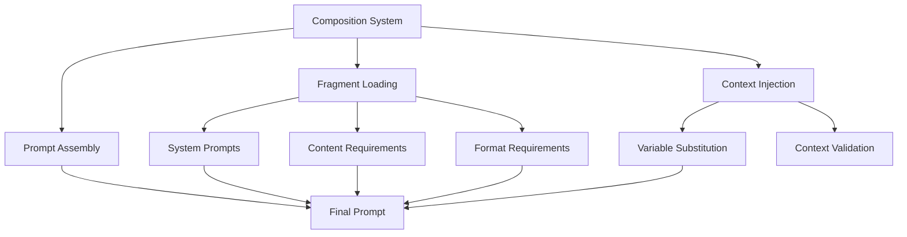

# Prompt Compositions - Quick Reference

Pre-built prompt combinations for common research tasks.

## Overview

Prompt compositions are pre-assembled combinations of fragments designed for specific research workflows. They provide ready-to-use prompts for common tasks like manuscript review, literature synthesis, and code analysis.

## Quick Start

```python
from infrastructure.llm.prompts.composer import load_composition

# Load pre-built composition
composition = load_composition("manuscript_review")

# Apply with context
prompt = composition.apply(context={
    "manuscript": manuscript_text,
    "focus_areas": ["methodology", "results"]
})
```

## Available Compositions

### Manuscript Review (`retry_prompts.json`)

manuscript review with retry logic:

```python
from infrastructure.llm.prompts.compositions import load_retry_composition

# Load review composition
review = load_retry_composition("comprehensive_review")

# Generate review prompt
prompt = review.build_prompt(
    manuscript=text,
    review_type="comprehensive"
)
```

### Literature Synthesis

Synthesize multiple papers into coherent review:

```python
composition = load_composition("literature_synthesis")

prompt = composition.apply(context={
    "papers": paper_summaries,
    "focus": "methodological approaches"
})
```

### Code Review

Structured code quality assessment:

```python
composition = load_composition("code_review")

prompt = composition.apply(context={
    "code": code_snippet,
    "focus": ["performance", "readability"]
})
```

## Composition Structure

Compositions are defined in JSON:

```json
{
  "composition_name": {
    "fragments": [
      "system_prompts.research_reviewer",
      "content_requirements.comprehensive_analysis",
      "format_requirements.structured_output"
    ],
    "context_variables": ["manuscript", "focus_areas"],
    "metadata": {
      "description": "manuscript review",
      "version": "1.0"
    }
  }
}
```

## Creating Custom Compositions

### Define Composition

```json
// custom_compositions.json
{
  "custom_review": {
    "fragments": [
      "system_prompts.research_assistant",
      "content_requirements.brief_summary",
      "format_requirements.bullet_points"
    ],
    "context_variables": ["text"],
    "metadata": {
      "description": "Quick summary composition",
      "version": "1.0"
    }
  }
}
```

### Use Custom Composition

```python
from infrastructure.llm.prompts.composer import load_composition

composition = load_composition(
    "custom_review",
    custom_path="custom_compositions.json"
)

prompt = composition.apply(context={"text": document_text})
```

## Retry Compositions

Special compositions with built-in retry logic:

```python
from infrastructure.llm.prompts.compositions import RetryComposition

# Create retry composition
retry_comp = RetryComposition(
    base_composition="manuscript_review",
    retry_strategies=["clarify", "simplify", "expand"]
)

# Apply with automatic retry
result = retry_comp.apply_with_retry(
    context={"manuscript": text},
    max_retries=3
)
```

## Integration

### Pipeline Usage

```python
# scripts/06_llm_review.py
from infrastructure.llm.prompts.composer import load_composition

def generate_review(manuscript_path):
    composition = load_composition("manuscript_review")
    
    with open(manuscript_path) as f:
        text = f.read()
    
    prompt = composition.apply(context={"manuscript": text})
    return llm_client.query(prompt)
```

## Architecture



## See Also

- [AGENTS.md](AGENTS.md) - compositions documentation
- [../README.md](../README.md) - Prompts module overview
- [../fragments/README.md](../fragments/README.md) - Fragment library