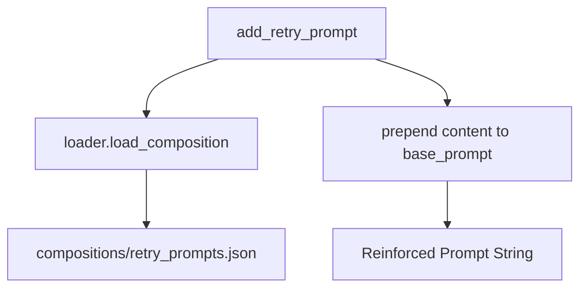

# Prompt Compositions - Quick Reference

Retry and format-enforcement JSON entries loaded by `PromptFragmentLoader.load_composition()`
and injected by `PromptComposer.add_retry_prompt()`.

## Overview

This directory contains JSON data files only — there is no Python package here.
Compositions are pre-written reinforcement strings prepended to an existing prompt
when an LLM response fails a quality or relevance check. They are not assembled
from fragments; each entry stores a ready-made `content` string directly.

The only file currently present is `retry_prompts.json`.

## Loading Compositions

```python
from infrastructure.llm.prompts import PromptFragmentLoader, PromptComposer

loader = PromptFragmentLoader()

# Load a composition entry directly
entry = loader.load_composition("retry_prompts.json#off_topic_reinforcement")
# Returns: {"version": "1.0", "content": "IMPORTANT: You must review..."}

# Prepend the appropriate reinforcement to an existing prompt
composer = PromptComposer(loader=loader)
reinforced_prompt = composer.add_retry_prompt(base_prompt, retry_type="off_topic")
# Internally calls: loader.load_composition("retry_prompts.json#off_topic_reinforcement")
# Prepends content to base_prompt; returns base_prompt unchanged if key not found.
```

## `retry_prompts.json` — Entries

### `off_topic_reinforcement`

Prepended when the LLM generates generic or hypothetical content instead of
analyzing the supplied manuscript:

```json
{
  "off_topic_reinforcement": {
    "version": "1.0",
    "content": "IMPORTANT: You must review the ACTUAL manuscript text provided below..."
  }
}
```

`add_retry_prompt(prompt, retry_type="off_topic")` selects this entry.

### `format_enforcement` (nested object)

Four sub-keys targeting specific review types. Referenced as
`"retry_prompts.json#format_enforcement.executive_summary"` etc. using dot-notation:

| Sub-key | Prepended instruction |
| --- | --- |
| `format_enforcement.executive_summary` | Exact headers: Overview, Key Contributions, Methodology Summary, Principal Results, Significance and Impact |
| `format_enforcement.quality_review` | Include `**Score: [1-5]**` in every scoring section |
| `format_enforcement.methodology_review` | Include all required sections with proper markdown headers |
| `format_enforcement.improvement_suggestions` | Each improvement must include WHAT / WHY / HOW |

## How `add_retry_prompt` Works

```python
# Simplified logic from composer.py
def add_retry_prompt(self, base_prompt: str, retry_type: str = "off_topic") -> str:
    retry_entry = self.loader.load_composition(
        f"retry_prompts.json#{retry_type}_reinforcement"
    )
    content = retry_entry.get("content", "") if isinstance(retry_entry, dict) else str(retry_entry)
    if content.strip():
        return f"{content}\n\n{base_prompt}"
    return base_prompt  # silently returns base if key not found
```

The `retry_type` argument maps to a `{retry_type}_reinforcement` key in
`retry_prompts.json`. If the key does not exist, `load_composition` raises
`LLMTemplateError` which `add_retry_prompt` catches and silently swallows,
returning the original prompt unchanged.

## Composition JSON Schema

```json
{
  "entry_name": {
    "version": "1.0",
    "content": "IMPORTANT: Reinforcement text prepended to the original prompt.\n\n"
  }
}
```

Nested sub-objects use the same shape and are accessed via dot-notation in the
loader reference string.

## Adding New Compositions

1. Add a new top-level key (or nested object) to `retry_prompts.json` following
   the `{"version": "...", "content": "..."}` schema.
2. Call it via `loader.load_composition("retry_prompts.json#your_key")`, or define
   a new `retry_type` string and rely on `add_retry_prompt`'s `{retry_type}_reinforcement`
   naming convention.
3. No Python code changes are needed for new entries that follow the existing schema.

## Architecture


```mermaid
graph TD
    A[add_retry_prompt] --> B[loader.load_composition]
    B --> C[compositions/retry_prompts.json]
    A --> D[prepend content to base_prompt]
    D --> E[Reinforced Prompt String]
```

## See Also

- [AGENTS.md](AGENTS.md) - compositions documentation
- [../README.md](../README.md) - Prompts module overview
- [../fragments/README.md](../fragments/README.md) - Fragment JSON files
