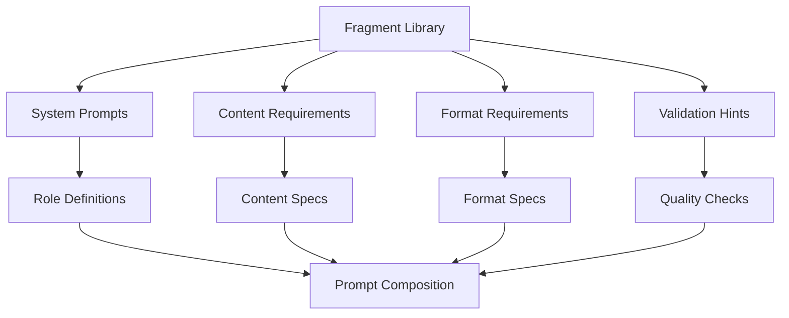

# Prompt Fragments - Quick Reference

Reusable prompt components for building structured LLM interactions.

## Overview

Prompt fragments are modular, reusable components stored as JSON that can be combined to create complex prompts. This enables consistent prompt engineering and easy maintenance.

## Quick Start

```python
from infrastructure.llm.prompts.loader import load_fragments

# Load fragment library
fragments = load_fragments()

# Access fragment
system_prompt = fragments["system_prompts"]["research_assistant"]
content_req = fragments["content_requirements"]["comprehensive_analysis"]
```

## Fragment Categories

### System Prompts (`system_prompts.json`)

Role definitions for LLM interactions:

```json
{
  "research_assistant": "You are a helpful research assistant...",
  "research_reviewer": "You are an expert scientific reviewer...",
  "code_reviewer": "You are a senior software engineer..."
}
```

### Content Requirements (`content_requirements.json`)

Specifications for response content:

```json
{
  "comprehensive_analysis": "Provide detailed analysis including...",
  "brief_summary": "Provide a concise summary (150 words)...",
  "structured_output": "Organize response with clear sections..."
}
```

### Format Requirements (`format_requirements.json`)

Output formatting specifications:

```json
{
  "structured_output": "Format as JSON with keys: summary, analysis, recommendations",
  "bullet_points": "Use bullet points for clarity",
  "paragraph_format": "Write in paragraph form with transitions"
}
```

### Validation Hints (`validation_hints.json`)

Quality checks and validation guidance:

```json
{
  "citation_check": "Verify all claims are properly cited",
  "fact_check": "Ensure factual accuracy of statements",
  "completeness": "Check that all required sections are present"
}
```

## Usage Examples

### Building a Review Prompt

```python
from infrastructure.llm.prompts.loader import load_fragments

fragments = load_fragments()

# Compose review prompt
prompt = f"""
{fragments['system_prompts']['research_reviewer']}

{fragments['content_requirements']['comprehensive_analysis']}

{fragments['format_requirements']['structured_output']}

{fragments['validation_hints']['citation_check']}

Manuscript:
{manuscript_text}
"""
```

### Custom Fragment Combinations

```python
# Create custom prompt from fragments
custom_prompt = compose_from_fragments(
    system_role="research_assistant",
    content_type="brief_summary",
    format_style="bullet_points",
    validation=["fact_check", "completeness"]
)
```

## Fragment Structure

Each fragment JSON file contains:

```json
{
  "fragment_name": {
    "content": "Fragment text content",
    "metadata": {
      "category": "system_prompts",
      "version": "1.0",
      "description": "Fragment purpose"
    }
  }
}
```

## Adding New Fragments

### Create Fragment File

```json
// custom_fragments.json
{
  "custom_role": {
    "content": "You are a specialized assistant for...",
    "metadata": {
      "category": "system_prompts",
      "version": "1.0"
    }
  }
}
```

### Load Custom Fragments

```python
from infrastructure.llm.prompts.loader import load_fragments

# Load with custom fragments
fragments = load_fragments(custom_paths=["custom_fragments.json"])
```

## Best Practices

### Fragment Design

- **Modular**: Each fragment should serve a single purpose
- **Reusable**: Design for multiple use cases
- **Clear**: Use descriptive names and metadata
- **Versioned**: Track fragment versions for compatibility

### Composition Guidelines

- **Logical order**: System prompt → Content → Format → Validation
- **Context injection**: Use placeholders for dynamic content
- **Consistency**: Maintain consistent style across fragments

## Architecture



## See Also

- [AGENTS.md](AGENTS.md) - Complete fragments documentation
- [../README.md](../README.md) - Prompts module overview
- [../../composer.py](../composer.py) - Fragment composition utilities