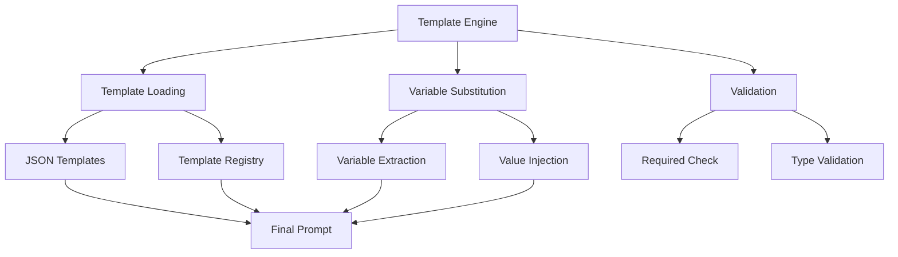

# Prompt Templates - Quick Reference

Template-based prompt generation for structured LLM interactions.

## Overview

Prompt templates provide a template engine for generating prompts with variable substitution. They enable consistent prompt formatting while allowing dynamic content injection.

## Quick Start

```python
from infrastructure.llm.prompts.templates import apply_template

# Apply template with variables
prompt = apply_template(
    template="manuscript_review",
    variables={
        "manuscript": manuscript_text,
        "focus": "methodology"
    }
)
```

## Available Templates

### Manuscript Review Templates (`manuscript_reviews.json`)

Structured review templates:

```python
# Comprehensive review
prompt = apply_template(
    template="comprehensive_review",
    variables={
        "manuscript": text,
        "reviewer_role": "expert in machine learning"
    }
)

# Methodology-focused review
prompt = apply_template(
    template="methodology_review",
    variables={
        "methodology_section": methodology_text
    }
)
```

### Paper Summarization (`paper_summarization.json`)

Summarization templates:

```python
# Abstract summarization
prompt = apply_template(
    template="summarize_abstract",
    variables={
        "abstract": abstract_text,
        "target_length": "150 words"
    }
)

# Full paper summary
prompt = apply_template(
    template="full_paper_summary",
    variables={
        "paper": paper_text,
        "sections": ["introduction", "methods", "results"]
    }
)
```

## Template Structure

Templates use variable placeholders:

```json
{
  "template_name": {
    "template": "You are {role}. Review the following manuscript focusing on {focus_areas}:\n\n{manuscript}",
    "variables": {
      "role": {
        "default": "research reviewer",
        "description": "Reviewer role"
      },
      "focus_areas": {
        "required": true,
        "description": "Areas to focus review"
      },
      "manuscript": {
        "required": true,
        "description": "Manuscript text"
      }
    },
    "metadata": {
      "category": "review",
      "version": "1.0"
    }
  }
}
```

## Usage Examples

### Basic Template Application

```python
from infrastructure.llm.prompts.templates import apply_template

# Simple variable substitution
prompt = apply_template(
    template="greeting",
    variables={"name": "Alice", "topic": "research"}
)
# Result: "Hello Alice, let's discuss research"
```

### Complex Template with Validation

```python
from infrastructure.llm.prompts.templates import TemplateEngine

engine = TemplateEngine()

# Apply with validation
prompt = engine.apply(
    template="manuscript_review",
    variables={
        "manuscript": text,
        "focus": "methodology"
    },
    validate=True  # Check required variables
)
```

### Template Chaining

```python
# Chain templates for complex workflows
summary_template = apply_template("summarize", variables={"text": abstract})
review_template = apply_template(
    "review_summary",
    variables={"summary": summary_template}
)
```

## Creating Custom Templates

### Define Template

```json
// custom_templates.json
{
  "custom_analysis": {
    "template": "Analyze {text} focusing on {aspects}. Provide {output_format}.",
    "variables": {
      "text": {"required": true},
      "aspects": {"default": "key points"},
      "output_format": {"default": "structured analysis"}
    }
  }
}
```

### Use Custom Template

```python
from infrastructure.llm.prompts.templates import load_template

template = load_template("custom_analysis", path="custom_templates.json")

prompt = template.apply({
    "text": document_text,
    "aspects": "methodology and results"
})
```

## Template Validation

### Variable Validation

```python
from infrastructure.llm.prompts.templates import validate_template

# Check template validity
is_valid, errors = validate_template(
    template="manuscript_review",
    variables={"manuscript": text}
)

if not is_valid:
    print(f"Missing variables: {errors}")
```

### Template Syntax Checking

```python
# Validate template syntax
from infrastructure.llm.prompts.templates import check_template_syntax

is_valid = check_template_syntax(template_content)
```

## Integration

### Pipeline Integration

```python
# scripts/06_llm_review.py
from infrastructure.llm.prompts.templates import apply_template

def generate_review(manuscript_path):
    with open(manuscript_path) as f:
        text = f.read()
    
    prompt = apply_template(
        template="comprehensive_review",
        variables={"manuscript": text}
    )
    
    return llm_client.query(prompt)
```

## Architecture



## See Also

- [AGENTS.md](AGENTS.md) - Complete templates documentation
- [../README.md](../README.md) - Prompts module overview
- [../fragments/README.md](../fragments/README.md) - Fragment system
- [../compositions/README.md](../compositions/README.md) - Composition system