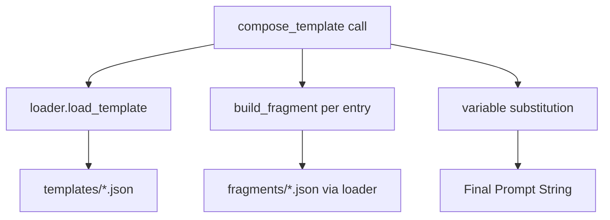

# Prompt Templates - Quick Reference

JSON template definitions consumed by `PromptFragmentLoader.load_template()` and
assembled into complete prompt strings by `PromptComposer.compose_template()`.

## Overview

This directory contains JSON data files only — there is no Python package here.
Templates are not Python objects; they are JSON records that the loader and composer
interpret at runtime. Each template defines a `base_template` string with `${variable}`
placeholders, a `fragments` map that drives the fragment builder dispatch, default
`variables`, and a `section_config` used by some builders.

## Loading and Composing Templates

```python
from infrastructure.llm.prompts import PromptFragmentLoader, PromptComposer

loader = PromptFragmentLoader()

# Inspect the raw template definition
template_def = loader.load_template("manuscript_reviews.json#manuscript_executive_summary")
# Returns the JSON dict: base_template, fragments, variables, section_config

# Compose a ready-to-send prompt string
composer = PromptComposer(loader=loader)
prompt = composer.compose_template(
    "manuscript_reviews.json#manuscript_executive_summary",
    text=manuscript_text,
    max_tokens=1000,
)

# Paper summarization (variables supplied inline)
summary_prompt = composer.compose_template(
    "paper_summarization.json#paper_summarization",
    title="My Paper",
    authors="Smith et al.",
    year="2024",
    source="arXiv",
    text=paper_text,
)
```

`compose_template` raises `LLMTemplateError` if any `${variable}` referenced in
`base_template` is not provided by the template's `variables` defaults, the
resolved fragment values, or the caller-supplied keyword arguments.

## Available Templates

### `manuscript_reviews.json`

Five review-type templates. All share the same fragment set
(`format_requirements`, `section_structure`, `token_budget_awareness`,
`content_requirements`, `validation_hints`) with different `section_config` values:

| Template key | Section structure | Sections |
| --- | --- | --- |
| `manuscript_executive_summary` | `executive_summary` | 5 |
| `manuscript_quality_review` | `quality_review` | 7 |
| `manuscript_methodology_review` | `methodology_review` | 5 |
| `manuscript_improvement_suggestions` | `improvement_suggestions` | 5 |
| `manuscript_translation_abstract` | `translation_abstract` | 2 |

All review templates require a `text` variable (the manuscript content). The
translation template additionally requires `target_language`.

### `paper_summarization.json`

One template: `paper_summarization`. Requires `title`, `authors`, `year`, `source`,
and `text`. Unlike the review templates it does not use the fragment system —
its `base_template` is self-contained with all instructions inline, targeting
400–700 words of structured paper summary.

## Template JSON Schema

```json
{
  "template_key": {
    "version": "1.0",
    "base_template": "...${text}...\n\n${format_requirements}\n\n${section_structure}...",
    "fragments": {
      "format_requirements": "format_requirements.json",
      "section_structure": "section_structures.json#executive_summary",
      "token_budget_awareness": "token_budget_awareness.json",
      "content_requirements": "content_requirements.json",
      "validation_hints": "validation_hints.json"
    },
    "variables": {
      "word_count_range": [400, 600],
      "required_elements": ["all 5 section headers", "specific manuscript references"]
    },
    "section_config": {
      "structure_key": "executive_summary",
      "token_allocation": "equal",
      "sections": 5
    }
  }
}
```

### Fields

| Field | Type | Role |
| --- | --- | --- |
| `version` | string | Traceability |
| `base_template` | string | Prompt skeleton with `${key}` placeholders |
| `fragments` | object | Maps placeholder names to loader references; resolved by `build_fragment()` |
| `variables` | object | Default values merged with caller-supplied kwargs |
| `section_config` | object | Passed to fragment builders (headers list, section count) |

### Variable Substitution Order

1. `template["variables"]` provides defaults.
2. Caller `**kwargs` to `compose_template()` override defaults.
3. Resolved fragment strings (from `fragments` map) are merged in.
4. All values are substituted into `base_template` using `${key}` replacement.
5. Missing required placeholders raise `LLMTemplateError`.

## Adding New Templates

1. Add a new top-level key to an existing JSON file, or create a new `*.json` file
   in this directory.
2. Define `base_template` with `${placeholder}` markers for every dynamic value.
3. Populate `fragments` with loader references for any fragment-built blocks.
4. Populate `variables` with default values for optional placeholders.
5. Reference the template in Python as `"filename.json#template_key"` passed to
   `loader.load_template()` or `composer.compose_template()`.

No Python code changes are needed for new templates that use existing fragments.

## Architecture


```mermaid
graph TD
    A[compose_template call] --> B[loader.load_template]
    B --> C[templates/*.json]
    A --> D[build_fragment per entry]
    D --> E[fragments/*.json via loader]
    A --> F[variable substitution]
    F --> G[Final Prompt String]
```

## See Also

- [AGENTS.md](AGENTS.md) - templates documentation
- [../README.md](../README.md) - Prompts module overview
- [../fragments/README.md](../fragments/README.md) - Fragment JSON files
- [../compositions/README.md](../compositions/README.md) - Composition JSON files
