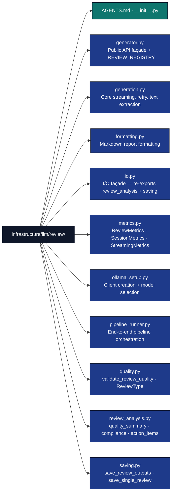

# LLM Review Module

## Overview

The `infrastructure/llm/review/` directory generates manuscript reviews using local Ollama LLM models. The public API is a set of standalone functions — there is no `ReviewGenerator` class, no `ReviewConfig` dataclass, and no `ReviewIO` class. `generator.py` is the public-API façade; the focused submodules (`generation.py`, `quality.py`, `ollama_setup.py`, `saving.py`, `review_analysis.py`, `metrics.py`) implement the details.

## Directory Structure



## Key Components

### Review Generation Façade (`generator.py`)

`generator.py` owns `_REVIEW_REGISTRY`, the mapping of review types to template classes and temperatures. The four named public entry points are generated from the registry by `_make_review_fn`:

```python
from infrastructure.llm.review.generator import (
    generate_llm_executive_summary,    # ManuscriptExecutiveSummary, temp 0.3
    generate_quality_review,           # ManuscriptQualityReview, temp 0.3
    generate_methodology_review,       # ManuscriptMethodologyReview, temp 0.3
    generate_improvement_suggestions,  # ManuscriptImprovementSuggestions, temp 0.4
)

# All four share this signature:
# (client: LLMClient, text: str, model_name: str = "", temperature: float = <default>)
#   -> tuple[str | None, ReviewMetrics]
review_text, metrics = generate_llm_executive_summary(
    client=client,
    text=manuscript_text,
    model_name="gemma3:4b",
)
```

The `_REVIEW_REGISTRY` dict — add new review types here to generate additional entry points without duplicating logic:

```python
# _REVIEW_REGISTRY: dict[str, tuple[review_name, template_class, default_temperature]]
# Defined in generator.py; not part of the public API but documents the pattern.
```

`generator.py` also re-exports from its submodules for backwards compatibility (all names flow through `__init__.py`):

```python
from infrastructure.llm.review.generator import (
    validate_review_quality,
    get_manuscript_review_system_prompt,
    create_review_client,
    select_and_start_ollama_model,
    warmup_model,
    extract_manuscript_text,
    generate_review_with_metrics,
    generate_translation,
)
```

### Core Generation Logic (`generation.py`)

`generation.py` implements PDF text extraction, streaming with heartbeat monitoring, retry loops, and repetition deduplication.

#### Text Extraction

```python
from infrastructure.llm.review.generation import extract_manuscript_text
from pathlib import Path

# Returns (str | None, ManuscriptInputMetrics)
# - None if the PDF does not exist (graceful skip)
# - Raises PDFValidationError if the file exists but is unreadable
text, input_metrics = extract_manuscript_text(
    pdf_path=Path("output/project/pdf/combined.pdf"),
    max_input_length=500_000,   # optional; pass client.config.max_input_length
)
```

#### Low-Level Review Generation

```python
from infrastructure.llm.review.generation import generate_review_with_metrics
from infrastructure.llm.templates import ManuscriptQualityReview

# Returns (str | None, ReviewMetrics)
# - None if the LLM returned empty or all retries produced off-topic content
review_text, metrics = generate_review_with_metrics(
    client=client,
    text=manuscript_text,
    review_type="quality_review",
    review_name="quality review",
    template_class=ManuscriptQualityReview,
    model_name="gemma3:4b",
    temperature=0.3,
    max_tokens=None,    # defaults to client.config.long_max_tokens
    max_retries=1,
)
```

#### Translation

```python
from infrastructure.llm.review.generation import generate_translation
from infrastructure.llm.templates import TRANSLATION_LANGUAGES

# Returns (str | None, ReviewMetrics); None on failure (non-fatal)
translated, metrics = generate_translation(
    client=client,
    text=abstract_text,
    language_code="zh",
    model_name="gemma3:4b",
)
```

### Ollama Setup (`ollama_setup.py`)

```python
from infrastructure.llm.review.ollama_setup import (
    get_manuscript_review_system_prompt,
    create_review_client,
    select_and_start_ollama_model,
    warmup_model,
)

# Select model and ensure Ollama is running
model_name = select_and_start_ollama_model()

# Create an LLMClient configured for manuscript review
client = create_review_client(model_name)

# Warm up the model to measure initial throughput
warmup_tokens_per_sec = warmup_model(client)
```

### Review I/O (`io.py`, `saving.py`, `review_analysis.py`)

`io.py` is the preferred import path — it re-exports from `saving.py` and `review_analysis.py`:

```python
from infrastructure.llm.review.io import save_review_outputs, save_single_review
from infrastructure.llm.review.io import generate_review_summary
from infrastructure.llm.review.io import calculate_quality_summary
from infrastructure.llm.review.io import calculate_format_compliance_summary
from infrastructure.llm.review.io import extract_action_items
from infrastructure.llm.review.io import SessionMetrics
```

**Saving reviews:**

```python
from infrastructure.llm.review.io import save_review_outputs, save_single_review

# Save all reviews with session metadata
save_review_outputs(
    reviews={"executive_summary": text1, "quality_review": text2},
    output_dir=Path("output/project/llm"),
    model_name="gemma3:4b",
    pdf_path=Path("output/project/pdf/combined.pdf"),
    session_metrics=session_metrics,  # SessionMetrics
)

# Save a single review file
save_single_review(
    name="executive_summary",
    content=review_text,
    output_dir=Path("output/project/llm"),
)
```

**Analysis and summaries:**

```python
from infrastructure.llm.review.io import (
    generate_review_summary,
    calculate_quality_summary,
    calculate_format_compliance_summary,
    extract_action_items,
)

summary = generate_review_summary(reviews, session_metrics)
quality = calculate_quality_summary(reviews)
compliance = calculate_format_compliance_summary(reviews)
actions = extract_action_items(reviews)
```

### Review Metrics (`metrics.py`)

Four dataclasses track generation statistics:

```python
from infrastructure.llm.review.metrics import ReviewMetrics
from infrastructure.llm.review.metrics import ManuscriptInputMetrics
from infrastructure.llm.review.metrics import SessionMetrics
from infrastructure.llm.review.metrics import StreamingMetrics
from infrastructure.llm.review.metrics import estimate_tokens
```

- `ReviewMetrics` — single review: input/output chars, words, tokens, time, preview
- `ManuscriptInputMetrics` — PDF extraction: chars, words, tokens, truncated flag
- `SessionMetrics` — full session: manuscript + reviews dict + timing + model info
- `StreamingMetrics` — streaming: chunk counts, bytes/sec, first-chunk time
- `estimate_tokens(text)` — returns `int`

### Quality Validation (`quality.py`)

```python
from infrastructure.llm.review.quality import (
    validate_review_quality,
    ReviewType,           # Literal alias for the five review type strings
    ReviewQualityDetails, # TypedDict — shape of the details return value
)

# Returns (is_valid: bool, issues: list[str], details: ReviewQualityDetails)
is_valid, issues, details = validate_review_quality(
    response=review_text,
    review_type="executive_summary",  # ReviewType
    model_name="gemma3:4b",
)
```

`ReviewType` accepts: `"executive_summary"`, `"quality_review"`, `"methodology_review"`, `"improvement_suggestions"`, `"translation"`.

## Integration with the Review Pipeline

The full pipeline is orchestrated by `pipeline_runner.py`, invoked from `scripts/06_llm_review.py`. The canonical flow:

```python
from infrastructure.llm.review import select_and_start_ollama_model
from infrastructure.llm.review import create_review_client, warmup_model
from infrastructure.llm.review import extract_manuscript_text
from infrastructure.llm.review import generate_llm_executive_summary
from infrastructure.llm.review import generate_improvement_suggestions
from infrastructure.llm.review import generate_translation, save_review_outputs
from infrastructure.llm.review.generator import generate_quality_review
from infrastructure.llm.review.generator import generate_methodology_review
from infrastructure.llm.review.metrics import SessionMetrics, ManuscriptInputMetrics
from pathlib import Path

model_name = select_and_start_ollama_model()
client = create_review_client(model_name)
warmup_model(client)

text, input_metrics = extract_manuscript_text(
    Path("output/project/pdf/combined.pdf")
)

reviews = {}
if text:
    for fn, key in [
        (generate_llm_executive_summary, "executive_summary"),
        (generate_quality_review, "quality_review"),
        (generate_methodology_review, "methodology_review"),
        (generate_improvement_suggestions, "improvement_suggestions"),
    ]:
        review_text, metrics = fn(client, text, model_name)
        if review_text:
            reviews[key] = review_text

    save_review_outputs(
        reviews=reviews,
        output_dir=Path("output/project/llm"),
        model_name=model_name,
        pdf_path=Path("output/project/pdf/combined.pdf"),
        session_metrics=SessionMetrics(),
    )
```

## Configuration

Runtime behaviour is controlled by environment variables read by `OllamaClientConfig.from_env()`:

```bash
# Model selection
export OLLAMA_MODEL="gemma3:4b"
export OLLAMA_HOST="http://localhost:11434"
export OLLAMA_AUTO_START="true"

# Generation parameters
export LLM_LONG_MAX_TOKENS="16384"
export LLM_REVIEW_TIMEOUT="300"     # seconds per review
export LLM_HEARTBEAT_INTERVAL="30"
```

## Testing

Follow the project no-mocks policy — use real function calls with `pytest-httpserver` or `ollama_test_server` for HTTP coverage:

```python
from infrastructure.llm.review.metrics import ReviewMetrics, estimate_tokens
from infrastructure.llm.review.quality import validate_review_quality

def test_estimate_tokens():
    # estimate_tokens approximates at ~4 chars/token
    assert estimate_tokens("hello world") == len("hello world") // 4

def test_validate_review_quality_short_response():
    is_valid, issues, _ = validate_review_quality(
        response="Too short.",
        review_type="quality_review",
    )
    assert not is_valid
    assert any("word" in i.lower() or "short" in i.lower() for i in issues)
```

## See Also

**Related Documentation:**

- [`../core/AGENTS.md`](../core/AGENTS.md) - LLM core client
- [`../templates/AGENTS.md`](../templates/AGENTS.md) - Template system
- [`../AGENTS.md`](../AGENTS.md) - LLM module overview

**System Documentation:**

- [`../../../AGENTS.md`](../../../AGENTS.md) - system overview
- [`../../../docs/operational/troubleshooting/llm-review.md`](../../../docs/operational/troubleshooting/llm-review.md) - LLM review troubleshooting
