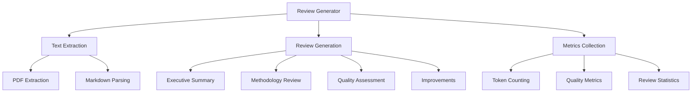

# LLM Review - Quick Reference

Automated manuscript review generation using Large Language Models.

## Overview

The review module generates comprehensive scientific reviews of research manuscripts using local LLM models. It provides structured analysis, quality assessment, and improvement suggestions.

## Quick Start

```python
from infrastructure.llm.review import ReviewGenerator

# Create review generator
generator = ReviewGenerator()

# Generate comprehensive review
review = generator.generate_review(
    manuscript_path=Path("manuscript/combined.md"),
    review_type="comprehensive"
)

# Generate specific review sections
executive_summary = generator.generate_executive_summary(manuscript_text)
methodology_review = generator.generate_methodology_review(manuscript_text)
```

## Key Features

- **Comprehensive Reviews**: Full manuscript analysis with structured sections
- **Quality Assessment**: Automated quality scoring and recommendations
- **Section-Specific Reviews**: Focused analysis of methodology, results, conclusions
- **Improvement Suggestions**: Actionable recommendations for enhancement
- **Metrics Tracking**: Review quality metrics and token usage

## Common Usage

### Generate Full Review

```python
from infrastructure.llm.review import ReviewGenerator
from pathlib import Path

generator = ReviewGenerator()
review = generator.generate_review(
    manuscript_path=Path("output/pdf/manuscript.pdf"),
    review_type="comprehensive"
)

print(review.executive_summary)
print(review.quality_score)
print(review.improvements)
```

### Extract and Review PDF

```python
from infrastructure.llm.review.io import extract_manuscript_text

# Extract text from PDF
text, metrics = extract_manuscript_text(Path("manuscript.pdf"))

# Generate review from extracted text
review = generator.generate_review_from_text(text)
```

### Review Metrics

```python
from infrastructure.llm.review.metrics import ReviewMetrics

metrics = ReviewMetrics(
    total_tokens=1500,
    review_quality="high",
    sections_reviewed=5
)

print(f"Quality: {metrics.review_quality}")
print(f"Tokens used: {metrics.total_tokens}")
```

## Review Types

### Comprehensive Review

Full manuscript analysis including:
- Executive summary
- Methodology assessment
- Results evaluation
- Conclusion analysis
- Improvement suggestions

### Focused Reviews

**Executive Summary:**
```python
summary = generator.generate_executive_summary(manuscript_text)
```

**Methodology Review:**
```python
methodology = generator.generate_methodology_review(manuscript_text)
```

**Quality Review:**
```python
quality = generator.generate_quality_review(manuscript_text)
```

## Configuration

### Review Settings

```python
from infrastructure.llm.review.generator import ReviewGenerator

generator = ReviewGenerator(
    model_name="gemma3:4b",
    temperature=0.7,
    max_tokens=2000
)
```

### Quality Thresholds

```python
# Set quality validation thresholds
generator.set_quality_thresholds(
    min_length=500,
    min_sections=3,
    require_suggestions=True
)
```

## Integration

### Pipeline Integration

```python
# scripts/06_llm_review.py uses review module
from infrastructure.llm.review import ReviewGenerator

def run_llm_review(manuscript_path: Path):
    generator = ReviewGenerator()
    review = generator.generate_review(manuscript_path)
    
    # Save review
    save_review(review, output_path)
    return review
```

## Architecture



## See Also

- [AGENTS.md](AGENTS.md) - Complete review module documentation
- [../core/README.md](../core/README.md) - LLM core functionality
- [../templates/README.md](../templates/README.md) - Review templates