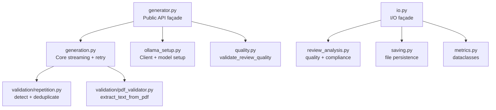

# LLM Review - Quick Reference

Automated manuscript review generation using local Ollama LLM models.

## Overview

The review module generates scientific reviews of research manuscripts. It orchestrates PDF text extraction, LLM generation via streaming, retry with quality validation, and file saving. The public entry points are standalone functions — there is no `ReviewGenerator` class.

## Quick Start

```python
from pathlib import Path
from infrastructure.llm.review import (
    select_and_start_ollama_model,
    create_review_client,
    extract_manuscript_text,
    generate_llm_executive_summary,
    generate_review_with_metrics,
    save_review_outputs,
)
from infrastructure.llm.review.metrics import SessionMetrics

# 1. Select model and create client
model_name = select_and_start_ollama_model()
client = create_review_client(model_name)

# 2. Extract text from PDF
text, input_metrics = extract_manuscript_text(Path("output/project/pdf/combined.pdf"))

# 3. Generate a review
review_text, metrics = generate_llm_executive_summary(
    client=client,
    text=text,
    model_name=model_name,
)

print(review_text[:500])
```

## Key Functions

### Text Extraction

```python
from infrastructure.llm.review import extract_manuscript_text
from pathlib import Path

# Returns (text | None, ManuscriptInputMetrics)
# text is None if the PDF file does not exist
# Raises PDFValidationError if the file exists but cannot be read
text, metrics = extract_manuscript_text(
    pdf_path=Path("manuscript.pdf"),
    max_input_length=500_000,   # optional; 0 or None = unlimited
)
print(f"Extracted {metrics.total_words} words, truncated={metrics.truncated}")
```

### Named Review Entry Points

Four named functions — each binds a specific template class and default temperature via `_make_review_fn` in `generator.py`:

```python
from infrastructure.llm.review import generate_llm_executive_summary
from infrastructure.llm.review import generate_improvement_suggestions
from infrastructure.llm.review.generator import generate_quality_review
from infrastructure.llm.review.generator import generate_methodology_review

# All share the same signature:
# (client, text, model_name="", temperature=<default>) -> tuple[str | None, ReviewMetrics]
review_text, metrics = generate_llm_executive_summary(client, text, model_name="gemma3:4b")
```

Note: `generate_quality_review` and `generate_methodology_review` are exported from
`infrastructure.llm.review.generator` but not from the top-level `infrastructure.llm.review`
package. Import from `generator` directly when you need them.

### Translation

```python
from infrastructure.llm.review import generate_translation
from infrastructure.llm.templates import TRANSLATION_LANGUAGES

# Returns (str | None, ReviewMetrics); None on failure (non-fatal)
translated, metrics = generate_translation(
    client=client,
    text=abstract_text,
    language_code="zh",     # key from TRANSLATION_LANGUAGES
    model_name="gemma3:4b",
)
```

### Low-Level Generation (all review types)

```python
from infrastructure.llm.review import generate_review_with_metrics
from infrastructure.llm.templates import ManuscriptQualityReview

review_text, metrics = generate_review_with_metrics(
    client=client,
    text=manuscript_text,
    review_type="quality_review",
    review_name="quality review",
    template_class=ManuscriptQualityReview,
    model_name="gemma3:4b",
    temperature=0.3,
    max_tokens=None,     # defaults to client.config.long_max_tokens
    max_retries=1,
)
```

### Review Metrics

```python
from infrastructure.llm.review.metrics import ReviewMetrics
from infrastructure.llm.review.metrics import ManuscriptInputMetrics
from infrastructure.llm.review.metrics import SessionMetrics
from infrastructure.llm.review.metrics import StreamingMetrics
from infrastructure.llm.review.metrics import estimate_tokens
```

- `ReviewMetrics` — input/output chars, words, tokens, generation time, preview
- `ManuscriptInputMetrics` — PDF extraction stats: chars, words, tokens, truncated flag
- `SessionMetrics` — full session: manuscript + reviews dict + model info
- `StreamingMetrics` — chunk counts, bytes/sec, first-chunk time
- `estimate_tokens(text)` — returns `int` (~4 chars/token)

### Quality Validation

```python
from infrastructure.llm.review import validate_review_quality

is_valid, issues, details = validate_review_quality(
    response=review_text,
    review_type="quality_review",   # ReviewType literal
    model_name="gemma3:4b",
)
```

### Saving Outputs

```python
from infrastructure.llm.review import save_review_outputs, save_single_review

# Save all reviews from a session
save_review_outputs(
    reviews={"executive_summary": text1, "quality_review": text2},
    output_dir=Path("output/project/llm"),
    model_name="gemma3:4b",
    pdf_path=Path("output/project/pdf/combined.pdf"),
    session_metrics=session_metrics,
)

# Save a single review file
save_single_review(
    name="executive_summary",
    content=review_text,
    output_dir=Path("output/project/llm"),
)
```

### Analysis and Summaries

```python
from infrastructure.llm.review import (
    generate_review_summary,
    calculate_quality_summary,
    calculate_format_compliance_summary,
    extract_action_items,
)

summary = generate_review_summary(reviews, session_metrics)
quality = calculate_quality_summary(reviews)
compliance = calculate_format_compliance_summary(reviews)
actions = extract_action_items(reviews)
```

## Architecture


```mermaid
graph TD
    A[generator.py<br/>Public API façade] --> B[generation.py<br/>Core streaming + retry]
    A --> C[ollama_setup.py<br/>Client + model setup]
    A --> D[quality.py<br/>validate_review_quality]

    B --> E[validation/repetition.py<br/>detect + deduplicate]
    B --> F[validation/pdf_validator.py<br/>extract_text_from_pdf]

    G[io.py<br/>I/O façade] --> H[review_analysis.py<br/>quality + compliance]
    G --> I[saving.py<br/>file persistence]
    G --> J[metrics.py<br/>dataclasses]
```

## See Also

- [AGENTS.md](AGENTS.md) - review module reference
- [../core/README.md](../core/README.md) - LLM core client
- [../templates/README.md](../templates/README.md) - Review templates
